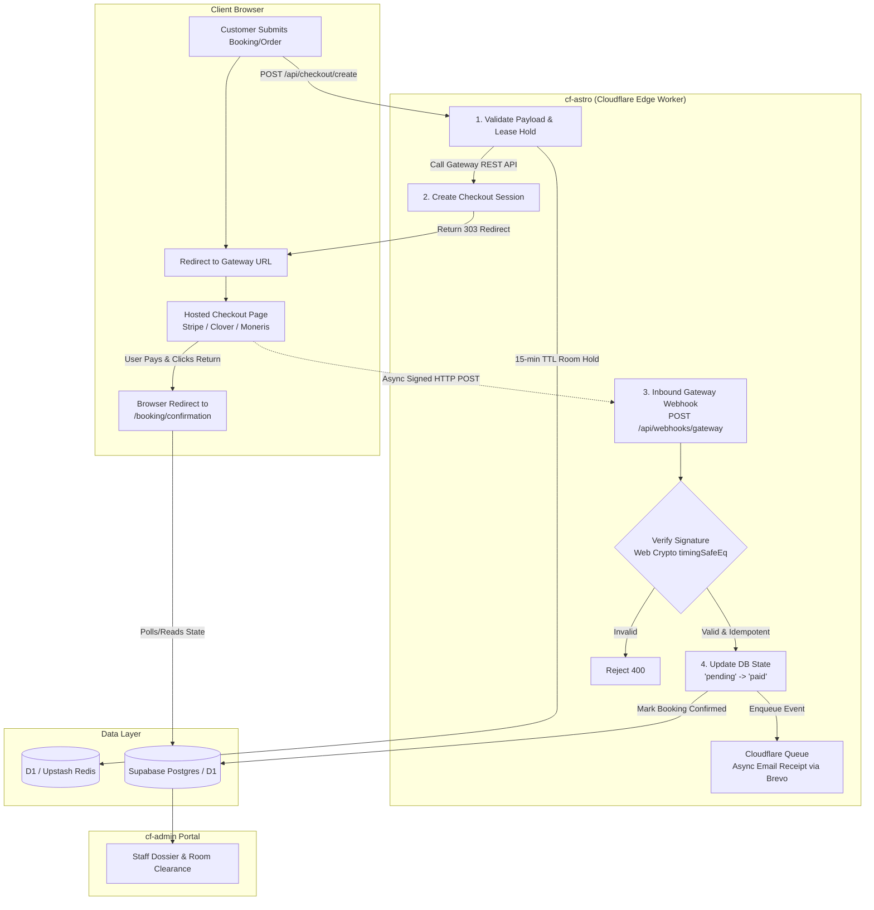
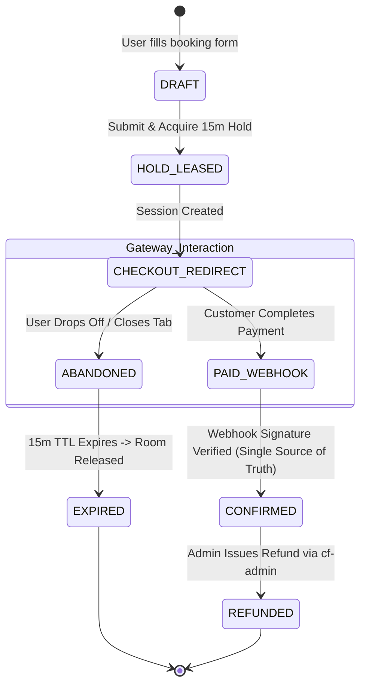

# Payment Gateway Redirection & Ordering Systems

This document is the authoritative architectural and operational reference for integrating third-party payment gateway redirection systems (**Stripe Checkout**, **Moneris Hosted Paypage**, **Clover Ecommerce / Hosted Checkout**, **Mercado Pago Checkout Pro**) and online ordering into the **Madagascar Pet Hotel** edge platform (**cf-astro** customer frontend + **cf-admin** operations portal).

---

## 1. Executive Summary & Core Architectural Thesis

### 1.1 The Direct Verdict
**Can we do it on this stack? Yes, 100%.** 

Not only is it possible on Cloudflare Workers/Pages + Astro + Preact + D1/Supabase, but **Hosted Redirection** is the industry-standard, battle-tested pattern for serverless edge deployments.



### 1.2 The Non-Negotiable Axioms of Edge Payments
1. **Never touch raw cardholder data (PAN/CVV).** Pure redirection keeps the platform in **PCI-DSS SAQ A**, eliminating audits, cryptographic hardware requirements, and massive legal liability.
2. **Never trust the browser return URL.** The return URL (`/booking/confirmation?session_id=...`) is a cosmetic client convenience. Only cryptographically signed, server-to-server **webhooks** are authoritative for payment verification.
3. **Webhooks must be idempotent.** Duplicate webhooks from gateway retries must never create double bookings, duplicate charges, or redundant confirmation emails.
4. **Adhere to workspace caps (RULES RULE #0.8 & #0.9).** Store credentials via Cloudflare Secret Bindings, operational toggles via D1 `admin_portal_settings`, and transaction metadata in existing structured JSONB columns — **zero new database tables required**.

---

## 2. Compliance, Legal & Data Governance

### 2.1 PCI-DSS Scope Reduction (SAQ A vs. SAQ D)

| Standard Tier | What Touches the System | Audit & Engineering Requirement | Our Architecture |
| :--- | :--- | :--- | :--- |
| **SAQ A** | **Nothing.** User is redirected to gateway domain (Stripe/Moneris/Clover URL). Gateway collects card data. | Annual self-assessment form (~20 questions). Zero network penetration tests or card vaults required. | **Selected Architecture.** Complete protection. |
| **SAQ A-EP** | Gateway iframe or JS Elements embedded on our page. Form posts directly to gateway. | Substantial audit. Vulnerability scans, script integrity monitoring, strict CSP tampering guards. | High maintenance; fragile on edge. |
| **SAQ D** | Raw PAN/CVV entered into our form or transmitted through our Worker. | Full on-site QSA audit, $50k+ compliance costs, hardware security modules (HSM), extreme liability. | **Strictly Forbidden.** |

> [!CAUTION]
> **D1 SQLite Unencrypted Storage Invariant:**
> Per [`COMPLIANCE-SECURITY-AND-HISTORY.md`](./COMPLIANCE-SECURITY-AND-HISTORY.md), Cloudflare D1 is an unencrypted local SQLite engine. It is strictly forbidden from holding payment card details, CVVs, or unencrypted bank credentials. Redirection guarantees D1 only ever sees gateway-issued opaque tokens (`cs_live_...`), transaction UUIDs, and status strings (`'paid'`, `'deposit_only'`).

### 2.2 Privacy & Data Protection (LFPDPPP, PIPEDA & GDPR)
* **Mexican Law (LFPDPPP - Aguascalientes):** Processing payments for Mexican customers requires disclosing the payment processor as a *remitente* (third-party service provider) under the Privacy Notice. The privacy notice uses category-based disclosure (*"Procesadores de pagos electrónicos y pasarelas bancarias"*).
* **Canadian Law (PIPEDA / Law 25 - Canada):** If serving Canadian clients (Moneris/Clover/Stripe in CAD), cardholder billing addresses and transaction amounts must be protected with encryption in transit (TLS 1.3) and at rest (Supabase Postgres encryption).
* **Audit-First Invariant:** In `cf-astro`, booking attempts are captured to D1 `booking_attempts` before external API calls. If the gateway fails or the user aborts, the attempt remains audited without storing orphaned financial tokens.

---

## 3. Edge Runtime & Cloudflare Stack Affection Factors

### 3.1 Cloudflare `workerd` vs. Node.js Runtimes
* **The Problem:** Many payment processor SDKs (such as older Moneris or Clover libraries) were compiled for Node.js servers, pulling in `http`, `https`, `crypto`, and `net` modules that fail or bloat bundle sizes in Cloudflare Workers.
* **The Solution:**
  * **Stripe:** Fully supports Cloudflare Workers using the modern `stripe` npm module with `httpClient: Stripe.createFetchHttpClient()`, or direct HTTP REST calls via standard `fetch()`.
  * **Moneris & Clover:** Avoid legacy npm wrappers. Consume their clean REST APIs (`POST https://gateway.moneris.com/...` or `POST https://api.clover.com/ecommerce/v1/checkouts`) using native `fetch` and the Web Crypto API (`crypto.subtle`).

### 3.2 CPU Budget & Execution Limits
* **Free Tier Worker Limit:** 50ms CPU time per request.
* **Impact:** 
  * Signature verification using `crypto.subtle.importKey()` and `crypto.subtle.verify()` takes **< 1ms CPU time**.
  * Gateway checkout session creation takes **< 5ms CPU time** (the rest is network I/O wait, which does not count against CPU limits).
  * Fast acknowledgement: The webhook endpoint must verify the signature, persist the event to D1/Supabase, and return HTTP `200 OK` in **< 100ms wall-clock time** to prevent gateway timeouts.

### 3.3 Rule Compliance: Env Vars & Database Caps
* **RULE #0.8 (Env Var Cap):**
  * `cf-astro` carries a hard cap of ~21 environment variables.
  * **Rule:** Do not add 5 new env vars for gateway configs. Add only essential cryptographic secrets via Cloudflare bindings (`wrangler secret put`):
    - `STRIPE_SECRET_KEY`
    - `STRIPE_WEBHOOK_SECRET`
  * Store non-secret options (gateway mode `test`/`live`, enabled payment methods, default deposit percentage) inside D1 table `admin_portal_settings` managed via `PortalSettingsRepository.ts`.
* **RULE #0.9 (Migration-Minimal Data Design):**
  * Shared table cap: 50 tables (30 D1 + 20 Supabase).
  * **Zero new tables needed:** In `cf-admin`, `BookingStateRepository.ts` already tracks:
    ```typescript
    payment_status?: 'paid' | 'deposit_only' | 'unpaid' | null;
    ```
  * Transaction identifiers, gateway names, receipt URLs, and fee breakdowns must be stored inside existing JSONB columns (`payment_metadata` in Supabase) or structured operational notes (`[PAYMENT:paid][GATEWAY:stripe:cs_test_123]`).

---

## 4. Security Policies & Browser Hardening

### 4.1 Permissions-Policy & CSP Adjustments

In `cf-astro/public/_headers` and `src/lib/security-headers.ts`, the application enforces:
```http
Permissions-Policy: camera=(), microphone=(), geolocation=(), payment=(), ...
```

#### The Impact:
1. **Full Redirection (Recommended):**
   * If the user is redirected via an HTTP `303 See Other` to `https://checkout.stripe.com/...` or Moneris/Clover, **`payment=()` does not block anything**, because the payment interaction happens entirely on the third party's origin.
2. **In-Browser Apple Pay / Google Pay Sheets:**
   * If you wish to trigger native browser Apple Pay sheets directly on `madagascarhotelags.com`, you must change `payment=()` to `payment=(self)` or `payment=*`.
3. **Content Security Policy (`form-action` and `connect-src`):**
   * If checkout initiation uses client-side JavaScript redirect (`window.location.href = session.url`), CSP `connect-src` must whitelist `https://api.stripe.com` (or equivalent).
   * If using HTML form submission, CSP `form-action` must allow the gateway domain.

### 4.2 Webhook Signature Verification & Replay Protection
* **Constant-Time Verification:** Webhook signatures must always be validated using `timingSafeEq` (available in `src/lib/security.ts`) to prevent timing side-channel attacks:
  ```typescript
  import { timingSafeEq } from '@/lib/security';
  // Compute expected HMAC SHA-256 and compare with timingSafeEq
  if (!timingSafeEq(expectedSignature, incomingHeader)) {
    return new Response('Invalid signature', { status: 401 });
  }
  ```
* **Timestamp Tolerance:** Reject any webhook timestamp older than 300 seconds (5 minutes) to protect against replay attacks.

---

## 5. Distributed State Machine & Webhook Reliability



### 5.1 The "Two Generals" Problem (Why Return URLs Cannot Be Trusted)
* **The Anti-Pattern:**
  ```typescript
  // ❌ FATAL FLAW: User redirects to this page, hacker fakes URL params
  export async function GET({ url }) {
    if (url.searchParams.get('status') === 'success') {
      await markBookingPaid(url.searchParams.get('booking_id')); // VULNERABLE!
    }
  }
  ```
* **The Rule:** The `/booking/confirmation` page is **strictly read-only**. It polls D1/Supabase for the status. The status changes to `'paid'` **only** when the server-to-server webhook endpoint executes.

### 5.2 Handling Webhook Failures & Out-of-Order Delivery
* **Idempotency Store:** Webhooks must check an idempotency key (e.g. `gateway_event_id`) in D1. If the event was already processed, return `200 OK` immediately.
* **Out-of-Order Handling:** A `charge.refunded` webhook could theoretically arrive before `checkout.session.completed` if network retries back off. Storing discrete transaction states with event timestamps prevents race conditions.
* **Decoupled Heavy Jobs:** Never send emails or sync external calendars inside the webhook execution thread. Return `200 OK` to the gateway immediately, pushing the post-payment event to Cloudflare Queue (`madagascar-sync-revalidate` or `madagascar-emails`), where the dedicated consumer worker dispatches the Brevo confirmation.

---

## 6. Inventory & Booking Capacity Locking (Race Conditions)

### 6.1 The Double-Booking Dilemma
In a pet hotel with finite luxury suites, what happens while Customer A spends 8 minutes entering credit card details on Clover or Stripe?
* **Scenario Without Locks:** Customer B books the same suite 2 minutes later and pays instantly. Both customers arrive on Friday with their dogs.
* **Scenario With Permanent Locks:** Customer A enters checkout, decides not to book, and closes their laptop. The suite remains locked for the entire weekend.

### 6.2 The Solution: 15-Minute Reservation Hold (TTL Lease)
1. **On Checkout Initiation:**
   - Mark the booking attempt as `HOLD_LEASED` with `hold_expires_at = NOW() + INTERVAL '15 minutes'`.
2. **Availability Queries:**
   - Active bookings query: `WHERE status = 'confirmed' OR (status = 'hold_leased' AND hold_expires_at > NOW())`.
3. **Webhook Arrival:**
   - Converts `HOLD_LEASED` to `CONFIRMED` and clears `hold_expires_at`.
4. **Abandonment Cleanup:**
   - No active cron is required. Any subsequent availability query or reservation attempt lazily ignores holds where `hold_expires_at < NOW()`.

---

## 7. Comparative Analysis: Processors in Canada, Mexico & Globally

```
┌──────────────────────────────────────────────────────────────────────────────────┐
│                             PROCESSOR RADAR MATRIX                               │
├───────────────────┬──────────────┬──────────────┬───────────────┬────────────────┤
│ Feature           │ Stripe       │ Clover       │ Moneris       │ Mercado Pago   │
├───────────────────┼──────────────┼──────────────┼───────────────┼────────────────┤
│ Primary Territory │ Global / CA  │ US & Canada  │ Canada        │ Mexico / LATAM │
│ Hosted Redirect   │ ⭐⭐⭐⭐⭐ Checkout│ ⭐⭐⭐⭐ Ecommerce│ ⭐⭐⭐ MCO     │ ⭐⭐⭐⭐ Pro       │
│ Edge Worker DX    │ ⭐⭐⭐⭐⭐ Native  │ ⭐⭐⭐⭐ REST   │ ⭐⭐ Legacy/XML│ ⭐⭐⭐ REST     │
│ Canadian Interac  │ ✅ (Debit)   │ ✅ (POS/Web) │ ⭐ Native King │ ❌             │
│ Mexican OXXO/SPEI │ ✅ (Local)   │ ❌           │ ❌            │ ⭐ Native King │
│ Omnichannel POS   │ Stripe Term. │ ⭐ Best-in-Cl│ Moneris POS   │ Point Readers  │
│ Monthly Fixed Fee │ $0           │ POS plan fee │ $20-$50/mo    │ $0             │
│ Transaction Rates │ ~2.9% + 30¢  │ Interchange+ │ Interchange+  │ ~3.49% + $4 MXN│
└───────────────────┴──────────────┴──────────────┴───────────────┴────────────────┘
```

### 7.1 Stripe (Global & Canadian Recommendation)
* **Best for:** Rapid deployment, zero monthly fees, best-in-class TypeScript SDK, multi-currency (CAD, USD, MXN), built-in Apple Pay/Google Pay/Interac Debit.
* **Edge Fit:** Flawless with Cloudflare Workers.
* **Canadian Feature Set:** Native CAD settlement, Interac Debit support in Stripe Checkout, automatic Canadian provincial sales tax (GST/HST/PST) calculation via Stripe Tax.

### 7.2 Clover / Fiserv (Canada & US Omnichannel Hero)
* **Best for:** Businesses with physical reception desks using **Clover Flex** or **Clover Mini** POS terminals.
* **Superpower:** Online deposits and in-person balance payments land in the **same merchant account and inventory system**.
* **Integration:** Uses Clover Hosted Checkout (`POST https://api.clover.com/ecommerce/v1/checkouts`). Returns a `checkout_url`.

### 7.3 Moneris (Canada Domestic Market Leader)
* **Best for:** Large enterprise Canadian businesses processing high-volume Interac Debit transactions with domestic corporate accounts.
* **Trade-offs:** Requires direct merchant underwriting, monthly maintenance fees, and custom REST API wrapper (the official Node SDK is not edge-friendly).

### 7.4 Mercado Pago (Mexico Domestic Standard)
* **Best for:** Local Aguascalientes bookings paying in Mexican Pesos (MXN) via local bank transfers (SPEI) or cash vouchers at OXXO convenience stores.
* **Edge Fit:** Clean REST API (`POST /checkout/preferences`), instant webhook notifications.

---

## 8. Financial Lifecycle: Partial Payments, Deposits & Refunds

### 8.1 Deposit vs. Full Payment Architecture
Pet hotels operate on deposits rather than immediate 100% settlement:
1. **Deposit Model (e.g. 20% or 1st night):**
   - User pays `$50 CAD` deposit via Stripe/Clover.
   - Webhook sets `payment_status = 'deposit_only'`.
   - Remaining `$200 CAD` is collected in person at pet drop-off/pick-up.
2. **Full Payment Model:**
   - User pays 100% upfront (as currently permitted in `canonical-facts.ts`).
   - Webhook sets `payment_status = 'paid'`.

### 8.2 Refunds & Dispute Handling in `cf-admin`
* **Refund Route (`POST /api/bookings/[id]/refund`):**
  - Staff selects: *Full Refund* or *Partial Refund*.
  - Worker issues refund to gateway REST API using stored `transaction_id`.
  - `payment_status` flips to `'refunded'`.
  - Audited in `cf-admin` booking event log (`admin_audit_logs`).

---

## 9. Modular Adapter Pattern (Code Blueprint)

To avoid vendor lock-in, decouple payment logic behind a unified interface.

### 9.1 The Core Adapter Interface (`src/lib/payments/types.ts`)

```typescript
export interface CheckoutRequest {
  bookingId: string;
  customerEmail: string;
  customerName: string;
  amountCents: number;
  currency: 'CAD' | 'USD' | 'MXN';
  description: string;
  successUrl: string;
  cancelUrl: string;
  metadata?: Record<string, string>;
}

export interface CheckoutResponse {
  sessionId: string;
  redirectUrl: string;
}

export interface WebhookEvent {
  isValid: boolean;
  eventType: 'payment_succeeded' | 'payment_failed' | 'refund_processed' | 'ignored';
  bookingId?: string;
  transactionId?: string;
  amountCents?: number;
  currency?: string;
  receiptUrl?: string;
}

export interface PaymentGatewayAdapter {
  createCheckoutSession(req: CheckoutRequest): Promise<CheckoutResponse>;
  verifyAndParseWebhook(request: Request, rawBody: string): Promise<WebhookEvent>;
  issueRefund(transactionId: string, amountCents?: number): Promise<{ success: boolean; refundId: string }>;
}
```

### 9.2 Example Edge-Native Stripe Adapter (`src/lib/payments/StripeAdapter.ts`)

```typescript
import type { PaymentGatewayAdapter, CheckoutRequest, CheckoutResponse, WebhookEvent } from './types';
import { timingSafeEq } from '@/lib/security';

export class StripeAdapter implements PaymentGatewayAdapter {
  constructor(
    private secretKey: string,
    private webhookSecret: string
  ) {}

  async createCheckoutSession(req: CheckoutRequest): Promise<CheckoutResponse> {
    const params = new URLSearchParams();
    params.append('mode', 'payment');
    params.append('customer_email', req.customerEmail);
    params.append('success_url', `${req.successUrl}?session_id={CHECKOUT_SESSION_ID}`);
    params.append('cancel_url', req.cancelUrl);
    params.append('line_items[0][price_data][currency]', req.currency.toLowerCase());
    params.append('line_items[0][price_data][unit_amount]', req.amountCents.toString());
    params.append('line_items[0][price_data][product_data][name]', req.description);
    params.append('client_reference_id', req.bookingId);

    if (req.metadata) {
      for (const [key, value] of Object.entries(req.metadata)) {
        params.append(`metadata[${key}]`, value);
      }
    }

    const response = await fetch('https://api.stripe.com/v1/checkout/sessions', {
      method: 'POST',
      headers: {
        'Authorization': `Bearer ${this.secretKey}`,
        'Content-Type': 'application/x-www-form-urlencoded',
      },
      body: params.toString(),
    });

    if (!response.ok) {
      const err = await response.text();
      throw new Error(`Stripe session creation failed: ${err}`);
    }

    const session = await response.json() as { id: string; url: string };
    return { sessionId: session.id, redirectUrl: session.url };
  }

  async verifyAndParseWebhook(request: Request, rawBody: string): Promise<WebhookEvent> {
    const sigHeader = request.headers.get('stripe-signature');
    if (!sigHeader) return { isValid: false, eventType: 'ignored' };

    // Extract t (timestamp) and v1 (signature)
    const parts = Object.fromEntries(sigHeader.split(',').map(part => part.split('=')));
    const timestamp = parts['t'];
    const signature = parts['v1'];

    if (!timestamp || !signature) return { isValid: false, eventType: 'ignored' };

    // Protect against replay attacks (5 min tolerance)
    const now = Math.floor(Date.now() / 1000);
    if (Math.abs(now - parseInt(timestamp, 10)) > 300) {
      return { isValid: false, eventType: 'ignored' };
    }

    // Compute expected HMAC SHA-256 using Web Crypto
    const payload = `${timestamp}.${rawBody}`;
    const encoder = new TextEncoder();
    const key = await crypto.subtle.importKey(
      'raw',
      encoder.encode(this.webhookSecret),
      { name: 'HMAC', hash: 'SHA-256' },
      false,
      ['sign']
    );
    const signatureBytes = await crypto.subtle.sign('HMAC', key, encoder.encode(payload));
    const expectedSig = Array.from(new Uint8Array(signatureBytes))
      .map(b => b.toString(16).padStart(2, '0'))
      .join('');

    if (!timingSafeEq(expectedSig, signature)) {
      return { isValid: false, eventType: 'ignored' };
    }

    const data = JSON.parse(rawBody);
    if (data.type === 'checkout.session.completed') {
      const obj = data.data.object;
      return {
        isValid: true,
        eventType: 'payment_succeeded',
        bookingId: obj.client_reference_id,
        transactionId: obj.payment_intent,
        amountCents: obj.amount_total,
        currency: obj.currency?.toUpperCase(),
        receiptUrl: obj.receipt_url,
      };
    }

    return { isValid: true, eventType: 'ignored' };
  }

  async issueRefund(transactionId: string, amountCents?: number): Promise<{ success: boolean; refundId: string }> {
    const params = new URLSearchParams();
    params.append('payment_intent', transactionId);
    if (amountCents) params.append('amount', amountCents.toString());

    const response = await fetch('https://api.stripe.com/v1/refunds', {
      method: 'POST',
      headers: {
        'Authorization': `Bearer ${this.secretKey}`,
        'Content-Type': 'application/x-www-form-urlencoded',
      },
      body: params.toString(),
    });

    const data = await response.json() as { id: string; status: string };
    return { success: response.ok && data.status === 'succeeded', refundId: data.id };
  }
}
```

---

## 10. Pre-Flight Checklist for Adding Payments

Before deploying any live payment integration to `cf-astro` or `cf-admin`:

- [ ] **Secrets Loaded:** `STRIPE_SECRET_KEY` and `WEBHOOK_SECRET` added via `wrangler secret put` (never committed to git or `.dev.vars`).
- [ ] **Webhook Endpoint Live:** `POST /api/webhooks/stripe` handles signatures with `timingSafeEq` and Web Crypto.
- [ ] **No Cardholder Data in D1:** Audit D1 insert scripts to ensure only session IDs and status flags are stored.
- [ ] **15-Minute Reservation Lease Implemented:** Unpaid holds auto-expire; race condition double-bookings prevented.
- [ ] **CSP Whitelisted:** If using client-side elements, gateway domains added to `connect-src` and `frame-src`.
- [ ] **Email Decoupled:** Confirmation receipt enqueued to Cloudflare Queues; does not block the webhook HTTP 200 response.
- [ ] **Both Verification Gates Passed:**
  1. `npm run verify` passes in `cf-astro/`.
  2. `python .agents/scripts/checklist.py cf-astro` returns 100% green pass.
