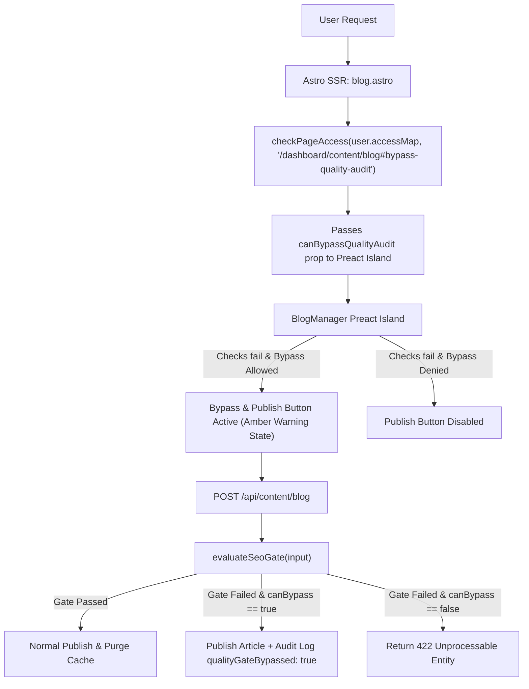

---

title: "Blog AI-Generation, Publishing & SEO/AIO/GEO System — Complete Reference (2026-08-03)"
status: active
audience: [non-technical, ai, technical, operator, owner]
last_verified: 2026-08-03
verified_against: [code]
owner: harshil
related_code: [cf-admin/src/pages/api/content/blog.ts, cf-admin/src/pages/api/content/ai-generate.ts, cf-admin/src/pages/api/content/scheduled-publish.ts, cf-admin/src/lib/blog/seo-gate.ts, cf-admin/src/lib/blog/publish-scheduled.ts, cf-admin/src/lib/dal/BlogRepository.ts, cf-admin/src/components/admin/content/BlogManager.tsx, cf-admin/src/components/admin/content/BlogAiCopilotModal.tsx, cf-admin/migrations/0033_create_blog_and_taxonomy_tables.sql, cf-admin/migrations/0034_blog_quality_gate_and_redirects.sql, cf-astro/src/lib/blog.ts, cf-astro/src/pages/es/blog/, cf-astro/src/pages/en/blog/, cf-astro/src/components/seo/BlogPostSchema.astro, cf-astro/src/components/blog/]
related_docs: [architecture/DYNAMIC-BLOG-AI-RAG-SYSTEM-ARCHITECTURE.md, specs/2026-07-26-payload-cms-evaluation-and-dynamic-blog.md, specs/2026-07-29-content-and-ai-visibility-engine.md]
tags: [blog, ai, seo, aio, geo, workers-ai, d1, rag, publishing, production-readiness]
---

# Blog AI-Generation, Publishing & SEO/AIO/GEO System — Complete Reference

> **TL;DR (non-technical):** The admin portal (`cf-admin`) now has a working
> AI-assisted blog: staff pick a topic, Cloudflare's own AI writes a
> full draft (title, meta description, body, an SEO score), a human reviews
> and hits Publish, and the article appears on the public site
> (`madagascarhotelags.com/es/blog/…` or `/en/blog/…`) usually in **under a
> second**. A built-in checklist blocks anything too short, missing a cover
> image, or missing SEO basics from going live, and the system will not let
> more than a small number of posts publish in a day or a month — so an AI
> mistake (or a bug) cannot flood the site with bad content. This pass also
> fixed a real security bug (a way malicious HTML could have been saved into
> an article and run in visitors' browsers), fixed a bug where editing a
> post's web address silently failed to save, and finished several
> half-built SEO features (tag pages, "related articles," proper 404 pages,
> automatic redirects when a URL changes). Nothing in this pass was
> deployed to production yet — it is code-complete and verified, sitting in
> the working tree, ready for review.

---

## Table of contents

1. [What this system is](#1-what-this-system-is)
2. [The two applications and who owns what](#2-the-two-applications-and-who-owns-what)
3. [The complete workflow, step by step](#3-the-complete-workflow-step-by-step)
4. [How long until it's live? (time-to-live tables)](#4-how-long-until-its-live-time-to-live-tables)
5. [SEO, AIO, GEO & other optimization factors](#5-seo-aio-geo--other-optimization-factors)
6. [Safety rails — why the system can't be abused](#6-safety-rails--why-the-system-cant-be-abused)
7. [Full feature list](#7-full-feature-list)
8. [Services & infrastructure — what's connected and how it coordinates](#8-services--infrastructure--whats-connected-and-how-it-coordinates)
9. [Data model (for technical readers)](#9-data-model-for-technical-readers)
10. [API surface (for technical readers)](#10-api-surface-for-technical-readers)
11. [File map — where everything lives](#11-file-map--where-everything-lives)
12. [Known limitations & deliberately deferred work](#12-known-limitations--deliberately-deferred-work)
13. [Glossary](#13-glossary)
14. [Change log — what this pass actually changed](#14-change-log--what-this-pass-actually-changed)

---

## 1. What this system is

Madagascar Pet Hotel's website (`cf-astro`) has a blog section
(`/es/blog/` and `/en/blog/`). Historically that blog was a handful of
hand-written Markdown files committed to the codebase — adding a post meant
a developer writing a file and deploying. That still exists today as a
**fallback** (14 legacy posts), but the real system now is a **database-backed,
AI-assisted blog** managed entirely from the admin portal, with no code
deploy required to publish a post.

In plain terms, the pieces are:

- **A writing tool** in the admin portal where staff describe what an
  article should cover, and Cloudflare's built-in AI (or an optional
  external AI provider) writes a full draft — headline, web-address-friendly
  slug, meta description, formatted body text, and a few AI-generated
  "quick answer" blocks aimed at how people search using ChatGPT/Google AI
  Overviews these days.
- **An editor** where a human reviews, edits, adds a cover photo (with
  required alt text), assigns topic tags, and decides whether to save as a
  draft, publish immediately, or schedule for a future date/time.
- **An automatic quality checklist** that runs on every save — it will not
  let an article go live if it's too short, missing a title or description
  of the right length, missing a cover image, or missing alt text on that
  image. This is a hard technical gate, not a suggestion.
- **A publish pipeline** that, the moment an article goes live, writes it to
  the shared database and tells the public website to immediately show it
  and stop showing any cached old version — then notifies search engines
  that a new page exists.
- **A public-facing rendering system** (`cf-astro`) that displays the
  article with all the technical SEO trimmings search engines and AI
  assistants look for: structured data, correct meta tags, sitemaps, tag
  browsing, "related articles," and clean URLs with automatic redirects if
  a URL ever changes.
- **Guardrails** that cap how many articles can go live per day and per
  month, specifically so that an AI-generation mistake, a bug, or an
  overexcited staff member cannot bulk-publish thin or spammy content and
  damage the site's search rankings.

---

## 2. The two applications and who owns what

The platform is split into two separate Cloudflare Workers applications that
share one database. Nothing about the blog lives in only one of them — it's
genuinely a two-repo feature.

| | `cf-admin` (Control Plane) | `cf-astro` (Storefront) |
|---|---|---|
| **What it is** | The private, staff-only admin portal (`secure.madagascarhotelags.com`) | The public marketing website (`madagascarhotelags.com`) |
| **Blog responsibility** | Writing, AI generation, editing, the quality gate, publish/schedule decisions, redirect bookkeeping | Rendering articles to visitors and search engines, SEO/structured data, sitemaps, tag pages, related posts |
| **Who uses it** | Hotel staff / content operators (behind Cloudflare Zero Trust login) | The public — pet owners searching for boarding/daycare/grooming, and search engine / AI crawlers |
| **Talks to AI models?** | Yes — this is where article generation happens | No — cf-astro never calls an AI model for blog content |
| **Owns the database write path?** | Yes — all blog writes go through `cf-admin`'s API | No — reads only, directly from the same database |

Both applications bind the exact same Cloudflare D1 database
(`madagascar-db`, id `[D1_MADAGASCAR_DB_ID]`) — there is no
data-copying or syncing lag between "the admin's copy" and "the website's
copy" of a blog post. There is only one copy, and both apps read/write the
same rows. This matters for the timing section below: because there's no
replica to catch up, the moment cf-admin writes a row, cf-astro can see it
on its very next database read.

---

## 3. The complete workflow, step by step

### 3.1 — Generating a draft with AI

1. A staff member opens **Content → Blog** in the admin portal and clicks
   **"Workers AI Author."**
2. They type a topic/brief (e.g. *"Complete guide to boarding senior dogs
   during summer heat in Aguascalientes"*), pick a tone (informative,
   persuasive, warm, technical, editorial), a target word count (300–1,500
   words via a slider), and a target language (Spanish or English).
3. They choose which AI model does the writing:
   - **Cloudflare Workers AI** (runs on Cloudflare's own infrastructure,
     no external API call): `Llama 3.3 70B` (best quality), `Qwen 2.5 Coder
     32B` (good at clean HTML), or `Llama 3.1 8B` (fastest, lower quality).
   - **OpenRouter** (an external AI aggregator) — optional, only available
     if a separate API key is configured; lets an operator pick from a wide
     range of other AI providers/models if desired.
4. If "Inject Knowledge Base Context" is checked (on by default), the
   system fetches real, ground-truth facts about the hotel — services,
   prices, location, policies — from the **cf-chatbot** application's
   knowledge base before writing the prompt. This is retrieval-augmented
   generation (RAG): the AI is given real facts to reference rather than
   inventing details, which reduces hallucinated pricing/service claims.
5. The AI is instructed (via a fixed system prompt) to return a strict
   JSON structure: title (≤60 characters), a URL slug, a meta description
   (≤150 characters), the full HTML body using proper `<h2>`/`<h3>`/`<p>`/
   `<ul>` structure, a suggested translated-language slug, a self-reported
   SEO score, and 1–2 "direct answer" Q&A pairs written specifically to be
   quotable by Google AI Overviews, ChatGPT, and Perplexity.
6. The draft appears in a preview panel. The human clicks **"Apply to
   Editor"** to load it into the main form — nothing is saved or published
   automatically at this point.

Cost/usage controls on this step (all pre-existing, not part of this pass,
but worth knowing): 20 generations/day and 3/minute per staff account
(owners/vendor-support accounts are exempt), plus a global safety cap that
blocks all AI generation platform-wide if Cloudflare's shared free daily AI
quota (10,000 "neurons") gets within 50 of running out.

### 3.2 — Editing

The editor form has: Title (auto-fills the slug as you type, until you
type your own), URL Slug, Meta Description, **Tags** (comma-separated —
new in this pass; previously there was no way to set tags at all), a
**Featured Cover Image** uploader (drag-to-Cloudflare-R2-storage, 5MB max,
plus a **required alt-text field** — new in this pass), Publication Status
(Draft / In Review / Scheduled / Published / Archived), a Publication
Date/Time picker, a Hreflang-paired-slug field (links this post to its
translation in the other language, with a dropdown suggesting existing
opposite-language posts), and the main rich-text body editor.

Live counters show title length (target 10–60 characters), description
length (target 70–160 characters), and body word count (300 minimum) as
you type, and the **Publish Now** button is disabled with an explanation
list the moment any required check fails — see §6.2 for the full checklist.

### 3.3 — Publishing (the moment you click "Publish Now")

This is the sequence that happens, in order, on every publish:

1. **Auth & permission check** — confirms the logged-in user is allowed to
   edit blog content (role-based + page-level access control).
2. **Rate limit check** — blocks if this account has made more than 30
   blog-write requests in the last minute (guards against a runaway script
   or bug, not normal human usage).
3. **Sanitize the HTML body** — every character of the article body is run
   through a server-side sanitizer that strips `<script>` tags, event
   handlers (`onclick=`, etc.), and dangerous URL schemes before anything
   touches the database. (This exact step was broken before this pass —
   see §14.)
4. **The quality gate runs** (see §6.2) — if any of 6 required checks
   fail, the request is rejected with a `422` error and a list of exactly
   which checks failed; nothing is saved with `published` status.
5. **The publish-cadence lock runs** (see §6.3) — if today's or this
   month's publish quota for this language is already used up, the
   request is rejected with a `429` error (unless an owner/developer
   account is deliberately overriding it, which gets logged).
6. **The row is written to the shared D1 database** — `status = 'published'`,
   plus a `published_at` timestamp that's set exactly once, the first time
   a post ever goes live (this timestamp is what the cadence lock counts
   against, and what proves a post "was ever live" for the archive-not-delete
   rule in §3.6).
7. **A permanent version snapshot is recorded** (every save, not just
   publish, keeps a full revision history you can browse and restore from).
8. **cf-admin calls cf-astro directly**, over an authenticated internal
   webhook, saying "these paths just changed": `/blog` and
   `/blog/<the-new-slug>`.
9. **cf-astro deletes its edge cache entry for those exact paths** —
   the next visitor to request that page will not get a stale cached
   version; they'll trigger a fresh render straight from the (already
   updated) database.
10. **cf-astro pings IndexNow** — an instant "hey, this URL changed"
    signal that Bing, Yandex, and several other search engines subscribe
    to (Google does not — see §4 for what that means in practice).
11. **cf-astro purges Cloudflare's own edge/CDN cache** for that path via
    the Cache-Tag API, as a second layer on top of step 9.

If step 8's webhook call fails for any reason (cf-astro temporarily
unreachable, network blip), it is **not silently dropped** — it's placed
into a durable retry queue (Cloudflare Queues) and retried automatically at
30 seconds, 2 minutes, 8 minutes, and 30 minutes. Even in the worst case
where all of that fails, the page's cache entry has a hard 24-hour
expiry, so the correct content becomes visible on its own within a day
regardless — and D1 (the database) is always correct and current even if
the cache momentarily isn't, so this only ever affects "how fast," never
"whether the change happened."

### 3.4 — Scheduled publishing

If Status is set to **Scheduled** with a future date/time, the same
quality-gate check runs at save time (a bad draft cannot even be
scheduled), but the post stays private until a background job promotes it.

A Cloudflare Cron Trigger runs **every 15 minutes**, checks for any
scheduled post whose time has passed, and — subject to the exact same
daily/monthly cadence caps as a manual publish — promotes it to
`published` and runs the same cache-purge/IndexNow sequence as step 8–11
above. If the cadence cap is already used up when a scheduled post's time
arrives, it is **not force-published** — it's left `scheduled` and
re-checked on the next 15-minute tick, so a backlog of scheduled posts
trickles out within the allowed cadence rather than all publishing the
instant the cap resets.

### 3.5 — Editing a post that's already live

Saving changes to a post that's already `published` (without changing its
status) goes through the exact same sanitize → quality-gate → save →
cache-purge → IndexNow sequence, **except** it does not count against the
daily/monthly publish-cadence caps (those only fire on a genuine
draft-or-scheduled → published *transition*, not on routine edits to an
already-live article).

### 3.6 — Renaming a URL, archiving, and deleting

- **Renaming the slug of a post that has ever been published**: the system
  automatically records a redirect from the old address to the new one.
  Any visitor or search engine that still has the old URL bookmarked or
  indexed gets sent to the new location with a proper permanent redirect
  (HTTP 301) instead of a broken-page error. *(Before this pass, editing an
  already-published post's slug silently failed to save at all — see §14 —
  so this redirect behavior is new and depends on that bug being fixed.)*
- **Archiving** a published post (setting Status to Archived) also writes a
  redirect — visitors get sent to the main `/blog/` listing instead of a
  dead page.
- **Deleting**: the system now refuses to hard-delete any post that was
  ever published (`published_at` is set) — it returns an error explaining
  that the post must be archived instead, precisely so its URL keeps
  resolving to something real rather than becoming a broken link/404 that
  search engines had already indexed. Hard delete is still allowed for
  drafts that were never published (nothing to protect there). The
  admin UI's Delete button automatically becomes an Archive button for any
  post this rule applies to.

---

## 4. How long until it's live? (time-to-live tables)

There are two different clocks here that people often conflate: **when does
the change appear on the website**, and **when does Google/Bing actually
index/rank it**. They are not the same thing, and the second one cannot be
fully controlled by any website — only influenced.

### 4.1 — On-site visibility (the website itself)

| Scenario | Typical time | Worst case |
|---|---|---|
| Immediate publish, cache-purge webhook succeeds (the normal case) | **Under 1 second** | — |
| Immediate publish, webhook fails once/twice but succeeds on retry | Under ~2.5 minutes (30s + 2min retry steps) | — |
| Immediate publish, webhook keeps failing | Automatic background retries continue at 8min, then 30min | **24 hours** (the page cache's hard expiry) — the database itself is correct immediately, this only affects when a *cached* copy refreshes |
| Scheduled post, its time arrives | Promoted and live within 15 minutes | Longer only if the monthly/daily cadence cap is temporarily full (see §6.3) — it will publish on the next tick once there's room |
| A brand-new deploy of the `cf-astro` website (a code change, unrelated to any specific blog post) | **Instant, for every page on the site** | — every deploy gets a new build identifier, and the page cache is keyed to that identifier, so a new deploy can never accidentally serve stale content from before it |

### 4.2 — Search engine discovery & indexing

This part is genuinely outside any website's direct control — no legitimate
system can force Google to index a normal web page "instantly." Be
realistic with anyone asking why a new post "isn't on Google yet."

| Engine | How this system notifies it | Realistic timeline |
|---|---|---|
| **Bing, Yandex, and other IndexNow-participating engines** | Pinged automatically, in real time, on every publish (step 10 in §3.3) | Often crawled within minutes to a few hours, but not guaranteed |
| **Google** | Google does **not** participate in IndexNow. Discovery happens via the sitemap (which is regenerated live from the database on every request, and which crawlers re-check roughly hourly) plus Google's normal crawl schedule for the site | Hours to weeks, depending on the site's existing authority and how often Google already crawls it. There is no official way to force-instant-index ordinary blog content — Google's "Indexing API" is explicitly restricted by Google to two narrow content types (job postings and livestream/broadcast events) and does not apply here. The one manual lever available is Google Search Console's "Request Indexing" tool, which nudges priority but still isn't instant or guaranteed. |
| **ChatGPT / Perplexity / AI Overview citation** | Not a "crawl" in the traditional sense — these systems build their own indexes on their own schedules, generally correlated with normal search-engine crawling plus their own retrieval systems | No fixed timeline; the main lever available is making content genuinely citable (see §5.3) rather than "submitting" it anywhere |

**Practical takeaway for content planning:** the website side is
effectively instant. The "is it on Google yet" question is a separate,
slower, less controllable process — which is exactly why §6.3's
publish-cadence lock matters: publishing in a steady, moderate rhythm (the
site's own SEO guidance says roughly 1–2 new posts per month) is more
effective for actually getting indexed and ranked than a sudden burst of
many posts at once, which search engines are more likely to treat with
suspicion (a classic thin-content/spam signal) rather than reward.

---

## 5. SEO, AIO, GEO & other optimization factors

Four related but distinct disciplines are all addressed by this system.
Plain-English definitions first, then exactly what code implements each.

### 5.1 — SEO (Search Engine Optimization) — being findable & rankable by Google/Bing's classic search results

| What it means | How this system does it |
|---|---|
| Search engines need a map of every page | Sitemaps (`sitemap-es.xml`, `sitemap-en.xml`) are generated live from the database on every request, always current, and now also include the new tag-browse pages |
| Titles and descriptions need to fit Google's display limits | The quality gate hard-blocks anything outside 10–60 characters (title) or 70–160 characters (description) before it can ever go live |
| Pages need a single canonical (authoritative) URL, even with pagination | Every blog listing page beyond page 1 gets its own explicit canonical tag (`?page=2`, etc.) instead of accidentally pointing back to page 1 |
| Broken/renamed URLs need to redirect, not 404 | Automatic 301 redirects on slug rename/archive (§3.6) |
| A truly-missing page needs to say so honestly | Blog URLs that don't exist now return a real HTTP 404 status (previously they returned a 302 redirect to a page that itself said 200 OK — a "soft 404" pattern that search consoles specifically flag as unhealthy) |
| Internal links help search engines find related content and understand site structure | "Related articles" (ranked by shared topic tags) now actually renders at the bottom of every post — it existed in code before but was never wired up (§14) |
| Every page should target real search terms | Tags are now a real, working feature (previously the field existed in the database but there was no way to set one) — each tag gets its own browsable archive page (`/es/blog/tag/cuidado-canino/`) that's included in the sitemap |
| Spanish is the primary market; English is secondary | Every ES page has a matching EN alternate declared via `hreflang`, and vice versa, so Google shows the right language version to the right searcher |

### 5.2 — AIO (AI Overview Optimization) — being the source Google's AI Overviews cite in-line at the top of search results

- Every article can carry 1–2 **direct-answer blocks**: a real question a
  customer might ask, followed by a direct, concise, factual answer. These
  render as plain, readable HTML on the page — this is what AI Overviews
  actually quote from, not any hidden metadata.
- A `SpeakableSpecification` structured-data marker (part of the schema.org
  vocabulary, read by voice assistants and some AI systems) is attached to
  the headline, the summary, the first paragraph, and the direct-answer
  block specifically, telling machines "these are the parts worth reading
  aloud/quoting."
- **A real correction made in this pass**: the direct-answer block used to
  also emit `FAQPage` structured data. Google formally retired FAQ rich
  results in May 2026, and the site's own SEO policy document already said
  not to bother with it — but the code still did, until this pass removed
  it. AI engines quote the visible text either way; the structured markup
  was pure dead weight (and, per policy, a contradiction worth fixing).

### 5.3 — GEO (Generative Engine Optimization) — being cited by name inside a ChatGPT/Perplexity/Claude answer, not just ranking in a search results list

This is the newest and least standardized of the four disciplines. What
this system does:

- `robots.txt` explicitly allows over 30 named AI crawlers (GPTBot,
  ClaudeBot, PerplexityBot, Google-Extended, and others) rather than
  blocking them — a site invisible to a crawler cannot be cited by that
  crawler's AI product, no matter how good the content is.
- `llms.txt` and `llms-full.txt` are static files that summarize the
  business and its content in a format AI systems can read cheaply. (These
  are hand-maintained and deliberately kept low-effort per the site's own
  SEO guidance — current independent research suggests Google doesn't use
  them at all and OpenAI/Anthropic haven't publicly committed to using
  them either. They cost nothing to keep around, so they stay, but they
  are correctly treated as a minor lever, not a primary one.)
- The actual primary lever for GEO, backed by the same research: **content
  freshness and genuine third-party corroboration** (real reviews, real
  local citations) matter far more than any technical markup. This system
  supports the freshness half directly — every publish/edit updates the
  page's visible "last updated" signal and the sitemap's `lastmod` value
  automatically.

### 5.4 — Other technical factors this system takes care of

- **Structured data (JSON-LD)**: every article emits a `BlogPosting` +
  `BreadcrumbList` schema.org graph with real publish/modified dates, real
  author, and a real cover image — all pulled from the actual database
  row, never hardcoded or guessed. It links (`@id` references) into the
  same Organization/Website/LocalBusiness graph the rest of the site uses,
  so search engines see one consistent entity, not disconnected pages.
- **Image alt text**: now a required field before a post can publish — a
  genuine accessibility requirement that also happens to be a ranking and
  AI-citation signal (AI systems that describe images rely on alt text).
- **Pagination**: the blog index no longer silently breaks once more than
  20 posts exist — it now paginates properly with correct canonical tags
  per page.
- **Mobile/edge performance**: unrelated to this specific pass, but worth
  knowing — every blog page is served from Cloudflare's global edge network
  (typically 35–60ms response time) rather than a single origin server, and
  images are stored on Cloudflare R2 behind a CDN domain.

---

## 6. Safety rails — why the system can't be abused

The user-facing concern this whole section answers: **"If the AI (or a
person) tries to publish 50 thin articles in an afternoon, what stops
that from happening and hurting our search rankings?"**

### 6.1 — Rate limiting

No more than 30 blog-save requests per minute per staff account (this is a
speed-of-usage limit, not a content-quality limit — it exists to catch
scripts/bugs, not to slow down normal editing).

### 6.2 — The quality gate (10 checks, 6 of them mandatory)

This runs on the server every time a post is saved with status
`published` or `scheduled` — it **cannot be bypassed from the browser**,
because the check re-runs independently on the server regardless of what
the editor UI shows.

| # | Check | Required to publish? | Rule |
|---|---|---|---|
| 1 | Title length | **Yes** | 10–60 characters |
| 2 | Meta description length | **Yes** | 70–160 characters |
| 3 | Body length | **Yes** | At least 300 words |
| 4 | Cover image present | **Yes** | Must have an image |
| 5 | Cover image alt text | **Yes** | At least 3 characters |
| 6 | Tags valid | **Yes** | No duplicate tags; 8 maximum |
| 7 | Body length (strong) | Advisory only | 500+ words is "thin content" territory below this, but 300–499 still passes |
| 8 | Translation slug set | Advisory only | Never blocks — the site publishes Spanish first, English translation second, so a Spanish post legitimately goes live before its English pairing exists |
| 9 | Slug reflects the title | Advisory only | Catches an obviously leftover/placeholder URL slug, without forcing every slug to be a literal title match (a deliberately different, punchier URL is a legitimate editorial choice) |
| 10 | Has at least one subheading | Advisory only | Structural readability signal |

A **score out of 100** is shown (each of the 10 checks is worth 10 points),
so an editor can see quality at a glance even for advisory items that
won't block publishing.

### 6.3 — The publish-cadence lock

Two independent caps, both counted from the moment a post is *first*
published (routine edits to an already-live post don't count):

- **Daily circuit breaker: 2 publishes per day, platform-wide (both
  languages combined), and this cannot be overridden by anyone, including
  owners.** Its entire purpose is catching a bug or a runaway
  script — if that's what's happening, it needs to stop for everyone, not
  just be waved through by a higher-privilege account.
- **Monthly cadence cap: 4 publishes per language per rolling 30 days.**
  This directly reflects the site's own documented SEO guidance of "1–2
  new posts per month," with a 2× buffer built in so a legitimate
  catch-up week doesn't get blocked outright. Owner/developer accounts
  *can* override this one for a genuine reason (breaking news, a seasonal
  push) — but doing so writes a permanent, visible entry to the audit
  log, so it's a deliberate, accountable decision, never a silent
  bypass.

Scheduled posts that arrive while a cap is full are not force-published —
they wait and retry automatically every 15 minutes until there's room
(§3.4).

### 6.4 — PLAC+RBAC Permission-Based Quality Audit Bypass (`/dashboard/content/blog#bypass-quality-audit`)

Users holding the granular PLAC permission `/dashboard/content/blog#bypass-quality-audit` (registered in D1 `admin_pages` with `required_role = 'admin'`) or high-clearance roles (`vendor_support` / `owner`) can bypass the Quality Audit block when publishing or scheduling an article.

#### Architecture & Enforcement Flow

```
User Request → Astro SSR (blog.astro)
    │
    ▼ Resolves user session & computes PLAC permission in SSR
    ▼ checkPageAccess(user.accessMap, '/dashboard/content/blog#bypass-quality-audit')
    │
    ▼ Passes `canBypassQualityAudit` prop to Preact Island
BlogManager (Preact Island)
    │  • Enables "Bypass & Publish" with Amber Warning styling when checks fail & permission is true
    │  • Disables "Publish Now" if permission is false and checks fail
    │
    ▼ POST /api/content/blog
API Route (blog.ts)
    │  • Evaluates evaluateSeoGate(input)
    │  • If !gate.passed → Checks checkPageAccess(user.accessMap, '/dashboard/content/blog#bypass-quality-audit')
    │  • Allowed: Publishes article, attaches `qualityGateBypassed: true` to Ghost Audit Log via ctx.waitUntil
    │  • Denied: Returns 422 Unprocessable Entity
```



#### PLAC System Integration Details:
1. **D1 Migration**: `migrations/0043_add_blog_bypass_quality_gate_plac.sql` inserts `/dashboard/content/blog#bypass-quality-audit` into `admin_pages`.
2. **SSR Resolution**: `src/pages/dashboard/content/blog.astro` computes `canBypassQualityAudit` using `checkPageAccess` and passes it to `BlogManager`.
3. **API Gate & Audit**: `src/pages/api/content/blog.ts` checks `checkPageAccess(user.accessMap, '/dashboard/content/blog#bypass-quality-audit')` if `evaluateSeoGate(...)` fails. When bypassed, `qualityGateBypassed: true` is included in the D1 `admin_audit_log` details via `ctx.waitUntil`.
4. **Preact UI**: `src/components/admin/content/BlogManager.tsx` surfaces "Bypass & Publish" with amber warning styling and a toast notification on successful bypass.


---

## 7. Full feature list

**Content creation**
- AI-assisted full-article generation (Cloudflare Workers AI or OpenRouter), grounded in real business facts via RAG from the chatbot's knowledge base
- Manual authoring/editing via a rich-text (Tiptap) editor
- Auto-slugify from title, with a manual override
- Tags (comma-separated entry, normalized automatically to URL-safe form)
- Cover image upload to Cloudflare R2, with required alt text
- Hreflang pairing UI (link a post to its translation, with autosuggest from existing opposite-language posts)
- Full version history per post, with the ability to view any past revision

**Publishing controls**
- Draft / In Review / Scheduled / Published / Archived states
- A hard, server-enforced quality gate before anything can go public
- Scheduled/timed publishing via a 15-minute background job
- Daily and monthly publish-volume caps, with an audited override path for owners
- Automatic redirect creation when a live post's URL changes or it's archived
- Archive-instead-of-delete protection for anything ever published

**Public-site rendering & SEO**
- Server-rendered blog post and listing pages, always reading live data (no stale build)
- Full JSON-LD structured data (BlogPosting, BreadcrumbList, Speakable) linked into the site's broader entity graph
- Dynamic, always-current XML sitemaps including posts and tag pages
- Tag-based browsing pages
- "Related articles" powered by shared-tag scoring, working for both the database-backed and legacy static posts
- Pagination past 20 posts, with correct per-page canonical tags
- True HTTP 404s for genuinely missing content
- Automatic 301 redirects for renamed/retired post URLs
- IndexNow real-time search-engine notification on every publish
- AI-crawler-friendly `robots.txt` (30+ named bots explicitly allowed) and `llms.txt`/`llms-full.txt` context files

**Safety/security**
- Server-side HTML sanitization of every article body before storage
- A second, independent sanitization pass on the public-rendering side (defense in depth)
- Rate limiting on the write path
- Role-based access control + page-level access control on every blog admin route
- Full audit logging of publishes, deletes, and cadence-cap overrides

---

## 8. Services & infrastructure — what's connected and how it coordinates

| Service | Role in this system |
|---|---|
| **Cloudflare D1** (`madagascar-db`) | The single source of truth. Both `cf-admin` and `cf-astro` bind the exact same database — there is no sync lag, no separate copies, no cache-vs-database consistency question for the *data itself* (only the page-cache layer, described in §3.3/§4.1, has any lag, and it self-heals). |
| **Cloudflare Workers AI** | Runs the default AI models in-region on Cloudflare's own infrastructure — no third-party API call, no data leaving Cloudflare, for the default model choices. |
| **OpenRouter** (optional) | An external AI aggregator, only invoked if a staff member explicitly picks an `openrouter/...` model and a key is configured. Off by default. |
| **cf-chatbot** (a separate, sibling application) | Supplies the RAG "ground-truth" knowledge base (real prices, services, policies) that gets injected into the AI-generation prompt, via an internal service call. |
| **Cloudflare KV** (`ISR_CACHE`) | The public-site page cache. Purged surgically (per-path) on every publish; expires automatically after 24 hours regardless; fully reset on every new site deploy. |
| **Cloudflare R2** (`madagascar-images` bucket, served via `cdn.madagascarhotelags.com`) | Stores cover images, now in their own `blog/covers/` path (separate from the homepage hero/gallery images, so a cover upload can never accidentally overwrite hero/gallery content). |
| **Cloudflare Queues** (`madagascar-sync-revalidate` + a dead-letter queue) | Durable retry mechanism if the instant cache-purge webhook between `cf-admin` and `cf-astro` fails — guarantees the update eventually lands even through a temporary outage. |
| **Cloudflare Cron Triggers** | Three scheduled jobs run on `cf-admin`: security-log polling and booking-email retry (every 5 minutes, pre-existing), R2 cleanup (weekly, pre-existing), and — new in this pass — scheduled-blog-post promotion (every 15 minutes). This uses the last of the 3 cron slots available on Cloudflare's free plan for a single Worker. |
| **IndexNow** | A shared real-time indexing-notification protocol (used by Bing, Yandex, and others). Pinged automatically on every publish. |
| **Google Search Console / Bing Webmaster Tools** | External, manual tools — not code-integrated. Sitemap submission and any priority "request indexing" actions are done by a human in those dashboards; see §4.2 for what to realistically expect from them. |
| **Sentry** | Error tracking — captures failures anywhere in the generation, publish, or rendering pipeline for after-the-fact debugging. |
| **BetterStack** | Structured application logging for the blog data-access layer on the public-site side. |

### How a publish actually moves through these services (text flow)

```
Staff clicks "Publish Now" in cf-admin
        │
        ▼
cf-admin: auth check → rate limit → HTML sanitize → quality gate → cadence-cap check
        │  (any failure stops here, nothing is published)
        ▼
cf-admin writes the row to D1 (shared database) — this is the moment
the article is "real" and durable, regardless of anything downstream
        │
        ▼
cf-admin calls cf-astro's revalidation endpoint (authenticated, internal)
        │
        ├── succeeds ──► cf-astro purges its page cache for that URL (KV)
        │                cf-astro pings IndexNow
        │                cf-astro purges Cloudflare's edge/CDN cache
        │                        │
        │                        ▼
        │                Next visitor request → fresh render straight
        │                from D1 → article is live
        │
        └── fails ─────► Queued to Cloudflare Queues for automatic retry
                          (30s / 2m / 8m / 30m) — same end state, just delayed;
                          worst case the 24h cache expiry catches it anyway
```

---

## 9. Data model (for technical readers)

Four D1 tables, all created/extended by this feature (migrations `0033`
and `0034` in `cf-admin/migrations/`):

- **`blog_posts`** — the articles themselves. Key columns: `id`, `slug`,
  `locale`, `title`, `description`, `body` (sanitized HTML), `cover_image`,
  `cover_image_alt` *(added this pass)*, `tags` (JSON array), `status`,
  `pub_date`, `updated_date`, `published_at` *(added this pass — set once,
  only on the first publish transition; this is what the cadence lock
  counts against, deliberately not `updated_at`, which changes on every
  edit)*, `translation_slug`, `seo_score`, `aio_data` (the direct-answer
  Q&A JSON), `category_id`. A unique index enforces one `(slug, locale)`
  combination. `embedding`/`related_ids` columns exist in the schema for a
  future semantic-similarity feature but are not currently populated —
  the shipped "related articles" feature uses tag-overlap scoring instead,
  which needed no new infrastructure.
- **`blog_categories`** — a hierarchical taxonomy table. Modeled and ready,
  but there is currently no admin UI to assign a category to a post, so in
  practice every post's `category_id` is `null` today (see §12).
- **`blog_posts_history`** — a full snapshot of every previous version of
  every post, for the version-history/restore feature.
- **`blog_redirects`** *(new this pass)* — `old_slug → new path`
  mappings, one row per locale, written automatically whenever a
  previously-published post's slug changes or it's archived. Read by the
  public site to issue 301 redirects.

---

## 10. API surface (for technical readers)

All under `cf-admin/src/pages/api/content/`:

| Endpoint | Method | Purpose |
|---|---|---|
| `/api/content/blog` | `GET` | List/fetch posts (also supports `?history=true` for revision history) |
| `/api/content/blog` | `POST` | Create/update a post — runs sanitize → quality gate → cadence check → save → cache-purge |
| `/api/content/blog` | `DELETE` | Delete a post — blocked (`409`) for anything ever published |
| `/api/content/ai-generate` | `POST` | Trigger AI article generation (Workers AI or OpenRouter) |
| `/api/content/ai-visibility` | `POST` | A secondary, lighter-weight AI pass that re-scores an existing post and extracts direct-answer Q&As |
| `/api/content/scheduled-publish` | `POST` | Promotes matured scheduled posts — callable manually (admin session) or by the internal cron secret; this is also what the 15-minute cron job calls |

On the `cf-astro` side, the relevant public-facing surface is entirely
page rendering (`/es/blog/*`, `/en/blog/*`, `/sitemap-es.xml`,
`/sitemap-en.xml`) plus one internal, authenticated endpoint,
cf-astro's `/api/revalidate`, which is what `cf-admin` calls to trigger the
cache-purge/IndexNow sequence.

---

## 11. File map — where everything lives

**`cf-admin`** (writing, AI, publishing, safety rails)

```
src/pages/api/content/blog.ts              — the main CRUD + gate + cadence endpoint
src/pages/api/content/ai-generate.ts       — AI article generation
src/pages/api/content/scheduled-publish.ts — scheduled-post promotion (HTTP entry point)
src/lib/blog/seo-gate.ts                   — the 10-check quality gate (pure function)
src/lib/blog/publish-scheduled.ts          — shared scheduled-publish logic (HTTP + cron both call this)
src/lib/dal/BlogRepository.ts              — all D1 database access for blog data
src/lib/email/sanitize-html.ts             — the real server-side HTML sanitizer used on save
src/components/admin/content/BlogManager.tsx       — the main editor UI
src/components/admin/content/BlogAiCopilotModal.tsx — the AI-generation modal UI
src/workers/scheduled-blog-publish.ts      — the cron handler wiring
migrations/0033_create_blog_and_taxonomy_tables.sql — original schema
migrations/0034_blog_quality_gate_and_redirects.sql — this pass's schema additions
```

**`cf-astro`** (public rendering, SEO)

```
src/lib/blog.ts                            — all D1 reads for the public site + related-posts scoring + redirect lookup
src/lib/related-posts-static.ts            — related-posts scoring for the legacy static-post fallback path
src/pages/es/blog/[slug].astro             — Spanish article page
src/pages/en/blog/[slug].astro             — English article page
src/pages/es/blog/index.astro              — Spanish blog listing (paginated)
src/pages/en/blog/index.astro              — English blog listing (paginated)
src/pages/es/blog/tag/[tag].astro          — Spanish tag browse page (new)
src/pages/en/blog/tag/[tag].astro          — English tag browse page (new)
src/pages/sitemap-es.xml.ts                — Spanish sitemap (now includes tag pages)
src/pages/sitemap-en.xml.ts                — English sitemap (now includes tag pages)
src/pages/404.astro                        — the shared 404 page (now returns a true HTTP 404)
src/pages/api/revalidate.ts                — receives the cache-purge call from cf-admin
src/components/seo/BlogPostSchema.astro    — the JSON-LD structured-data graph for each post
src/components/blog/AioDirectAnswers.astro — renders the AI-quotable direct-answer blocks
src/components/blog/RelatedPosts.astro     — the "related articles" component
src/components/sections/BlogPageContent.astro — the listing-page grid + pagination controls
```

---

## 12. Known limitations & deliberately deferred work

- **No category admin UI yet.** `blog_categories` exists in the database
  and is fully modeled, but there is no way to assign a category to a post
  from the editor, so category-browse pages weren't built either — there's
  no data to browse yet. Building tag pages instead (where data does flow
  end-to-end) was the deliberate choice this pass. Fast-follow item.
- **`llms.txt`/`llms-full.txt` are not auto-updated when a new post
  publishes.** This is intentional, not an oversight — the site's own SEO
  research concluded these files are low-value for actual ranking/citation
  (see §5.3) and not worth the engineering cost of automatic sync. They
  remain hand-maintained.
- **`embedding`/`related_ids` columns exist but are unused.** A future
  semantic-similarity "related articles" upgrade (vector embeddings
  instead of tag-overlap) could use them, but the current tag-based
  approach already works well and needed no new infrastructure — this is
  explicitly deferred, not broken.
- **This entire feature is currently uncommitted, undeployed code.** Every
  fix and feature described in this document exists in the working tree,
  passes verification (type-checking, linting, automated tests, and the
  project's own security/rules/accessibility gates), but has not been
  pushed or deployed to production. Deployment is a separate, deliberate
  next step, not something this pass performed.

---

## 13. Glossary

- **SEO (Search Engine Optimization)** — making a page findable and
  well-ranked in traditional search results (Google, Bing).
- **AIO (AI Overview Optimization)** — making content likely to be quoted
  inside Google's AI-generated answer boxes at the top of search results.
- **GEO (Generative Engine Optimization)** — making a business likely to be
  cited by name inside a conversational AI answer (ChatGPT, Perplexity,
  Claude), which is a different, newer, less standardized discipline than
  classic SEO.
- **JSON-LD / structured data / schema.org** — a standardized, machine-readable
  format embedded in a page that tells search engines and AI systems facts
  about the page ("this is an article, published on this date, by this
  author, about this business") without them having to guess from the
  visible text.
- **hreflang** — an HTML signal that tells search engines "this page has a
  translated version at this other URL," so they show the right language
  to the right searcher.
- **Canonical URL** — the one "official" address for a page, used when the
  same content is technically reachable at more than one URL (e.g. with or
  without a `?page=2` parameter).
- **Sitemap** — an XML file listing every page a site wants search engines
  to know about, used as a discovery aid alongside normal crawling.
- **IndexNow** — a shared protocol (used by Bing, Yandex, and others,
  not Google) that lets a website instantly notify participating search
  engines the moment a page changes, instead of waiting to be re-crawled.
- **301 redirect** — a permanent "this page moved here" instruction browsers
  and search engines both respect, used when a URL changes so old links
  and search rankings transfer to the new address instead of breaking.
- **Soft 404** — a technical anti-pattern where a broken/missing page
  actually returns a "success" HTTP status (200 OK) instead of a proper
  "not found" status (404), which confuses search engines about whether
  the page is real. This system used to have this bug on missing blog
  posts; it's fixed (§14).
- **RAG (Retrieval-Augmented Generation)** — an AI technique where real,
  looked-up facts are given to the AI as part of its prompt before it
  writes anything, specifically to reduce invented/incorrect details.
- **Quality gate** — an automated, server-enforced checklist that a piece
  of content must pass before it's allowed to become publicly visible.
- **Cadence cap / circuit breaker** — a hard limit on how often something
  is allowed to happen in a given time window, used here to prevent
  runaway or bulk publishing.
- **Sanitize (HTML sanitization)** — stripping potentially dangerous code
  (like embedded scripts) out of user- or AI-supplied content before it's
  stored or displayed, to prevent it from running in someone else's
  browser (a stored cross-site-scripting / XSS attack).

---

## 14. Change log — what this pass actually changed

This pass was a full production-readiness review and hardening effort
across both repositories. Everything below is real, verified code — not a
plan.

**Security fixes**
- Closed a stored cross-site-scripting (XSS) vulnerability: the blog save
  endpoint was calling a browser-only sanitizer function that silently did
  nothing when run on the server (which is where it actually runs), so
  article bodies were being stored and displayed to every site visitor
  completely unsanitized. Now uses the correct server-side sanitizer, plus
  an added second, independent sanitization pass on the public-rendering
  side as defense in depth.
- Closed the same class of risk in the AI-generation preview panel (an AI
  response containing malicious HTML could have rendered unsanitized in
  the staff preview).
- Fixed an authentication fallback in the scheduled-publish endpoint that
  would have silently accepted a hardcoded, source-visible password if a
  required secret was ever left unconfigured — it now fails safely
  (rejects the request) instead.

**Data-integrity fix**
- Found and fixed a bug where editing the URL slug of an existing post
  never actually saved — the database update was silently missing that
  field. This was also blocking the new redirect feature, since there was
  nothing to detect a slug change against.

**New capabilities built this pass**
- The 10-check server-enforced quality gate (§6.2)
- Daily/monthly publish-cadence caps with audited override (§6.3)
- Rate limiting on the blog write endpoint (previously had none)
- Scheduled-post publishing actually wired to a running cron job
  (previously fully built but never triggered by anything)
- Automatic redirect creation on slug rename/archive, with real 301s
  served on the public site
- Archive-instead-of-hard-delete protection for ever-published posts
- True HTTP 404 status for missing blog pages (previously a soft 404)
- Blog listing pagination past 20 posts, with correct per-page canonicals
- A working tags system end-to-end: editor input, server-side
  normalization, tag browse pages, sitemap inclusion, and prettified
  display (previously the database column existed with no way to set it)
- "Related articles" actually wired up and rendering (previously fully
  built in code but never called from anywhere)
- Removed a `FAQPage` structured-data block that contradicted the site's
  own documented SEO policy; replaced with a properly-targeted `Speakable`
  marker
- Fixed a non-functional cover-image upload (both a server-side rejection
  bug and a separate client-side bug reading the wrong response field —
  both had to be fixed for uploads to work at all)
- Corrected two documentation files that incorrectly described the
  platform's email system as split per-project; the actual, verified
  architecture is a single shared queue/consumer with Brevo as the
  primary provider and Resend as an automatic failover, for both
  applications

**What's updated in AI Generation Engine**
- Integrated **AI System Prompt Reviewer & Customization Studio** in `/dashboard/content/blog` (Workers AI Copilot modal).
- Staff can inspect full system prompts, view live real-time interpolated prompts, insert dynamic variable chips (`{topic}`, `{tone}`, `{locale}`, `{target_words}`, `{knowledge_base}`), and select style presets (*Deep-Dive Educational Guide*, *Commercial Comparison & Review*, *Local Services Spotlight*).
- System prompts enforce strict semantic HTML tags (`<h2>`, `<h3>`, `<p>`, `<ul>`, `<li>`, `<blockquote class="cms-callout">`), eliminating unformatted plain text lines.
- Custom system prompt templates persist in D1 `admin_portal_settings` (`blog_ai_system_prompt_override`) and are gated via PLAC capability `/dashboard/content/blog#edit-ai-prompts`.

