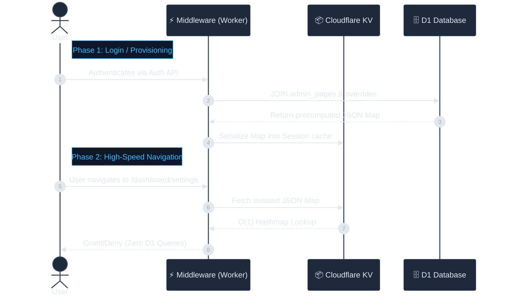
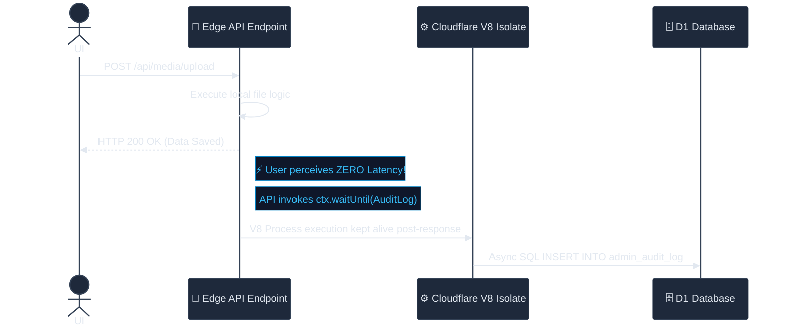

# 🛡️ System Architecture: RBAC, PLAC & Ghost Audit

> [!NOTE]
> **System Status:** Production Ready
> **Target Environment:** Cloudflare Workers V8 Isolates (Edge Computing)
> **Last Updated:** April 2026 (5-Tier RBAC + SHA-256 Audit Hash Chain)

This document outlines the complete technical implementation, execution lifecycle, and operational rules for the **CF-Admin Security & Tracing Triad**: Hierarchical RBAC, Page-Level Access Control (PLAC), and the Ghost Audit Engine.

Designed specifically to operate within Cloudflare's strict 10ms–50ms CPU limits, this triad provides enterprise-grade administrative security with **zero user-perceived latency** and an effective **$0 infrastructure cost**.

---

## 1. The RBAC Foundation (Role-Based Access Control)

RBAC forms the "natural baseline" of the CF-Admin authentication system. It assigns an absolute integer weight to users, establishing a rigid command hierarchy.

### 1.1 The 5-Tier Role Hierarchy Matrix

Defined centrally in `src/lib/auth/rbac.ts`, roles are scored such that a **lower number equals higher privilege**. Any permission check evaluates if `ActorLevel <= TargetLevel`.

| Level | Role | Identifier | Capabilities | Badge Color | Icon | Target Audience |
| :---: | :--- | :--- | :--- | :--- | :---: | :--- |
| **0** | **DEV (Ghost)** | `dev` | **Absolute System Supremacy.** Can execute database prunes, create hidden accounts, mutate other devs, and view raw cryptolocked logs. Hidden entirely from lower tiers. | Red (`#ef4444`) | ⚡ | System Architects |
| **1** | **Owner** | `owner` | **Project Ownership.** Can manage billing, API keys, and view all hidden accounts. Protected from modification by SuperAdmin and below. | Emerald (`#10b981`) | 💎 | Business Owners |
| **2** | **Super Admin** | `super_admin` | **Full Operational Access.** Can manage users (at or below their level), alter global settings, and grant PLAC privileges. Cannot see hidden accounts. | Amber (`#f59e0b`) | 👑 | Senior Managers |
| **3** | **Admin** | `admin` | **Manager-Level Access.** Can manage content (Hero, Gallery, Reviews), view customers, and read generalized audit logs. | Purple (`#8b5cf6`) | 🛡️ | Operations Managers |
| **4** | **Staff** | `staff` | **Restricted Access.** Designed for read-only operations and basic daily front-desk interactions. | Blue (`#3b82f6`) | 👤 | Front Desk & Support |

### 1.2 Color System: Thermal Gradient

Badge colors follow a deliberate **thermal gradient** for dark UI legibility:

```
🔴 Red (danger/system) → 💚 Emerald (ownership) → 🟠 Amber (authority)
→ 🟣 Purple (management) → 🔵 Blue (operations)
```

Each role has full display metadata exposed via `ROLE_META` in `rbac.ts` including `color`, `bgColor`, `icon`, and `label`.

### 1.3 The Hardcoded Emergency Fallback

> [!CAUTION]
> **Anti-Lockout Mechanism**
> To prevent catastrophic administrative lockouts (e.g., if D1 drops, migrations fail, or a vicious actor strips rights), the system relies on a hardcoded array of `SUPER_ADMIN_EMAILS`.

```typescript
export const SUPER_ADMIN_EMAILS = [
  'harshil.8136@gmail.com',
  'team@madagascarhotelags.com'
] as const;
```

If an authenticated email matches the array above, the Cloudflare worker natively forces `super_admin` properties during token minting, bypassing the D1 role validation entirely.

### 1.4 Helper Functions

| Function | File | Description |
|----------|------|-------------|
| `hasPermission(userRole, requiredRole)` | `rbac.ts` | O(1) integer comparison — core gatekeeper |
| `isDev(role)` | `rbac.ts` | Exact DEV check |
| `isOwner(role)` | `rbac.ts` | Owner or higher (DEV/Owner) |
| `isOwnerOrDev(role)` | `rbac.ts` | Specific check for hidden account visibility |
| `isSuperAdmin(role)` | `rbac.ts` | SuperAdmin or higher |
| `isAdmin(role)` | `rbac.ts` | Admin or higher |
| `isValidRole(value)` | `rbac.ts` | Type guard for string validation |
| `isHardcodedSuperAdmin(email)` | `rbac.ts` | Anti-lockout fallback check |

---

## 2. Page-Level Access Control (PLAC)

While RBAC handles broad categorization natively, **PLAC** is a high-performance database extension that allows explicit **Granting** or **Denying** of single pages inside the dashboard on a *per-user* basis. It acts as the absolute final authority determining if a UUID can view a specific `/dashboard/*` route.

### 2.1 The "Compute on Write, Read from Cache" Pipeline

Querying D1 for page permissions on every single navigation event would consume 3–5ms of CPU time per click and create thousands of unnecessary SQL reads. PLAC avoids this entirely.



### 2.2 The D1 Schema Integration

PLAC relies on two specific tables in D1:

* **Table A: `admin_pages`** (The Source of Truth for Routing)
  Defines every page that exists in the interface (`path`, `required_role`, `is_active`).
  The `required_role` column uses a CHECK constraint validating against all 5 roles: `'dev', 'owner', 'super_admin', 'admin', 'staff'`.

* **Table B: `admin_page_overrides`** (The Delta State)
  Holds specific overrides from the natural hierarchy via composite keys (`user_id` + `page_path`) and a boolean `granted` parameter.

### 2.3 The "Deny Wins" Resolution Algorithm

When the `computeAccessMap` function fires (in `src/lib/auth/plac.ts`), it resolves permissions through strict precedence:

1. **Explicit DENY (`0`) Overrides:** ACCESS IS BLOCKED. Denies instantly overwrite the natural hierarchy.
2. **Explicit GRANT (`1`) Overrides:** ACCESS IS ALLOWED.
3. **Implicit Role Default:** If no override row exists, the system relies on baseline mathematics: `user.RoleLevel <= page.RequiredLevel`.

### 2.4 Provisioning Gatekeepers (Anti-Escalation Measures)

> [!IMPORTANT]
> The API endpoint handling Access Management (`POST /api/users/access`) contains four ironclad validation gates. Without them, a standard Admin could theoretically grant themselves Dev permissions.

* **Gate A: Rank Supremacy (`actorLevel < targetLevel`)**
  Administrators can never manipulate the access array of users at their own level or higher.
* **Gate B: DEV + Owner Ghosting**
  Users with `dev` or `owner` rank are intentionally dropped from UI payloads when requested by non-devs. The DEV and Owner cohort operates completely invisibly to standard administration.
* **Gate C: Page Visibility Check (`actorHasPage === true`)**
  Administrators cannot grant another user access to a page they cannot see themselves.
* **Gate D: Natural Ceiling Enforcement**
  Administrators cannot grant a Staff member access to a tool designed with a `dev` base requirement. Grants are capped at the actor's maximum clearance level.

### 2.5 Auto-Purging Strategies

* **Instant Discontinuation:** Modifying a user's PLAC map calls `forceLogoutUser(kv, targetId)`. This uses a **reverse-mapping key** (`user-session:{userId}` → `sessionId`) for O(k) session destruction, avoiding the O(n) KV scan that would violate CPU limits at scale.
* **Role Promotion Reset:** Changing a user's natural baseline role immediately triggers a `DELETE FROM admin_page_overrides WHERE user_id = ?`. A new role implies a new baseline; historical granular rules are destroyed to maintain logical database cleanliness.

### 2.6 Key Files

| File | Purpose |
|------|---------|
| `src/lib/auth/plac.ts` | Core PLAC module — `computeAccessMap()`, `checkPageAccess()`, KV cache helpers |
| `src/pages/api/users/access.ts` | PLAC provisioning API — grant/revoke/reset with hierarchy enforcement |
| `src/pages/api/users/access-data.ts` | Data fetcher for PageAccessManager UI (requires `super_admin+`) |
| `src/components/admin/users/PageAccessManager.tsx` | Preact island — interactive toggle grid for per-user page overrides |

---

## 3. The Ghost Audit Engine

The Ghost Audit Engine is the overarching forensic surveillance system covering `cf-admin`. Because we do not rely on a monolithic backend, traditional blocking loggers would severely degrade Edge performance. The Ghost Engine resolves this.

### 3.1 The Concept: `ctx.waitUntil`

Writing to a physical D1 SQL database takes approximately 5ms to 15ms. Waiting for an audit log to spool before completing a request destroys perceived application speed.

**Solution:** Cloudflare's `ExecutionContext.waitUntil(promise)`.



The user experiences unparalleled performance, while the security ledger remains mathematically uncompromised.

### 3.2 SHA-256 Hash Chain Integrity

> [!IMPORTANT]
> **Tamper Detection:** Each audit entry includes a `prev_hash` field — a SHA-256 hash chain linking every entry to its predecessor.

The hash chain works as follows:
1. Before inserting a new audit entry, the engine reads the most recent entry's `id` and `prev_hash`
2. A chain input is computed: `"${prev.id}:${prev.prev_hash}:${entry.action}:${entry.userId}:${timestamp}"`
3. The chain input is hashed via `crypto.subtle.digest('SHA-256', ...)`
4. The first 8 bytes (16 hex chars) are stored as `prev_hash` on the new entry

**If any row in the audit table is modified, deleted, or inserted out of sequence, the chain breaks.** This provides cryptographic tamper evidence without relying on external blockchain infrastructure.

### 3.3 Immutability at the Edge

> [!WARNING]
> The `admin_audit_log` table explicitly allows `SELECT` and `INSERT`. **The API layer exposes NO `DELETE` or `UPDATE` endpoints.**

To modify a log, a malicious actor would require Cloudflare Dashboard-level administrative access to run raw D1 queries via the CLI. At the framework level, the ledger is computationally immutable.

**Defense-in-Depth:** The `createAuditLogger()` factory validates the `tableName` config parameter against the `ALLOWED_AUDIT_TABLES` whitelist (`Set(['admin_audit_log'])`). Since D1 does not support parameterized table names, this prevents SQL injection even if the factory config surface is widened in future.

### 3.4 Privacy-Preserved Traceability (Edge IP Hashing)

We must trace if a singular geographic IP address is repeatedly attacking the API, but storing raw IPv4 data permanently violates global data privacy regulations (GDPR/LFPDPPP).

The `hashIP()` function (in `src/lib/audit.ts`) solves this at the edge via **cryptographic blinding**:

1. `cf-connecting-ip` is stripped from the request header natively
2. It is bound to a hardened Environment Secret (`IP_HASH_SECRET`)
3. An **HMAC-SHA256 signature** is spawned via the V8 WebCrypto API
4. The result is safely truncated to 12 hex characters

**The Privacy Result:** We can perfectly group abusive traffic *(e.g., "Hash `a4f89d` submitted 500 failed gallery uploads")* without ever saving the raw IP address. It neutralizes privacy liabilities even if the D1 database is entirely compromised. *(Note: Raw SHA-256 is insufficient here; the minimal 4.3B IPv4 space is easily cracked via rainbow tables. HMAC protects the signature).*

> [!IMPORTANT]
> **Deployment Requirement:** The `IP_HASH_SECRET` must be deployed via `wrangler secret put IP_HASH_SECRET`. If absent, all audit IP hashes silently resolve to `undefined`.

### 3.5 Typed Actions and Modules

The audit system uses strict typed unions (not arbitrary strings) for maximum query reliability:

**Actions (`AuditAction`):**
`login`, `logout`, `create`, `update`, `delete`, `grant_access`, `revoke_access`, `reset_access`, `role_change`, `view`, `export`, `prune`, `force_logout`

**Modules (`AuditModule`):**
`auth`, `plac`, `users`, `content`, `bookings`, `customers`, `pets`, `settings`, `analytics`, `reports`, `logs`, `media`, `debug`, `system`

### 3.6 Operational Payload Tracking

The engine specifically tracks unified JSON payloads representing every state mutation:

* **Identity Signatures:** `user_id`, `user_email`, `user_role`
* **Behavior Vectors:** `action` (typed enum), `module` (typed enum)
* **Impact Vectors:** `target_id`, `target_type`, `details` *(granular JSON tracking of exact element changes)*
* **Environment Vectors:** `ip_hash`
* **Integrity Chain:** `prev_hash` *(SHA-256 link to previous entry)*

### 3.7 Key Files

| File | Purpose |
|------|---------|
| `src/lib/audit.ts` | Core audit module — `auditLog()`, `hashIP()`, `createAuditLogger()`, hash chain logic |
| `src/middleware.ts` | Injects `X-Request-ID` via `crypto.randomUUID()` for audit correlation |
| `src/pages/api/users/manage.ts` | User mutations — all logged with audit entries |
| `src/pages/api/users/access.ts` | PLAC provisioning — grant/revoke actions logged |
| `src/pages/api/content/blocks.ts` | CMS updates — logged with sanitized error responses |
| `src/pages/api/media/upload.ts` | Media uploads — logged with R2 key tracking |
| `src/pages/auth/callback.astro` | Login events — IP hashed, provider validated, session created |

### 3.8 Ubiquitous Navigational Telemetry (Middleware Tracking)

> [!TIP]
> **The "In-Accessible Page" Tracer**
> Traditional audit logs only track successful API actions. CF-Admin intercepts navigations at the core Astro `middleware.ts` to log both permitted views and **malicious probing**.

Every non-API navigation inside the dashboard is intercepted:

1. **Access Evaluation:** The middleware checks the PLAC map.
2. **Synchronous Transition:** The user is either allowed to load the page or bounced to a `403` error screen.
3. **Ghost Telemetry:** The middleware fires an async `ctx.waitUntil()` task pushing an `action: 'view'` ledger entry.

The `details` payload contains `granted: boolean`. This allows Devs to scan the audit table for `granted: false` to instantly uncover repeated unauthorized access attempts.
