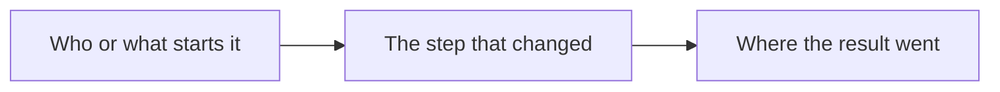
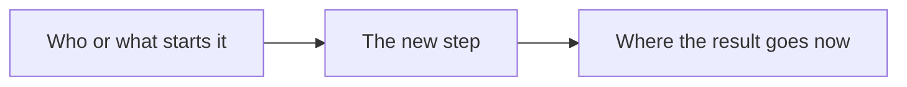

<!-- docs-check: stale-exempt -->
<!-- This is the change-record template. It makes no claim about the system,
     so there is nothing in it to re-verify against code. -->

<!--
HOW TO USE THIS TEMPLATE (delete this comment in the copy)

When:   every big change. A new system, tool or service; a rework that spans several
        files, screens or services; a change in how something runs, deploys or is
        backed up. main.md §4 is the rule. A small fix needs only the owning document.
Where:  documentation/records/reports/YYYY-MM-DD-short-slug.md (the date the work
        shipped). Add a row to the "records/reports" table in documentation/README.md.
Front:  replace this file's front-matter with the block under "Front-matter for the
        copy", and keep status: historical (a record is frozen once written: it is
        superseded, never edited to match today).
Write:  sections 1 and 2 for someone who has never seen the code; sections 3 and 4 as
        diagrams first, then plain sentences that walk through each diagram; sections
        5 to 8 for engineers. Every claim says how it was checked. No secrets, no
        personal data, no binding IDs: link to OPERATIONS.md for those.
GitHub: mermaid renders in GitHub's file view. Keep node labels short and quoted, use
        flowchart LR or TD, and check the preview before pushing. <details> folds long
        technical lists so the page stays readable.
-->

## Front-matter for the copy

```yaml
---
title: "<What changed, in plain words>"
status: historical
audience: [owner, non-technical, technical, ai, operator]
last_verified: YYYY-MM-DD
verified_against: [code, infra]
owner: harshil
related_code: [src/<file>]
related_docs: [../../<owning document>.md]
tags: [record, <area>]
---
```

# <What changed, in plain words>

> **In one minute (for everyone)**
>
> - **What changed:** one plain sentence.
> - **Why:** the problem it solves, or who asked for it.
> - **What you will notice:** what looks or behaves differently, or "nothing visible".
> - **What it costs or saves:** money, time, free-plan allowance, or "nothing".

| | |
|---|---|
| **Date** | YYYY-MM-DD |
| **Asked for by** | who, and the request in their own words |
| **Done by** | the person, or the AI agent and its session |
| **Commits** | `abc1234` short description (one row per repository if several) |
| **Risk** | low, medium or high, and why |
| **Can it be undone?** | yes, and how (§8), or no, and why |

## 1. What happened, for non-technical staff

Three to six short paragraphs a front-desk or management reader can follow: what the
system did before, what it does now, why that is better, and whether anyone has to do
anything differently. No file names, no jargon; explain any term you cannot avoid.

## 2. Impact on each service

| Service | Before | After | Does anyone need to act? |
|---|---|---|---|
| Admin portal (cf-admin) | | | |
| Public website (cf-astro) | | | |
| Backups (cf-backup) | | | |
| Email delivery (cf-email-consumer) | | | |
| Server dashboard (cf-vps) | | | |
| Knowledge graph (cf-graph) | | | |
| Outside services (Supabase, Sentry, PostHog, GitHub) | | | |

Leave out the rows the change does not touch, and say so in one line under the table.
Downtime, data migrated, settings changed and money spent all go here.

## 3. How it worked before



Walk through the diagram in plain sentences, one per arrow that matters, and say what was
wrong with it.

## 4. How it works now



Walk through the new diagram the same way, and name the difference from §3 in one line.

## 5. Technical detail (for engineers)

- **Files changed:** each file and what changed in it.
- **Decisions:** what was chosen, and the alternatives rejected and why.
- **Data and schema:** migrations (number, how and when applied), settings rows, KV keys.
- **Security and privacy:** what personal data moves, which checks guard the change.

<details>
<summary>Longer lists (optional)</summary>

Route tables, full file lists, query output.

</details>

## 6. How it was verified

| Check | Command or method | Result |
|---|---|---|
| Full gate | `npm run verify` | exit 0, quote the summary |
| Live check | the connector or command used | what it returned |

Name what was **not** checked, and why.

## 7. What is left

Follow-ups, known limits and open owner decisions, each with where it is tracked
(`MAINTENANCE.md`, a spec, an issue).

## 8. Rolling back

The exact steps to undo it, or why it cannot be undone and what replaces a rollback.

## Phone test steps

Short steps the owner can follow in a phone browser to see the change working.
