# Dynamic Configuration Architecture (Proposal)

> **Status:** PROPOSED (Review only, no implementation)
> **Goal:** Provide a centralized, ultra-low-latency, dynamic configuration system for Madagascar (`cf-astro`, `cf-admin`, and related workers) strictly within the $0/month Cloudflare free tier.

## 1. Executive Summary

As the Madagascar platform grows, managing configurations—such as Sentry sampling rates, email provider failovers (Option A vs Option C), site-wide alerts, and theme defaults—via hardcoded environment variables or static deployments becomes a bottleneck.

This proposal defines a **Tiered Configuration Architecture** leveraging **Cloudflare D1** as the strong-consistency source of truth and **Cloudflare KV** (plus worker isolate memory) as a lightning-fast, globally distributed read cache for Server-Side Rendering (SSR).

## 2. Research & Component Evaluation

When building configuration systems on Cloudflare Workers, there are three primary storage primitives. Here is the evaluation for our use case:

| Storage Type | Characteristics | Verdict for Config |
|--------------|-----------------|--------------------|
| **Cloudflare R2** | Object storage (S3-compatible). Built for large, unstructured assets (images, videos). High latency for small JSON reads. | ❌ **Rejected**. Will cause severe SSR latency penalties. |
| **Cloudflare KV** | Globally distributed, low-latency key-value store. Built for read-heavy, low-write data. Eventual consistency (up to 60s). | ✅ **Perfect for Edge Reads**. Sub-10ms read times. |
| **Cloudflare D1** | Serverless SQLite. Strong consistency, relational queries, transactional integrity. Higher query overhead than KV. | ✅ **Perfect for Source of Truth**. Ideal for Admin UI mutations. |

**Conclusion:** Neither D1 nor KV alone solves the problem perfectly. D1 is too slow for blocking SSR reads on every request, and KV lacks relational structure and strong transactional consistency for admin management. **The solution is to combine them.**

## 3. The Tiered Architecture (D1 ➔ KV ➔ Memory)

This architecture mimics the proven CMS ingestion pipeline currently used in `cf-admin`.

### 3.1 The Flow

1. **Mutation (Admin):** 
   - Authorized admins log into `cf-admin`.
   - Settings are updated in a dedicated UI and saved to the **D1 `system_configs` table**. 
   - D1 acts as the uncorrupted source of truth, allowing for audit logs, RBAC validation, and version rollbacks.
2. **Compilation & Push (KV):**
   - Immediately after a successful D1 commit, `cf-admin` serializes the required configurations into a single JSON payload.
   - This JSON is written to a shared **KV Namespace** (e.g., `cf-shared-config-kv` with key `global:config`).
3. **Execution (SSR / Edge):**
   - `cf-astro` (or the email consumer worker) receives a user request.
   - The worker checks its **V8 Isolate Memory** (global variable cache) for the config. Latency: **0ms**.
   - If not in memory (or TTL expired), it queries the **KV Namespace**. Latency: **~5-10ms**.
   - It caches the KV result in memory and proceeds with SSR.

### 3.2 System Architecture Graph

```mermaid
sequenceDiagram
    participant Admin as SuperAdmin
    participant AdminUI as cf-admin
    participant D1 as D1 (Source of Truth)
    participant KV as KV (Edge Cache)
    participant Astro as cf-astro (Edge)
    participant Memory as Worker Isolate Cache

    %% Configuration Mutation Flow
    rect rgb(20, 30, 50)
    Note over Admin,KV: 1. Mutation & Injection Phase
    Admin->>AdminUI: Save Sentry Rate & Email Config
    AdminUI->>D1: UPDATE system_configs SET value = ...
    D1-->>AdminUI: Success
    AdminUI->>KV: PUT "global:config" (JSON Payload)
    end

    %% Hot Read Flow
    rect rgb(20, 50, 30)
    Note over Astro,Memory: 2. Lightning SSR Read Phase
    Astro->>Memory: Read globalConfig
    alt Cache Miss
        Memory-->>Astro: undefined
        Astro->>KV: GET "global:config"
        KV-->>Astro: JSON payload (5-10ms)
        Astro->>Memory: Store in Memory (Cache)
    else Cache Hit
        Memory-->>Astro: JSON payload (0ms)
    end
    Astro-->>User: Render Page (Instant)
    end
```



## 4. Addressing the Email Reliability Requirements

Referring to the `email_reliability_brainstorm.md` context:

By implementing this configuration architecture, we can cleanly solve the **Provider Fallback (Option A)** requirement. 
- The email routing configuration (e.g., `PRIMARY_PROVIDER = "brevo"`, `FALLBACK_PROVIDER = "resend"`, `FAILOVER_ENABLED = true`) will live in this dynamic JSON config.
- The `cf-email-consumer` worker will read this JSON from KV natively. 
- If the Brevo API responds with a 429/500, the worker checks the dynamic config in memory, sees failover is active, and immediately dispatches via Resend—all without requiring a hardcoded environment variable redeployment.

## 5. D1 Schema Concept (For Review)

A flexible schema allowing for both simple key-value pairs and nested JSON structures.

```sql
CREATE TABLE admin_system_configs (
    key TEXT PRIMARY KEY,           -- e.g., 'sentry_config', 'email_providers'
    value JSON NOT NULL,            -- e.g., {"sample_rate": 0.1}
    category TEXT NOT NULL,         -- e.g., 'security', 'infrastructure', 'theme'
    updated_at DATETIME DEFAULT CURRENT_TIMESTAMP,
    updated_by_user_id TEXT         -- Audit tracking
);
```

## 6. Implementation Roadmap

If approved, the implementation phase would follow these non-destructive steps:

1. **Phase 1: Foundation (cf-admin)**
   - Provision a new KV namespace (e.g., `cf-shared-config-kv`).
   - Create the `admin_system_configs` D1 table.
   - Build the Data Access Layer (DAL) to read/write from D1 and flush to KV.
2. **Phase 2: UI (cf-admin)**
   - Build the Configuration Dashboard UI using existing Preact Island patterns.
3. **Phase 3: Consumption (cf-astro / Workers)**
   - Implement a lightweight, memory-caching utility in `cf-astro` to fetch the JSON from KV securely during SSR.
   - Update `cf-email-consumer` to dynamically route based on the fetched config.

---
*End of Proposal. Awaiting technical review.*
