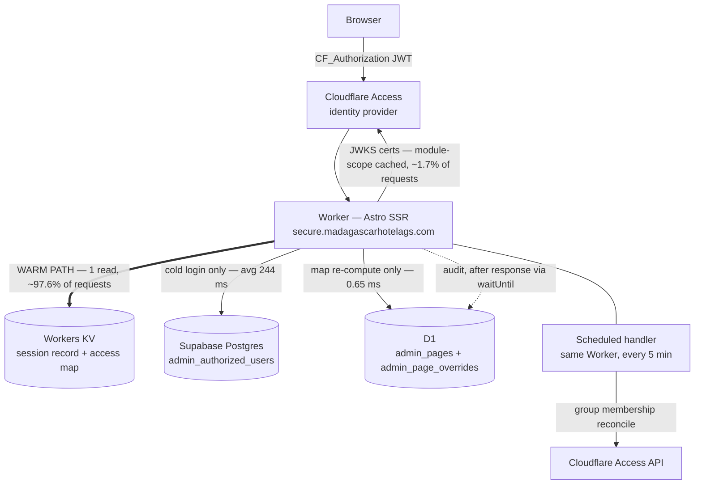

---

title: "Permissions System — RBAC, PLAC and ACM End to End"
status: active
audience: [ai, technical, operator]
last_verified: 2026-09-04
verified_against: [code, infra]
owner: harshil
related_docs: [plac-and-audit.md, ARCHITECTURE.md, ../features/USER-MANAGEMENT.md, ../features/SESSION-MANAGEMENT.md, ../security/SECURITY.md, ../reference/RBAC-AT-SCALE.md]
related_code: [src/lib/auth/rbac.ts, src/lib/auth/plac.ts, src/lib/auth/pipeline.ts, src/lib/auth/stages/, src/lib/auth/decide-access.ts, src/lib/auth/session.ts, src/lib/auth/guard.ts, src/lib/auth/routes.ts]
tags: [architecture, security, rbac, plac, authorization, performance]
---

# Permissions System — RBAC, PLAC and ACM End to End

> **TL;DR (non-technical):** Every screen in this admin portal is locked. Who can
> open which screen is decided in two steps: your job title gives you a baseline,
> and an administrator can then open or close individual screens for you
> personally. The decision is worked out once when you sign in, stored next to your
> session, and then re-checked on every single click without touching a database.
> A closed door always beats an open one.

This document is the **authority** for the permission model. Where another
document restates any of it, this one wins; where this one disagrees with the
code, the code wins and this document is the bug.

It is written to be read cold, by someone comparing this design against Auth0,
Keycloak, Zanzibar/OpenFGA/SpiceDB, Cerbos, Casbin or a hand-rolled RBAC. Every
number is either **measured** — with its source, sample size and date — or
explicitly labelled as arithmetic. Nothing here is estimated and presented as
observed.

---

## 1. The model in one paragraph

Three layers stack, and they are frequently confused because two of them are
per-page:

| Layer | Name | What it answers | Where it lives |
|---|---|---|---|
| **ACM** | Access Control Map — the page registry | *What pages exist, and what is each one's default minimum rank?* | D1 `admin_pages` |
| **RBAC** | Role-based baseline | *What rank is this person?* | Supabase `admin_authorized_users.role` |
| **PLAC** | Page-Level Access Control | *Has an administrator overridden this person's access to this specific page?* | D1 `admin_page_overrides` |

The three are resolved together, once, into a flat `Record<string, boolean>` — the
**access map** — which is embedded in the session record in KV. Every subsequent
request is one KV read and one hash lookup. There is no policy engine, no
policy language, and no per-request database call on the happy path.

**Resolution order, exactly:** explicit deny → explicit grant → role baseline.

---

## 2. Threat model — what this actually defends

Stating this first, because a permission system can only be judged against what it
is meant to stop.

| # | Threat | Defence |
|---|---|---|
| T1 | An unauthenticated stranger reaches any admin surface | Cloudflare Access sits in front of the entire origin; `workers_dev = false` in `wrangler.toml` means the Access-protected custom domain is the only ingress. There is no off-Access path to close. |
| T2 | A valid staff member reads a page above their rank | RBAC baseline computed from the page registry |
| T3 | A valid staff member with a page grant escalates to *other* pages | Grants are per-path and capped at the granting actor's own clearance |
| T4 | An administrator elevates themselves | Self-modification is refused outright; grants are capped at the actor's ceiling |
| T5 | A lower tier edits a higher tier's account | Rank supremacy — strictly higher privilege required |
| T6 | A revoked user keeps working from a live session | Three-layer revocation, including a Cloudflare API call that kills the edge cookie |
| T7 | A read-only user mutates through the API | Viewer tier refused on every non-idempotent method, before page resolution |
| T8 | An API route ships without a guard | Default-deny in the pipeline plus a CI inventory test |
| T9 | Session theft via XSS | `__Host-` cookie prefix, `HttpOnly`, strict CSP with nonces |
| T10 | Cross-site request forgery | Custom CSRF validation in `src/lib/csrf.ts` |

**What it explicitly does not defend.** It cannot express object-level permissions
("user X may edit document Y"). It has no relationship graph, no inheritance beyond
path prefixes, and no delegation. See §15.

---

## 3. Topology — which store owns which fact



The thick edge is the only one on the hot path. Everything else runs on a cold
login, on a re-compute, or after the response has already been sent.

| Fact | Owner | Read on the hot path? |
|---|---|---|
| Is this a real, active human? | Cloudflare Access (IdP) | Yes — JWT signature |
| Is this email allowed in at all, and at what rank? | Supabase `admin_authorized_users` | **No** — cold login only |
| What pages exist and their default rank | D1 `admin_pages` | No — cached |
| Per-user overrides | D1 `admin_page_overrides` | No — folded into the map |
| The resolved decision | KV, inside the session record | **Yes — the only hot-path read** |
| Group membership mirror | Cloudflare Access groups | No — reconciled by cron |

The split is the whole design: **identity is centralised, the decision is
edge-local.**

---

## 4. RBAC — the role ladder

Six tiers. Lower number means higher privilege (`src/lib/auth/rbac.ts`).

| Level | Canonical role | Stored value today | Assignable? | Summary |
|---:|---|---|---|---|
| 0 | `vendor_support` | `dev` | No | Supplier support tier. Visible in the registry by design, never in a role picker. |
| 1 | `owner` | `owner` | Yes | Account holder. Full authority. |
| 2 | `admin` | `super_admin` | Yes | Full operational control including settings and users. |
| 3 | `manager` | `admin` | Yes | Day-to-day operations. No user or platform administration. |
| 4 | `staff` | `staff` | Yes | Own area only. |
| 5 | `viewer` | *(none)* | Not yet | Read-only. Refused on every mutation. |

### 4.1 The vocabulary split, and why it exists

The code speaks canonical names; both databases still hold the old ones.
`normalizeRole()` translates on read, `toStoredRole()` on write, and
`ROLE_VOCABULARY` is the single switch that flips after the data migration.

This is not laziness — **the rename collides**. `super_admin` becomes `admin`, and
`admin` becomes `manager`. The string `"admin"` therefore means level 3 before the
migration and level 2 after it, and no amount of looking at a bare row tells you
which. Translating in code behind an explicit flag means the deployed Worker and
the database can never disagree about what a role means. Verified live on
2026-08-23: every `required_role` in D1 `admin_pages` still holds a legacy value,
and the table's CHECK constraint still admits only
`('dev','owner','super_admin','admin','staff')` — so `viewer` and `manager` cannot
be persisted at all yet. `toStoredRole()` **throws** rather than silently writing a
different role. Tracked as C-11 in [`../MAINTENANCE.md`](../MAINTENANCE.md).

`canManageUser(actor, target)` requires *strictly* higher privilege, so nobody can
act on a peer. An untranslatable stored role returns `false` — there is no safe
level at which to compare it.

### 4.2 Deprecated aliases are load-bearing

`isAdmin` is an alias for `isManagerOrAbove` (level 3) and `isSuperAdmin` for
`isAdminOrAbove` (level 2). The names moved; the levels deliberately did not.
Renaming the helpers without preserving their level would have silently shifted a
privilege boundary at ~200 call sites — invisible in review.

---

## 5. ACM — the page registry

D1 `admin_pages`, primary key `path`:

| Column | Purpose |
|---|---|
| `path` | A dashboard route, or a hash-fragment sub-page such as `/dashboard/sessions#revoke` |
| `required_role` | Default minimum rank (legacy vocabulary, see §4.1) |
| `is_active` | `0` removes the page from nav **and from the access map** |
| `parent_path` | Groups sub-features under their page |
| `sort_order`, `category`, `label`, `icon` | Presentation |

**Measured live, 2026-08-24:** 92 rows, **81 active**, **47** of them hash-fragment
sub-pages (45 active).

Hash fragments are the fine-grained layer. `/dashboard/sessions` is the page;
`#revoke`, `#unblock`, `#flush`, `#export` are separately grantable actions within
it. This is how a coarse per-page model reaches action-level granularity without a
policy language.

**Only depth-2 paths render as sidebar items** (`computeNavItems`); anything deeper
is reachable but not navigable. That rule is why promoting the sessions screen to a
top-level page required a migration rather than a re-link
(`migrations/0002_promote_sessions_page.sql`).

`is_active = 0` is a soft delete that keeps foreign keys and audit history intact.
It has a consequence worth knowing — see §16, D-3.

---

## 6. PLAC — per-user overrides

D1 `admin_page_overrides`:

```sql
user_id TEXT NOT NULL,            -- Supabase admin_authorized_users.id
page_path TEXT NOT NULL,
granted INTEGER NOT NULL CHECK (granted IN (0, 1)),
granted_by TEXT NOT NULL,
granted_by_email TEXT NOT NULL,
reason TEXT,
PRIMARY KEY (user_id, page_path),
FOREIGN KEY (page_path) REFERENCES admin_pages(path) ON DELETE CASCADE
```

Keyed on `user_id`, not email — an email change does not orphan grants. The cascade
means retiring a page cleans up its overrides.

### 6.1 The resolution query

One batched LEFT JOIN, in `computeAccessMap()` (`src/lib/auth/plac.ts`):

```sql
SELECT p.path, p.required_role, o.granted
FROM admin_pages p
LEFT JOIN admin_page_overrides o
  ON o.user_id = ?1 AND o.page_path = p.path
WHERE p.is_active = 1
ORDER BY p.sort_order
```

Then per row: `granted = 0` → `false` (deny wins absolutely); `granted = 1` →
`true`; otherwise `userLevel <= requiredLevel`.

The assignment goes through a guarded `Reflect.set` that refuses `__proto__` and
`constructor` — a prototype-pollution guard, because the keys are database-supplied
strings written into a plain object.

### 6.2 Checking a decision

`requirePageAccess()` (`src/lib/auth/guard.ts`):

1. `vendor_support` returns immediately — the supplier tier is PLAC-exempt.
2. No map on the session → **throw 403**. Fail-closed, deliberately: a session whose
   policy cannot be read costs a login, whereas the other way round costs a page.
3. Exact match in the map → allow or deny.
4. Otherwise **longest-prefix match**: a deny on `/dashboard/users` propagates to every
   path beneath it, such as `/dashboard/users/[id]/access`.

Note what prefix matching does *not* do: it never grants. Only a deny propagates
downward. An unknown path with no matching prefix deny falls through to allow —
which is safe only because every real page is in the registry, and API routes are
default-deny separately (§9).

### 6.3 PLAC in production is barely exercised

**Measured live 2026-08-23: `admin_page_overrides` contains exactly one row.**

This matters for an honest comparison. PLAC is a *designed* capability carrying
real complexity, but essentially all authorization decisions in this deployment are
made by the RBAC baseline. Anyone benchmarking this design should weigh the
override machinery as capability, not as exercised behaviour.

---

## 7. Request lifecycle

`src/middleware.ts` composes three handlers in order:

1. `sentryErrorBoundary` — catches downstream throws, tags them, returns JSON 500
   for `/api/*` and re-throws for pages.
2. `securityHeaders` — CSP with a per-request nonce (`src/lib/security/csp.ts`).
3. `authMiddleware` — everything below (`src/lib/auth/pipeline.ts`, a 77-line
   orchestrator over the stage modules in `src/lib/auth/stages/` since chunk 10).

Ordered, with the file that owns each stage and the store it touches (chunk 10,
2026-09-02; files are under `src/lib/auth/stages/` unless the path says otherwise):

| # | Stage | File | Touches |
|---|---|---|---|
| 1 | Asset, webhook, public-page and public-API classification with the method rules; then the CSRF gate | `classify.ts` | — |
| 2 | Read `__Host-admin_session` → `session:{id}` from KV; refuse a revoked session (`revoked-session:{id}`, `revoked:{userId}`) | `session-stage.ts` | **KV ×3** (record + two flags) |
| 3a | Warm session, every 30 min: re-read the identity row; inactive, missing or unrecognised revokes; a changed role recomputes the map | `refresh-role.ts` | Supabase HTTP; **D1 ×1** on a role change |
| 3b | No session: verify the Cloudflare Access assertion (JWKS, RS256, audience, issuer, expiry) | `assertion.ts` | JWKS fetch (cached) |
| 3c | … bot score, header/claim email match, whitelist, revocation flag, stored role, session creation, `cf_sub_id` write-back, login event | `bootstrap.ts` | **Supabase HTTP**, **D1 ×1** (map), **KV ×1 read + ×2 writes** |
| 4 | A usable access map: missing, built for another role or older than 1 h → recompute; bounded fail-open on a D1 error when a prior map exists | `access-map.ts` | **D1 ×1** when recomputing |
| 5 | The decision, as data: page or API resolution through the one page rule, the viewer-on-mutation refusal, `API_DENY_MODE`, and the audit events each outcome records | `decide.ts` (pure), `../decide-access.ts` | — |
| 6 | Audit rows, after the response, through the Ghost Audit engine | `record.ts` | **D1 ×1 per event, via `waitUntil`** |
| 7 | `locals.user`, then the Decision becomes a Response (`next`, redirect, rewrite, text or JSON) | `../pipeline.ts`, `decision.ts` | — |

Stages 3b–3c run only on a cold login and 3a every 30 minutes; 1, 2 and 4–7
are the warm path. Each stage returns either `continue` with the facts the next
one needs or a `Decision`; `decision.ts` is the only place a `Response` is
built and `record.ts` the only place a row is written, so every stage is
tested on its own against real KV and D1 (`test/pipeline-*.test.ts`).

---

## 8. What happens when someone without access signs in

The question this document exists to answer. Every rejection forks: `/api/*` gets
JSON with a status code; a page gets a redirect carrying an `?error=` code, so the
login screen can explain itself.

> **Both halves of that sentence became true on 2026-09-04.** Until then two
> branches did not fork — a request with no `CF-Access-Authenticated-User-Email`
> redirected to `/` even for `/api/*`, and an untranslatable stored role returned
> JSON 403 even on a page — and four `?error=` codes were appended to
> `/cdn-cgi/access/logout`, which is Cloudflare's endpoint and does not forward an
> `error` parameter to the application, so their screens could never render. Both
> are fixed and pinned: `test/pipeline-bootstrap.test.ts` asserts each fork in both
> directions, and `test/error-code-contract.test.ts` fails on any code without a
> card, any card without a code, and any redirect that puts a code on the
> Cloudflare logout endpoint. See [`../MAINTENANCE.md`](../MAINTENANCE.md) C-20 and
> C-21, and
> [`../features/CFZT-EDGE-AUTHENTICATION.md`](../features/CFZT-EDGE-AUTHENTICATION.md)
> §4 for the full code list.

| Trigger | Status | Page behaviour | Audited |
|---|---|---|---|
| No Cloudflare identity header at all | 401 `{"error":"Missing identity"}` | → `/?error=missing_identity` | — |
| No `CF_Authorization` token | 401 `{"error":"Missing auth token"}` | → `/?error=missing_token` | login attempt |
| Invalid or expired JWT | 401 `{"error":"Invalid or expired auth token"}` | → `/?error=expired_token` | login attempt |
| JWT valid, **email not in `admin_authorized_users`** | 403 `{"error":"Access denied"}` | → `/?error=access_denied` | **yes — `is_authorized_email = 0`** |
| Account exists but `is_active = 0` **at bootstrap** | 403 `{"error":"Access denied"}` — deliberately the same flat 403 as "not whitelisted", so the API never reveals directory membership | → `/?error=account_inactive` | yes — `account_inactive` |
| Account went inactive **during a warm session** (30-min re-check) | — | → `/?error=access_revoked` | yes |
| Stored role does not translate | 403 `{"error":"Account role not recognised"}` | → `/?error=role_unrecognised` | no — the one refusal in `stages/bootstrap.ts` that emits no login event |
| Session revoked (`revoked:{userId}`) | 403 `{"error":"Session revoked"}` + `Clear-Site-Data` | → `/?error=session_revoked` | yes |
| Role re-check failed (D1 unreachable) | — | → `/?error=recheck_failed` | Sentry |
| Bot score below threshold | 403 `{"error":"Automated traffic blocked"}` | 403 | yes |
| Identity mismatch between JWT and session | 403 `{"error":"Identity verification failed"}` | 403 | yes |
| **PLAC deny on the page** | 403 `{"error":"Forbidden"}` | → `/dashboard/access-denied` | yes |
| **Viewer attempting a mutation** | 403 | 403 | yes — `viewer_write_blocked` |
| Access map unreadable | 403 `Access policy unavailable for this session` | destroy session → `/?error=system_error` | Sentry |
| CSRF failure | 403 | 403 | — |
| Method not allowed on a public route | 405 | 405 | — |

**The unauthorised-stranger case specifically.** A person with a valid Google
account who is not in `admin_authorized_users` *does* pass Cloudflare Access — the
IdP only proves who they are, not that they belong here. The Worker then fails them
at step 6, writes an `admin_login_logs` row with `is_authorized_email = 0`, and
redirects to `/?error=access_denied`. Those rows are what the probes view in the
user registry surfaces: attempted access by people who authenticated successfully
but were never authorised.

### 8.1 Viewer enforcement runs early, on purpose

The read-only check sits **before** page resolution and covers page routes as well
as `/api/*` — Astro SSR pages accept POST, so an API-only check would leave a
mutation path open. It is deliberately not staged behind `API_DENY_MODE`: that flag
exists to protect legitimate traffic on routes that pre-dated it, and a brand-new
tier has none. A refused mutation is recorded as `viewer_write_blocked` rather than
a generic denial, so the audit trail distinguishes "wrong tier" from "wrong page".

---

## 9. API authorization

`src/lib/auth/routes.ts` holds the route contract:

- `PUBLIC_ROUTES` — `/`, `/privacy`, `/terms`
- `PUBLIC_API_ROUTES` — `/api/health`, `/api/emails/unsubscribe`
- `PUBLIC_API_PREFIXES` — `/api/auth/`, `/api/storage/share/`, `/api/storage/request/`
- `WEBHOOK_ROUTES` — `/api/emails/webhook` (signature-verified instead)
- `API_PAGE_MAPPING` — **39** prefix → page entries (`src/lib/auth/routes.ts` lines 10–48), matched longest-prefix-first via `API_PAGE_MAPPING_KEYS`

`resolveApiAuthz()` returns `public | webhook | mapped | null`. **`null` is
default-deny.** `API_DENY_MODE` in `wrangler.toml` selects the behaviour: `shadow`
allows the request but writes an `api_authz_shadow_deny` audit row recording what
*would* have been blocked; `enforce` returns 403. Any unset or unrecognised value
also enforces — an unreadable config must never silently reopen the gap. It has
been `enforce` since 2026-08-12.

Two independent mechanisms guard API routes, and both must pass:

1. The pipeline's mapping-driven default-deny (above).
2. Per-handler opt-in via `placDenyResponse(actor, pagePath)` from
   `src/lib/auth/guard.ts`.

`test/api-authz-inventory.test.ts` fails CI if any `/api/*` route is unmapped, which
makes "someone shipped a route without a guard" a build error rather than an
incident.

---

## 10. Provisioning gates

`POST /api/users/access` enforces five gates before any override is written
(`src/pages/api/users/access.ts`):

| Gate | Rule | Prevents |
|---|---|---|
| — | Self-modification refused | Elevating yourself |
| **A** | Actor must strictly outrank the target; target's role is **read from the database**, never from the request body | Spoofing a low target role to bypass the hierarchy |
| **B** | Vendor Support and Owner accounts cannot be mutated by lower ranks | A manager editing the account holder |
| **C** | Actor must have access to the page they are granting | Granting a door you cannot open |
| **D** | Grants capped at the target role's natural ceiling | Manufacturing a super-user by accumulating grants |

Gate A reading the target role from the database rather than the payload is the
single most important line in the file; trusting `body.targetUserRole` was a real
finding, hardened 2026-05-25.

---

## 11. Revocation, and how fast it actually takes effect

Three layers (`src/lib/auth/plac.ts`):

1. `revoked:{userId}` written to KV (TTL 24 h) — every session for that user fails
   its next request.
2. All `session:{id}` and `user-session:{userId}:{id}` keys deleted.
3. A Cloudflare Access API call invalidates the `CF_Authorization` cookie at the
   edge, so the user cannot simply re-enter with the token they still hold.

`revoked-session:{sessionId}` (TTL 24 h) does the same for one session.

**The asymmetry that matters.** Revoking access triggers the full three-layer
force-kick — immediate, with no consistency window. **Granting** access does not:
there is no push invalidation, so a new grant reaches a logged-in user only when
their access map is next recomputed. That happens when the map is missing, when
their role changed, or when it is older than `PLAC_REFRESH_MS` — **one hour**.

This is the safe direction to be wrong in: denials are instant, grants are eventual.
It should still be stated plainly to anyone comparing against a system with push
invalidation, and it is a genuine difference from a centralised PDP, which sees
every decision live.

---

## 12. Audit

Authorization events are written to D1 `admin_audit_log` via
`context.locals.runtime.waitUntil` — the insert runs *after* the response is
flushed, so the database write is off the user's critical path entirely. Sign-in
attempts, authorised or not, go to `admin_login_logs` with full Cloudflare
telemetry: IP, user agent, geo, ASN, colo, TLS version, HTTP protocol, client RTT,
Ray ID, Access method, identity provider, JWT tail and bot score.

**Measured live 2026-08-24:** 232 rows in `admin_audit_log`, 293 in
`admin_login_logs`.

IPs are stored as an HMAC-SHA256 hash derived through
`src/lib/crypto/hkdf.ts`, so one root secret backs several independent per-purpose
subkeys and the audit trail carries no raw IP.

The log is complete but **not tamper-evident** — no hash chain, no sequence number,
no WORM storage, and the table is a retention-purge target. Tracked as C-9.

---

## 13. Resource accounting

### 13.1 Operations per request, by path

Derived by reading `src/lib/auth/pipeline.ts` and `src/lib/auth/session.ts`.
This is a code-derived count, not a measurement.

| Path | KV reads | KV writes | D1 | Supabase | External |
|---|---:|---:|---:|---:|---|
| Warm authenticated page | **1** | 0 | 0 (+1 audit via `waitUntil`) | 0 | 0 |
| Cold login | 1 | **2** | 1 (map) + 1 (audit) | **1 GET + 1 PATCH** | JWKS if cache cold |
| Role re-check (30 min elapsed) | 1 | 1 | 1 | 1 | 0 |
| PLAC refresh (map > 1 h old) | 1 | 1 | 1 | 0 | 0 |
| Unauthenticated | 0 | 0 | 1 (login log) | 1 | JWKS if cold |
| Public/asset route | 0 | 0 | 0 | 0 | 0 |

Session creation costs **two** KV writes, not one — the record plus the
`user-session:` reverse index that makes per-user revocation possible.

A sidebar render adds one more KV read for the `system:admin_pages_cache_v2` page
registry cache (TTL 1 h), which falls back to D1 with three retries and exponential
backoff.

### 13.2 Measured latency

**Source: Sentry, `cf-admin` project, 30-day window ending 2026-08-23, 10% trace
sampling (`tracesSampleRate: 0.1` in `src/workers/cf-entry.ts`).** Spans scoped to
the `GET /dashboard` transaction, n = 2,920 transactions.

| Span | Occurrences | avg | p50 | p95 |
|---|---:|---:|---:|---:|
| Supabase `GET admin_authorized_users` | 70 | **243.6 ms** | 198 ms | 401 ms |
| Supabase `PATCH admin_authorized_users` | 50 | 96.8 ms | 113 ms | 125 ms |
| Cloudflare Access JWKS `/cdn-cgi/access/certs` | 50 | 31.4 ms | 28 ms | 47 ms |
| Sign-in alert email (Brevo) | 40 | 145.8 ms | 144 ms | 167 ms |

Whole-transaction `GET /dashboard`: **avg 128.7 ms, p95 219.4 ms**.

**The two ratios that characterise this architecture:**

- The Supabase identity lookup runs on **70 of 2,920 requests — about 2.4%**. The
  KV session cache absorbs roughly **97.6%** of traffic with no origin round trip.
- The JWKS fetch runs on **50 of 2,920 — about 1.7%**; the module-scope certificate
  cache is doing its job.

**So the honest performance story is bimodal, and most descriptions of this system
tell only the fast half.** A warm request resolves authorization from a single KV
read. A cold login pays roughly **240 ms to Supabase**, plus ~31 ms for JWKS if the
certificate cache is cold, plus ~97 ms for the login-counter write. "Sub-millisecond
edge authorization" is true of the decision, and not true of the login.

**Source: Cloudflare D1, live query 2026-08-23.** The exact `computeAccessMap`
query against production:

| Metric | Value |
|---|---|
| Rows returned | 81 |
| **Rows read** (the billing unit) | **173** |
| SQL duration | **0.65 ms** |

That is materially faster than the "~2 ms" budget asserted in the source comments.

**Access map size:** 2,143 bytes of path strings across 81 entries (mean path 26.5
chars, max 44) → roughly **2.9 KB** serialised, comfortably inside KV's 25 MB value
limit and cheap to parse.

### 13.3 Quota ceilings — where this design runs out

Cloudflare limits, from Cloudflare documentation retrieved 2026-08-23:

| Resource | Free | Paid |
|---|---|---|
| Worker CPU time | **10 ms / invocation** | 30 M CPU-ms/mo included |
| KV reads | 100,000 / day | 10 M/mo, then $0.50/M |
| **KV writes** | **1,000 / day** | 1 M/mo, then $5.00/M |
| D1 rows read | 5 M / day | 25 B/mo |
| D1 rows written | 100,000 / day | 50 M/mo |

**The binding constraint is KV writes, not reads** — and this is the single most
useful capacity fact about the design.

The arithmetic (labelled as arithmetic, not measured): one working day per staff
member costs 2 writes at login, plus 1 write per 30-minute role re-check. An 8-hour
day is ~16 re-checks, so ~18 writes per person per day. Against 1,000 writes/day
that is roughly **55 concurrent daily users on the free plan** before writes fail —
while the same population would consume well under 1% of the read quota.

Reads scale enormously further: at one KV read per request, 100,000 reads/day
supports ~100,000 authenticated requests. The asymmetry is the point — the design
trades writes for reads, and the free tier prices writes 100× higher.

D1 is not close to a limit: 173 rows read per map computation against 5 M/day.

**Worker CPU time is not measurable from here.** No read-only MCP tool exposes
per-invocation CPU, and the portal sits behind Cloudflare Access so it cannot be
driven from this environment. What can be said structurally: the warm path performs
one KV read, one `JSON.parse` of ~2.9 KB, and one hash lookup, with no cryptography
— the JWT is verified only when a session is being created. Whether that fits the
10 ms free-plan ceiling should be confirmed with `wrangler tail` or Workers
analytics before anyone quotes a number.

---

## 14. Failure modes

| Dependency fails | Behaviour | Fail-open or closed? |
|---|---|---|
| KV read fails / session missing | Falls through to full JWT + Supabase login | **Closed** |
| Access map missing from session | `requirePageAccess` throws 403 | **Closed** |
| D1 unreachable during map recompute, **no** prior map | Session destroyed → `/?error=system_error` | **Closed** |
| D1 unreachable during map recompute, prior map exists | Prior map extended with a new `computedAt` | **Open, bounded** — serves the last known-good policy rather than locking everyone out |
| Supabase unreachable at login | Login fails | **Closed** |
| JWKS fetch fails | JWT cannot be verified → 401 | **Closed** |
| Page registry cache miss | 3 D1 retries with exponential backoff, then throw | Closed |

Every branch except one fails closed. The exception is deliberate and bounded: an
already-authenticated user with a valid map keeps their existing policy through a
D1 outage rather than being ejected mid-task. That is a defensible trade, and it is
the kind of decision a comparison should surface rather than bury.

**KV eventual consistency.** Workers KV is eventually consistent across regions.
A session write is not guaranteed instantly visible at every edge location, so in
the worst case a just-revoked session could be served briefly from a stale replica —
which is precisely why revocation is *three* layers rather than one, with the
Cloudflare Access cookie invalidation as the backstop that does not depend on KV
propagation.

---

## 15. Where this sits against the industry

Judged honestly, this is a **coarse-grained, per-page ACL with an edge-cached
decision point**. It is not a relationship-based authorization system and does not
try to be.

| Dimension | This system | Zanzibar / OpenFGA / SpiceDB | Auth0 / Keycloak RBAC | Cerbos / Casbin / OPA |
|---|---|---|---|---|
| Model | Role rank + per-page override | Relationship tuples | Roles + scopes | Policy language |
| Granularity | Page and hash-fragment action | Any object, any relation | Role/scope | Arbitrary, policy-defined |
| Decision latency (warm) | 1 KV read, no network hop | Network call to the PDP | Token claims, or a network call | Sidecar or network call |
| Decision latency (cold) | ~240 ms measured (Supabase) | PDP round trip | IdP round trip | Sidecar startup |
| Infra to operate | None beyond Cloudflare | A PDP cluster + datastore | Hosted or a Keycloak cluster | A sidecar per service |
| Expresses "user X can edit doc Y" | **No** | Yes | Not natively | Yes |
| Policy change propagation | Deny instant; grant ≤ 1 h | Immediate, consistency-tokened | Token TTL | Immediate |
| Audit of decisions | Every denial, to D1 | Yes | Varies | Varies |
| Cost at this scale | $0 | A cluster | Per-MAU | Compute per service |

**Where it genuinely wins.** There is no policy decision point to run, scale, patch
or pay for. The decision is co-located with the request, so authorization adds one
KV read to a request that was going to hit KV for the session anyway — the marginal
cost of authorization is close to zero. For an admin console with a fixed, small set
of pages and a handful of staff, this is a proportionate design, and its measured
97.6% cache-hit rate shows the caching strategy working as intended.

**Where it would lose.** The moment permissions need to depend on the *object*
rather than the *page* — "this manager may see only their own branch's bookings" —
the model has no way to express it, and the honest answer is a rewrite onto a
relationship model, not an extension. Prefix-based deny propagation is a weak
substitute for inheritance. And the one-hour grant delay would be unacceptable in a
system where permissions change frequently.

Prior comparative research lives in
[`../reference/RBAC-AT-SCALE.md`](../reference/RBAC-AT-SCALE.md) and
[`../reference/PERMISSION-ARCHITECTURE-ASSESSMENT.md`](../reference/PERMISSION-ARCHITECTURE-ASSESSMENT.md);
a proposed successor model is sketched in
[`../reference/DYNAMIC-ROLES-PBAC-DESIGN.md`](../reference/DYNAMIC-ROLES-PBAC-DESIGN.md).
Those are `draft` and forward-looking. **This document describes what is built.**

### 15.1 Compliance mapping

| Framework | Control | Where satisfied |
|---|---|---|
| SOC 2 | CC6.1 logical access | Cloudflare Access + RBAC baseline |
| SOC 2 | CC6.2 registration/authorisation | `admin_authorized_users`, §10 gates |
| SOC 2 | CC6.3 role-based restriction | §4–§6 |
| ISO 27001 | A.9.2 user access management | §10, access-review export |
| ISO 27001 | A.9.4 system access control | §7–§9 |
| OWASP ASVS L2 | V1/V4 access control | [`../security/compliance/ASVS-L2.md`](../security/compliance/ASVS-L2.md) |

---

## 16. Known gaps

| # | Gap | Impact |
|---|---|---|
| D-3 | `src/pages/api/users/[id]/session-status.ts` gates on the page key `/dashboard/users/sessions`, whose `admin_pages` rows migration 0002 **deactivated** (`is_active = 0`, confirmed against live D1). Absent from the map, it resolves by longest-prefix to `/dashboard/users`. | Not a hole — the parent deny still applies — but a grant scoped to sessions has no effect on an endpoint returning session telemetry. |
| D-4 | `API_PAGE_MAPPING` maps `/api/sessions` to `/dashboard/sessions` while the handlers check `/dashboard/users`. | Both must pass, so the stricter wins; but the access matrix cannot be reasoned about from either source alone. |
| C-11 | Role vocabulary migration outstanding; `viewer` and `manager` cannot be persisted. | The read-only tier is enforced in code but unassignable. |
| C-9 | Audit log is not tamper-evident. | Complete, but not provably unaltered. |
| — | One override in production (§6.3). | PLAC is unexercised capability. |
| — | Cold login costs ~240 ms to Supabase (§13.2). | Identity is not edge-local; only the decision is. |
| — | Grants propagate in up to 1 h (§11). | No push invalidation. |

---

## 17. What the tests actually pin

| Test | Guarantees |
|---|---|
| `test/rbac-roles.test.ts` | Ladder ordering, translation, `canManageUser` semantics |
| `test/plac.test.ts` | Map computation against a real D1 registry, deny-beats-grant |
| `test/guard-plac.test.ts` | `requirePageAccess` exact match, prefix propagation, fail-closed on a missing map, owner bypass, an unknown key is not a deny |
| `test/decide-access.test.ts` | The one page-access rule: vendor and owner bypass, exact key, longest-ancestor inheritance, unknown vs deny |
| `test/pipeline-session.test.ts`, `test/pipeline-bootstrap.test.ts`, `test/pipeline-decision.test.ts` | Every status, redirect, rewrite, header, KV effect and audit row of the middleware on real KV and D1 (40 cases, chunk 10): session read and both revocation flags; the 30-minute re-check, including that a supabase-js 5xx revokes like a missing row; the Cloudflare Access bootstrap with a real RS256 key and a stubbed identity store; the access-map refresh and its bounded fail-open; the viewer rule; `API_DENY_MODE`; the rows `recordEvents` writes |
| `test/api-authz-inventory.test.ts` | **Every `/api/*` route is mapped** — CI fails otherwise |
| `test/sessionRisk.test.ts` | Session risk scoring |
| `test/cf-access-sync.test.ts` | Group sync behaviour |

---

## Verification log

| Date | Checked by | Method | Result |
|------------|-----------|-------------------------------|------------------------|
| 2026-08-24 | antigravity | Full read of `src/lib/auth/*`; live D1 queries via Cloudflare MCP (registry counts, access-map query timing, schema); Supabase user counts; Vitest auth suite execution (223/223 pass) | pass — all figures verified against live code and database |
| 2026-09-02 | claude | chunk 10: §7 rewritten from the stage modules after the decomposition (`wc -l src/lib/auth/stages/*.ts`, `git show 794bc34`); §17 from the suites that ran (`npx vitest run`: 279 cases across the 11 auth-path files, 717 across the repository). §13.1's KV-read figures were not re-verified here — chunk 10b owns that correction | §7 and §17 match the code at `794bc34` |

## Related

- [`plac-and-audit.md`](plac-and-audit.md) — Ghost Audit engine internals
- [`ARCHITECTURE.md`](ARCHITECTURE.md) — the wider request lifecycle
- [`../features/USER-MANAGEMENT.md`](../features/USER-MANAGEMENT.md) — account lifecycle and the admin UI
- [`../features/SESSION-MANAGEMENT.md`](../features/SESSION-MANAGEMENT.md) — the sessions console
- [`../security/SECURITY.md`](../security/SECURITY.md) — route tables and posture
- [`../security/login-forensics.md`](../security/login-forensics.md) — sign-in telemetry
