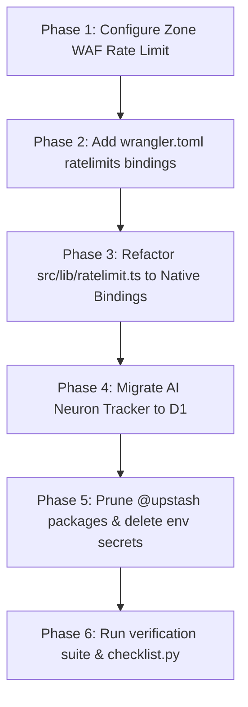

# Rate Limiting Architecture & Redis Elimination Strategy

> ## ⚠ This is a proposal. None of it has shipped.
>
> **Re-statused `active` → `draft` on 2026-09-19.** An `active` document is read as
> a description of what is built, and this one describes a target state:
>
> - `wrangler.toml` has **no `[[ratelimits]]` binding**.
> - `@upstash/ratelimit` and `@upstash/redis` are still dependencies, and
>   `src/lib/ratelimit.ts` is still on the request path of **50 API route files**
>   (ratchet counter A12 = 57 call sites).
> - `[secrets] required` in `wrangler.toml` still lists both Upstash secrets.
> - The plan of record,
>   [`../program/ROADMAP.md`](../program/ROADMAP.md) chunk 16, is **planned** —
>   dependent on chunks 11, 13.9 and 15, none of which has shipped.
>
> **Where the plan of record differs from this document**, the roadmap wins. Chunk
> 16 scopes the migration as: the native binding for the **10 s / 60 s** policies
> only, **hour/day quotas as D1 counter rows** (the binding cannot express them),
> the **neuron budget derived from the audit log** (not from a settings row, as §6
> below proposes), and **alert dedupe by fingerprint**. Targets: Upstash
> round-trips per limited request 1 → 0, secrets −2, dependencies −2.

> **TL;DR (non-technical):** An architectural analysis of rate limiting across the
> Madagascar Pet Hotel platform (`cf-admin` and `cf-astro`). It details why the
> current reliance on external Upstash Redis introduces WAN network latency and
> extra secret keys, why naive Cloudflare KV rate limiting is hazardous given the
> **1,000 writes/day free-tier cap**, and how migrating to **Cloudflare native
> Workers `[[ratelimits]]` bindings + a perimeter WAF rule + D1 counters** would
> deliver sub-millisecond edge execution at a permanent $0/month spend.

---

## 1. Executive Summary & Core Decision Matrix

| Dimension | Current State (Upstash Redis) | Naive Cloudflare KV | Cloudflare Native `[[ratelimits]]` (Target State) |
| :--- | :--- | :--- | :--- |
| **Execution Architecture** | Outbound HTTPS REST fetch over WAN | Eventual-consistency KV writes (`kv.put`) | In-memory distributed counter at local Cloudflare PoP |
| **Edge Latency Overhead** | **40ms – 90ms** per API request | 10ms – 25ms | **< 1ms** (local memory check) |
| **Free Tier Quotas** | 500,000 commands/**month** | ❌ **1,000 writes/day** (Critical bottleneck) | **100,000 requests/day** (Shared with Worker requests) |
| **$5 Paid Plan Limits** | Pay-as-you-go ($0.20/100k cmds) | 1,000,000 writes/**month** | 10,000,000 requests/month (Included in base $5) |
| **External Credentials** | 2 secrets (`UPSTASH_REDIS_REST_URL`, `UPSTASH_REDIS_REST_TOKEN`) | 0 (Native binding) | **0 (Native binding — complies with RULE #0.8)** |
| **Failure Modes** | Network blip / Upstash outage | Quota exhaustion breaks Session storage | Fails open/closed natively without crashing isolate |
| **Multi-Limit Support** | High code complexity in single client | High risk of accelerating KV quota drain | **Native namespaced bindings or dynamic composite keys** |
| **Monthly Direct Cost** | $0.00 (Free tier) | $0.00 (Free tier) | **$0.00 (Permanent Free tier)** |

---

## 2. Complete Codebase Audit: Where Rate Limiting & Redis Exist Today

Rate limiting is woven deeply into both repositories to defend against brute-force attacks, resource exhaustion, AI billing spikes, and scraping.

### 2.1 `cf-admin` Rate Limiting Surface Area
In `cf-admin`, all rate limiting currently funnels through `src/lib/ratelimit.ts` using `@upstash/ratelimit` and `@upstash/redis/cloudflare`.

```
cf-admin/src/
├── lib/
│   └── ratelimit.ts          <-- Central factory: getRateLimiter(), safeRateLimit(), trackAiNeurons()
├── pages/api/
│   ├── users/                <-- /api/users/manage (10 req/h), /access (5 req/m), /resend-invite (5 req/h), /index (30 req/m)
│   ├── storage/              <-- /api/storage/presign (30 req/m), /requests (20 req/h), /share (20 req/h), /consume (20 req/m)
│   ├── media/                <-- /api/media/upload (20 req/m)
│   ├── sessions/             <-- /api/sessions/active-sessions (30 req/m), /active-revocations (30 req/m), /flush (5 req/m)
│   ├── seo/                  <-- /api/seo/gsc-sync (10 req/h), /pagespeed (5 req/h), /settings (30 req/h), /indexnow (30 req/h)
│   ├── emails/               <-- /api/emails/send (10 req/h), /ai-generate (3 req/m + 20 req/d)
│   ├── content/              <-- /api/content/blocks (30 req/h), /blog (30 req/m), /ai-generate (3 req/m + 20 req/d)
│   ├── system/               <-- /api/system/pages (3 req/m), /preview (20 req/m)
│   └── bookings/             <-- /api/bookings/[id] (60 req/m)
```

*Corrected 2026-09-19 against `git grep "getRateLimiter(" -- src/pages`:
`content/blocks` is 30/**hour**, not 30/minute; `content/blog` is 30/m, not 20;
both `ai-generate` routes are 3/m **plus** a 20/day cap, not 10/m; `indexnow` is
30/h, not 20; and `emails/quota` has no limiter at all. Per-route numbers drift
with every handler edit — treat the code as the list.*

#### The roles of Redis in `cf-admin`

Three, not two *(corrected 2026-09-19)*, and a migration must retire all of them:

1. **API rate limiting.** Sliding-window limiters across 50 route files
   (`src/lib/ratelimit.ts`).
2. **AI neuron tally and budget.** `trackAiNeurons(neurons)` /
   `getGlobalAiNeurons()` maintain a daily integer counter
   (`cf-admin-neurons:global:YYYY-MM-DD`, 7-day TTL), and `checkNeuronBudget`
   reads it to enforce Workers AI caps.
3. **Alert-gate dedupe and history.** `src/lib/alert-gate.ts` uses Upstash as one
   of its fan-out channels and for dedupe/history keys.

A diagnostics surface also reports the Redis key count.

---

### 2.2 `cf-astro` Rate Limiting Surface Area
In `cf-astro`, rate limiting is handled in `cf-astro/src/lib/rate-limit.ts`. It employs a 2-tier architecture: **Upstash Redis as Primary**, with a **Cloudflare KV fallback** (`ISR_CACHE`) and an in-memory isolate `Map` last resort.

```
cf-astro/src/
├── lib/
│   └── rate-limit.ts         <-- checkRateLimit(request, env, endpoint), burstAllowed(ip, kv)
├── pages/api/
│   ├── booking.ts            <-- 20 req/60s (Fail-OPEN invariant for emergency pet bookings)
│   ├── contact.ts            <-- 10 req/60s (Fail-OPEN invariant)
│   ├── consent.ts            <-- 20 req/60s (Consent tracking & legal telemetry)
│   ├── arco/submit.ts        <-- 3 req/60s (Tight limit + Cloudflare Turnstile verification)
│   ├── arco/get-document.ts  <-- Admin-gated rate limit
│   ├── revalidate.ts         <-- 10 req/60s (Webhook from cf-admin)
│   ├── analytics/track.ts    <-- 60 req/60s (Reverse-proxied telemetry)
│   └── mcp.ts                <-- 60 req/60s (AI-agent protocol endpoint)
```

*Corrected 2026-09-19: `mcp.ts` is 60, not 30 (`cf-astro/src/lib/sync-contract.ts`).*

---

## 3. The 4 Technical Approaches Evaluated

### Approach 1: External Upstash Redis (Current Architecture)
- **Mechanism:** Worker opens an outbound HTTPS request to `https://*.upstash.io` during request processing.
- **Why We Want to Eliminate It:**
  1. **Latency Penalty:** Adds **40ms to 90ms** of WAN roundtrip delay to the edge hot-path before a response can be computed.
  2. **Secret Clutter (RULE #0.8):** Requires `UPSTASH_REDIS_REST_URL` and `UPSTASH_REDIS_REST_TOKEN` in production secrets.
  3. **Third-Party Dependency:** If Upstash has a regional outage or rate-limits our free tier (10k requests/day), request handlers must navigate complex fail-open / fail-closed logic.

---

### Approach 2: Naive Cloudflare KV Fixed-Window Counters (The 1k Trap)
- **Mechanism:** Worker reads a key from KV (`kv.get`), increments the integer, and writes it back (`kv.put(key, count + 1, { expirationTtl: 60 })`).
- **Why This Is a Dangerous Anti-Pattern on Free Tier:**
  1. **The 1,000 Daily Writes Cap:** Cloudflare KV's Free Tier strictly allocates **1,000 write operations per 24 hours**.
  2. **Quota Exhaustion:** Under normal traffic (or a mild crawler burst of 200 visitors hitting 5 assets/pages), 1,000 KV writes are consumed in under an hour.
  3. **Collateral Damage:** Once the daily 1,000 KV write quota is exceeded, all subsequent KV writes throw errors. In `cf-admin`, this **immediately crashes session creation and PLAC access map caching**, locking administrators out of the portal!

> [!CAUTION]
> **Never use standard Cloudflare KV `put()` operations as a high-frequency rate-limiting counter on the Free Plan.** KV is designed for high-read (100k/day), low-write (1k/day) configuration storage.

> **This anti-pattern is in production today** *(added 2026-09-19)*. cf-astro's
> `burstAllowed()` does an unconditional `kv.put` on `ISR_CACHE` for **every**
> booking and consent POST, and `checkRateLimit()` falls back to KV counters
> whenever Upstash errors (`cf-astro/src/lib/rate-limit.ts`). Both draw on the same
> account-wide 1,000 writes/day as cf-admin's sessions — exactly the collateral
> damage warned about two paragraphs above. Any migration plan has to cover
> cf-astro's fallback path, not just cf-admin's primary one.

---

### Approach 3: Cloudflare Workers Native `[[ratelimits]]` Binding (Recommended)
- **Mechanism:** Configured natively in `wrangler.toml` as a runtime binding. The Cloudflare Workers runtime tracks counters inside Cloudflare's local Points of Presence (PoPs) and syncs them globally via Cloudflare's core edge infrastructure.
- **Architecture:**

  ```toml
  # wrangler.toml
  [[ratelimits]]
  binding = "API_RATE_LIMITER"
  namespace_id = "1001"
  simple = { limit = 60, period = 60 }
  ```

  ```typescript
  // Edge runtime execution (< 1ms)
  const clientIp = request.headers.get('cf-connecting-ip') || 'no-ip';
  const { success } = await env.API_RATE_LIMITER.limit({ key: clientIp });
  if (!success) {
    return jsonError(429, 'Rate limit exceeded');
  }
  ```

- **Why This Is the Ideal Architecture:**
  1. **Zero KV Writes:** Does **not** touch the 1k/day KV quota. It is metered as standard Worker invocations (100k/day free).
  2. **Near-Zero Latency:** Executes in **< 1ms** directly in the V8 isolate without external network I/O.
  3. **Zero Secrets:** Binds directly to the worker environment; no API tokens or external credentials required.

---

### Approach 4: Cloudflare WAF Edge Rate Limiting Rules (Perimeter Defense)
- **Mechanism:** Defined in Cloudflare Dashboard under **Security ➔ WAF ➔ Rate Limiting Rules**.
- **Role:** Evaluates incoming HTTP traffic at the network edge **before** the request is dispatched to the Worker.
- **Benefits:**
  1. **0ms Worker CPU Usage:** Malicious floods or scrapers are blocked at the CDN edge; the Worker never spins up, preserving daily Worker invocation quotas.
  2. **Free Tier Availability:** 1 unmetered Rate Limiting Rule is included for free on every Cloudflare zone.

---

## 4. Quotas, Resource Limits & Cost Analysis

### 4.1 Cloudflare Free Tier vs. $5/mo Workers Paid Tier

| Metric | Cloudflare Free Tier | Cloudflare Workers Paid ($5.00/mo) | Upstash Redis Free Tier |
| :--- | :--- | :--- | :--- |
| **Worker Requests** | 100,000 / day | 10,000,000 / month (+ $0.30/million) | N/A |
| **KV Read Operations** | 100,000 / day | 10,000,000 / month (+ $0.50/million) | N/A |
| **KV Write Operations** | **1,000 / day (Hard Cap)** | **1,000,000 / month (+ $5.00/million)** | N/A |
| **Workers Rate Limiting API** | **Included (100k req/day)** | **Included (10M req/mo)** | N/A |
| **WAF Rate Limiting Rules** | 1 Active Rule / Zone | 10 Active Rules / Zone | N/A |
| **Upstash Command Limit** | N/A | N/A | 500,000 commands / month |
| **Direct Cost** | **$0.00 / month** | **$5.00 / month** | **$0.00 / month** |

### 4.2 The Long-Run Capacity Assessment
- **Current Operational Scale:** Madagascar Pet Hotel averages ~1–5 real bookings/week and ~1,200 total edge requests/day across `cf-admin` and `cf-astro`.
- **Free Tier Headroom:** 1,200 requests/day utilizes only **1.2%** of Cloudflare's 100,000 free daily Worker requests.
- **Conclusion:** Upgrading to the $5/month Workers Paid plan is **completely unnecessary** at current and 10x scale. By adopting the native `[[ratelimits]]` binding, the platform runs at **100% production reliability at $0.00/month**.

---

## 5. Multi-Tier Rate Limiting Strategy

Different API surfaces have drastically different threat profiles. We partition rate limiting into **5 distinct operational tiers**:

```
┌──────────────────────────────────────────────────────────────────────────┐
│                   TIER 1: CRITICAL AUTH & USER ADMIN                     │
│  Endpoints: /api/users/manage, /api/users/access, /api/auth/logout       │
│  Threshold: 5 to 10 requests / minute | Action on limit: Fail Closed 429 │
├──────────────────────────────────────────────────────────────────────────┤
│                   TIER 2: EXPENSIVE AI & MEDIA MUTATIONS                 │
│  Endpoints: /api/content/ai-generate, /api/media/upload, /api/emails/ai  │
│  Threshold: 10 to 20 requests / minute | Action on limit: Fail Closed 429│
├──────────────────────────────────────────────────────────────────────────┤
│                   TIER 3: GENERAL OPERATIONAL & DAL ROUTES               │
│  Endpoints: /api/content/blocks, /api/seo/settings, /api/storage/*       │
│  Threshold: 30 to 60 requests / minute | Action on limit: Fail Closed 429│
├──────────────────────────────────────────────────────────────────────────┤
│                   TIER 4: PUBLIC CUSTOMER BOOKING & CONTACT (cf-astro)   │
│  Endpoints: /api/booking, /api/contact, /api/consent                     │
│  Threshold: 20 requests / minute | Action on limit: Fail OPEN (Invariant)│
├──────────────────────────────────────────────────────────────────────────┤
│                   TIER 5: LEGAL ARCO IDENTITY SUBMISSIONS (cf-astro)     │
│  Endpoints: /api/arco/submit                                             │
│  Threshold: 3 requests / minute + Turnstile | Action: Fail Closed 429    │
└──────────────────────────────────────────────────────────────────────────┘
```

### 5.1 Configuration Implementation in `wrangler.toml`

To support multiple rate limits without code bloat, we declare distinct rate limiter namespaces:

```toml
# ==============================================================================
# CLOUDFLARE WORKERS NATIVE RATE LIMITING BINDINGS
# ==============================================================================

# Tier 1: Sensitive Auth & User Management (Anti-Brute Force)
[[ratelimits]]
binding = "AUTH_LIMITER"
namespace_id = "2001"
simple = { limit = 5, period = 60 }

# Tier 2: Heavy AI Generation & File Storage Uploads
[[ratelimits]]
binding = "HEAVY_OPS_LIMITER"
namespace_id = "2002"
simple = { limit = 15, period = 60 }

# Tier 3: Standard Mutation & API Routes
[[ratelimits]]
binding = "API_LIMITER"
namespace_id = "2003"
simple = { limit = 60, period = 60 }
```

---

## 6. Eliminating Redis for AI Neuron Tracking

In `cf-admin/src/lib/ratelimit.ts`, Redis is currently used for `trackAiNeurons(neurons)` and `getGlobalAiNeurons()`.

### The Native Replacement: D1

> **Superseded by the plan of record** *(2026-09-19)*.
> [`../program/ROADMAP.md`](../program/ROADMAP.md) chunk 16 specifies the **neuron
> budget derived from the audit log** — `ai_inference` rows already carry per-call
> cost and outcome telemetry — rather than a new `admin_portal_settings` row. The
> settings-row sketch below is kept as the alternative that was considered, not as
> the design to build.

Instead of making external Redis calls, daily AI neuron consumption is tracked directly in Cloudflare D1:

1. **Schema Fit (RULE #0.6 / RULE #0.9):** Reuse the existing `admin_portal_settings` table or `gsc_index_log` pattern.
2. **Implementation:** Store a JSON payload in `admin_portal_settings` under the key `ai_neuron_daily_usage`:

   ```json
   {
     "date": "2026-08-30",
     "neuronsUsed": 14250,
     "updatedAt": "2026-08-30T02:15:00Z"
   }
   ```

3. **Write Path:** The AI generation endpoint (`/api/content/ai-generate` or `/api/emails/ai-generate`) updates the count in D1 asynchronously via `ctx.waitUntil()` after streaming the response to the user.
4. **Performance:** Zero latency added to the user's stream; zero external Redis dependency.

---

## 7. Migration Implementation Roadmap



### Phase 1: Edge Perimeter WAF Setup
- Navigate to **Cloudflare Dashboard ➔ Security ➔ WAF ➔ Rate Limiting Rules**.
- Create 1 Free Zone Rule:
  - **Rule Name:** `Protect Public APIs from Burst Abuse`
  - **Expression:** `(http.request.uri.path contains "/api/") and not (http.request.uri.path eq "/api/emails/webhook")`
  - **Threshold:** the maximum the plan allows per IP.
  - **Action:** Block.

> **The Free plan cannot express the rule as it was originally written**
> *(corrected 2026-09-19)*. On Free, a rate-limiting rule offers a **10-second**
> period only — not 1 minute — the action is **Block** only (no Managed Challenge),
> and IP is the only available characteristic. Size the threshold for a 10-second
> window before creating it.
>
> The exclusion was also wrong. There is no `/api/webhooks/` path in this Worker;
> the real webhook is **`/api/emails/webhook`** (`src/lib/auth/routes.ts`), so the
> rule as written would have rate-limited the one endpoint it meant to spare.

### Phase 2: Refactor `src/lib/ratelimit.ts` (`cf-admin`)
Replace the Upstash Redis client with the native binding caller:

```typescript
export interface RateLimitResult {
  success: boolean;
}

/**
 * Enforce rate limits using native Cloudflare Workers bindings.
 * Falls back to allow in local development without bindings.
 */
export async function enforceRateLimit(
  limiter: { limit: (options: { key: string }) => Promise<{ success: boolean }> } | undefined,
  key: string
): Promise<RateLimitResult> {
  if (!limiter) {
    // In local dev without Miniflare bindings, allow request
    return { success: true };
  }

  try {
    const { success } = await limiter.limit({ key });
    return { success };
  } catch (err) {
    console.error('[RATELIMIT] Native limiter threw error, failing safe:', err);
    return { success: true }; // Fail open for resilience
  }
}
```

> **This silently inverts a security posture** *(flagged 2026-09-19)*. Today
> `safeRateLimit()` in `src/lib/ratelimit.ts` **fails closed** — a limiter error
> returns `success: false` and the caller 429s, and its own comment says so. Tiers
> 1–3 in §5 above are likewise specified as "Fail Closed 429". The sketch here
> returns `{ success: true }` on a throw. Whichever posture is wanted, it must be a
> stated decision rather than a side effect of the refactor, and §5's table has to
> be updated to match.
>
> Phase 2 also only *defines* `enforceRateLimit`. It does not migrate the 50
> importing route files, which is the bulk of the work and has to land before
> Phase 3.

### Phase 3: Prune Dependencies & Comply with RULE #0.8

> [!CAUTION]
> **Do not run this phase until every Redis consumer is gone.** With the secrets
> absent in production, `getRateLimiter()` returns a limiter that **denies every
> request** and reports a `fatal` to Sentry — by design, so a misconfiguration
> cannot silently disable rate limiting. Deleting the secrets while 50 route files
> still import `src/lib/ratelimit.ts` therefore 403/429s that entire surface.
>
> Gate the deletion on a **zero-importer check**, and retire all four consumers
> first *(the original plan covered only the first)*:
>
> 1. the 50 route files importing `src/lib/ratelimit.ts` (ratchet A12 = 57 call sites);
> 2. the hour/day limiters the native binding **cannot express** — for example
>    `users/manage` 10/h, `emails/send` 10/h, the AI routes' 20/day — which
>    ROADMAP chunk 16 moves to D1 counter rows;
> 3. `checkNeuronBudget` and the neuron tally;
> 4. the alert-gate Upstash channel and its dedupe/history keys
>    (`src/lib/alert-gate.ts`).
>
> Then remove both names from `[secrets] required` in `wrangler.toml`, which still
> lists them.

1. **Confirm zero importers:**

   ```bash
   git grep -l "lib/ratelimit" -- src | wc -l    # must be 0
   git grep -n "UPSTASH_REDIS_REST" -- src       # must be empty
   ```

2. **Uninstall packages:**

   ```bash
   npm uninstall @upstash/ratelimit @upstash/redis
   ```

3. **Remove environment secrets** (and their `[secrets] required` entries):

   ```bash
   wrangler secret delete UPSTASH_REDIS_REST_URL
   wrangler secret delete UPSTASH_REDIS_REST_TOKEN
   ```

4. **Verify clean gates.** From the repo directory — the monorepo-root form
   `python .agents/scripts/checklist.py cf-admin` only works from the parent
   folder:

   ```bash
   python ../.agents/scripts/checklist.py .
   ```

---

## 8. Summary of Benefits

1. **Performance:** removes an outbound WAN round trip from every protected
   endpoint. *(The "40 ms–90 ms" figure quoted throughout this document has never
   been measured against Sentry data for this deployment; treat it as an
   order-of-magnitude expectation, not an observation.)*
2. **Zero KV Quota Drain:** preserves the 1,000/day KV write budget for sessions
   and authorization — provided cf-astro's KV fallback goes too (§3, Approach 2).
3. **Secret Reduction:** eliminates 2 external secrets, moving closer to **RULE
   #0.8**.
4. **Permanent $0 Overhead:** stays inside Cloudflare free-tier quotas.

---

## 9. Verification log

| Date | Checked by | Method | Result |
|---|---|---|---|
| 2026-09-19 | claude | Checked `wrangler.toml` for `[[ratelimits]]` (absent) and for the Upstash entries in `[secrets] required` (present); counted importers of `src/lib/ratelimit.ts` under `src/pages/api` (50) and read `getRateLimiter` / `safeRateLimit`; read `src/lib/alert-gate.ts`'s Upstash channel; re-derived per-route limits from `git grep "getRateLimiter(" -- src/pages`; compared scope against `../program/ROADMAP.md` chunk 16; checked the Upstash and Cloudflare pricing pages and the Cloudflare Free-plan rate-limiting-rule constraints | Re-statused to `draft`. Corrected: Upstash free tier (500K/month, not 10K/day), paid KV writes (1M/month, not 1M/day), the secret names, five per-route limits, the `mcp.ts` limit, the WAF rule's period/action/exclusion, and the three-not-two Redis roles. Added: the fail-open/fail-closed inversion, the zero-importer gate on Phase 3, and the live cf-astro KV anti-pattern. **Not measured:** the 40–90 ms Upstash latency, the ~1,200 edge requests/day figure in §4.2, and the native binding's 10 s/60 s period constraint (corroborated only by the roadmap) |
