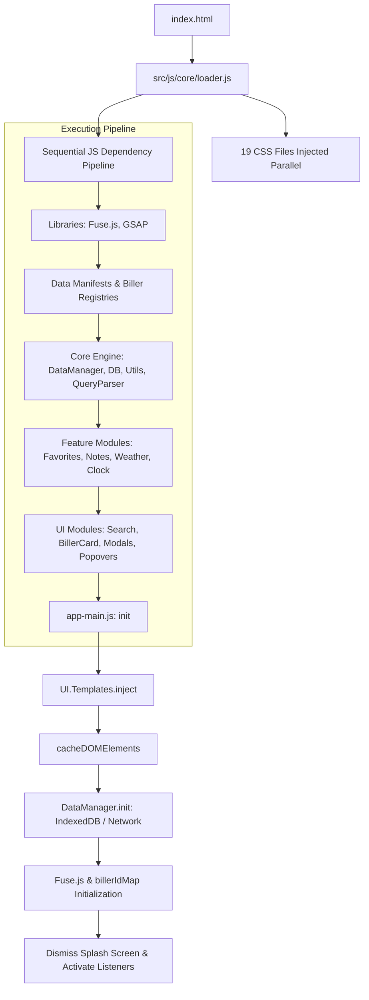
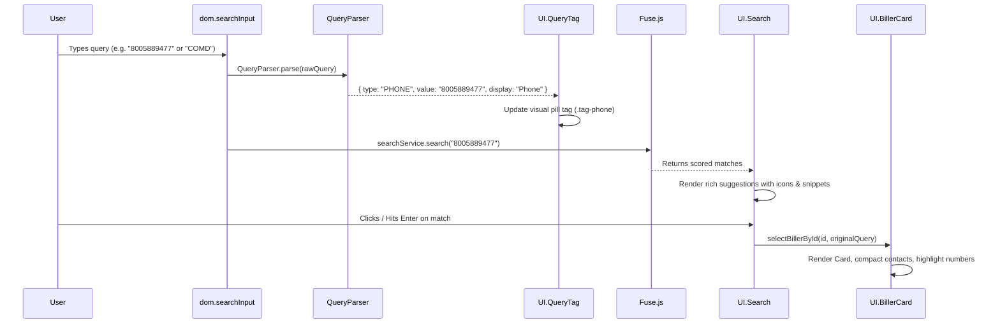

# BillerHub — Comprehensive In-Depth Codebase & Architecture Review

**Scope:** Root files and entire `src/` directory tree (Core, Data, Features, UI, Workers, Lib, CSS, and SVG assets). Strictly excludes `live/` directory.

---

## 1. Executive Summary & Architecture Overview

BillerHub is an enterprise-grade, client-side single-page application (SPA) designed for Customer Service Representatives (CSRs) to rapidly look up utility and financial biller information, processing rules, fees, contact directories, operating hours, and area codes.

### Core Architecture Principles
1. **Zero-Build & Zero-Module Architecture**:
   - The application is engineered to operate directly from the local filesystem (`file:///` protocol) without requiring a web server, bundler, or build step (e.g., Vite, Webpack, npm).
   - Because modern browsers block `fetch()` on local JSON files and ES Module `import`/`export` under `file:///` due to strict CORS policies, the codebase uses structured global namespaces (`UI`, `Features`, `DataHelpers`, `DataManager`, `DB`, `Telemetry`, `Utils`, `Anim`, `Positioning`, `QueryParser`).

2. **Deterministic Sequential Asset Loading**:
   - `src/js/core/loader.js` controls dependency resolution by loading scripts sequentially using Promises, guaranteeing that each global object is fully defined before dependent modules execute.

3. **Strict DOM Injection & Caching Sequence**:
   - Runtime HTML templates (`src/js/ui/ui-templates.js`) are injected into `document.body` first.
   - All DOM elements are cached by ID into the central `dom` object in `src/js/main/app-main.js`.
   - Event listeners and interactive modules attach only after caching is complete.

4. **Multi-Layer Data Caching & TTL Management**:
   - `src/js/core/data-manager.js` verifies the application data version against `<meta name="data-version">` and enforces a 24-hour Time-To-Live (TTL) cache in IndexedDB via `src/js/core/db.js`.

---

## 2. Complete File Inventory

The following table summarizes all 54 non-live files reviewed across the project:

| Category | File Path | Lines / Size | Key Purpose |
| :--- | :--- | :--- | :--- |
| **Root** | `index.html` | 159 lines / 9.6 KB | Primary HTML application shell and mount point |
| **Root** | `Restrictions.txt` | 28 lines / 2.9 KB | Documentation of `file:///` technical constraints |
| **Root** | `Rules List.txt` | 86 lines / 7.6 KB | Mandatory coding standards and architecture rules |
| **Root** | `firebase.js` | 26 lines / 986 B | Standalone Firebase reference configuration |
| **Root** | `sw.js` | 163 lines / 4.8 KB | Service worker cache manifest and offline interceptor |
| **CSS** | `src/css/theme.css` | 97 lines / 3.0 KB | Core design tokens (spacing, radii, elevation, transitions, light theme) |
| **CSS** | `src/css/themes.css` | 775 lines / 24.2 KB | 20+ comprehensive theme palettes (Dark, Solarized, Nord, Catppuccin, etc.) |
| **CSS** | `src/css/base.css` | 98 lines / 2.4 KB | Global layout, accessibility, responsive grid, motion reduction |
| **CSS** | `src/css/header.css` | 197 lines / 5.0 KB | Sticky header, clock widget, area lookup input animation, weather box |
| **CSS** | `src/css/search.css` | 190 lines / 5.3 KB | Search bar styling, loading spinner, glassmorphic dropdown list |
| **CSS** | `src/css/query-tag.css` | 62 lines / 1.8 KB | Query classification pill tag inside the search bar |
| **CSS** | `src/css/biller-card.css` | 286 lines / 7.8 KB | Biller card layout, contact item grid, phone highlight animations |
| **CSS** | `src/css/notes.css` | 296 lines / 9.7 KB | Interactive biller notes, tab navigation, accordions, payment logos |
| **CSS** | `src/css/fee-tool.css` | 151 lines / 6.3 KB | Fee tool two-pane cockpit layout and triage cards |
| **CSS** | `src/css/location.css` | 99 lines / 2.4 KB | Area code lookup results box and biller list |
| **CSS** | `src/css/drawer.css` | 85 lines / 2.1 KB | Slide-out drawer structure with custom scrollbars |
| **CSS** | `src/css/modal.css` | 186 lines / 4.1 KB | Modal overlay system, sizing variants, directory lists |
| **CSS** | `src/css/popover.css` | 168 lines / 4.0 KB | Popover containers, menu items, greeting gradient, global tooltip |
| **CSS** | `src/css/forms.css` | 119 lines / 3.1 KB | Form inputs, toggle switches, round font buttons, reset buttons |
| **CSS** | `src/css/sidebar.css` | 131 lines / 3.2 KB | Favorites sidebar, drag handles, drag-over feedback |
| **CSS** | `src/css/splash.css` | 86 lines / 1.8 KB | Loading splash screen, breathing icon, delayed pro-tips |
| **CSS** | `src/css/title-effects.css` | 40 lines / 1.0 KB | Animated multi-stop text gradient for header title |
| **CSS** | `src/css/toast.css` | 38 lines / 871 B | Bottom-centered transient toast notifications |
| **CSS** | `src/css/tool-menu.css` | 41 lines / 1.0 KB | Accessible tools popover menu with keyboard badges |
| **Core JS** | `src/js/core/loader.js` | 170 lines / 6.8 KB | Sequential script loader and application bootstrapper |
| **Core JS** | `src/js/core/app-core.js` | 165 lines / 6.0 KB | Global state, central search handler, selection, error tracking |
| **Core JS** | `src/js/core/data-manager.js` | 127 lines / 5.3 KB | Data versioning, IndexedDB caching, regional data bundle merging |
| **Core JS** | `src/js/core/db.js` | 168 lines / 5.3 KB | Promise-based wrapper around browser IndexedDB API |
| **Core JS** | `src/js/core/data-helpers.js` | 125 lines / 4.4 KB | $O(1)$ biller ID map builder, search snippet formatter, sorting |
| **Core JS** | `src/js/core/query-parser.js` | 55 lines / 1.9 KB | Search query classifier (Phone, Area Code, Type, Name) |
| **Core JS** | `src/js/core/positioning.js` | 112 lines / 4.1 KB | Viewport collision-avoidance and dynamic element positioning |
| **Core JS** | `src/js/core/anim.js` | 108 lines / 2.9 KB | GSAP micro-animation utility respecting `prefers-reduced-motion` |
| **Core JS** | `src/js/core/utils.js` | 149 lines / 5.0 KB | Universal clipboard copy, debouncing, timezone string formatting |
| **Core JS** | `src/js/core/virtual-list.js` | 90 lines / 3.1 KB | Lightweight DOM virtualization engine for large directory lists |
| **Core JS** | `src/js/core/telemetry-core.js` | 152 lines / 4.5 KB | Anonymous Firebase auth, offline event queue, Firestore sync |
| **Core JS** | `src/js/core/firebase-config.js` | 19 lines / 567 B | Firebase project credentials object |
| **Data JS** | `src/js/data/biller-data-na-east.js` | 618 lines / 28.4 KB | Eastern region biller dataset (AWK, PHI, BGE, CEB, DNE, etc.) |
| **Data JS** | `src/js/data/biller-data-na-central.js` | 333 lines / 13.1 KB | Central region biller dataset (AETX, COMD, DCN3, MEC, NSRC, etc.) |
| **Data JS** | `src/js/data/biller-data-na-west.js` | 165 lines / 6.9 KB | Western region biller dataset (PAC, PSE, SRP, SDG, MDUU, APS, etc.) |
| **Data JS** | `src/js/data/locations.js` | 523 lines / 36.2 KB | Master dictionary of North American area codes, timezones, and TLAs |
| **Data JS** | `src/js/data/theme-data.js` | 174 lines / 3.1 KB | Manifest of all 20+ themes categorized by theme family |
| **Data JS** | `src/js/data/tools-data.js` | 120 lines / 4.5 KB | Manifest of workspace tools (Fee Tool, KB Search, Links, Shortcuts) |
| **Data JS** | `src/js/data/kb-articles.js` | 21 lines / 585 B | Quick reference KB article list |
| **Data JS** | `src/js/data/tips-data.js` | 15 lines / 697 B | Array of pro-tips for splash screen |
| **Features JS** | `src/js/features/app-features.js` | 238 lines / 8.7 KB | Favorites management, Settings synchronization, Font Size, App Reset |
| **Features JS** | `src/js/features/clock.js` | 79 lines / 2.8 KB | 1-second live clock, time-of-day theme logic, weather data integration |
| **Features JS** | `src/js/features/weather-feature.js` | 81 lines / 3.3 KB | Open-Meteo REST API client with 15-minute caching and WMO icons |
| **Features JS** | `src/js/features/location-feature.js` | 76 lines / 2.3 KB | Area code query processor and regional biller lookup engine |
| **Features JS** | `src/js/features/notes-feature.js` | 95 lines / 4.9 KB | Biller TLA notes mapper and tab switching controller |
| **Features JS** | `src/js/features/investigation-notes-feature.js` | 196 lines / 7.4 KB | Fee investigation form logic, summary builder, TL escalation formatter |
| **Features JS** | `src/js/features/theme-feature.js` | 108 lines / 3.4 KB | Dynamic theme selector UI builder and body class switcher |
| **UI JS** | `src/js/ui/ui-main.js` | 9 lines / 233 B | Root declaration of the global `UI` namespace object |
| **UI JS** | `src/js/ui/ui-templates.js` | 173 lines / 7.2 KB | Runtime HTML template injector for modals, drawers, and popovers |
| **UI JS** | `src/js/ui/ui-biller-card.js` | 261 lines / 11.0 KB | Biller card renderer, contact grid, OPPD CSR compaction, phone pulse |
| **UI JS** | `src/js/ui/ui-notes.js` | 184 lines / 8.2 KB | Note rendering engine supporting Stateless, Stateful, and Composite types |
| **UI JS** | `src/js/ui/ui-search.js` | 144 lines / 5.7 KB | Combobox suggestion renderer with rich icons, snippets, query highlight |
| **UI JS** | `src/js/ui/ui-query-tag.js` | 49 lines / 1.3 KB | Search bar classification pill display controller |
| **UI JS** | `src/js/ui/ui-location.js` | 103 lines / 3.6 KB | Area lookup results popover and regional biller selector UI |
| **UI JS** | `src/js/ui/ui-favorites.js` | 184 lines / 6.7 KB | Favorites list renderer with HTML5 drag-and-drop reordering |
| **UI JS** | `src/js/ui/ui-fee-tool.js` | 164 lines / 6.8 KB | Two-pane Fee Tool cockpit UI with triage cards and visited link tracking |
| **UI JS** | `src/js/ui/ui-tool-menu.js` | 205 lines / 6.4 KB | Accessible WAI-ARIA tools dropdown menu with keyboard support |
| **UI JS** | `src/js/ui/ui-kb-modal.js` | 96 lines / 2.5 KB | Knowledge base article search dialog UI |
| **UI JS** | `src/js/ui/ui-shortcuts.js` | 37 lines / 871 B | Keyboard shortcuts reference dialog controller |
| **UI JS** | `src/js/ui/ui-clock.js` | 85 lines / 2.7 KB | Clock options popover controller and live weather renderer |
| **UI JS** | `src/js/ui/ui-drawer.js` | 35 lines / 1.0 KB | Drawer panel transitions and focus management |
| **UI JS** | `src/js/ui/ui-modal.js` | 73 lines / 2.4 KB | Modal manager integrating `VirtualList` for directory browsing |
| **UI JS** | `src/js/ui/ui-popovers.js` | 106 lines / 3.1 KB | Generic popover manager enforcing single-open state |
| **UI JS** | `src/js/ui/ui-settings.js` | 48 lines / 1.7 KB | Settings switch synchronization and body class toggles |
| **UI JS** | `src/js/ui/ui-themes.js` | 42 lines / 1.2 KB | Theme drawer lazy-loading controller |
| **UI JS** | `src/js/ui/ui-toasts.js` | 40 lines / 1.2 KB | Transient toast notification manager |
| **UI JS** | `src/js/ui/ui-tooltips.js` | 56 lines / 2.0 KB | JavaScript-driven tooltip manager for `[data-tooltip]` elements |
| **UI JS** | `src/js/ui/ui-notifications.js` | 35 lines / 1.2 KB | Top banner alert controller and offline state indicator |
| **UI JS** | `src/js/ui/ui-header.js` | 38 lines / 1.0 KB | Dynamic greeting vs. clock display controller |
| **UI JS** | `src/js/ui/ui-tools.js` | 113 lines / 3.9 KB | Legacy tools drawer renderer (retained for backward compatibility) |
| **UI JS** | `src/js/ui/ui-analytics.js` | 37 lines / 1.3 KB | Chart.js analytics view renderer with HTML list fallback |
| **UI JS** | `src/js/ui/ui-components-core.js` | 12 lines / 416 B | Deprecated placeholder file preserved for loader stability |
| **UI JS** | `src/js/ui/ui-components.js` | 12 lines / 390 B | Deprecated placeholder file preserved for loader stability |
| **UI JS** | `src/js/ui/ui-features.js` | 12 lines / 398 B | Deprecated placeholder file preserved for loader stability |
| **Main JS** | `src/js/main/app-main.js` | 231 lines / 10.6 KB | Application entry point: initializes services, caches DOM, binds events |
| **Main JS** | `src/js/main/handlers.js` | 76 lines / 2.9 KB | Global keyboard shortcuts and area code list navigation |
| **Worker** | `src/js/workers/search.worker.js` | 109 lines / 3.2 KB | Web Worker for background Fuse.js searching |
| **Lib** | `src/js/lib/fuse.min.js` | 1 line / 23.0 KB | Bundled Fuse.js fuzzy search library |
| **Assets** | `src/assets/svg/*.svg` (9 files) | — / ~110 KB | Vector payment logos: `visa`, `mastercard`, `discover`, `amex`, `ach`, `paypal`, `paypal-credit`, `amazon-pay`, `venmo` |

---

## 3. Deep Dive: Core Engines & Lifecycle Systems

### 3.1 Data Management & Lifecycle Pipeline
- **Cache Invalidation Mechanism**:
  `src/js/core/data-manager.js` checks `<meta name="data-version">` against `localStorage.getItem('biller-hub-data-version')`. If versions mismatch, or if more than 24 hours have elapsed since `biller-hub-last-purge`, the IndexedDB store is cleared using `DB.clear()`.
- **Sequential Fallback Loading**:
  When cache is purged or invalid, `src/js/core/data-manager.js` dynamically loads `biller-data-na-east.js`, `biller-data-na-central.js`, and `biller-data-na-west.js` in sequence, concatenates them into `window.BILLERS`, writes the combined array to IndexedDB key `biller-index`, and updates `localStorage`.
- **$O(1)$ Hash Map Indexing**:
  `src/js/core/data-helpers.js` creates a `Map<number, object>` (`billerIdMap`) from `BILLERS`. Every subsequent lookup (favorites, search suggestions, directory clicks) resolves in $O(1)$ time instead of scanning arrays.

### 3.2 Intelligent Search & Query Classification
- **Query Classification Engine**:
  `src/js/core/query-parser.js` uses regex patterns to categorize input:
  - Phone Number: Matches `^(\+\d{1,2}\s?)?\(?\d{3}\)?[\s.-]?\d{3}[\s.-]?\d{4}$`, normalizes to 10 digits (`type: 'PHONE'`).
  - Area Code: Matches `^\d{3}$` (`type: 'AREA_CODE'`).
  - Payment Type: Matches keywords (`utility`, `gas`, `electric`, `insurance`, `tax`, etc.) (`type: 'TYPE'`).
  - Biller Name / TLA: Default fallback (`type: 'NAME'`).
- **Visual Feedback**:
  `src/js/ui/ui-query-tag.js` dynamically shows a color-coded pill tag inside the search bar matching the classification.
- **Weighted Multi-Key Fuzzy Matching**:
  `src/js/main/app-main.js` configures `Fuse.js` with weighted scoring keys:
  - `tla` (Weight: `0.9`)
  - `name` (Weight: `0.7`)
  - `contacts.value` (Weight: `0.8`)
  - `aliases` (Weight: `0.5`)
  - `paymentTypes` (Weight: `0.4`)

---

## 4. Deep Dive: Feature Modules & Business Logic

### 4.1 Biller Card Rendering & Contact Compaction
`src/js/ui/ui-biller-card.js` implements specialized CSR business rules:
- **Grouped Contact Grid**: Renders contacts under structured headers (`IVR Numbers`, `Customer Service`, `Internal Transfers`, `Emergency`). Internal numbers render with `.contact-group-internal` red text and an `INTERNAL USE ONLY` pill badge.
- **OPPD Contact Compaction**: Automatically detects Omaha Public Power District (OPPD) with 4 CSR lines (Residential/Business x English/Spanish) and compacts them into two structured bilingual rows:
  - `CSR English: (402) 514-6760 (Res) • (402) 514-6761 (Biz)`
  - `CSR Spanish: (402) 514-6762 (Res) • (402) 514-6763 (Biz)`
- **Search Number Highlighting**: If a phone search was entered, `_highlightPhoneNumber()` locates matching digits in rendered spans and triggers a 2.5-second glowing animation (`@keyframes highlight-glow`).
- **Single-Click Copying**: All phone numbers, names, and TLAs have `click` handlers calling `Utils.copyToClipboard()` with toast confirmations.

### 4.2 Tri-Architecture Interactive Notes Engine
`src/js/ui/ui-notes.js` supports three distinct biller note data contracts:
1. **Stateless Notes** (e.g., standard billers): Category tabs (`alerts`, `fees`, `contact`, `channels`, `system`) with dynamic color-coded left borders and backgrounds.
2. **Stateful Notes** (e.g., NiSource / NSRC): Dual-level navigation with state tabs (`IN`, `OH`, `PA`, `VA`, `MD`, `KY`) updating state-specific rules while maintaining general corporate guidelines below.
3. **Composite Notes** (e.g., Durham NC): Accordion sections for sub-entities (`DHNM`, `DHCC`, `DHDS`, `DHBP`, `DHNS`, `DHNB`, `DUCT`) with collapsible details.

### 4.3 Fee Investigation Cockpit & Summary Generator
`src/js/ui/ui-fee-tool.js` and `src/js/features/investigation-notes-feature.js`:
- **Fixed Height 2-Pane Layout**:
  - **Left Pane (Triage)**: Categorized gateway links (Primary Gateway Portals 1–5, Secondary Gateway, General Regional Portals, Operations Support Toolbox) with single-click visited tracking (`.is-visited`).
  - **Right Pane (Investigation Form & Live Summary)**: Fields for fee amount, charge date, MOP type, MOP last 4, customer name, phone, email, and state/country.
- **Real-Time Summary**: Automatically converts form inputs into formatted lists and provides dedicated copy actions:
  - *Copy Summary*: Plaintext bulleted list for CRM notes.
  - *Copy for TLs*: Formats a pre-composed Team Lead escalation message:  
    `"Hello Tl's. Could I get some assistance with this processing fee:\n• Processing fee: $X.XX\n• Date: MM/DD/YYYY..."`

### 4.4 Area Code Lookup & Timezone Resolution
`src/js/features/location-feature.js` and `src/js/ui/ui-location.js`:
- Triggered by `Alt+S` or header button. Expanding input box animates via GSAP.
- Maps 3-digit input against `AREA_CODES` dictionary in `src/js/data/locations.js`.
- Calculates target local time via `Intl.DateTimeFormat` using the resolved IANA timezone string (e.g. `America/Chicago`).
- Cross-references `LOCATION_BILLERS` map to display primary utilities serving that jurisdiction with direct selection links.

### 4.5 Live Clock & Weather Integration
`src/js/features/clock.js` and `src/js/features/weather-feature.js`:
- 1-second timer updating time in `America/Toronto` timezone.
- Computes time-of-day buckets to adapt header background tints: `morning` (5–12), `afternoon` (12–17), `evening` (17–21), and `night` (21–5).
- Queries Open-Meteo REST API (`https://api.open-meteo.com/v1/forecast`) for configured coordinates. Caches results in `sessionStorage` for 15 minutes to minimize network traffic.

### 4.6 Favorites Management & Drag-and-Drop
`src/js/features/app-features.js` and `src/js/ui/ui-favorites.js`:
- Persists favorite biller IDs in `localStorage` under `biller-favorites`.
- Edit mode enables HTML5 drag-and-drop (`draggable="true"`, `dragstart`, `dragover`, `drop`, `dragend`).
- Uses bounding box midpoint calculations (`_getDragAfterElement`) for real-time visual insertion feedback during reordering.

---

## 5. Keyboard Navigation & Accessibility Matrix

BillerHub provides comprehensive keyboard accessibility across all components:

| Key Combination | Scope | Action |
| :--- | :--- | :--- |
| `Ctrl + F` / `Cmd + F` | Global | Focuses and selects all text in the main search input. |
| `Alt + T` | Global | Toggles the accessible Tools popover menu. |
| `Alt + S` | Global | Toggles and focuses the animated Area Code lookup input. |
| `Alt + K` | Global | Opens the Knowledge Base article search modal. |
| `Alt + 1` | Global | Opens the Processing Fee Tool. |
| `Alt + 2` | Global | Opens Email Generator Pro in a new browser tab. |
| `Alt + 3` | Global | Opens Advance Sticky Notes in a new browser tab. |
| `Alt + ?` | Global | Opens the Keyboard Shortcuts reference dialog. |
| `Escape` | Global | Hierarchically dismisses active Modal $\rightarrow$ Drawer $\rightarrow$ Popover $\rightarrow$ Search Suggestions. |
| `ArrowDown` / `ArrowUp` | Search & Area Lookup | Navigates through suggestion list items with automatic scroll adjustment. |
| `Enter` | Search & Area Lookup | Selects the active item and loads the biller card. |
| `Arrow Keys` / `Enter` | Biller Card | Navigates between focusable action buttons, KB/AD links, and copyable items. |
| `Arrow Keys` / `Enter` | Tools Menu | WAI-ARIA compliant focus traversal through menu items. |

---

## 6. Telemetry & Error Tracking Architecture

`src/js/core/telemetry-core.js` implements anonymous, opt-in telemetry:
- **Consent Gated**: Disabled by default unless `telemetry-consent` is explicitly `true` in `localStorage`.
- **Anonymous Authentication**: Uses Firebase Anonymous Auth to generate a persistent client UID without gathering PII.
- **Offline Resilient Queue**: Events and errors are queued in IndexedDB store `telemetry-queue`.
- **Batch Flushing**: Flushes queued events every 10 seconds (or immediately on `visibilitychange` to visible) using Firestore batch writes with `serverTimestamp()`.
- **Global Error Interception**: Hooks into `window.onerror` and `window.[SUPABASE_PROJECT_REF]` to catch and sanitize unhandled runtime exceptions.

---

## 7. Technical Findings & Architectural Observations

1. **Protocol Rigor**: Zero unauthorized `fetch()` calls on local files and zero `import`/`export` keywords in runtime code. All scripts strictly follow global namespace scoping.
2. **Deterministic Startup**: `src/js/core/loader.js` guarantees consistent script evaluation order on any browser engine.
3. **Deprecated File Footprint**: `src/js/ui/ui-components-core.js`, `src/js/ui/ui-components.js`, and `src/js/ui/ui-features.js` are blank legacy stubs. They are kept in `src/js/core/loader.js` and `sw.js` for loading stability.
4. **Performance Efficiency**: The pre-computed `billerIdMap` in `src/js/core/data-helpers.js` and `VirtualList` virtualization in `src/js/core/virtual-list.js` ensure instantaneous DOM rendering even with hundreds of directory entries.
5. **Robust Copier**: `src/js/core/utils.js` `copyToClipboard()` provides seamless fallback via hidden `textarea` elements when running in non-HTTPS environments.
