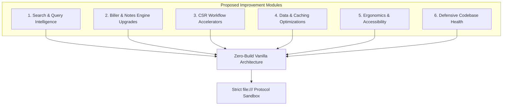
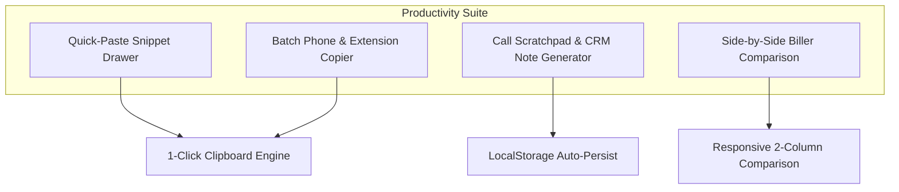

# BillerHub — Comprehensive Improvement Blueprint & Technical Specifications

**Document Type:** Enhancement Architecture, Feature Roadmap & Optimization Strategy  
**Compliance Standards:** `Restrictions.txt` (`file:///` protocol compatibility) & `Rules List.txt` (Zero-build vanilla modular architecture)  
**Scope:** Core Engines, Data Pipelines, UI/UX, CSR Workflows, Accessibility, and Performance

---

## Table of Contents
1. [Architecture & Compliance Framework](#1-architecture--compliance-framework)
2. [Search & Query Intelligence Enhancements](#2-search--query-intelligence-enhancements)
3. [Biller Intelligence & Dynamic Notes Upgrades](#3-biller-intelligence--dynamic-notes-upgrades)
4. [CSR Productivity & Call Handling Accelerators](#4-csr-productivity--call-handling-accelerators)
5. [Data Pipeline & Performance Optimizations](#5-data-pipeline--performance-optimizations)
6. [UI, Ergonomics & Accessibility (a11y) Upgrades](#6-ui-ergonomics--accessibility-a11y-upgrades)
7. [Defensive Architecture & Codebase Health](#7-defensive-architecture--codebase-health)
8. [Implementation Phasing & Dependency Matrix](#8-implementation-phasing--dependency-matrix)

---

## 1. Architecture & Compliance Framework

All proposed enhancements strictly adhere to the project's non-negotiable architectural rules:
- **`file:///` Protocol Resilience**: Zero build tools (no npm/Vite), zero ES module `import`/`export`, zero local `fetch()`, zero server-side dependencies.
- **Meticulous Global Namespaces**: Communication strictly through global namespaces (`UI`, `Features`, `DataHelpers`, `DataManager`, `DB`, `Telemetry`, `Utils`, `Anim`, `Positioning`, `QueryParser`).
- **Deterministic Loading Order**: Every new script or stylesheet must be registered in `src/js/core/loader.js` in dependency order.
- **Strict DOM Lifecycle Sequence**: (1) Inject HTML templates via `UI.Templates`, (2) Cache elements in `dom` object, (3) Attach event listeners.
- **Standardized Biller Notes Order**: `alerts` (danger) $\rightarrow$ `fees` (primary) $\rightarrow$ `contact` (info) $\rightarrow$ `channels` (info) $\rightarrow$ `system` (secondary).
- **Zero Sensitive Machine Data**: Documentation and code maintain strict privacy and sanitization standards.



---

## 2. Search & Query Intelligence Enhancements


### 2.1 Multi-Token Deep Query Routing
- **Problem**: CSRs currently search for a biller, click it, and then manually click the "Fees" or "Alerts" tab.
- **Solution**: Upgrade `src/js/core/query-parser.js` to recognize composite intent tokens:
  - `"COMD fees"` $\rightarrow$ Loads ComEd directly with the **Fees** tab active.
  - `"BGE alerts"` $\rightarrow$ Loads Baltimore Gas & Electric directly with the **Alerts** tab active.
  - `"PAC ivr"` $\rightarrow$ Loads PacifiCorp and scrolls directly to the **IVR Numbers** contact group.
- **Technical Specification**:
  ```javascript
  // In src/js/core/query-parser.js
  parseCompositeQuery(query) {
      const tokens = query.toLowerCase().trim().split(/\s+/);
      const tabKeywords = {
          fees: 'fees', fee: 'fees', rate: 'fees', charge: 'fees',
          alert: 'alerts', alerts: 'alerts', outage: 'alerts',
          contact: 'contact', phone: 'contact', ivr: 'contact',
          channel: 'channels', web: 'channels', portal: 'channels',
          system: 'system', hours: 'system'
      };
      // Match biller identifier + target tab keyword
  }
  ```

### 2.2 Recent Search History & 1-Click Rerun
- **Feature**: Dropdown showing the last 5 searched billers when the search bar is focused with an empty input.
- **Implementation**: Store an array of recent biller IDs in `localStorage['biller-recent-searches']`.
- **Ergonomics**: CSRs handling multiple repeat calls for the same utility (e.g. during weather outages) can switch billers with a single click.

### 2.3 Numbered Search Result Quick-Jumps (`1`–`5`)
- **Feature**: When suggestions appear, append small keyboard badges (`1`–`5`) to the top 5 results.
- **Behavior**: Pressing `Alt + 1` through `Alt + 5` while in the search box immediately selects that suggestion without requiring multiple `ArrowDown` presses.

---

## 3. Biller Intelligence & Dynamic Notes Upgrades

### 3.1 In-Card Live Note Search & Filter Bar
- **Problem**: Lengthy notes and accordion sections require CSRs to manually scan long text during live customer calls.
- **Solution**: Add a lightweight search input at the top of the interactive notes container (`#notesFilterInput`) that highlights matching text in yellow and collapses accordion items that do not contain the query.
- **Implementation Details**:
  - Pure DOM string matching with `<mark>` tag wrapping.
  - Automatically activates hidden tabs or expands accordions if the match exists inside them.

### 3.2 Dynamic Tab Counter Badges
- **Feature**: Display numeric badges directly on category tabs to give CSRs immediate at-a-glance awareness:
  - `Alerts [2]` (Red badge if active emergency alerts exist).
  - `Fees [4]` (Indicates 4 distinct payment channels or fee tiers).
  - `Contacts [3]` (Indicates 3 available telephone lines).

### 3.3 Interactive In-Card Fee Calculator
- **Feature**: An embedded calculator widget inside the `fees` tab.
- **Functionality**:
  - CSR enters bill amount (e.g., `$150.00`) $\rightarrow$ Auto-calculates processing fee based on biller rules (e.g. `$2.50` flat or `2.25%` tier) $\rightarrow$ Displays total charged amount (`$152.50`).
  - Single-click copy button for the total payment amount to quote directly to the customer.

### 3.4 Live Biller Operating Schedule & "Open Now" Status
- **Feature**: Calculate live operational status from schedule data in `system` notes against the biller's primary timezone.
- **Visual Display**: Green pill (`● Open Now (Closes 7:00 PM EST)`) or Amber pill (`● Closed (Opens 8:00 AM EST)`).

---

## 4. CSR Productivity & Call Handling Accelerators



### 4.1 Quick-Paste Response Snippet Engine
- **Feature**: A dedicated sliding drawer or popover (`Alt+P`) containing pre-approved, standardized CSR call scripts:
  - *Standard Greeting / Closing script*.
  - *Payment Processing Fee Explanation* (explains why third-party processing fees apply).
  - *IVR Navigation Guidance* (step-by-step keypad instructions).
  - *Refund / Investigation Disclaimer*.
- **Mechanism**: Single-click on any snippet copies it to the clipboard with an immediate toast notification.

### 4.2 Call Scratchpad & CRM Note Builder
- **Feature**: A floating or sidebar-docked notepad widget that persists notes in `localStorage`.
- **Template Generator**: 1-click button to insert a standardized CRM call log template:
  ```text
  [CALL LOG — MM/DD/YYYY HH:MM]
  • Biller: COMD (ComEd)
  • Caller Name: 
  • Account #: 
  • Reason: Processing Fee Inquiry / Payment Assistance
  • Resolution: Provided IVR payment steps & fee breakdown.
  ```

### 4.3 Side-by-Side Dual Biller Comparison Mode
- **Feature**: Toggle button allowing CSRs to pin a secondary biller card side-by-side.
- **Use Case**: Comparing policies between parent and child utilities (e.g., Constellation Energy vs. Constellation Home, or regional multi-state utilities like NiSource Ohio vs. NiSource Pennsylvania).

---

## 5. Data Pipeline & Performance Optimizations

```mermaid
flowchart LR
    subgraph Boot Pipeline
        IndexDB[(IndexedDB: BillerHubDB)] -->|1. Check Version| VersionCheck{Version Match?}
        VersionCheck -->|Yes| PrecompiledFuse[Load Precompiled Fuse Index]
        VersionCheck -->|No| FetchBundles[Load Regional Bundles]
        FetchBundles --> CompileIndex[Build Fuse Index & O(1) Map]
        CompileIndex --> StoreIndexDB[(Write Index to IndexedDB)]
    end

    PrecompiledFuse --> FastBoot[Boot in < 10ms]
    StoreIndexDB --> FastBoot
```

### 5.1 Precompiled Search Index Serialization in IndexedDB
- **Current Behavior**: `Fuse.js` reconstructs its internal search index tree in memory on every page load.
- **Optimization**: Use `Fuse.createIndex()` to build the search index once, serialize it to JSON, and store it in IndexedDB alongside `biller-index`. On subsequent launches, load the precomputed index to reduce warm-start CPU cycles.

### 5.2 Dynamic Event Delegation in UI Modules
- **Current Behavior**: Individual event listeners are attached to each DOM button inside biller cards and suggestion lists.
- **Optimization**: Migrate to centralized event delegation on parent containers (`#billerCard`, `#suggestionsList`).
- **Benefit**: Reduces memory footprint and prevents event listener leaks when cards are dynamically re-rendered.

### 5.3 Data Schema Validator (Debug Mode Utility)
- **Feature**: A lightweight verification script in `src/js/core/data-manager.js` (activated when `state.settings.showDebugLog` is true) that audits all biller records on startup:
  - Verifies presence of required properties (`id`, `name`, `tla`, `contacts`, `paymentTypes`, `live`).
  - Verifies all phone strings conform to standard 10-digit formats.
  - Alerts developer/maintainer in the debug console if a biller has broken data contracts.

---

## 6. UI, Ergonomics & Accessibility (a11y) Upgrades

### 6.1 Screen Reader Live Regions (`aria-live`)
- **Enhancement**: Add `aria-live="polite"` to:
  - Search suggestion status announcement: `"5 billers found for 'water'"`.
  - Notification banner: `"Copied (800) 588-9477 to clipboard"`.
  - Area code result box: `"Area code 312 mapped to Illinois (Central Time)"`.

### 6.2 Focus Trap & Restoration Engine
- **Enhancement**: When opening any modal (`Directory`, `Fee Tool`, `Shortcuts`, `KB Search`) or drawer (`Themes`):
  1. Trap keyboard `Tab` navigation strictly within the active dialog.
  2. Upon pressing `Escape` or clicking close, automatically restore focus back to the exact button that triggered the overlay.

### 6.3 Low Blue Light & High-Contrast Ergonomic Modes
- **Enhancement**: Add specialized visual comfort options in the Settings menu:
  - *OLED True Black* (pure `#000000` background for high power efficiency and maximum contrast).
  - *Warm Night Shift* (low blue-light amber tint filter for night shift CSRs).

### 6.4 Synthetic Web Audio Confirmation Clicks (Zero-Asset Sound)
- **Feature**: Optional subtle, accessible sound cue on successful copy or shortcut trigger.
- **Implementation**: Uses native browser `AudioContext` to generate a 15ms sine wave beep at 800Hz with zero external `.mp3` or `.wav` files:
  ```javascript
  // In src/js/core/utils.js
  playAudioCue() {
      if (!state.settings.soundEnabled) return;
      try {
          const ctx = new (window.AudioContext || window.webkitAudioContext)();
          const osc = ctx.createOscillator();
          const gain = ctx.createGain();
          osc.connect(gain);
          gain.connect(ctx.destination);
          osc.frequency.value = 880;
          gain.gain.setValueAtTime(0.05, ctx.currentTime);
          gain.gain.exponentialRampToValueAtTime(0.001, ctx.currentTime + 0.08);
          osc.start();
          osc.stop(ctx.currentTime + 0.08);
      } catch (e) {}
  }
  ```

---

## 7. Defensive Architecture & Codebase Health

### 7.1 Isolated Module Error Sandboxing
- **Problem**: An unhandled exception in one feature (e.g. Weather API network timeout or Clock timer glitch) could potentially halt remaining initializers.
- **Solution**: Wrap each module initializer in `src/js/main/app-main.js` with an isolated execution wrapper:
  ```javascript
  function safeInit(moduleName, initFn) {
      try {
          initFn();
      } catch (err) {
          console.error(`[Init Failed] ${moduleName}:`, err);
          if (window.Telemetry) Telemetry.logError(err, { context: `init_${moduleName}` });
      }
  }
  ```

### 7.2 Clean Removal of Deprecated Legacy Stubs
- **Observation**: `src/js/ui/ui-components-core.js`, `src/js/ui/ui-components.js`, and `src/js/ui/ui-features.js` are empty legacy files.
- **Action**: When ready for a major release, safely remove them from `src/js/core/loader.js` and `sw.js` to reduce HTTP requests during cold boots.

---

## 8. Implementation Phasing & Dependency Matrix

```mermaid
gantt
    title Phased Implementation Roadmap
    dateFormat X
    axisFormat Phase %s

    section Phase 1: High Impact & Zero Risk
    Multi-Token Query Routing          :0, 1
    In-Card Notes Search Filter        :0, 1
    Live Region a11y Announcements     :0, 1
    Focus Restoration Engine           :0, 1

    section Phase 2: CSR Workflow Accelerators
    Quick-Paste Snippet Drawer         :1, 2
    Interactive Fee Calculator         :1, 2
    Dynamic Tab Counter Badges         :1, 2
    Recent Search History Dropdown     :1, 2

    section Phase 3: Advanced Intelligence & Performance
    Operating Hours Status (Open/Closed):2, 3
    Precompiled Fuse Index Storage     :2, 3
    Call Scratchpad & CRM Note Builder :2, 3
    Dual-Biller Comparison View        :2, 3
```

| Phase | Milestone | Features Included | Primary Files Impacted | Complexity |
| :---: | :--- | :--- | :--- | :---: |
| **1** | **Search & a11y Polish** | Multi-token search routing, in-card notes text filter, live region announcements, focus restoration. | `query-parser.js`, `ui-search.js`, `ui-notes.js`, `ui-modal.js` | Low |
| **2** | **CSR Workflow Suite** | Quick-paste snippet drawer, interactive fee calculator, tab count badges, recent searches. | `tools-data.js`, `ui-fee-tool.js`, `ui-notes.js`, `app-features.js` | Medium |
| **3** | **Advanced Intelligence** | Live operating schedule (Open/Closed), precompiled search index caching, call scratchpad, dual-biller view. | `data-manager.js`, `biller-card.js`, `ui-templates.js`, `clock.js` | Medium |

---

### Conclusion
By implementing these enhancements within the boundaries of `Restrictions.txt` and `Rules List.txt`, BillerHub will further reduce Average Handling Time (AHT) for CSRs, expand its offline intelligence, and improve daily ergonomics—while maintaining zero-build portability and client-side security.
