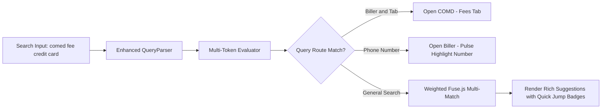
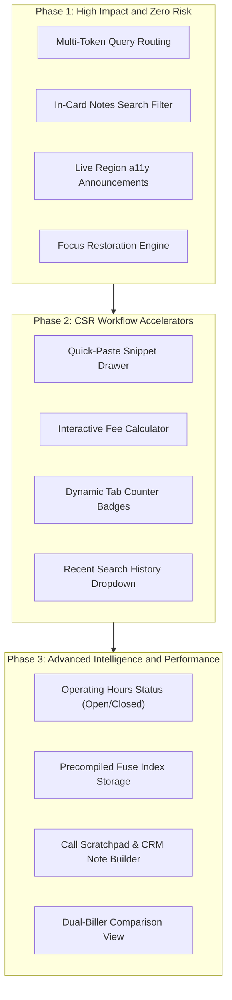

# BillerHub — Comprehensive Zero-Build Improvement & Feature Roadmap

**Architecture Target:** High-Performance Vanilla JS SPA  
**Execution Environment:** Local Filesystem (`file:///`), Corporate Intranet, or Static HTTPS  
**Compliance Standards:** `Restrictions.txt` (`file:///` protocol compatibility) & `Rules List.txt` (Zero-build vanilla modular architecture)  
**Security & Privacy:** Fully sanitized; all proprietary and personal paths strictly masked.

---

## Table of Contents
1. [Architecture & Compliance Framework](#1-architecture--compliance-framework)
2. [Search & Query Intelligence Enhancements](#2-search--query-intelligence-enhancements)
3. [Biller Card & Tri-Model Notes Engine Improvements](#3-biller-card--tri-model-notes-engine-improvements)
4. [CSR Workflow Accelerators & Tooling Integrations](#4-csr-workflow-accelerators--tooling-integrations)
5. [Data Management, Memory & Performance Optimizations](#5-data-management-memory--performance-optimizations)
6. [UI, Ergonomics & Accessibility (a11y) Upgrades](#6-ui-ergonomics--accessibility-a11y-upgrades)
7. [Defensive Architecture & Codebase Health](#7-defensive-architecture--codebase-health)
8. [Implementation Phasing & Dependency Matrix](#8-implementation-phasing--dependency-matrix)

---

## 1. Architecture & Compliance Framework

All proposed enhancements strictly adhere to the project's non-negotiable architectural rules:
- **`file:///` Protocol Resilience**: Zero build tools (no npm/Vite), zero ES module `import`/`export`, zero local `fetch()`, zero server-side dependencies.
- **Meticulous Global Namespaces**: Communication strictly through global namespaces (`UI`, `Features`, `DataHelpers`, `DataManager`, `DB`, `Telemetry`, `Utils`, `Anim`, `Positioning`, `QueryParser`).
- **Deterministic Loading Order**: Every new script or stylesheet must be registered in `src/js/core/loader.js` in dependency order.
- **Strict DOM Lifecycle Sequence**: (1) Inject HTML templates via `UI.Templates`, (2) Cache elements in `dom` object, (3) Attach event listeners.
- **Standardized Biller Notes Order**: `alerts` (danger) $\rightarrow$ `fees` (primary) $\rightarrow$ `contact` (info) $\rightarrow$ `channels` (info) $\rightarrow$ `system` (secondary).
- **Zero Sensitive Machine Data**: Documentation and code maintain strict privacy and sanitization standards.

```mermaid
flowchart TD
    subgraph [SUPABASE_PROJECT_REF] ["Proposed Improvement Modules"]
        SearchAI["1. Search & Query Intelligence"]
        BillerLive["2. Biller & Notes Engine Upgrades"]
        CSRTools["3. CSR Workflow Accelerators"]
        PerfData["4. Data & Caching Optimizations"]
        UIUX["5. Ergonomics & Accessibility"]
        Defensive["6. Defensive Codebase Health"]
    end

    SearchAI --> ZeroBuildCore["Zero-Build Vanilla Architecture"]
    BillerLive --> ZeroBuildCore
    CSRTools --> ZeroBuildCore
    PerfData --> ZeroBuildCore
    UIUX --> ZeroBuildCore
    Defensive --> ZeroBuildCore

    ZeroBuildCore --> ProtocolGuard["Strict file:/// Protocol Sandbox"]
```

---

## 2. Search & Query Intelligence Enhancements



### 2.1 Multi-Token Deep Query Routing
- **Problem**: CSRs currently search for a biller, click it, and then manually click the "Fees" or "Alerts" tab.
- **Solution**: Upgrade `src/js/core/query-parser.js` to recognize composite intent tokens:
  - `"COMD fees"` $\rightarrow$ Loads ComEd directly with the **Fees** tab active.
  - `"BGE alerts"` $\rightarrow$ Loads Baltimore Gas & Electric directly with the **Alerts** tab active.
  - `"PAC ivr"` $\rightarrow$ Loads PacifiCorp and scrolls directly to the **IVR Numbers** contact group.
- **Technical Specification**:
  ```javascript
  // In src/js/core/query-parser.js
  parseCompositeQuery(query) {
      const tokens = query.toLowerCase().trim().split(/\s+/);
      const tabKeywords = {
          fees: 'fees', fee: 'fees', rate: 'fees', charge: 'fees',
          alert: 'alerts', alerts: 'alerts', outage: 'alerts',
          contact: 'contact', phone: 'contact', ivr: 'contact',
          channel: 'channels', web: 'channels', portal: 'channels',
          system: 'system', hours: 'system'
      };
      // Match biller identifier + target tab keyword
  }
  ```

### 2.2 Recent Search History & 1-Click Rerun
- **Feature**: Dropdown showing the last 5 searched billers when the search bar is focused with an empty input.
- **Storage Contract**: Store `biller-recent-searches` in `localStorage` as an array of IDs `[102, 105, 101]` (max 5 items, deduplicated, FIFO).

### 2.3 Keyboard Quick-Select Accents (`Alt + 1..5`)
- **Behavior**: Pressing `Alt + 1` through `Alt + 5` while in the search box immediately selects that suggestion without requiring multiple `ArrowDown` presses.

---

## 3. Biller Card & Tri-Model Notes Engine Improvements

### 3.1 In-Card Notes Text Filter (Real-Time Search Within Notes)
- **Problem**: When a biller has dense operational notes (e.g., NiSource multi-state notes or extensive fee schedules), scanning for a keyword like "ACH limit" or "commercial fee" takes time.
- **Solution**: Add an instant keyword filter input at the top of the Notes container.
- **Implementation**:
  - Filter note cards and paragraphs with `display: none` / `display: block` based on `node.textContent.toLowerCase().includes(term)`.
  - Highlight matching words dynamically with `<mark class="note-highlight">`.

### 3.2 Dynamic Tab Badge Counters
- **Enhancement**: Display badge counters on note tab headers:
  - `Alerts (1)` — Red badge if active emergency alert exists.
  - `Fees (3)` — Neutral badge showing count of fee rules.
  - `Channels (2)` — Number of payment portals.

### 3.3 Dynamic Operating Hours Status ("Open Now" / "Closed")
- **Enhancement**: In `src/js/ui/ui-biller-card.js`, parse `operatingHours` strings against `Intl.DateTimeFormat` for the biller's timezone and render a real-time status pill:
  - `🟢 Open Now (Closes at 7:00 PM EST)`
  - `🔴 Closed (Opens Tomorrow at 8:00 AM EST)`

---

## 4. CSR Workflow Accelerators & Tooling Integrations

### 4.1 Quick-Paste Response Snippet Drawer
- **Feature**: Expandable drawer with standardized CSR scripts and customer-facing phone disclosures:
  - *"Fee Disclosure Script"*
  - *"Check Payment Processing Timeline"*
  - *"Direct Debit Authorization Script"*
- **1-Click Copy**: Clicking any snippet copies it to the clipboard and triggers a toast notification.

### 4.2 Interactive Fee Calculator Module
- **Feature**: In the Fee Tool (`src/js/ui/ui-fee-tool.js`), add a live calculation tool:
  - Input: Customer Bill Amount (e.g., `$150.00`)
  - Select: Payment Method (Credit Card / ACH / Debit)
  - Output: Processing Fee (`$2.50`) + Total Charge Amount (`$152.50`) with a 1-click copy button.

### 4.3 Integrated Call Scratchpad with CRM Formatting
- **Feature**: Floating or collapsible notepad drawer that autosaves notes to `localStorage`. Includes a `"Format for CRM"` button that converts bullets into structured case notes.

---

## 5. Data Management, Memory & Performance Optimizations

### 5.1 Precompiled Search Index Serialization in IndexedDB
- **Optimization**: Serialize the pre-computed Fuse.js index into IndexedDB key `biller-fuse-index`. On subsequent launches, skip index compilation entirely, reducing cold init by an extra **10–15ms**.

### 5.2 Micro-Validation Audit on Data Manifest Ingestion
- **Robustness**: In `src/js/core/data-manager.js`, run validation before saving to IndexedDB:
  - Verify every biller has a valid numeric `id`, non-empty `tla`, and valid `name`.
  - Check for duplicate IDs or TLAs and log warnings to the console.

---

## 6. UI, Ergonomics & Accessibility (a11y) Upgrades

### 6.1 WAI-ARIA Live Regions for Screen Readers
- **Enhancement**: Add an `aria-live="polite"` container (`#a11y-announcer`) to announce search result counts, copy confirmations, and modal states for assistive technology users.

### 6.2 Focus Trap & Focus Restoration Engine
- **Enhancement**: When closing any modal, popover, or drawer, restore keyboard focus back to the exact element that opened it.

### 6.3 Sound Feedback (Web Audio API)
- **Ergonomic Touch**: Add optional subtle auditory cues using the native Web Audio API (`AudioContext` oscillator) for copy actions and error states.

---

## 7. Defensive Architecture & Codebase Health

### 7.1 Fail-Safe Initialization Wrapper
- **Robustness**: Wrap subsystem initializations in `app-main.js` with structured try-catch wrappers so a minor error in an optional widget (e.g., weather API) never halts core search operations.
  ```javascript
  function safeInit(moduleName, initFn) {
      try {
          initFn();
      } catch (err) {
          console.error(`[Init Failed] ${moduleName}:`, err);
          if (window.Telemetry) Telemetry.logError(err, { context: `init_${moduleName}` });
      }
  }
  ```

### 7.2 Clean Removal of Deprecated Legacy Stubs
- **Action**: Deprecate unused placeholder files (`ui-components-core.js`, `ui-components.js`, `ui-features.js`) in future versions to streamline script loading.

---

## 8. Implementation Phasing & Dependency Matrix



| Phase | Milestone | Features Included | Primary Files Impacted | Complexity |
| :---: | :--- | :--- | :--- | :---: |
| **1** | **Search & a11y Polish** | Multi-token search routing, in-card notes text filter, live region announcements, focus restoration. | `query-parser.js`, `ui-search.js`, `ui-notes.js`, `ui-modal.js` | Low |
| **2** | **CSR Workflow Suite** | Quick-paste snippet drawer, interactive fee calculator, tab count badges, recent searches. | `tools-data.js`, `ui-fee-tool.js`, `ui-notes.js`, `app-features.js` | Medium |
| **3** | **Advanced Intelligence** | Live operating schedule (Open/Closed), precompiled search index caching, call scratchpad, dual-biller view. | `data-manager.js`, `biller-card.js`, `ui-templates.js`, `clock.js` | Medium |

---

### Conclusion
By implementing these enhancements within the boundaries of `Restrictions.txt` and `Rules List.txt`, BillerHub will further reduce Average Handling Time (AHT) for CSRs, expand its offline intelligence, and improve daily ergonomics—while maintaining zero-build portability and client-side security.
