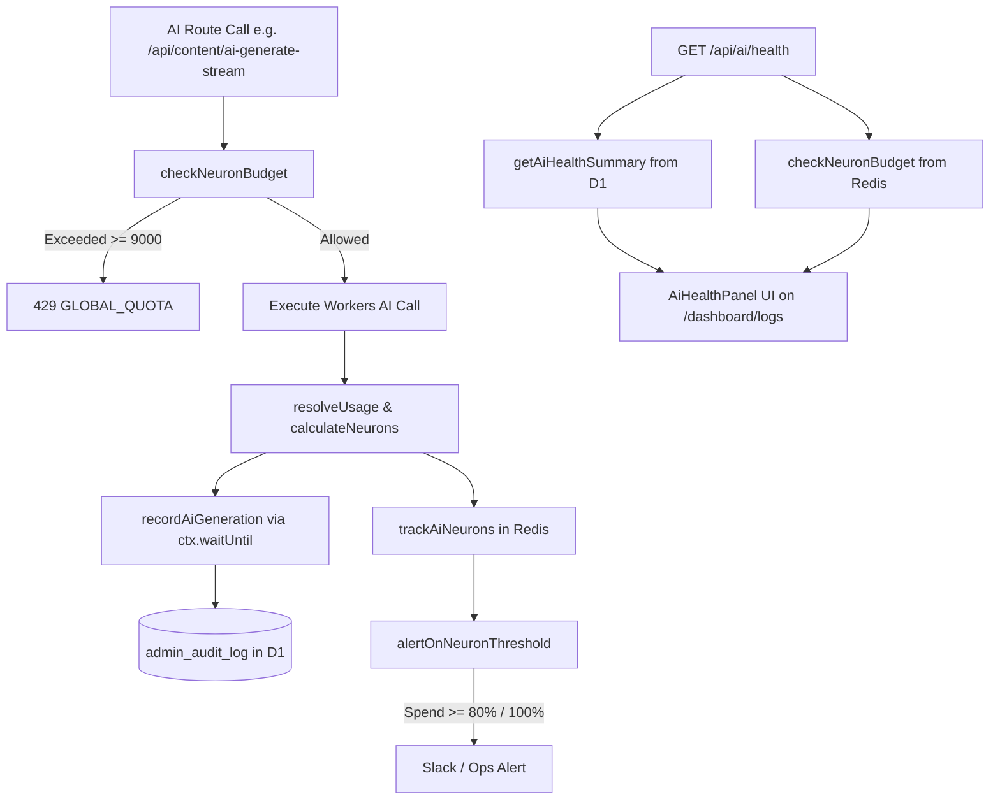

# AI Health & Telemetry Subsystem (`/api/ai/health`)

> **TL;DR (non-technical):** An internal, real-time observability API that reports what Workers AI inferences cost today, which models spent the budget, what percentage succeeded, median latency, and whether articles used the live knowledge base or built-in fallback. It powers the AI Health panel on the Activity Center (`/dashboard/logs`).

---

## 1. Overview & Architectural Motivation

Before the 2026-08-31 AI overhaul, the platform had **no record of any AI call made**. There was no table, no dashboard, and no failure telemetry. A 100% failure rate on blog generation was invisible to system monitors, and neuron consumption was stored only as a single aggregate Redis counter without breakdown by model, route, or outcome.

`GET /api/ai/health` provides full visibility into AI health, cost, and reliability without introducing any new database tables or schema migrations.

### Core Tenets

1. **Zero New Tables / Zero Migrations (RULE #0.9):** Reuses the existing `admin_audit_log.details` JSON column (`action = 'ai_inference'`, `module = 'ai'`). Telemetry is aggregated via native SQLite `json_extract()` in Cloudflare D1.
2. **Fire-and-Forget Ingestion:** Telemetry writes via `recordAiGeneration()` use Cloudflare's `ctx.waitUntil()`. Ingestion errors are caught and swallowed so a telemetry write failure will **never** fail the underlying user generation.
3. **No Fabricated Numbers (RULE #0.5):** When zero inferences have occurred in the requested time window, the API responds with `hasData: false`, `successRate: null`, and `p50LatencyMs: null`. The UI explicitly displays "no AI activity recorded" rather than an unearned 100%.
4. **Privacy & Data Minimization:** Prompts and completions are **never** stored in the audit log. The log tracks metadata, cost, and outcome only (latency, token counts, model ID, error codes, grounding source).

---

## 2. Endpoint Specification

### `GET /api/ai/health`

- **File Path:** `src/pages/api/ai/health.ts`
- **Runtime:** Edge SSR (Astro API Route, `prerender = false`)
- **HTTP Method:** `GET`

### Authentication & Authorization

- **RBAC Gate:** Requires `admin` role or higher via `requireAuth(context, 'admin')`.
- **PLAC Page Gate:** Gated on `/dashboard/logs` access via `placDenyResponse(user, '/dashboard/logs')` (configured in `src/lib/auth/routes.ts` and tested in `test/api-authz-mapping.test.ts`).
- **CSRF / Origin:** Standard cookie-based session verification with edge validation.

### Query Parameters

| Parameter | Type | Required | Default | Bounds | Description |
|-----------|------|----------|---------|--------|-------------|
| `days` | integer | No | `1` | `1` to `30` | Time window in days to aggregate telemetry over (`datetime('now', '-<days> day')`). |

---

## 3. Response Schema

### `200 OK` (Success)

```json
{
  "success": true,
  "days": 1,
  "hasData": true,
  "summary": {
    "day": "2026-09-08",
    "totalCalls": 24,
    "successCalls": 23,
    "successRate": 96,
    "neurons": 4120,
    "estimatedUsd": 0.0453,
    "p50LatencyMs": 920,
    "byModel": [
      {
        "modelId": "@cf/meta/llama-4-scout-17b-16e-instruct",
        "modelName": "Llama 4 Scout 17B — Balanced",
        "calls": 18,
        "neurons": 3240
      },
      {
        "modelId": "@cf/qwen/qwen3-30b-a3b-fp8",
        "modelName": "Qwen3 30B A3B — Fast & economical",
        "calls": 6,
        "neurons": 880
      }
    ],
    "byOutcome": [
      { "outcome": "success", "calls": 23 },
      { "outcome": "upstream_error", "calls": 1 }
    ],
    "grounding": {
      "kb": 20,
      "fallback": 3,
      "none": 0
    }
  },
  "budget": {
    "used": 4120,
    "cap": 10000,
    "softLimit": 9000,
    "warn": false,
    "degraded": null
  }
}
```

### Response Field Reference

#### Root Object

| Field | Type | Description |
|-------|------|-------------|
| `success` | `boolean` | Indicates successful retrieval of telemetry and budget state. |
| `days` | `number` | The sanitized lookback window in days (1–30). |
| `hasData` | `boolean` | `true` if `summary.totalCalls > 0`. When `false`, caller renders an empty state. |
| `summary` | `AiHealthSummary` | Aggregated telemetry data from D1. |
| `budget` | `NeuronBudget` | Real-time global daily neuron budget state from Upstash Redis. |

#### `summary` Object (`AiHealthSummary`)

| Field | Type | Description |
|-------|------|-------------|
| `day` | `string` | The current UTC date (`YYYY-MM-DD`). |
| `totalCalls` | `number` | Total number of AI calls recorded in the window. |
| `successCalls` | `number` | Number of calls with `outcome === 'success'`. |
| `successRate` | `number \| null` | Integer percentage (`0`–`100`), or `null` if `totalCalls === 0`. |
| `neurons` | `number` | Sum of Cloudflare Neurons spent across all recorded calls in the window. |
| `estimatedUsd` | `number` | Derived cost in USD at Cloudflare's published rate ($0.011 / 1,000 Neurons). |
| `p50LatencyMs` | `number \| null` | Median round-trip latency in milliseconds, or `null` if no valid latencies recorded. |
| `byModel` | `Array` | List of models sorted descending by neuron spend. Contains `modelId`, `modelName`, `calls`, and `neurons`. |
| `byOutcome` | `Array` | Distribution of outcomes sorted descending by call count. |
| `grounding` | `Object` | Grounding source count for successful inferences: `kb` (live knowledge base), `fallback` (built-in fallback), or `none`. |

#### `budget` Object (`NeuronBudget`)

| Field | Type | Description |
|-------|------|-------------|
| `used` | `number \| null` | Global neurons spent today across all users/routes, or `null` if Redis is unreadable. |
| `cap` | `number` | Free daily account limit (`10,000` neurons). |
| `softLimit` | `number` | Cutoff threshold where new inferences are refused (`9,000` neurons, reserving 1,000 headroom). |
| `warn` | `boolean` | `true` when `used >= 8,000` (80% warning threshold). |
| `degraded` | `'unconfigured' \| 'error' \| null` | Set when `used` is `null`. `'unconfigured'` in local dev without Upstash; `'error'` if Redis failed. |

---

## 4. Error Responses

| Status Code | Error Response Body | Cause |
|-------------|---------------------|-------|
| `401 Unauthorized` | `{"success": false, "error": "Unauthorized"}` | Unauthenticated session or invalid token. |
| `403 Forbidden` | `{"success": false, "error": "Forbidden"}` | User lacks `admin` role or PLAC denies `/dashboard/logs`. |
| `500 Internal Server Error` | `{"success": false, "error": "Failed to read AI health"}` | D1 query or runtime exception (logged to Sentry). |

---

## 5. Telemetry Ingestion & Accounting Mechanics

### Data Pipeline



### Audit Log Storage Structure

Every inference is persisted as an audit row:

```sql
INSERT INTO admin_audit_log (
  user_id, user_email, user_role, action, module, target_type, target_id, target_label, details
) VALUES (
  'usr_123', 'admin@example.com', 'admin', 'ai_inference', 'ai', 'article', 'art_456', 'Llama 4 Scout 17B — Balanced',
  '{"v":1,"summary":"...","context":{"route":"content/ai-generate-stream","model_id":"@cf/meta/llama-4-scout-17b-16e-instruct","provider":"workers-ai","outcome":"success","error_code":null,"latency_ms":850,"prompt_tokens":1100,"completion_tokens":450,"total_tokens":1550,"token_source":"reported","neurons":180,"attempts":1,"kb_source":"kb"}}'
);
```

### Outcome Codes (`AiOutcome`)

- `success`: Model returned valid response matching required JSON schema.
- `model_json_invalid`: Model output failed JSON schema parsing.
- `timeout`: Upstream timeout exceeded.
- `upstream_capacity`: Cloudflare Workers AI capacity limits reached.
- `upstream_error`: Generic upstream provider error.
- `quota`: User or system quota exhausted.
- `no_response`: Empty stream or connection dropped.

---

## 6. Frontend Consumer: `AiHealthPanel`

The primary consumer of `/api/ai/health` is `src/components/admin/logs/AiHealthPanel.tsx`, mounted on the **AI Health** tab of `src/components/admin/logs/ActivityCenter.tsx` at `/dashboard/logs`.

### Visual Components & States

1. **Range Picker:** 1 day ("Today"), 7 days, 30 days.
2. **Allocation Meter:** Real-time visual progress bar tracking daily neuron consumption against the 10,000 cap with warning badges.
3. **Stat Ribbon (4 Cards):**
   - Total Calls (`X succeeded`)
   - Success Rate (`% over X calls` or `—` if 0)
   - Neuron Usage (with formatted USD estimate)
   - p50 Latency (median ms roundtrip)
4. **Spend by Model Table:** Lists each model, number of calls, and total neuron spend.
5. **Outcomes Table:** Lists all failure modes and successes.
6. **Grounding Distribution:** Progress bar comparing Knowledge Base vs. Built-in Fallback vs. No Grounding.

---

## 7. Testing & Verification

- **Route Authorization Test:** `test/api-authz-mapping.test.ts` asserts `/api/ai/health` correctly resolves to `/dashboard/logs`.
- **Pricing & Token Arithmetic Tests:** `test/ai-pricing.test.ts` validates neuron conversion and JSON schema requirements for all models.
- **Dead-Surface Ratchet:** Verified at 0 uncalled routes (`scripts/ratchet.py --list A18`).
