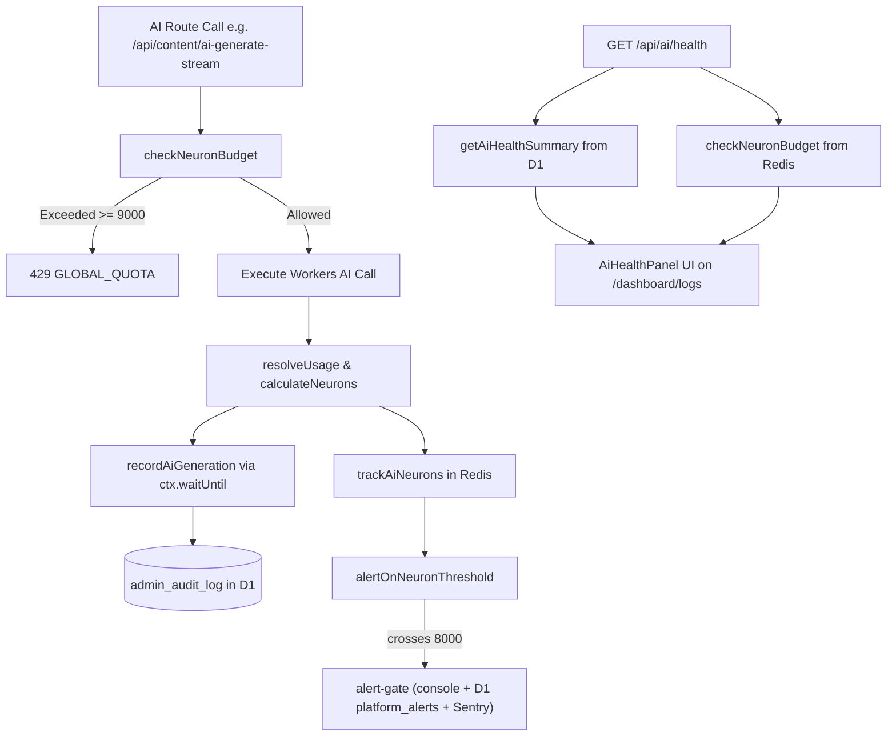

# AI Health & Telemetry Subsystem (`/api/ai/health`)

> **TL;DR (non-technical):** An internal, real-time observability API that reports what Workers AI inferences cost today, which models spent the budget, what percentage succeeded, median latency, and whether articles used the live knowledge base or built-in fallback. It powers the AI Health panel on the Activity Center (`/dashboard/logs`).

---

## 1. Overview & Architectural Motivation

Before the 2026-08-31 AI overhaul, the platform had **no record of any AI call made**. There was no table, no dashboard, and no failure telemetry. A 100% failure rate on blog generation was invisible to system monitors, and neuron consumption was stored only as a single aggregate Redis counter without breakdown by model, route, or outcome.

`GET /api/ai/health` reports AI health, cost, and reliability without introducing any new database tables or schema migrations.

> **Durability caveat — this history is only as deep as the last audit prune.**
> The telemetry has no table of its own: it is `admin_audit_log` rows, and that
> table is prunable and bulk-deletable from `/dashboard/logs`
> (`src/pages/api/audit/prune.ts`, `src/pages/api/audit/logs.ts`). It was bulk
> cleared on 2026-09-18 and held 2 rows the next day, so every window read
> "no AI activity recorded" regardless of what had actually been spent. Treat a
> quiet panel as "no surviving rows", not as "no AI ran". The Upstash neuron
> counter in `budget` is independent of this and survives a prune, but it only
> covers the current UTC day. *Corrected 2026-09-19.*

### Core Tenets

1. **Zero New Tables / Zero Migrations (RULE #0.9):** Reuses the existing `admin_audit_log.details` JSON column (`action = 'ai_inference'`, `module = 'ai'`). Telemetry is aggregated via native SQLite `json_extract()` in Cloudflare D1.
2. **Fire-and-Forget Ingestion:** Telemetry writes via `recordAiGeneration()` use Cloudflare's `ctx.waitUntil()`. Ingestion errors are caught and swallowed so a telemetry write failure will **never** fail the underlying user generation.
3. **No Fabricated Numbers (RULE #0.5):** When zero inferences have occurred in the requested time window, the API responds with `hasData: false`, `successRate: null`, and `p50LatencyMs: null`. The UI explicitly displays "no AI activity recorded" rather than an unearned 100%.
4. **Privacy & Data Minimization:** Prompts and completions are **never** stored in the audit log. The log tracks metadata, cost, and outcome only (latency, token counts, model ID, error codes, grounding source).

---

## 2. Endpoint Specification

### `GET /api/ai/health`

- **File Path:** `src/pages/api/ai/health.ts`
- **Runtime:** Edge SSR (Astro API Route, `prerender = false`)
- **HTTP Method:** `GET`

### Authentication & Authorization

- **RBAC Gate:** Requires `admin` role or higher via `requireAuth(context, 'admin')`.
- **PLAC Page Gate:** Gated on `/dashboard/logs` access via `placDenyResponse(user, '/dashboard/logs')` (configured in `src/lib/auth/routes.ts` and tested in `test/api-authz-mapping.test.ts`). The permission model itself is owned by [`../architecture/PERMISSIONS-SYSTEM.md`](../architecture/PERMISSIONS-SYSTEM.md).
- **CSRF / Origin:** Standard cookie-based session verification with edge validation.

> **The tab and the API are gated on different keys.** The AI Health *tab* is
> shown or hidden by `/dashboard/logs#ai` (`src/pages/dashboard/logs/index.astro`,
> default: admin or above). That key has no `admin_pages` row and the API does
> not read it, so the two can disagree: a `#ai: false` PLAC deny hides the tab
> while `GET /api/ai/health` still answers, and a `#ai: true` grant to a manager
> shows a tab the API refuses. Fixing this means teaching the route the fragment;
> until then, treat `#ai` as a UI-only toggle. *Documented 2026-09-19.*

### Query Parameters

| Parameter | Type | Required | Default | Bounds | Description |
|-----------|------|----------|---------|--------|-------------|
| `days` | integer | No | `1` | `1` to `30` | Rolling window to aggregate telemetry over (`datetime('now', '-<days> day')`). |

> `days=1` is a **rolling 24 hours**, not "today". `budget.used` and
> `summary.day`, by contrast, are per **UTC calendar day** (`telemetry.ts`,
> `ratelimit.ts`). The two figures on one screen therefore cover different
> windows, and shortly after 00:00 UTC the neuron total in `summary` can exceed
> the one in `budget`. *Corrected 2026-09-19.*

---

## 3. Response Schema

### `200 OK` (Success)

```json
{
  "success": true,
  "days": 1,
  "hasData": true,
  "summary": {
    "day": "2026-09-08",
    "totalCalls": 24,
    "successCalls": 23,
    "successRate": 96,
    "neurons": 4120,
    "estimatedUsd": 0.0453,
    "p50LatencyMs": 920,
    "byModel": [
      {
        "modelId": "@cf/meta/llama-4-scout-17b-16e-instruct",
        "modelName": "Llama 4 Scout 17B — Balanced",
        "calls": 18,
        "neurons": 3240
      },
      {
        "modelId": "@cf/qwen/qwen3-30b-a3b-fp8",
        "modelName": "Qwen3 30B A3B — Fast & economical",
        "calls": 6,
        "neurons": 880
      }
    ],
    "byOutcome": [
      { "outcome": "success", "calls": 23 },
      { "outcome": "upstream_error", "calls": 1 }
    ],
    "grounding": {
      "kb": 20,
      "fallback": 3,
      "none": 0
    }
  },
  "budget": {
    "used": 4120,
    "cap": 10000,
    "softLimit": 9000,
    "warn": false,
    "degraded": null
  }
}
```

### Response Field Reference

#### Root Object

| Field | Type | Description |
|-------|------|-------------|
| `success` | `boolean` | Indicates successful retrieval of telemetry and budget state. |
| `days` | `number` | The sanitized lookback window in days (1–30). |
| `hasData` | `boolean` | `true` if `summary.totalCalls > 0`. When `false`, caller renders an empty state. |
| `summary` | `AiHealthSummary` | Aggregated telemetry data from D1. |
| `budget` | `NeuronBudget` | cf-admin's own daily neuron counter, read from Upstash Redis. Not the account total — see below. |

#### `summary` Object (`AiHealthSummary`)

| Field | Type | Description |
|-------|------|-------------|
| `day` | `string` | The current UTC date (`YYYY-MM-DD`). |
| `totalCalls` | `number` | Total number of AI calls recorded in the window. |
| `successCalls` | `number` | Number of calls with `outcome === 'success'`. |
| `successRate` | `number \| null` | Integer percentage (`0`–`100`), or `null` if `totalCalls === 0`. |
| `neurons` | `number` | Sum of Cloudflare Neurons spent across all recorded calls in the window. |
| `estimatedUsd` | `number` | Derived cost in USD at Cloudflare's published rate ($0.011 / 1,000 Neurons). |
| `p50LatencyMs` | `number \| null` | Median round-trip latency in milliseconds, or `null` if no valid latencies recorded. |
| `byModel` | `Array` | List of models sorted descending by neuron spend. Contains `modelId`, `modelName`, `calls`, and `neurons`. |
| `byOutcome` | `Array` | Distribution of outcomes sorted descending by call count. |
| `grounding` | `Object` | Grounding source count for successful inferences: `kb` (live knowledge base), `fallback` (built-in fallback), or `none`. |

#### `budget` Object (`NeuronBudget`)

| Field | Type | Description |
|-------|------|-------------|
| `used` | `number \| null` | Neurons **cf-admin** spent this UTC day across all its users and routes (Redis key `cf-admin-neurons:global:<date>`), or `null` if Redis is unreadable. |
| `cap` | `number` | `10,000` — Cloudflare's free daily allocation. The allocation is **account-wide**; this counter is not. |
| `softLimit` | `number` | Cutoff where cf-admin refuses new inferences (`9,000` neurons, reserving 1,000 headroom). |
| `warn` | `boolean` | `true` when `used >= 8,000` (80% warning threshold). |
| `degraded` | `'unconfigured' \| 'error' \| null` | Set when `used` is `null`. `'unconfigured'` in local dev without Upstash; `'error'` if Redis failed. |

> **`used` is a floor, not the account total.** *Corrected 2026-09-19 — this
> section read "global neurons spent today" and "free daily account limit",
> which invited the reader to treat `cap - used` as real headroom.* The 10,000
> neurons/day are allocated per **Cloudflare account** and `cf-chatbot` draws on
> the same pool — its Llama 4 Scout classifier and BGE embeddings run on every
> inbound message — without being visible to this counter
> (`src/lib/ai-pricing.ts` says so at the constant). cf-admin can therefore be
> refused by Cloudflare while this panel shows headroom. For the account figure,
> read Workers AI usage in the Cloudflare dashboard; see also
> [`CHATBOT.md`](./CHATBOT.md) §4.

---

## 4. Error Responses

| Status Code | Error Response Body | Cause |
|-------------|---------------------|-------|
| `401 Unauthorized` | `{"success": false, "error": "Unauthorized"}` | Unauthenticated session or invalid token. |
| `403 Forbidden` | `{"success": false, "error": "Forbidden"}` | PLAC denies `/dashboard/logs`, or the middleware refuses the request before the route runs — the default path, since `/dashboard/logs` carries a canonical-admin role floor. |
| `500 Internal Server Error` | `{"success": false, "error": "Failed to read AI health"}` | D1 query or runtime exception (logged to Sentry). |

> **A below-admin user with an explicit `/dashboard/logs` grant gets `401`, not
> `403`.** Such a user passes the middleware, reaches the route, and fails
> `requireAuth(context, 'admin')` — whose `AuthError` the route flattens into
> `401 Unauthorized` (`src/pages/api/ai/health.ts`). The status is misleading
> (the caller *is* authenticated); the refusal is correct. Fix is a code change
> in the route's catch, not a doc change. *Corrected 2026-09-19.*

---

## 5. Telemetry Ingestion & Accounting Mechanics

### Data Pipeline



### Budget alerting — what actually fires

*Corrected 2026-09-19 — this section said "Spend >= 80% / 100% --> Slack / Ops
Alert". There is no Slack channel anywhere in this codebase, and there is no
separate 100% alert.*

`alertOnNeuronThreshold()` (`src/lib/ai/telemetry.ts`) fires **only on the
crossing** of 8,000 neurons — `previousUsed < 8000 <= used` — so at most one
alert per UTC day, deduplicated by the fingerprint `neuron-budget:<date>`.

| Condition | Severity | Channels (`src/lib/alert-gate.ts`) |
|---|---|---|
| `used` crosses 8,000 (80%) | `warning` | console, D1 `platform_alerts`, Sentry |
| the same call also lands at or above 10,000 | `critical` | console, D1 `platform_alerts`, Sentry, Upstash, email |

The `critical` row is reachable only if a *single* generation takes the counter
from below 8,000 to 10,000 or more; a gradual climb past the cap emits nothing
further, because the crossing already fired at 8,000. Separately, and
independently of alerting, `checkNeuronBudget()` refuses new cf-admin inferences
with `429 GLOBAL_QUOTA` at the 9,000 soft limit.

### Audit Log Storage Structure

Every inference is persisted as an audit row:

```sql
INSERT INTO admin_audit_log (
  user_id, user_email, user_role, action, module, target_type, target_id, target_label, details
) VALUES (
  'usr_123', 'admin@example.com', 'admin', 'ai_inference', 'ai', 'article', 'art_456', 'Llama 4 Scout 17B — Balanced',
  '{"v":2,"summary":"...","context":{"route":"content/ai-generate-stream","model_id":"@cf/meta/llama-4-scout-17b-16e-instruct","provider":"workers-ai","outcome":"success","error_code":null,"latency_ms":850,"prompt_tokens":1100,"completion_tokens":450,"total_tokens":1550,"token_source":"reported","neurons":180,"attempts":1,"kb_source":"kb"}}'
);
```

### Outcome Codes (`AiOutcome`)

- `success`: Model returned valid response matching required JSON schema.
- `model_json_invalid`: Model output failed JSON schema parsing.
- `timeout`: Upstream timeout exceeded.
- `upstream_capacity`: Cloudflare Workers AI capacity limits reached.
- `upstream_error`: Generic upstream provider error.
- `quota`: User or system quota exhausted.
- `no_response`: Empty stream or connection dropped.

---

## 6. Frontend Consumer: `AiHealthPanel`

The primary consumer of `/api/ai/health` is `src/components/admin/logs/AiHealthPanel.tsx`, mounted on the **AI Health** tab of `src/components/admin/logs/ActivityCenter.tsx` at `/dashboard/logs`.

### Visual Components & States

1. **Range Picker:** 1 day, 7 days, 30 days. The 1-day option is labelled "Today" but queries a rolling 24 hours (see §2).
2. **Allocation Meter:** Progress bar tracking cf-admin's daily neuron consumption against the 10,000 cap with warning badges. The cap is account-wide and shared with cf-chatbot, so the meter under-reports account usage.
3. **Stat Ribbon (4 Cards):**
   - Calls (`X succeeded`)
   - Success rate (`over X calls`, or `—` when there are no rows)
   - Neurons (with formatted USD estimate)
   - p50 latency (median ms roundtrip)
4. **Spend by Model Table:** Lists each model, number of calls, and total neuron spend.
5. **Outcomes Table:** Lists all failure modes and successes.
6. **Grounding Distribution:** Progress bar comparing Knowledge Base vs. Built-in Fallback vs. No Grounding.

> ⚠️ **Known defect — the success-rate card renders 100× too high.** The API
> already returns an integer percentage 0–100 (`telemetry.ts`:
> `Math.round(successCalls / totalCalls * 100)`), and `AiHealthPanel.tsx`
> multiplies it by 100 again, so a real 96% is displayed as `9600%`.
> `test/ai-telemetry.test.ts` pins the API side at `67`, which is why the tests
> pass. The fix is to drop the second multiplication in the panel; do not
> "correct" the API to emit a 0–1 fraction, because that would break the pinned
> contract and the D1-derived figure. *Flagged 2026-09-19 — not yet fixed, so
> do not read this card as trustworthy.*

---

## 7. Testing & Verification

- **Route Authorization Test:** `test/api-authz-mapping.test.ts` asserts `/api/ai/health` correctly resolves to `/dashboard/logs`.
- **Pricing & Token Arithmetic Tests:** `test/ai-pricing.test.ts` validates neuron conversion and JSON schema requirements for all models.
- **Dead-Surface Ratchet:** Verified at 0 uncalled routes (`scripts/ratchet.py --list A18`).

### Verification log

| Date | Checked | Not checked |
|---|---|---|
| 2026-09-19 | `src/pages/api/ai/health.ts` (auth order, `days` clamp, catch behaviour); `src/lib/ai/telemetry.ts` (the D1 aggregate, `successRate` arithmetic, `alertOnNeuronThreshold` crossing logic and fingerprint); `src/lib/alert-gate.ts` channel routing per severity; `src/lib/ratelimit.ts` (`cf-admin-neurons:global:<date>`, UTC day); `src/lib/ai-pricing.ts` cap and its account-wide note; `src/lib/audit-helpers.ts` (`v: 2`); `src/components/admin/logs/AiHealthPanel.tsx` (the ×100 defect); `src/pages/dashboard/logs/index.astro` (`#ai`); live `admin_pages` — no `/dashboard/logs#ai` row, `/dashboard/logs` floor `super_admin` | Cloudflare's currently published neuron price and free allocation (not re-fetched — `$0.011 / 1,000` and `10,000/day` are carried forward); a live generation end to end |
