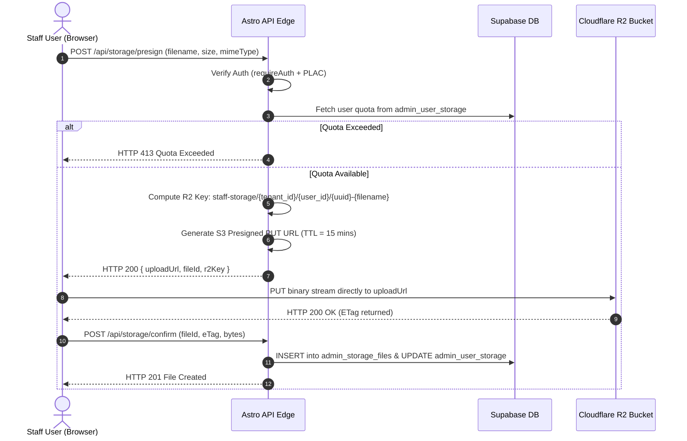

---

title: "Staff Managed Storage Architecture & Feature Specification"
status: draft
audience: [ai, technical, operator, owner]
last_verified: 2026-08-04
verified_against: [code, infra]
owner: harshil
related_code: [src/lib/dal/, src/pages/api/]
related_docs: [../architecture/ARCHITECTURE.md, ../operations/OPERATIONS.md, ../security/SECURITY.md, USER-MANAGEMENT.md]
tags: [r2, storage, staff-drive, feature-spec, architecture, zero-egress, presigned-urls]
---

# Staff Managed Storage Subsystem — Feature Specification & Technical Architecture

> **TL;DR (non-technical):** This document specifies a proposed managed storage solution for `cf-admin`. Powered by Cloudflare R2 object storage and Supabase PostgreSQL metadata tracking, it allows staff to securely store, share, and manage business documents, pet records, and contracts with role-based storage limits at near-zero operating cost ($0 egress fees).

---

## 1. Executive Summary & Problem Statement

### 1.1 Context & Problem
Staff members at Madagascar Pet Hotel frequently handle digital assets, including:
- Customer liability waivers and pet onboarding contracts
- Veterinary medical records, vaccination certificates, and dietary logs
- High-resolution grooming before/after photo media
- Internal SOPs, payroll receipts, and vendor invoices

Without a dedicated internal storage engine, staff rely on unmanaged third-party tools or direct email attachments, creating compliance risks, security vulnerabilities, and fragmented asset tracking.

### 1.2 The Cloudflare-Native Solution
The **Staff Managed Storage Subsystem** is an edge-native, multi-tenant digital asset management (DAM) and file drive module integrated directly into `cf-admin`.

Key highlights:
- **Zero Egress Bandwidth Costs:** Built on Cloudflare R2 (S3-compatible object storage), eliminating bandwidth charges.
- **Direct-to-Edge Uploads:** Files upload directly from the user's browser to R2 via AWS S3 Presigned URLs, bypassing Worker execution memory limits.
- **Role-Based Storage Quotas:** Automatic per-user and per-role storage allowances tracked in Supabase.
- **Strict Edge Security:** Expiring presigned GET links, MIME-type sanitization, Content-Disposition locks, and full audit telemetry.

---

## 2. Cloudflare R2 Economics & Cost Model

Cloudflare R2 eliminates traditional cloud egress fees, making high-volume document and media storage exceptionally cost-effective.

### 2.1 Pricing Breakdown

| Dimension | Cloudflare R2 Rate | Free Tier Allowance (Per Month) |
| :--- | :--- | :--- |
| **Egress Bandwidth (Downloads)** | **$0.00 / FREE** | **Unlimited** |
| **Storage Volume** | **$0.015 / GB-month** (Standard)<br>**$0.01 / GB-month** (Infrequent Access) | 10 GB-months / month |
| **Class A Operations** (PUT, POST, DELETE, List) | $4.50 per 1,000,000 requests | 1,000,000 requests / month |
| **Class B Operations** (GET, HEAD) | $0.36 per 1,000,000 requests | 10,000,000 requests / month |

### 2.2 Financial Projections at Scale

Below are three operational scale models for Madagascar Pet Hotel staff usage:

```
+-----------------------------------------------------------------------------------+
| Scale Level      | Total Storage | Active Staff | Monthly Cost Calculation        |
+-----------------------------------------------------------------------------------+
| 1. Startup Tier  | 10 GB         | 10 users     | 10 GB included free -> $0.00/mo |
| 2. Operational   | 100 GB        | 35 users     | (100 - 10) * $0.015 -> $1.35/mo |
| 3. High Volume   | 500 GB        | 100 users    | (500 - 10) * $0.015 -> $7.35/mo |
+-----------------------------------------------------------------------------------+
```

*Note: Data egress for downloading large media or documents remains **$0.00** across all scale tiers.*

---

## 3. Storage Allowance & Quota System

To prevent storage bloat and abuse, the subsystem enforces role-based storage quotas and granular per-user overrides.

### 3.1 Worker Runtime Limits vs. Direct R2 Presigned Limits

Understanding platform limits is critical for selecting the right architecture:

| Dimension | Worker Proxy Route (`/api/upload`) | Direct R2 Presigned S3 URL |
| :--- | :--- | :--- |
| **Max HTTP Request Body** | **100 MB** (Cloudflare Worker limit) | **5 GB** (Single PUT) / **5 TB** (S3 Multipart) |
| **Worker RAM Overhead** | High (Streams through 128 MB RAM) | **Zero (0 MB Worker RAM used)** |
| **Worker Execution CPU Time** | Billed per ms during stream | 1–2 ms (only generates presigned signature) |
| **Recommended Max File Size** | **<= 10 MB** (Small thumbnails/logs only) | **100 MB – 1 GB** (PDFs, Videos, Contracts) |

> ⚡ **Architectural Directive:** All file uploads/downloads in `cf-admin` MUST use **Direct R2 Presigned URLs** (`@aws-sdk/s3-request-presigner`). Routing binary file payloads through Cloudflare Worker memory is strictly forbidden for files > 10 MB.

### 3.2 Granular Multi-Role Access Control Matrix (RBAC & Shared Access)

The storage subsystem enforces strict data isolation by default while supporting controlled cross-tenant and vendor access:

```
+---------------------------------------------------------------------------------------------------------------+
| User Role       | Own Personal Bucket | Shared Dept Folders | Other Users' Buckets | Vendor / External Share  |
+---------------------------------------------------------------------------------------------------------------+
| Staff           | Full Access (1 GB)  | Read / Upload       | ❌ BLOCKED           | ❌ Disabled              |
| Admin           | Full Access (5 GB)  | Full Management     | Read / View Only     | Presigned Link (Max 24h) |
| SuperAdmin      | Full Access (25 GB) | Full Management     | Full Admin Access    | Presigned Link (Max 7d)  |
| Owner / DEV     | Unlimited           | Full Management     | Full Admin Access    | Presigned Link (Unlimited)|
| Vendor / Guest  | ❌ No Bucket        | ❌ No Access        | ❌ No Access         | Read-Only (Token Gated)  |
+---------------------------------------------------------------------------------------------------------------+
```

#### Granular Access Scenarios:
1. **Default Isolated Bucket (`private/`):** A standard staff member can *only* browse, upload, or delete files inside `staff-storage/{tenant_id}/{user_id}/private/*`.
2. **Elevated Oversight (`Owner` / `SuperAdmin` / `Admin`):** Privileged roles can browse other users' storage trees via `/api/storage/admin/inspect?user_id=...` for security auditing and management.
3. **Vendor & Partner Access (`vendor_shared/`):** When a staff member shares a pet medical log with a vet clinic or vendor:
   - A short-lived, cryptographically signed GET link (`/api/storage/share?token=...`) is generated.
   - The token checks `expires_at` and passcode hash stored in Supabase `admin_storage_shares`.
   - Access is read-only and logged in the audit telemetry table.

### 3.3 Additional Operational Restrictions & Edge Safeguards

To maintain system integrity and prevent abuse, the following security constraints apply:

- **File Extension & MIME Sanitization:**
  - **Allowed:** `.pdf`, `.png`, `.jpg`, `.jpeg`, `.webp`, `.docx`, `.xlsx`, `.csv`, `.mp4`, `.zip`.
  - **Forbidden (Hard Rejected):** `.html`, `.htm`, `.svg` (prevents Stored XSS via inline rendering), `.exe`, `.js`, `.sh`, `.bat`, `.php`.
- **Rate-Limiting on Presigned Ticket Generation:**
  - Protected via Upstash Redis (`@upstash/ratelimit`).
  - Max **30 presigned upload tickets per minute per IP / User Session** to prevent presigned URL spam.
- **Content-Disposition Enforcement:**
  - Presigned GET download links force `response-content-disposition: attachment; filename="..."` for document files to force a browser download rather than raw inline execution.

### 3.4 Dual-Layer Real-Time Telemetry & Accounting Engine

Cloudflare R2 bucket-level metrics report total aggregate operations across the bucket, but do not provide per-user breakdowns. To track **individual user Class A operations (PUT, POST, DELETE), Class B operations (GET, HEAD), and Egress/Download volume**, `cf-admin` implements a **Dual-Layer Accounting Engine**:

```
+---------------------------------------------------------------------------------------------------+
| LAYER 1: REAL-TIME API GATEWAY TELEMETRY                                                          |
| - Intercepts every /api/storage/presign, /download, /delete request.                             |
| - Logs Class A (writes/deletes) and Class B (reads/downloads) into admin_storage_operation_logs. |
| - Enforces per-user daily/monthly limits BEFORE issuing presigned R2 tickets.                     |
+---------------------------------------------------------------------------------------------------+
                                                  |
                                                  v
+---------------------------------------------------------------------------------------------------+
| LAYER 2: CLOUDFLARE CRON RECONCILIATION WORKER (Nightly / Hourly)                                  |
| - Executes env.R2.list({ prefix: 'staff-storage/madagascar/{user_id}/' }).                       |
| - Reconciles physical R2 byte counts and object totals against DB records.                        |
| - Detects and corrects drift caused by failed uploads or aborted multipart sessions.             |
+---------------------------------------------------------------------------------------------------+
```

#### Individual Operational Metric Tracking:
1. **Class A Operations Counter (Upload, Mutate, Delete):** Incremented whenever a user requests an upload presigned URL or executes a file deletion/rename.
2. **Class B Operations Counter (Read, Preview, Download):** Incremented whenever a user generates a download link or previews a document.
3. **Estimated Egress Volume Counter:** Tracks estimated byte transfers requested per user for download requests, allowing SuperAdmins to spot bandwidth spikes.

---

### 3.5 Granular Configuration Engine (System Defaults vs User Overrides)

The storage subsystem supports flexible configuration rules managed via SuperAdmin settings:

#### A. System Global Defaults (`admin_storage_global_config`):
- **Default Role Quotas:** Storage space, Class A ops/day, Class B ops/day, Egress bytes/month.
- **Global Allowed Extensions:** Whitelist of allowed extensions (`.pdf`, `.png`, `.jpeg`, `.docx`, etc.).
- **Global Blocked Extensions:** Blacklist of dangerous extensions (`.exe`, `.js`, `.html`, `.svg`, `.sh`, `.bat`).

#### B. Individual User Overrides & Extension Exemptions (`admin_user_storage_overrides`):
SuperAdmins can grant custom exceptions for specific staff or developer users:
- **Custom Quota Bump:** Expand User X's allowance (e.g. 1 GB $\rightarrow$ 50 GB).
- **Custom Operational Ceiling:** Expand Class A / Class B daily operation limits for power users.
- **File Extension Exemption Whitelist:** Explicitly allow a specific user (e.g. an Admin or Developer) to upload a blocked file extension (e.g., `.js`, `.svg`, or `.exe`) for legitimate business requirements, while logging a high-priority security audit event.

---

### 3.6 Forbidden Access & Security Violation Telemetry

Every blocked upload, unauthorized access attempt, or policy violation is logged to `admin_storage_violations` for security review:

- **Violation Triggers:**
  - `FORBIDDEN_FILE_EXTENSION` (Attempted upload of blocked extension without exemption).
  - `MIME_TYPE_MISMATCH` (File header does not match claimed file extension).
  - `QUOTA_EXCEEDED` (Storage or Class A/B request ceiling reached).
  - `UNAUTHORIZED_USER_INSPECTION` (Non-admin attempting to view another user's bucket).
- **Admin Alerting:** High-severity violations (e.g. `.exe` upload attempts or cross-user bucket access) trigger instant alerts in the Edge Command Center.

---

## 4. Architectural Design & End-to-End Workflows

### 4.1 System Topology & Component Map

```
+-----------------------------------------------------------------------------------+
|                                 CLIENT BROWSER                                    |
| [Preact UI: Midnight Slate Storage Island] <---> [Uppy / Better-Upload Client]    |
+-----------------------------------------------------------------------------------+
             |                                              |
    1. Issue Presigned Ticket                      3. Direct Upload (PUT)
             v                                              v
+-----------------------------+                    +--------------------------------+
|    ASTRO SSR / WORKER EDGE  |                    |      CLOUDFLARE R2 BUCKET      |
|  - Check Quota & Auth (PLAC)|                    |  - Key: staff-storage/{uid}/...|
|  - Generate S3 Signature    |                    |  - Storage Class: Standard     |
+-----------------------------+                    +--------------------------------+
             |                                              |
    2. Read/Update Quota                                    |
             v                                              v
+-----------------------------+                    +--------------------------------+
|    SUPABASE POSTGRESQL DB   |                    |   CLOUDFLARE IMAGE RESIZER    |
|  - admin_storage_files      |                    |  - On-the-fly previews for PNG |
|  - admin_user_storage       |                    |  - WebP compression            |
+-----------------------------+                    +--------------------------------+
```

### 4.2 Presigned Upload Sequence Diagram



---

## 5. Security & Isolation Architecture

### 5.1 Object Key Namespacing
R2 object keys must adhere to strict hierarchical prefixing:

```
staff-storage/{tenant_id}/{owner_user_id}/{visibility}/{year}/{month}/{file_id}.ext
```

* `tenant_id`: Multi-tenant isolation boundary (`madagascar`).
* `owner_user_id`: UUID of the uploading staff member.
* `visibility`: `private` (owner only), `shared` (department access), or `system`.

### 5.2 Expiring Presigned Download Links
Direct public URL access to the R2 staff bucket is strictly **disabled**. All file downloads use short-lived presigned GET URLs:

- **Internal View / Download:** Presigned GET URL with 15-minute TTL.
- **External Share Link:** Staff can generate temporary external links with configurable TTL (1 hour, 24 hours, 7 days) and optional passcode protection.
- **Content-Disposition Locking:** For uploaded documents, headers enforce `Content-Disposition: attachment; filename="safe_filename.pdf"` to mitigate inline HTML/SVG script execution vulnerabilities.

---

## 6. Database Schema & Data Models

### 6.1 `admin_user_storage` (Quota Registry)

```sql
CREATE TABLE IF NOT EXISTS public.admin_user_storage (
    user_id UUID PRIMARY KEY REFERENCES public.admin_users(id) ON DELETE CASCADE,
    bytes_used BIGINT NOT NULL DEFAULT 0 CHECK (bytes_used >= 0),
    file_count INT NOT NULL DEFAULT 0 CHECK (file_count >= 0),
    max_bytes_limit BIGINT NOT NULL DEFAULT 1073741824, -- 1 GB default
    custom_override BOOLEAN NOT NULL DEFAULT FALSE,
    updated_at TIMESTAMPTZ NOT NULL DEFAULT NOW()
);
```

### 6.2 `admin_storage_files` (File Metadata Registry)

```sql
CREATE TABLE IF NOT EXISTS public.admin_storage_files (
    id UUID PRIMARY KEY DEFAULT gen_random_uuid(),
    owner_user_id UUID NOT NULL REFERENCES public.admin_users(id) ON DELETE CASCADE,
    r2_key TEXT NOT NULL UNIQUE,
    original_name TEXT NOT NULL,
    mime_type TEXT NOT NULL,
    size_bytes BIGINT NOT NULL CHECK (size_bytes > 0),
    etag TEXT,
    folder_path TEXT NOT NULL DEFAULT '/',
    visibility TEXT NOT NULL DEFAULT 'private' CHECK (visibility IN ('private', 'shared', 'system')),
    is_deleted BOOLEAN NOT NULL DEFAULT FALSE,
    deleted_at TIMESTAMPTZ,
    created_at TIMESTAMPTZ NOT NULL DEFAULT NOW(),
    updated_at TIMESTAMPTZ NOT NULL DEFAULT NOW()
);

CREATE INDEX idx_admin_storage_files_owner ON public.admin_storage_files(owner_user_id, folder_path) WHERE NOT is_deleted;
CREATE INDEX idx_admin_storage_files_r2_key ON public.admin_storage_files(r2_key);
```

### 6.3 `admin_storage_global_config` (System-Wide Storage & Limit Defaults)

```sql
CREATE TABLE IF NOT EXISTS public.admin_storage_global_config (
    key TEXT PRIMARY KEY,
    value JSONB NOT NULL,
    description TEXT,
    updated_at TIMESTAMPTZ NOT NULL DEFAULT NOW()
);

-- Default Config Baseline:
-- key: 'role_defaults' -> { "staff": { "quota_mb": 1024, "class_a_daily": 500, "class_b_daily": 2000, "egress_mb_monthly": 5120 }, ... }
-- key: 'allowed_extensions' -> [".pdf", ".png", ".jpg", ".jpeg", ".webp", ".docx", ".xlsx", ".csv", ".mp4", ".zip"]
-- key: 'blocked_extensions' -> [".exe", ".js", ".html", ".htm", ".svg", ".sh", ".bat", ".php", ".dll", ".cmd"]
```

### 6.4 `admin_user_storage_overrides` (Individual User Limits & Extension Exemptions)

```sql
CREATE TABLE IF NOT EXISTS public.admin_user_storage_overrides (
    user_id UUID PRIMARY KEY REFERENCES public.admin_users(id) ON DELETE CASCADE,
    custom_max_bytes BIGINT,               -- Custom storage quota override
    custom_class_a_daily INT,              -- Custom write/upload daily limit
    custom_class_b_daily INT,              -- Custom read/download daily limit
    custom_egress_monthly_bytes BIGINT,    -- Custom egress limit override
    allowed_extension_exemptions TEXT[],   -- Array of exempt extensions (e.g. ARRAY['.js', '.svg'])
    granted_by UUID REFERENCES public.admin_users(id),
    reason TEXT NOT NULL,
    updated_at TIMESTAMPTZ NOT NULL DEFAULT NOW()
);
```

### 6.5 `admin_storage_operation_logs` (Class A & Class B Request Telemetry)

```sql
CREATE TABLE IF NOT EXISTS public.admin_storage_operation_logs (
    id UUID PRIMARY KEY DEFAULT gen_random_uuid(),
    user_id UUID NOT NULL REFERENCES public.admin_users(id) ON DELETE CASCADE,
    operation_class TEXT NOT NULL CHECK (operation_class IN ('CLASS_A', 'CLASS_B')),
    operation_type TEXT NOT NULL,          -- 'PRESIGN_PUT', 'DELETE', 'LIST', 'PRESIGN_GET', 'SHARE'
    file_id UUID REFERENCES public.admin_storage_files(id) ON DELETE SET NULL,
    bytes_transferred BIGINT DEFAULT 0,
    ip_hash TEXT NOT NULL,
    created_at TIMESTAMPTZ NOT NULL DEFAULT NOW()
);

CREATE INDEX idx_storage_ops_user_time ON public.admin_storage_operation_logs(user_id, created_at DESC);
CREATE INDEX idx_storage_ops_class ON public.admin_storage_operation_logs(operation_class, created_at DESC);
```

### 6.6 `admin_storage_violations` (Security Audit & Forbidden Block Logs)

```sql
CREATE TABLE IF NOT EXISTS public.admin_storage_violations (
    id UUID PRIMARY KEY DEFAULT gen_random_uuid(),
    user_id UUID REFERENCES public.admin_users(id) ON DELETE SET NULL,
    violation_type TEXT NOT NULL,          -- 'FORBIDDEN_FILE_EXTENSION', 'MIME_TYPE_MISMATCH', 'QUOTA_EXCEEDED', 'UNAUTHORIZED_ACCESS'
    attempted_filename TEXT,
    attempted_mime TEXT,
    ip_hash TEXT NOT NULL,
    details JSONB DEFAULT '{}'::jsonb,
    created_at TIMESTAMPTZ NOT NULL DEFAULT NOW()
);

CREATE INDEX idx_storage_violations_time ON public.admin_storage_violations(created_at DESC);
```

---

## 7. Client UI & Open-Source Integration

### 7.1 Pre-Built Open-Source Components
To streamline client-side development while maintaining standard UI quality:

1. **Uppy (`@uppy/core` + `@uppy/aws-s3`):** Handles drag-and-drop, upload queueing, presigned multipart chunking, and upload progress feedback.
2. **Midnight Slate File Explorer (Preact Island):**
   - Built inside `src/pages/storage/_components/StorageExplorer.tsx`.
   - Styled using Midnight Slate theme tokens (`--theme-surface`, `--theme-border-subtle`, Blue-500 primary accents).
   - Compliant with **Section 7.8 of RULESAd.md** for modals and dialogs (`dialogRef.current?.showModal()`).

### 7.2 UI Wireframe & Layout

```
+------------------------------------------------------------------------------------+
| 📁 Staff Storage Drive                              [ + Upload File ] [ + New Folder] |
+------------------------------------------------------------------------------------+
| [ Storage Allowance: 450.5 MB / 1,024.0 MB used (44%)                (Gauge Bar) ] |
+------------------------------------------------------------------------------------+
|  Left Sidebar          |  Main Explorer: /Shared/Medical-Records                   |
|  --------------------  |  -------------------------------------------------------- |
|  * My Files            |  Name                       Size       Modified    Actions|
|  * Department Shared   |  -------------------------------------------------------- |
|  * Pet Contracts       |  📄 Luna_Vaccination.pdf     1.4 MB     2 hours ago [...]  |
|  * Trash (30d auto)    |  📄 Max_Grooming_Log.docx   420 KB     1 day ago   [...]  |
+------------------------------------------------------------------------------------+
```

---

## 8. Development & Implementation Roadmap

The implementation of the Staff Managed Storage subsystem is broken down into four distinct, self-contained phases:

```
[ Phase 1: Database & DAL ] ---> [ Phase 2: R2 Presign API ] ---> [ Phase 3: Preact UI ] ---> [ Phase 4: Audit & Soft-Delete ]
```

1. **Phase 1: DB Migrations & DAL Repositories**
   - Create Supabase migrations for `admin_user_storage` and `admin_storage_files`.
   - Implement `StorageRepository.ts` in `src/lib/dal/StorageRepository.ts`.

2. **Phase 2: R2 Binding Integration & Presigned API Endpoints**
   - Implement `/api/storage/presign.ts` and `/api/storage/confirm.ts`.
   - Wire AWS S3 v3 client SDK (`@aws-sdk/client-s3`, `@aws-sdk/s3-request-presigner`) into Astro Worker handlers.

3. **Phase 3: Preact "Midnight Slate" Storage Explorer**
   - Build `StorageExplorer.tsx` island with file list, grid view, search, and folder navigation.
   - Integrate Uppy upload modal with direct R2 upload progress.

4. **Phase 4: Retention, Soft-Delete & Audit Telemetry**
   - Cron worker for purging files marked `is_deleted = true` after 30 days.
   - Security audit logger integration (`storage_audit_logs`).

---

## 9. Verification & Compliance Checklist

Before deploying the Staff Managed Storage subsystem to production, verify compliance against the following repository guards:

- [ ] **SEC-01 / CSP:** Client upload scripts do not use `'unsafe-eval'`. Nonce is passed to island components.
- [ ] **SEC-03 / DAL:** API routes fetch storage metadata via `StorageRepository.ts` (no raw SQL inside `.astro` pages).
- [ ] **SEC-04 / RBAC:** Upload ticket generation checks `requireAuth()` and user PLAC permissions.
- [ ] **RULE #0.5:** Storage usage gauge and file list query active database state (zero mock data).
- [ ] **Section 7.8 Modal Guard:** Upload & Rename modals use imperative `<dialog>` with `showModal()` and inline CSS width styling.
