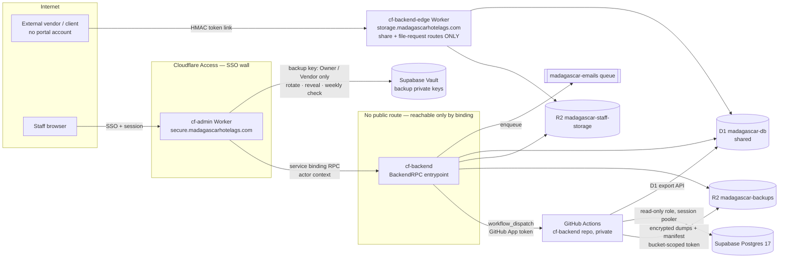

# 01 — Architecture

## 1. The picture



**The two-provider rule for backups** (doc 09): encrypted backups live at **Cloudflare**
(R2), and the key that opens them lives at **Supabase** (Vault). Only cf-admin, and
only for the Owner or Vendor-support roles, can bring the two together.

One repository deploys **two Workers** (OD-1, revised after factor D1):

| Worker | How it is reached | What it serves | Holds |
|---|---|---|---|
| `cf-backend` (private; exports the named `WorkerEntrypoint` `BackendRPC`) | **Only** through the `[[services]]` binding in cf-admin. No route, no `workers.dev`, no preview URLs, and RPC methods are not HTTP anyway | Everything operational: capability manifest, job control, backup status and downloads, storage management | GitHub App key, `BACKUPS` binding, storage management, the R2 S3 pair for presigned uploads. **Never** a backup private key (those stay in Supabase Vault, doc 09) |
| `cf-backend-edge` (public) | Custom domain `storage.madagascarhotelags.com`; `workers_dev = false`, `preview_urls = false` | An enumerated allow-list: share-link pages/downloads, file-request pages/uploads, `/robots.txt`. **Everything else returns 404** | Only what serving links needs: `STAFF_STORAGE` (read, plus upload for file requests), `DB`, and the share-token verification key. **No** GitHub token, **no** backups binding |

"No possible way to directly access" is therefore literally true for the operational
surface. The only public code path is the storage allow-list, which exists because
vendors with no identity must be able to download files. That path already sits outside
Access today (as a bypass on `secure.*`); moving it makes it *smaller*, not larger.

## 2. Why two Workers in one repo (OD-1, revised)

The first draft chose one Worker with two surfaces. The deep review reversed it:

- **Blast radius.** In one Worker, a logic bug on the internet-facing path runs in the same isolate as the GitHub App key and the backups binding. Split, the public Worker simply has no such credentials to leak.
- **CPU accounting.** Service-binding calls are billed as one request, with CPU summed across the chain (factor A4). Keeping the public path out of the operational Worker keeps each Worker's CPU profile small and legible.
- **The cost is small.** One repo with a shared `src/storage/` domain module, two `wrangler.toml` files (`workers/private`, `workers/edge`), two Workers Builds projects with their own root directories, and one test suite. Builds are serialized on Free (factor A6), so the deploy runbook orders them.
- The edge Worker does **not** call the private Worker. Anything it needs (token verification, logging a download) it does itself against D1 and R2.

## 3. What moves, what stays

| Concern | Today | After |
|---|---|---|
| Staff storage domain logic (quota, trash, share/request tokens, presign, reconcile, notifications) | cf-admin `src/lib/storage/**`, 24 `api/storage/**` routes, 2 DAL repos, the `scheduled-storage-notifications` worker. *Measured*: ~57 files, ~14.6k lines | **cf-backend** |
| Staff storage UI (file grid, modals, trash view) | cf-admin islands | **Stays in cf-admin.** Its API routes become thin adapters over `env.BACKEND` RPC |
| Public share/request pages | cf-admin via an Access bypass on `secure.*` | **cf-backend on `storage.*`.** The bypass is then removed |
| DB backups | cf-admin `.github/workflows/backups.yml` (weekly; GitHub artifacts; currently failing on missing secrets) | **cf-backend repo** workflow, output to R2 |
| Job scheduling for Worker jobs | cf-admin `*/5` tick + control plane | Unchanged. cf-admin's tick calls cf-backend RPC for the storage jobs, so cf-backend needs **no cron trigger** |
| Identity, sessions, PLAC, audit log | cf-admin | **Stays in cf-admin.** cf-backend has no concept of login |
| Global config | `admin_portal_settings` (D1) | Same table. cf-backend-owned keys use the `backend:` prefix |

## 4. Bindings

**cf-backend (private) `wrangler.toml`** (IDs come from the live resources; never invent them). The edge Worker gets only `DB`, `STAFF_STORAGE` and the share-token key:

| Binding | Type | Purpose |
|---|---|---|
| `DB` | D1 `madagascar-db` | Storage tables, `admin_portal_settings` (`backend:*` keys) |
| `STAFF_STORAGE` | R2 `madagascar-staff-storage` | Files |
| `BACKUPS` | R2 `madagascar-backups` (new) | Read the manifests; stream encrypted artifacts for owner download; prune |
| `EMAIL_QUEUE` | Queue producer `madagascar-emails` | Backup alerts, storage notifications |
| `ANALYTICS` | Analytics Engine `madagascar_analytics` | Run metrics (same dataset cf-admin writes) |
| Secrets | — | `GITHUB_APP_PRIVATE_KEY` (OD-17), `R2_ACCESS_KEY_ID` / `R2_SECRET_ACCESS_KEY` (storage presign, moved from cf-admin), share-token signing key(s) (moved) |

**cf-admin gains one binding** and loses the storage secrets:

```toml
[[services]]
binding = "BACKEND"
service = "cf-backend"
entrypoint = "BackendRPC"
```

## 5. Repository layout (cf-backend)

```text
cf-backend/
├── workers/
│   ├── private/wrangler.toml    # cf-backend: BackendRPC only, no routes
│   └── edge/wrangler.toml       # cf-backend-edge: storage.* public allow-list
├── src/
│   ├── private.ts               # export BackendRPC (entry of the private Worker)
│   ├── edge.ts                  # default fetch → public router (entry of the edge Worker)
│   ├── rpc/                     # BackendRPC methods: one file per capability group
│   ├── capabilities/            # registry: id → handler, input schema, minRole, danger, view
│   ├── contract/                # manifest builder, contract version, error envelope
│   ├── public/                  # storage.* router + share/request handlers
│   ├── storage/                 # domain logic moved from cf-admin
│   ├── backups/                 # manifest reader, reconcile, prune, download stream
│   └── lib/                     # d1, r2, github client, queue, redaction
├── .github/workflows/
│   ├── db-backup.yml            # the backup pipeline (doc 03)
│   └── ci.yml                   # verify on push (does not deploy)
├── contract/
│   ├── manifest.schema.json     # published contract (doc 02)
│   └── fixtures/                # consumer fixtures vendored from cf-admin
├── scripts/                     # verify gates, contract sync, restore helpers
├── test/                        # vitest + workers pool
└── RULES.md  main.md  README.md
```

Conventions to copy from cf-admin (they were paid for in incidents): the ratchet, the
`verify` chain, `[secrets] required`, generated `worker-configuration.d.ts` with a check,
the partial-staging discipline, and the rule that a doc is part of done.

## 6. Request flows

**Operator runs a backup now**: staff browser → cf-admin (Access, session, PLAC
`/dashboard/backend#backup-run`, owner) → `env.BACKEND.invoke(actor, 'db-backup.run', {scope})`
→ cf-backend re-checks the role and cooldown → GitHub `workflow_dispatch` with a
correlation id → cf-admin writes `admin_audit_log` → the UI polls
`invoke('db-backup.status')`, which reads the GitHub run and then the R2 manifest.

**Vendor downloads a shared file**: `https://storage.madagascarhotelags.com/s/<token>`
→ cf-backend public router → HMAC verify (timing-safe), expiry, revocation, passcode,
consent → R2 stream → `storage_share_access_logs` row. cf-admin is not in the path, so a
cf-admin outage or deploy cannot break vendor links (and vice versa for the portal).

## 7. Failure isolation

| Failure | Effect | Design response |
|---|---|---|
| cf-backend down or mid-deploy | cf-admin's storage and backup panels show "backend unavailable"; the rest of the portal is unaffected | Every RPC call has a timeout and a typed error envelope; there are no uncaught throws into page render |
| cf-admin down | Vendor links keep working; scheduled backups keep running (GitHub owns the schedule) | Surfaces are independent by construction |
| GitHub Actions outage or schedule drop | A backup is missed | Dead-man's switch: cf-admin alerts when `backend:backup-status.lastSuccessAt` is older than 8 days (weekly) or 36 h (daily) |
| Supabase or D1 unavailable during a run | That half fails; the other half still completes | Each database is an independent job; the manifest records per-job outcomes |
