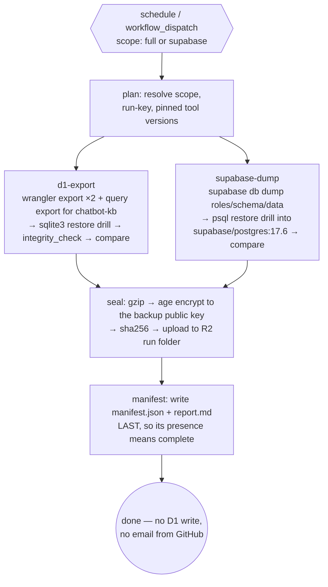

# 03 — The backup pipeline

## 1. Starting point (measured 2026-09-21)

cf-admin already has `.github/workflows/backups.yml` (302 lines): weekly
`17 3 * * 1`, a D1 export plus restore drill, a Supabase `pg_dump` (Postgres 17 client,
session pooler) plus restore drill, and optional GPG. **It has never produced a
backup.** Both runs (2026-09-15 manual, 2026-09-21 scheduled) failed because
`CLOUDFLARE_API_TOKEN` / `CLOUDFLARE_ACCOUNT_ID` are unset. The repo's only secret
is `PERSONAL_PAT`. Its `supabase-dump` job is **green without dumping** when
`SUPABASE_DB_URL` is missing; that behaviour must not carry over. Output goes to GitHub
artifacts (90-day expiry), not R2.

We **move and upgrade** this workflow; we do not rewrite from scratch. The full as-is
analysis (every job and step, run history, secrets state, the 14 gaps G1–G14, and the
bridge that gets a real backup running before cf-backend exists) is in
[08-existing-backup-workflow.md](08-existing-backup-workflow.md).

## 2. Scope: "the full DB architecture"

| Store | Size (measured) | What is captured | Notes |
|---|---|---|---|
| D1 `madagascar-db` | 2.2 MB | Full SQL export (schema + data), `d1_migrations` included | Export briefly blocks the DB. At 2.2 MB that is seconds, which is why the schedule is 03:17 local |
| D1 `chatbot-kb` | 216 KB | **Query-based export** (factor A1): `SELECT` each base table through the D1 query API, excluding the FTS table `kb_search` and its shadow tables; `kb_search` is rebuilt on restore | **Confirmed:** D1 export does not support databases containing virtual tables. Never drop the FTS table in production to make the export work |
| D1 `whatsapp-chatbot` | 76 KB | Full export | — |
| Supabase Postgres 17 | 17 MB | **`supabase db dump`, not raw `pg_dump`** (factor B1): `roles.sql` (`--role-only`), `schema.sql`, `data.sql` (`--data-only --use-copy`), plus the `supabase_migrations` schema and data pair. Includes `auth.users` (6 rows), RLS policies, functions, triggers and pg_cron job definitions | **Confirmed** from Supabase's own backup/restore guides: raw `pg_dump` pulls in Supabase internals and fails on restore. Today's workflow dumps only `public` with raw `pg_dump`, so both scope and method change. Customisations to `auth`/`storage` are captured by `supabase db diff --schema auth,storage` if any exist (factor B5) |
| Supabase `vault` | — | **Excluded, documented.** Vault secrets are encrypted with a Supabase-managed key that is not in any dump, so a restore cannot decrypt them | Re-enter those secrets manually after a restore; list them in the DR runbook |
| KV (`ADMIN_SESSION`, `SESSION`, `ISR_CACHE`) | — | **Excluded by design.** Sessions and caches rebuild themselves | Documented so nobody "fixes" the gap |
| R2 `madagascar-staff-storage` | to measure | **Phase 5:** incremental mirror into `madagascar-backups/v1/mirror/staff-storage/` | Payroll and medical records, currently with no copy at all (MAINTENANCE S-2) |
| R2 `madagascar-images`, `arco-documents` | to measure | Phase 5 candidates (`arco-documents` is legal evidence) | — |

## 3. The workflow (`cf-backend/.github/workflows/db-backup.yml`)



Rules baked into the workflow:

1. **A missing secret is a red run, never a warning.** Every job fails fast on missing configuration (the D1 job already does; the Supabase job must be fixed).
2. **Restore drills run on the plaintext before encryption, inside the runner, in three tiers** (OD-15, adapted from chunk 6's drill):
   - **Every run:** D1 into local `sqlite3`, which needs no D1 write permission and makes no D1 writes. Postgres goes into a **`supabase/postgres` container pinned to the project's version (17.6.x)**, because the dump expects Supabase's roles and extensions; a plain `postgres:17` drill would fail or pass misleadingly (factor B2).
   - **Monthly (first Sunday):** the **real-path drill**, restoring into a temporary D1 named `drill-<db>-<run id>`, created and always deleted, exactly as ADR-0001 requires. Local SQLite cannot reveal D1-specific import failures or D1's real import speed, and those are what a production restore would hit. It uses its own `CLOUDFLARE_DRILL_TOKEN` (**D1 Edit**), referenced only by that job, while the weekly export token stays **D1 Read**.
   - **Twice a year:** a human decrypts and restores end to end (§8 step 7, doc 09 §4).
3. **The runner holds only the public key** (OD-4). Once encrypted, even the runner cannot read its own output. Plaintext never leaves the VM.
4. **`permissions: {}` at the top**, granted per job; third-party actions **pinned by SHA**; no `${{ inputs.* }}` inside `run:` (inputs go through `env:`); `concurrency: db-backup` so two runs never overlap.
5. **Manifest last.** Artefacts upload first, then `manifest.json`. A run folder without a manifest is by definition incomplete, and reconcile reports it as such.
6. **Two schedules, one workflow** (OD-3): `17 9 * * 0` → `scope=full`; `17 9 * * 1-6` → `scope=supabase`. The job reads `github.event.schedule` to decide. Minute `:17` falls between cf-admin's `*/5` ticks, and Mexico has had no daylight saving time since 2022, so 09:17 UTC is always 03:17 in Aguascalientes.
7. **Short, separate D1 exports** (factor A2). A running export blocks that database, and the booking path writes to D1 first. Each database is exported on its own, the duration is recorded, and anything above 30 s raises a warning.
8. **Second provider** (OD-12, factor B8). The same encrypted files are also uploaded as a GitHub artifact with `retention-days: 14`. That is about 40 MB at steady state, well under the 500 MB Free artifact allowance, and it means a lost Cloudflare account does not take every copy with it.
9. **`doctor` runs first, every run** (§10 P-14/P-15). It checks that every required secret exists, then proves each credential works with one harmless call: the Cloudflare token-verify endpoint, `select 1` through the pooler, an R2 `HEAD` on the bucket, the GitHub API. It also checks that `BACKUP_AGE_RECIPIENT` is a well-formed `age` recipient. Any failure stops the run with a message naming the exact fix.
10. **A `seal` job always runs** (`needs: [doctor, d1, supabase]`, `if: always()`), so a partial failure still produces a manifest recording which path failed and why. There is never a silent half-run.
11. **Prove the ciphertext is decryptable by the right key without decrypting it** (factor B9). Each file header must carry exactly one recipient stanza, and the manifest records the recipient fingerprint. cf-admin's weekly key check (doc 09 §4) confirms that fingerprint has its private key in Supabase Vault, and that the active key derives to exactly the public key GitHub used.

## 4. R2 layout (`madagascar-backups`, OD-2)

```text
madagascar-backups/
├── README.txt                                # what this bucket is; points to the DR runbook
└── v1/                                       # layout version: v2 can coexist, readers pick
    ├── runs/                                 # ── immutable (OD-5): full/ locked 90 days, daily/ locked 30 days
    │   ├── daily/2026/…                      # Mon–Sat Supabase-only runs: same shape, postgres/ only
    │   └── full/2026/
    │       └── 2026-10-04T091703Z_full_gh12345678/     # <UTC start>_<scope>_gh<run id>
    │           ├── manifest.json             # source of truth for this run (written LAST)
    │           ├── report.md                 # human report, PII-free, rendered in cf-admin
    │           ├── checksums.sha256
    │           ├── d1/
    │           │   ├── madagascar-db.sql.gz.age
    │           │   ├── madagascar-db.schema.sql.gz.age   # schema-only copy (P-5): diffable, restores structure alone
    │           │   ├── chatbot-kb.sql.gz.age
    │           │   ├── chatbot-kb.schema.sql.gz.age
    │           │   ├── whatsapp-chatbot.sql.gz.age
    │           │   └── whatsapp-chatbot.schema.sql.gz.age
    │           ├── drill/
    │           │   ├── source-counts.json    # captured from the live source at dump time (P-3)
    │           │   ├── restored-counts.json  # what the drill got back
    │           │   └── drill.json            # tier, engine, seconds (the measured RTO), problems
    │           ├── doctor.json               # what the pre-flight found (secret names present, token checks) — never values
    │           ├── postgres/
    │           │   ├── roles.sql.gz.age      # supabase db dump --role-only (factor B1)
    │           │   ├── schema.sql.gz.age
    │           │   ├── data.sql.gz.age       # --data-only --use-copy
    │           │   └── migrations-history.sql.gz.age   # supabase_migrations schema + data
    │           └── logs/
    │               └── run.log.gz            # redacted: no connection strings, no row data
    ├── catalog/
    │   └── 2026.json                         # derived index, rebuilt by reconcile (not locked)
    ├── state/
    │   └── latest.json                       # pointer to the newest complete run (not locked)
    └── mirror/                               # Phase 5: staff-storage copies, own lock rule
```

- **Date-partitioned by year** keeps listings cheap (one `list` per year, Class A) and makes manual inspection in the dashboard obvious.
- **Run-key sorts chronologically** and is unique even for two runs in one day.
- `catalog/` and `state/` are *derived*. They can always be rebuilt from `runs/`, which is why only `runs/` is locked.

`manifest.json` (abridged):

```json
{
  "layout": "v1",
  "runKey": "2026-10-04T091703Z_full_gh12345678",
  "scope": "full",
  "trigger": { "event": "schedule", "correlationId": null, "actor": null },
  "source": { "repoSha": "abc123", "workflow": "db-backup.yml", "tools": { "pg_dump": "17.6", "wrangler": "4.x", "sqlite3": "3.x" } },
  "jobs": {
    "d1:madagascar-db": { "outcome": "ok", "bytes": 312004, "sha256": "…", "tables": 30, "rows": { "bookings": 0, "…": 0 }, "schemaHash": "…", "drill": "passed" },
    "postgres": { "outcome": "ok", "bytes": 2104331, "sha256": "…", "tables": 20, "rows": { "…": 0 }, "schemaHash": "…", "drill": "passed" }
  },
  "timing": { "scheduledFor": "2026-10-04T09:17:00Z", "startedAt": "2026-10-04T09:17:03Z", "delaySeconds": 3 },
  "drill": { "tier": "weekly-local", "d1Seconds": 4.1, "postgresSeconds": 38.6, "problems": [] },
  "expectedFiles": 14, "presentFiles": 14,
  "verdict": { "level": "ok", "reasons": [] },
  "startedAt": "2026-10-04T09:17:03Z",
  "finishedAt": "2026-10-04T09:19:41Z"
}
```

Row counts and hashes only: **never row data**.

## 5. Verification: deterministic, replacing the "AI audit"

| Check | Rule | Verdict if it trips |
|---|---|---|
| Restore drill | Dump restores cleanly into an empty engine of the same major version | `failed` |
| Integrity | `PRAGMA integrity_check` = `ok` (D1); `pg_restore` exit 0 with no errors (Postgres) | `failed` |
| Row-count fidelity | Restored counts = source counts captured at dump time; hot tables (`cf_access_sync_log`, `admin_login_logs`, …) get a small tolerance | `failed` beyond tolerance |
| Size anomaly | Compressed size drops >30% vs the last `ok` run | `warning` (possible upstream data loss) |
| Schema drift | `schemaHash` differs from the last run | `info`, with a diff summary in `report.md` (expected after migrations) |
| Coverage | Every table in the source catalog appears in the dump | `failed` |
| Freshness | Reconcile sees no `ok` run within 8 days (full) / 36 h (supabase) | alert (dead-man's switch) |
| Expected outputs (P-8) | Every file listed in `expectedFiles` exists in the run folder | `failed` |
| Drill speed (P-4) | Drill seconds > 2× the median of the last 8 runs | `warning` (RTO regression) |
| Readiness (P-14) | `doctor` found a secret missing, a credential failing its check, or a key within 30 days of expiry | `failed` (missing / invalid) or `warning` (expiring) |
| Lateness (P-17) | `timing.delaySeconds` > 6 h, or the start fell outside 00:00–06:00 local | `info` |

## 6. Status, history and alerts: no new tables

| Need | Where it lives |
|---|---|
| Full run record | R2 `manifest.json` (immutable) |
| "Current state" for dashboards and the dead-man's switch | `admin_portal_settings` key `backend:backup-status` (one JSON row: last run, last ok, verdict, next expected) |
| Charts over time | One Analytics Engine data point per run (`blob1=db-backup`, `blob2=verdict`, `double1=bytes`, `double2=durationMs`) |
| Who pressed Run / Enable / Disable / Prune / Download | `admin_audit_log` (written by cf-admin) |
| Alerts | cf-backend enqueues to `madagascar-emails` on `failed`/`warning`/stale. GitHub's own failed-workflow email to the repo owner is a free second channel |

`db-backup.reconcile` (called daily by cf-admin's `backend-reconcile` job and on page
view) lists the current year's `runs/` prefix, reads any manifest newer than
`backend:backup-status`, updates that row, rebuilds `catalog/`, and alerts if needed.
Cost: one list + a few gets/day, which is negligible Class A/B usage.

## 7. Retention (manual, by owner rule)

- **Bucket locks** on `v1/runs/full/` (90 days) and `v1/runs/daily/` (30 days): nothing (not even a leaked token) can delete or overwrite a run early.
- Nothing auto-deletes. cf-admin shows bucket usage (computed from manifests, not by listing) and offers **Prune runs older than N days**: owner-only, typed confirmation, audited, and it never touches the newest 4 `ok` full runs.
- Capacity: ~5 MB per full run + ~2 MB per daily Supabase run ≈ **0.9 GB/year**, against 10 GB free. Pruning is a hygiene choice, not a necessity, for years.

## 8. Restore (summary; the runbook lands in Phase 1)

1. Pick a run in cf-admin → **Download** (owner-only; the encrypted blob is streamed through RPC; nothing is decrypted server-side).
2. Decrypt offline with the private key; verify `checksums.sha256`.
3. D1: restore into a **new** database (never over production), point a preview binding at it, verify, then swap bindings. Postgres: `pg_restore` into a new project or a local container first. For point-in-time D1 within 7 days, prefer **Time Travel** over the export.
4. **Postgres specifics** (factors B3, B6): restore with `psql --single-transaction --variable ON_ERROR_STOP=1` and `SET session_replication_role = replica` for the data file. Then reset the password of every custom `LOGIN` role, including `cf_astro_writer`, because passwords are not in any dump. Then update the secrets in each consumer Worker: cf-astro `DATABASE_URL`, and cf-admin and cf-chatbot Supabase URL/keys if the project changed. Restore Postgres before D1, then run the D1 booking/consent replay outboxes to close the gap between the two dump times. Raw bodies are PII-redacted, so that reconstruction is partial.
5. Re-apply the erasure log (`legal_requests`) to restored data before it serves traffic (doc 05 §5).
6. Realistic recovery times per scenario are in [07-factor-register.md](07-factor-register.md) §F; D1 Time Travel (in place, minutes) always beats a restore from export.
7. **Twice-yearly rehearsal**: the Owner or Vendor restores the latest run end to end every six months and records it; an untested key is no key.

## 9. Open spikes (Phase 1, before building)

| Spike | Question | Fallback |
|---|---|---|
| S-1 | ~~Does D1 export work for `chatbot-kb` with its FTS virtual table?~~ **Answered 2026-09-21: no** (CF D1 import/export docs). The query-based exporter is now the design (§2); the spike becomes "build and drill it" | — |
| S-6 | Any integer column above 2^53 in the three D1 databases (factor A3)? | If yes, add a per-column checksum to the drill |
| S-7 | How many active projects does the Supabase Free org allow, and does the dormant second project occupy a slot needed for a restore? | Pause the dormant project during a restore, or restore into a wiped existing project |
| S-2 | Minimum Cloudflare API token permission for D1 export (the existing workflow asks for D1 Edit) | Use D1 Edit on the account; compensate with short token expiry + rotation |
| S-3 | Can a dedicated `backup_reader` role get `pg_read_all_data` on Supabase, including `auth` and `cron`? | Dump with the `postgres` role via the pooler; keep the URL only in GitHub secrets |
| S-4 | Real compressed sizes and durations | Measure from the first two runs; adjust thresholds |
| S-5 | ~~Does the dispatch API return the run id?~~ **Answered 2026-09-21: yes**: `workflow_run_id` in a `200` response (GitHub changelog 2026-02-19; always returned from REST API version 2026-03-10) | — |
| S-8 | Is **D1 Read** enough for `wrangler d1 export`? The chunk 6 record says "export needs read", but its token was scoped D1 Edit for the drill | If not, the weekly token needs D1 Edit too, and least privilege relies on its expiry and scope |

## 10. Operating principles adopted from the existing workflow

The chunk 6 workflow ([08-existing-backup-workflow.md](08-existing-backup-workflow.md))
never produced a backup, but not because its design was wrong. Its failure was purely
operational: secrets never set, nobody told, six silent days. So its good processes
carry over, and its failure mode drives a set of new ones. Each principle below says
where it came from.

| # | Principle | Origin | Kind | How cf-backend applies it |
|---|---|---|---|---|
| P-1 | **Error messages are instructions.** A failed check names the missing thing and the exact dashboard path to fix it | chunk 6 pre-check (`backups.yml:61`) | as-is | Every `doctor` and job failure message follows the pattern: *what is missing → where to set it → what to re-run* |
| P-2 | **Thin YAML, tested scripts.** All logic lives in pure functions under the planned `scripts/backup/` folder, with unit tests; the workflow only orchestrates | `backup_drill.mjs` + `test/backup-guards.test.ts` | as-is | `parseExportTables`, `compareCounts`, `drillSummary` are ported first, then extended (manifest builder, verdict rules, redaction) |
| P-3 | **Counts from the live source at dump time, compared after restore; counts, not byte diffs** (D1 export promises no row order) | `backup_drill.mjs` header | as-is | `drill/source-counts.json` vs `restored-counts.json` in every run folder |
| P-4 | **RTO is measured every run, not stated** | chunk 6 job summaries | as-is | `drill.d1Seconds` / `drill.postgresSeconds` in the manifest; the console charts them; a drill slower than 2× its 8-run median is a `warning` |
| P-5 | **A schema-only copy next to every full export** | `--no-data` export (`backups.yml:73`) | as-is | `*.schema.sql.gz.age` per database: the schema-drift diff reads these, and a structure-only restore needs no data |
| P-6 | **Independent paths per store** | D1 and Supabase jobs never block each other | adapted | Independent *steps* in **one job** (`continue-on-error` per store, `seal` with `if: always()`): the same resilience without paying a rounded-up minute per extra job ([10](10-free-tier-feasibility.md) §2.2) |
| P-7 | **Cleanup always runs and prints its own manual fallback** | `d1-drill` delete step (`backups.yml:162–164`) | as-is | Every temporary resource (monthly drill D1, containers) is deleted in an `always()` step that prints the exact command if it fails |
| P-8 | **A missing expected file is a failure** | `if-no-files-found: error` | adapted | The manifest lists `expectedFiles`; `seal` fails the verdict when any is absent |
| P-9 | **One renderer, two sinks.** The job summary *is* the report | chunk 6 `$GITHUB_STEP_SUMMARY` tables | adapted | `report.md` and the GitHub job summary are rendered by the same function from the manifest, so they cannot disagree |
| P-10 | **Explicit time budgets per job** | `timeout-minutes` 15/30/20 | as-is | Per-job timeouts + `concurrency: db-backup` |
| P-11 | **Temporary resources carry the run id and are never standing** | ADR-0001 + `madagascar-db-drill-<run>` | as-is | Monthly real-path drill `drill-<db>-<run id>` (rule 2) |
| P-12 | **The "why" lives in the file header** (PG17 client, IPv4 pooler, row-order) | `backups.yml:1–30` | as-is | Same header discipline in `db-backup.yml` and every script |
| P-13 | **Tiered drills**: weekly local, monthly real-path, twice-yearly human | the chunk 6 drill measured the *real* D1 import path; the first cf-backend draft had dropped it | adapted | Rule 2 (OD-15). Least privilege split: weekly token D1 Read, drill token D1 Edit (spike S-8) |
| P-14 | **Readiness is observable before a run fails.** Required secret *names* and their last-updated dates, token expiry, encryption-key proof age (doc 09), bucket-lock presence and last-success age are shown in cf-admin | the repo held only `PERSONAL_PAT` for six days and nobody could see it | new | `doctor` job (rule 9) + `backups.readiness` capability in the console (doc 02, OD-14) |
| P-15 | **Existence is not validity.** Each credential proves itself with one harmless call before any dump | a set-but-wrong token would fail exactly like a missing one, one step later | new | Rule 9 |
| P-16 | **Every secret a workflow references must exist** | `production-tests.yml` names the same missing secrets and has never run green | new | A CI guard lists `secrets.X` references across all workflows and compares them with the repo's secret names; cf-admin can adopt the same guard today |
| P-17 | **Lateness is recorded, not assumed away** | the first scheduled run started 5 h 38 min late | new | `timing.delaySeconds` in the manifest; the dead-man's switch tolerates ≥ 12 h; a run starting outside 00:00–06:00 local is flagged (the D1 export is seconds for 2,425 rows, so it still runs) |
| P-18 | **Measured numbers flow to their one home automatically** | the chunk 6 record asks a human to copy numbers into the runbook | new | Manifest → `backend:backup-status` → console; the DR runbook states *targets* and links to the console for *measurements* ("one fact, one home") |
| P-19 | **Break-glass from a laptop** | the same scripts are "runnable locally with a wrangler login" (`backup_drill.mjs`) | adapted | `npm run backup:local -- --scope full` runs the identical pipeline on the owner's machine, encrypted to the same two keys, for when GitHub or the Actions queue is down |
| P-20 | **The workflow itself is tested** | chunk 6 tested the helpers but not the YAML | new | Guard tests parse `db-backup.yml`: every job has `timeout-minutes`, top-level `permissions: {}`, actions pinned by SHA, no `${{ inputs.* }}` inside `run:`, `doctor` first, `seal` depends on all jobs |
| P-21 | **Owner steps are tracked, not assumed** | chunk 6's blocker lived in a doc table row for six days | new | Every phase is a program chunk with a CHUNK-TEMPLATE record; pending owner steps appear as verification-log rows *and* on the readiness panel (doc 06) |
| P-22 | **The bridge's first real numbers become the baselines** | the bridge (doc 08 §7) will be the first measured run | new | Its sizes, durations and RTOs seed the size-anomaly, slow-drill and export-duration thresholds instead of guessed values |
