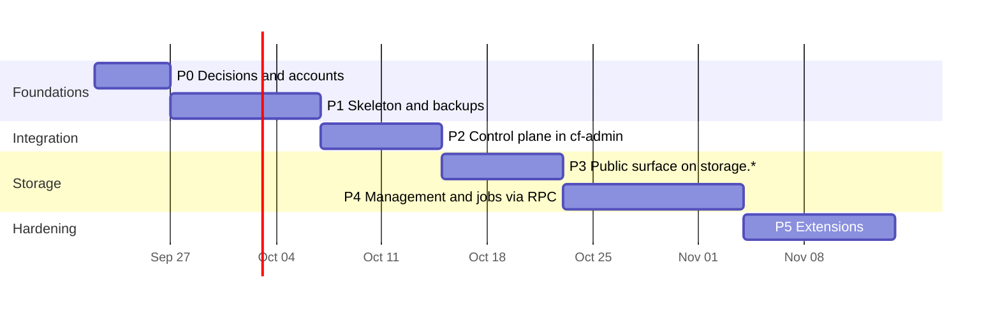

# 06 — Roadmap

**Ordering principle: value and safety first.** Backups come before the storage move,
because today there is **no working backup at all**, and the storage move is the
riskiest change. Each phase ships on its own, has an exit criterion measured against
live infrastructure, and can be rolled back without touching the next.

Dates are placeholders for sequencing, not commitments.

## P0 — Decisions and accounts (owner-heavy, no code)

| # | Task | Who |
|---|---|---|
| 0.0 | **Bridge, do first:** unblock the existing cf-admin `backups.yml` (rebuilt as one job 2026-09-22 with the bridge fixes applied, doc 08 §8a) by adding its four secrets and dispatching one run ([08-existing-backup-workflow.md](08-existing-backup-workflow.md) §7). This gives the business its first real backup this week instead of after P1 | Owner (~15 min) + AI records results |
| 0.1 | Review README decisions OD-1…OD-17; accept or reverse each | Owner |
| 0.2 | Create private GitHub repo `mascotasmadagascar-cmd/cf-backend`; confirm 2FA on the account | Owner |
| 0.3 | Create R2 bucket `madagascar-backups`; add bucket lock rules `v1/runs/full/` → 90 days and `v1/runs/daily/` → 30 days, then try a delete to prove them ([10](10-free-tier-feasibility.md) §5 check 5) | Owner (dashboard) |
| 0.4 | Create scoped tokens: R2 writer (backups bucket only), Cloudflare API token for D1 export (with expiry), the GitHub App (step 0.5′, OD-17) | Owner |
| 0.5 | **First backup key** (doc 09 §7): apply the Supabase migration for the three `backup_key_*` functions, then run the planned `scripts/backup-key-init` once. It generates the key, stores the private half in Vault, sets `BACKUP_AGE_RECIPIENT`, and shows the recovery kit once. Owner and Vendor each save the kit | Owner + Vendor |
| 0.5′ | Create the **GitHub App** (OD-17) with Actions r/w, Variables r/w and Secrets: read on the cf-backend repo only; install it; store its private key as a cf-backend Worker secret | Owner |
| 0.6 | Create a `backup_reader` role in Supabase (spike S-3), then the session-pooler URL secret | Owner + AI |
| 0.7 | Verify the GitHub Free limits assumed in doc 05 §3 against current GitHub docs | AI |
| 0.8 | Measure: staff-storage bucket size, which cf-admin env vars the storage feature uses exclusively, current account cron count | AI |
| 0.9 | List all Cloudflare Access applications (no wildcard may cover `storage.*`, factor D9); confirm the Free-plan WAF rate-limiting rule allowance for the `storage.*` guard (factor A5) | AI + owner |
| 0.10 | Supabase: confirm the Free org's active-project allowance and whether the dormant project blocks a restore (spike S-7); run the integer-precision audit on the three D1 databases (spike S-6) | AI |
| 0.11 | Set cf-backend repo Actions log and artifact retention to 14 days (factor D5) | Owner |
| 0.12 | **Free-tier checks** ([10](10-free-tier-feasibility.md) §5): Actions minutes after the consolidation; the zone's single free rate-limit rule and remaining custom rules; a Supabase project slot for restores; what the Vercel-managed Supabase org implies; bucket locks on this tier; the real R2 usage baseline | Owner + AI |

**Exit:** every OD answered; all secrets exist (verified by names, never values);
measurements recorded in this folder.

## P1 — cf-backend skeleton + backups to R2 (highest value)

| Stage | Tasks | Exit |
|---|---|---|
| 1a Skeleton | Repo scaffold (layout in doc 01 §5), `verify` chain (typecheck, tests with the workers pool, ratchet, contract check, audit gate), two Workers (OD-1): private `cf-backend` with `BackendRPC` exposing `manifest()` + `health()` only, and `cf-backend-edge` whose public router returns 404 for everything; one `wrangler.toml` per Worker; two Workers Builds projects with their own root directories, **build command = `npm run verify`** (OD-10). Verify what a deploy does when a binding's target Worker does not exist yet (factor C4) | Both deployed; `health()` callable from a scratch binding; a public-surface test proves 404 everywhere; the private Worker has no route |
| 1b Spikes | S-2/S-8 (token permissions: is D1 Read enough for export?), S-3 (`backup_reader` role), S-4 (sizes; seeded from the bridge run, P-22), S-6 (integer precision), S-7 (Supabase project slots). S-1 and S-5 are already answered | Each answered with evidence in doc 03 §9 |
| 1b′ Scripts first (P-2) | Port chunk 6's `parseExportTables` / `compareCounts` / `drillSummary` with their tests, then add the manifest builder, verdict rules, the report renderer used for both `report.md` and the job summary (P-9), and the `doctor` checks (P-14/P-15). The YAML guard tests (P-20) and the cross-workflow secret-reference guard (P-16) are written before the workflow | Scripts and guards green in `verify` before any YAML exists |
| 1c Pipeline | Port `backups.yml` → `db-backup.yml`: `wrangler d1 export` for two databases plus the **query-based exporter for `chatbot-kb`** (factor A1); **`supabase db dump`** roles/schema/data + migration history (factor B1); drills in `sqlite3` and **`supabase/postgres:17.6`** (factor B2); two-recipient encryption with a recipient check (factor B9); R2 layout v1; GitHub artifact second copy (OD-12); manifest last; two schedules; fail-fast on missing config | Two consecutive scheduled `ok` runs (one full, one supabase); manifests validate; `chatbot-kb` restores with a working `kb_search` |
| 1d Restore proof | Owner decrypts and restores one full run offline (D1 into a new local db, Postgres into a container) and records it; the first **monthly real-path drill** (temporary D1, OD-15) runs and records its RTO; `npm run backup:local` (P-19) is exercised once from the owner's machine | Rehearsal record written; real-path RTO measured; break-glass proven |
| 1e Retire the old | Delete cf-admin's `backups.yml` (it has never produced a backup) | cf-admin CI green |

**Rollback:** disable the workflow (one click). Nothing in production depends on it yet.

## P2 — Control plane inside cf-admin

| Stage | Tasks | Exit |
|---|---|---|
| 2a Contract | `manifest.schema.json` v1, consumer fixtures in cf-admin, `contract:sync` / `contract:check` in both repos, RPC wrapper with timeouts and envelopes | Both `verify` chains fail on a deliberately broken fixture (proven, then reverted) |
| 2b Permissions | cf-admin migration (next free number ≥ `0057`) seeding the planned `/dashboard/backend` + capability fragment rows; fail-closed guard for backend keys; both-keys check | A test proves an unseeded backend key is denied for every role below owner |
| 2c Backend console | The planned `/dashboard/backend` page, rendering manifest capabilities from the v1 primitives; backup history, report view, owner-only download | Owner browser check |
| 2d Cron page | `external` job kind; `decideJobRun` refuses it (compile-time); Enable/Disable via GitHub API; owner-only Run now with cooldown | Tick provably never dispatches external jobs (test); owner runs one manual backup end to end |
| 2d′ Readiness panel (P-14, OD-14) | `backups.readiness` capability: secret names and dates via GitHub API, token and key expiry from `backend:secrets-calendar`, workflow state, bucket-lock presence, pending owner steps | Deliberately deleting a test secret turns its row red within one page load (proven, then restored) |
| 2e Reconcile + alerts | `backend-reconcile` daily job, `backend:backup-status` row, dead-man's switch in the tick's batched read, alert emails via the queue. **Cross-repo first:** make `cf-email-consumer` accept `projectSource: cf-backend` (factor C7) | A forced stale status produces exactly one alert email |

**Rollback:** remove the `BACKEND` binding usage behind one config key; the console hides itself.

## P3 — Storage public surface on `storage.*`

Stages A and B of doc 04 §4: the parity test over fixture tokens; the custom domain;
cf-admin mints `storage.*` links; old paths 301.

**Exit:** new and old links both download; attempt logs identical; zero new Sentry issues for 7 days.
**Rollback:** flip minting back; delete the custom domain.

## P4 — Storage management and jobs via RPC

Stages C, D and E of doc 04 §4: 24 routes become adapters; jobs via RPC with
re-measured budgets; secrets and binding leave cf-admin; `storage_` table-ownership rule
in `rules_check.py`; old code deleted after 30 days of zero old-host traffic; Access
bypass removed.

**Exit:** cf-admin env count down by the measured amount; cf-admin ratchet A15 falls;
Access bypass list for `secure.*` no longer contains storage paths (verified with an
unauthenticated curl: 302).
**Rollback:** per stage, documented in doc 04 §4.

## P5 — Extensions (each optional, each its own decision)

| # | Item | Value |
|---|---|---|
| 5.1 | R2 mirror of `madagascar-staff-storage` (and `arco-documents`) into `madagascar-backups/v1/mirror/` | Closes MAINTENANCE S-2: payroll and medical files have no copy today |
| 5.2 | Twice-yearly restore rehearsal reminder in cf-admin | Keeps the recovery kit, the runbook and the people honest |
| 5.3 | Move cf-chatbot's admin integration to the service-binding pattern | Retires the published trust literal (critical finding, 2026-09-19 / 2026-09-21) |
| 5.4 | Optional Workers AI summary of `manifest.json` (PII-free) on the report view | "Executive summary" without shipping logs to a third party |
| 5.5 | Client "Platform Trust Report" for Velox deployments | Commercial, single-tenant only (doc 05 §5) |
| 5.6 | Move `/api/emails/unsubscribe` to a public surface | Removes the last Access bypass on `secure.*` |

## Definition of done (every phase)

0. **Each phase is a program chunk** (P-21): a record from `CHUNK-TEMPLATE.md` under `program/chunks/`, written before the code, with its rollback, operator steps, and a dated verification log. A pending owner step stays a visible `pending` row until done, and is mirrored on the readiness panel.
1. Both repos' `verify` green; Workers Builds green; Sentry clean for 7 days.
2. Live verification recorded (the command and its result), never a copied figure.
3. Docs updated in the same change: this folder, RoPA/DR where touched, `documentation/README.md` index.
4. For cf-admin's shared checkout: stage only your own hunks; `git fetch` before trusting state; ratchet updated from a clean tree.
