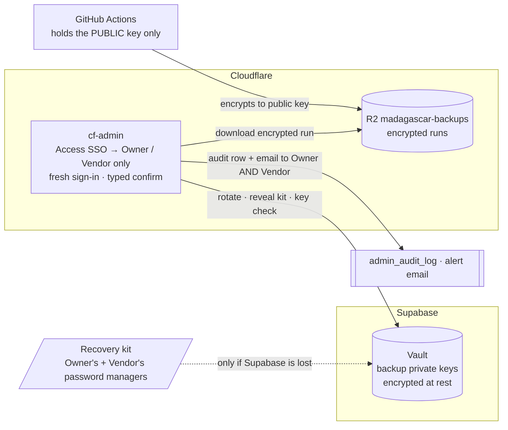

# 09 — Backup key management

> **TL;DR.** Backups are stored at **Cloudflare**; the key that opens them is stored at
> **Supabase** (Vault). Neither half is useful alone. Only the **Owner** and **Vendor
> support** can bring them together, and only through cf-admin, after a fresh sign-in,
> with every action audited and emailed to both. A new key can be generated **on the
> spot** with one click. The one thing kept offline is a **recovery kit** (like 2FA
> recovery codes), needed only if Supabase itself is lost.

## 1. The design in one picture

**What an attacker has to get past to read one backup:**

| Path | Layers to cross |
|---|---|
| Through the portal | Cloudflare Access SSO → an **Owner or Vendor** account (no other role can even see these controls) → a fresh sign-in → typed confirmation → the action is audited and **both** people are emailed |
| Around the portal | Steal the ciphertext (Cloudflare R2, or GitHub's 14-day artifact copy) **and** the key (Supabase Vault, reachable only by the `service_role` through three locked-down functions) **or** a recovery kit from a password manager. That means two different providers, or a personal vault |
| A stolen storage credential alone | Useless: ciphertext only |
| A Supabase dump alone | Useless: Vault contents stay encrypted in dumps (Supabase documents this) |

## 2. The rules

| # | Rule |
|---|---|
| K-1 | **One active backup key** (an `age` X25519 key pair). GitHub holds only its **public** half, as the repo variable `BACKUP_AGE_RECIPIENT`. |
| K-2 | **Private keys live only in Supabase Vault**, named `backup-key:<fingerprint>`. Retired keys **stay** in Vault (never deleted automatically), so old backups always remain openable. |
| K-3 | **Only Owner and Vendor support** can see key status, rotate, reveal the recovery kit, or download an encrypted run. This is **non-delegable**: no page grant can extend it to another role. |
| K-4 | **Every key action** requires a fresh sign-in, a typed confirmation and a rate limit (rotate ≤ 1/day, reveal ≤ 3/day per person). It writes `admin_audit_log` and **emails both Owner and Vendor**, so neither can act unseen. |
| K-5 | **The recovery kit** is the private key shown **once** at creation. Owner and Vendor each save it in their own password manager. It is needed only if the Supabase project is lost, because Vault contents cannot be restored from a dump. |
| K-6 | **The system checks the key itself, weekly**. No human chores (§4). |

## 3. Generate a new key on the spot

One button, **Rotate backup key**, in cf-admin's backend console (Owner or Vendor):

1. cf-admin generates a new X25519 key pair in the Worker (`node:crypto`, fully supported in Workers; no new package) and formats it as an `age` identity and recipient.
2. The private key goes into Vault through `backup_key_put()`. cf-admin never stores it anywhere else.
3. The public key goes to cf-backend, which updates `BACKUP_AGE_RECIPIENT` through the GitHub App (OD-17).
4. The registry row `backend:key-registry` records the fingerprint, date and who rotated; the old key is marked `retired`.
5. The screen shows the **new recovery kit once**, with a "copy to password manager" prompt. The other person gets an email telling them to save theirs from the portal (a *reveal*, which is itself audited).
6. The next backup run uses the new key. Nothing already stored changes.

When to rotate: **yearly** (reminder email), **immediately** if a device or account holding a kit is lost or suspected compromised, and **whenever Owner or Vendor changes**.

## 4. The weekly automatic key check

cf-admin's existing daily `backend-reconcile` job runs this once a week:

| Check | How | Alert if |
|---|---|---|
| The active private key matches what GitHub encrypts to | Read the key from Vault, derive its public key (`node:crypto`), compare with `BACKUP_AGE_RECIPIENT` and the newest manifest's recipient | They differ |
| Every retained backup can still be opened | Each manifest records its recipient fingerprint; each must have a key in Vault | Any run has no matching key |
| The recovery kits still exist | A yearly "I still have my kit" confirmation per person, recorded in the registry | Older than 12 months |

This replaces paper shares, key ceremonies and quarterly manual proofs. The only human
check that stays is the **twice-yearly restore rehearsal**, which compliance needs as
evidence anyway (§8).

## 5. Restoring a backup

1. In cf-admin, pick a run → **Download** (Owner/Vendor; the encrypted files stream from R2).
2. **Reveal key** (Owner/Vendor; fresh sign-in; audited; both emailed), or use your recovery kit.
3. On your own machine: `age -d -i key.txt file.age > file`. Then follow the restore steps in doc 03 §8.
4. Delete the local plaintext and key file afterwards.

## 6. What if…

| Situation | What happens | Data lost? |
|---|---|---|
| Laptop or password manager lost | The key is still in Vault. **Rotate** (the lost kit becomes a retired key) and save the new kit | No |
| Key "gets old" | Nothing breaks: rotation is one click, and old keys stay in Vault for old backups | No |
| Owner or Vendor leaves | Remove their cf-admin access, **rotate**, and the remaining person saves the new kit | No |
| Key suspected leaked | **Rotate now.** Past runs stay encrypted to the old key, so exposure needs the ciphertext too (R2 or the 14-day GitHub copy); revoke those credentials as well | No (confidentiality incident) |
| Supabase project lost | Open the backups with either person's **recovery kit**, restore Supabase, then put the key back into Vault with `backup_key_put()` | No |
| Supabase lost **and** both recovery kits lost | Backups cannot be opened. That is why there are two kits and a yearly confirmation | **Yes** |

## 7. What to build (small)

| Piece | Where | Notes |
|---|---|---|
| Three Postgres functions: `backup_key_put(fingerprint, secret)`, `backup_key_get(fingerprint)`, `backup_key_list()` (fingerprints and dates only) | Supabase migration (RULE #0.7) | `SECURITY DEFINER`, wrapping `vault.create_secret` / `vault.decrypted_secrets`; `EXECUTE` revoked from `public`, `anon` and `authenticated`, granted to `service_role` only. **No new table** (RULE #0.9): Vault's own table holds the keys |
| Key capabilities: status, rotate, reveal, confirm kit | cf-admin backend console | Uses cf-admin's existing Supabase service connection: **no new env var** (RULE #0.8). cf-backend never sees a private key |
| `backups.setRecipient(publicKey)` | cf-backend RPC | Updates the GitHub variable via the GitHub App |
| First key, before the portal buttons exist | The planned `scripts/backup-key-init` (same code path, run once by the Owner) | Needed for P1, since backups start before the P2 console |
| Weekly key check | The `backend-reconcile` job | §4 |

**To verify when building:**

- which Cloudflare Access JWT claim carries the sign-in time, so "fresh sign-in" can be enforced (target: ≤ 10 minutes);
- that `age` accepts a `node:crypto`-generated X25519 key in its standard encoding, proven with a round-trip test in CI.

## 8. Compliance and architecture text

**Add this to the live compliance documents only once it is built and verified**, not before.
Documents that describe unbuilt controls were a finding of the 2026-09-19 review.

| Document | Text to add |
|---|---|
| `security/SECURITY.md` / `THREAT-MODEL.md` | "Backups are encrypted with a public key before leaving the runner. The private key is held in Supabase Vault, a different provider from the Cloudflare storage that holds the backups. Access to it is limited to the Owner and Vendor-support roles through the admin portal, requires a fresh sign-in, and is audited and notified to both. An offline recovery copy is held by each of the two roles." |
| `security/RoPA.md` | Backup key custody: Supabase (Vault) as a processor of key material; no personal data in the key itself |
| `runbooks/disaster-recovery.md` | §5 of this document as the restore procedure; §6 as the key-loss playbook |
| `architecture/PERMISSIONS-SYSTEM.md` | The non-delegable Owner/Vendor capability class (K-3) |

## 9. What changed from the earlier draft

The first version of this document used paper Shamir shares (2-of-3), key ceremonies,
two encryption keys and quarterly manual canary proofs. It was replaced on 2026-09-21
with the design above, at the owner's request: **same protection against the realistic
threats, far less to operate.** The earlier design's one remaining advantage was that
the key never touched an online system. That trade is now explicit (§1): the key's only
online home is a different provider from the backups, locked to two roles.
