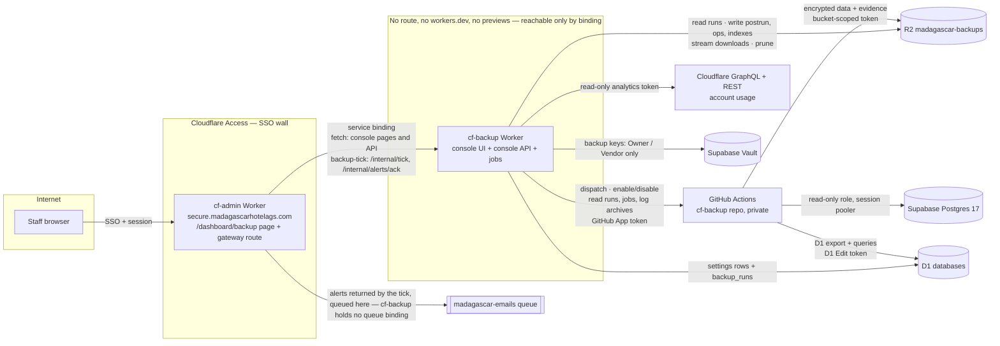

<!-- docs-check: proposed-paths -->
<!-- This is a plan: nothing in it is built yet. It names routes, files and folders that do not exist yet, in cf-admin and in the future cf-backup repo. -->

# 01 — Architecture

> **Revised 2026-09-22.** One private Worker instead of two; no public surface; the
> console is an embedded app served through cf-admin's gateway. The first draft's
> storage move and `cf-backend-edge` Worker are parked ([04](04-staff-storage-move.md)).

## 1. The picture



**The two-provider rule for backups** (doc 09): encrypted backups live at **Cloudflare**
(R2); the key that opens them lives at **Supabase** (Vault). The two meet only inside
cf-backup, a Worker with no public address, and only for an Owner or Vendor-support request
that came through cf-admin's gateway.

**"No possible way to directly access it" is literally true.** cf-backup has no route of
any kind. A browser reaches the console only as a page of `secure.madagascarhotelags.com`,
after Cloudflare Access, cf-admin's session and cf-admin's page permission have all
passed. Cloudflare documents this pattern: a Worker "not reachable via the public
Internet … only … via an explicit Service binding" (*confirmed*, service bindings docs).

## 2. What lives where

| Piece | Lives in | Notes |
|---|---|---|
| Console UI: status, readiness, history, run detail, logs, usage, keys | **cf-backup** (Preact single-page app, served from the Worker's static assets under `/dashboard/backup/app/`) | Runs on its own dev server; see doc 02 §9 |
| Console API (`/dashboard/backup/app/api/*`) | **cf-backup** | Same Worker, same origin as the UI |
| Identity, sessions, page permission (PLAC), `admin_audit_log` | **cf-admin**, unchanged | cf-backup has no login code |
| Gateway: `/dashboard/backup/app/*` → binding | **cf-admin**, one route | Knows nothing about backup features, so it never changes when they do |
| Backup pipeline | cf-backup repo, `.github/workflows/db-backup.yml` | Doc 03 |
| Scheduling | **As built (D-4):** cf-admin's existing `*/5` tick, one job `backup-tick`, calling cf-backup `POST /internal/tick` (schedule-slot dispatch, reconcile and chores, all budget-limited per tick). `db-backup.yml` keeps one weekly `schedule:` line only as the D-5 fallback | **No** Cloudflare cron triggers |
| Run evidence (logs, errors, sizes, usage) | R2 `madagascar-backups` | Doc 11. Nothing in D1 |
| Current status | `admin_portal_settings` key `backup:status` | One row |
| Who may do what; global settings | `admin_portal_settings` keys `backup:access` and `backup:config` | Doc 13 |
| What is running right now | R2 `v1/live/` heartbeats + the GitHub API | Doc 14; transient, not evidence |
| Staff Storage | **cf-admin, unchanged** | The move is parked; backing up its files is Phase 4 |

## 3. Why one Worker, and why it can hold a UI safely

- **The storage move was the reason for two Workers.** With storage parked, nothing public remains, so there is nothing to isolate from.
- **The console's code runs with admin-origin trust** (doc 02 §5). That is acceptable only because cf-backup has **no public surface**: nobody outside can reach its code paths, and it deploys from a private repo under the same discipline as cf-admin (`verify` in the build, owner-only write access).
- **A single-page app instead of Astro SSR** (default, reversible). The console is a handful of screens over a JSON API. A static Preact bundle served by `env.ASSETS.fetch()` keeps Worker CPU near zero, needs no inline scripts (so its CSP is simply `script-src 'self'`), and avoids running Astro under a base path inside another Astro app. Same component library and design tokens as cf-admin.

## 4. Bindings

**cf-backup `wrangler.toml`** (IDs come from the live resources; never invent them):

| Binding | Type | Purpose |
|---|---|---|
| `DB` | D1 `madagascar-db` | `admin_portal_settings` keys with the `backup:` prefix only (config, status, access, secrets calendar, key registry) plus the **`backup_runs`** table (D-1/C1, owned by cf-admin migration `0057`; cf-backup only reads and writes rows in it, never its schema) |
| `BACKUPS` | R2 `madagascar-backups` (new) | Read run folders; write `postrun/`, `ops/`, `indexes/`; stream encrypted downloads; prune |
| `ASSETS` | Static assets | The built console, fetched explicitly with `env.ASSETS.fetch()` (*confirmed* to work from a binding-only Worker) |
| `STAFF_STORAGE` | R2, **read-only**, Phase 4 only | Source for the staff-files mirror (added when that phase starts) |
| Secrets | — | **Two:** `GITHUB_APP_PRIVATE_KEY` (the one GitHub key) and `SUPABASE_KEYS_URL` (the key screens only). The other two keys live in GitHub. The full list, and how to set each: [12](12-keys-and-secrets.md). **Never** a backup private key at rest |

**As built (full build, 2026-09-23): no `EMAIL_QUEUE` binding in cf-backup (Ruling R-5).**
Under D-11, cf-backup never sends mail itself: `POST /internal/tick` returns `alerts[]`,
and cf-admin's `backup-tick` job puts each one on **cf-admin's own** `EMAIL_QUEUE` and acks
the ids that sent. **Two internal-only endpoints**, reachable solely by the `backup-tick`
system actor over the binding, never under `/dashboard/backup/app/`: `POST /internal/tick`
and `POST /internal/alerts/ack` (C3, C4).

There is no Analytics Engine binding: run history and usage series live in R2 ([11](11-run-evidence-and-usage.md) §6), which is their one home.

**cf-admin gains one binding** and nothing else:

```toml
[[services]]
binding = "BACKUP"
service = "cf-backup"
```

## 5. What changes in cf-admin

| Change | Size |
|---|---|
| `BACKUP` service binding | 3 lines in `wrangler.toml` (+ regenerated types) |
| `/dashboard/backup` page: `AdminLayout` + one full-height frame | one small `.astro` page |
| Gateway route `/dashboard/backup/app/[...path]` | one endpoint: strip client identity headers, add the actor, forward, audit (doc 02 §3) |
| Frame-header exception for that path only, with a guard test | `src/lib/security/csp.ts` + one test (OD-18) |
| Page row `/dashboard/backup` in `admin_pages`, **plus the new `backup_runs` table (D-1/C1)** | one migration — **as built: `migrations/0057_backup_runs.sql`**, cf-admin's own next free number |
| **One** job on the existing tick, **`backup-tick`** (D-4; supersedes the two-job `backup-reconcile`/`backup-meter` design of §5/§7) | job registry entry, tier `essential`, 0 D1 rows read/written in cf-admin on success (measured budget) |
| One read-only "Backups" row on `/dashboard/cron`, linking to the console | reads `backup:status` |
| Retire `.github/workflows/backups.yml` | Phase 1 exit |

Env count unchanged (42). **One** new table (`backup_runs`, the RULE #0.9 exception the owner
accepted 2026-09-23), no new KV namespaces or cron triggers.

## 6. Repository layout (cf-backup)

```text
cf-backup/
├── wrangler.toml                # one Worker; no routes; workers_dev = false; preview_urls = false
├── vite.config.ts               # Cloudflare Vite plugin; built assets under /dashboard/backup/app/assets/
├── src/
│   ├── worker.ts                # entry: fetch (console assets + API) and the internal endpoints
│   ├── api/                     # console API handlers + router; one capability per route (runs, usage, activity, …)
│   ├── internal/                # POST /internal/tick, POST /internal/alerts/ack — backup-tick system actor only
│   ├── tick/                    # tick budget, schedule-slot resolution, reconcile, chores (C3)
│   ├── db/                      # the backup_runs repository (C1): transitions, active-lane lock, queries
│   ├── ui/                      # Preact SPA: screens, components, design tokens (Midnight Slate)
│   ├── gateway/                 # actor header parsing, dev-only local actor
│   ├── access/                  # capability catalog, policy, floors, last-holder guard (doc 13)
│   ├── live/                    # live view: heartbeat reader, GitHub status, state machine (doc 14)
│   ├── backups/                 # run folder reader, postrun enrichment, download stream
│   ├── schedule/                # backup:config.schedule resolution and slot dispatch
│   ├── settings/                # admin_portal_settings CAS store + config/status/access/key-registry/secrets-calendar shapes
│   ├── config/                  # backup:config validation and bounds
│   ├── readiness/               # doctor.json reader, System map
│   ├── usage/                   # allowance catalog + account snapshot (doc 11 §5)
│   ├── keys/                    # age keygen, Vault calls (via lib/vault), weekly key check (doc 09)
│   ├── github/                  # the GitHub App client: JWT signing, installation tokens, dispatch (D-10)
│   ├── dev/                     # local-only dev simulation, wired only in `vite dev` on localhost
│   └── lib/                     # R2, D1, postgres.js (Vault), redaction, logger
├── scripts/backup/              # the pipeline's logic, run by the workflow (P-2), unit-tested
├── sql/supabase/                # C10: 01_backup_reader.sql, 02_backup_keys.sql, 03_backup_keyholder.sql (owner-run)
├── .github/workflows/
│   ├── db-backup.yml            # the backup pipeline (doc 03); workflow_dispatch + one weekly fallback schedule (D-5)
│   └── ci.yml                   # verify on push (holds no secrets, does not deploy)
├── test/                        # vitest + workers pool; public-surface test (no route exists)
└── RULES.md  main.md  README.md
```

**As built (full build, 2026-09-23):** there is **no `evidence/` directory and no queue
client in `lib/`** — evidence writing is the runner's job (`scripts/backup/lib/`, Track R),
and cf-backup never holds an `EMAIL_QUEUE` binding (Ruling R-5, D-11). The GitHub App
client moved out of `lib/` into its own `src/github/` (D-10).

Conventions to copy from cf-admin (they were paid for in incidents): the ratchet, the
`verify` chain, `[secrets] required`, generated `worker-configuration.d.ts` with a check,
and the rule that a doc is part of done. **Dependencies** (each needs owner approval under
the whitelist policy): `preact`, `lucide-preact`, `zod`, `tailwindcss` +
`@tailwindcss/vite`; dev-only `vite`, `@cloudflare/vite-plugin`, `wrangler`, `vitest`,
`@cloudflare/vitest-pool-workers`, `typescript`; plus `postgres` (postgres.js, pinned exact
`3.4.9`) for OD-24's Vault access — **the only dependency this build adds** to the Worker,
and the runner adds none at all (D-8). No Astro, no SSR framework.

**Approved 2026-09-23 for Phase 1a, exact versions:** preact 10.29.8; dev-only vite 8.3.0,
@cloudflare/vite-plugin 1.57.3, @preact/preset-vite 2.10.6, @babel/core 7.29.7, wrangler
4.136.3, typescript 5.9.3, vitest 4.1.9. The rest of the list is approved per phase, when
first needed.

## 7. Request flows

**Opening the console:** staff browser → cf-admin `/dashboard/backup` (Access, session,
page permission) → cf-admin renders `AdminLayout` with the frame → the frame loads
`/dashboard/backup/app/` → the gateway runs the same checks, removes any identity header
the browser sent, adds the actor, calls `env.BACKUP.fetch()` → cf-backup serves the app
shell from `ASSETS` → the app calls `/dashboard/backup/app/api/status` the same way.

**Run now:** the app POSTs `/dashboard/backup/app/api/runs` `{scope, confirm}` → gateway
(same-origin check, forward, audit) → cf-backup checks the `runs.run` capability floor
(Owner/Vendor by default), the cooldown, the per-person daily limit (default 6, doc 13) and
the typed confirmation → cf-backup inserts a `backup_runs` row (`requested`, D-1/C1) and
dispatches through the GitHub App with a correlation id and the actor → GitHub returns
`workflow_run_id` → the row advances to `dispatched` and cf-backup writes an `ops/events`
record → returns the run handle → the gateway writes `admin_audit_log` with cf-backup's
summary.

**A scheduled run:** cf-admin's `backup-tick` job calls `POST /internal/tick` every five
minutes; when a slot in `backup:config.schedule` is due, cf-backup inserts the
`backup_runs` row (`schedule_slot` unique) and dispatches the same way as Run now → GitHub
starts `db-backup.yml` → the runner itself writes the row's `running`/`sealing`/final
transitions (D-6) → the run folder lands in R2, manifest last (doc 03) → the **next tick**
(no longer once a day) adds `postrun/` (GitHub's log archive, job timings, billed minutes,
the account usage snapshot) if the row's manifest is not yet enriched, updates the indexes
and `backup:status`, and returns any alerts for cf-admin to queue (doc 11, D-11).

**Watching live:** the console polls `/dashboard/backup/app/api/live` through the gateway,
every 2 s while something runs. cf-backup answers from the runner's latest heartbeat in
R2, and asks GitHub only when there is no fresh heartbeat (doc 14 §4); `backup_runs` is the
source of truth for whether a lane is active (Ruling R-7), so this no longer depends on
asking GitHub before a dispatch.

**Every tick:** `POST /internal/tick` also runs cf-backup's chores inside its time and
subrequest budget (C3): reconcile/postrun, the daily record, the weekly key check, live
folder cleanup, prune chunks and the usage meter, each marked `ok`/`skipped`/`failed` in the
tick's result. The dead-man's switch (freshness) fires from the reconcile chore when the
last good run is too old.

## 8. Failure isolation

| Failure | Effect | Design response |
|---|---|---|
| cf-backup down or mid-deploy | The console frame shows "Backup console unavailable"; the rest of the portal is unaffected; backups keep running on GitHub | The gateway has a 10 s timeout and renders its own small error page inside the frame; no throw reaches page render |
| cf-admin down | Nobody can open the console; scheduled backups keep running and their evidence keeps landing in R2 | Reconcile is idempotent and write-once: when cf-admin is back, the next run ingests everything it missed |
| GitHub Actions outage or schedule drop | A backup is missed | Dead-man's switch in reconcile: alert when the last `ok` run is older than 8 days (full) or 36 h (daily) |
| Runner killed mid-run (timeout, crash) | No manifest; the runner's own log dies with it | `seal` runs `if: always()`; if even that cannot run, reconcile finds the finished GitHub run with no manifest and stores **GitHub's log archive** in `postrun/`, so the failure is still fully recorded (doc 11 §3) |
| Supabase or D1 unavailable during a run | That store's step fails; the other still completes | Independent steps in one job; the manifest records per-store outcomes |
