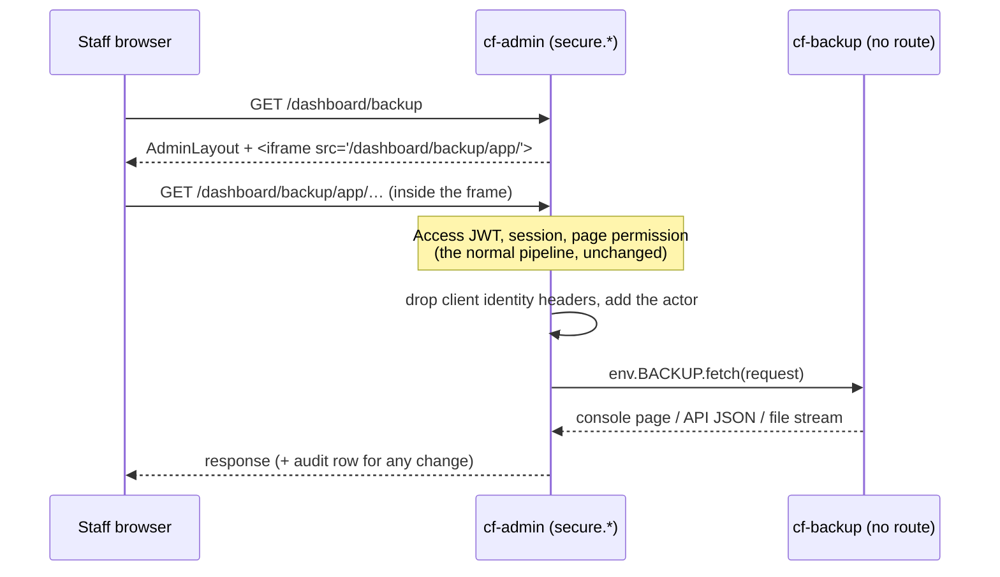

<!-- docs-check: proposed-paths -->
<!-- This is a plan: nothing in it is built yet. It names routes, files and folders that do not exist yet, in cf-admin and in the future cf-backup repo. -->

# 02 — How cf-admin embeds cf-backup, and why it cannot break

> **Revised 2026-09-22 (owner decision, OD-8/OD-18).** The first draft had cf-backup
> describe itself in a manifest and cf-admin render it with its own view primitives. It
> is replaced by an **embedded app**: cf-backup ships its whole console, and cf-admin
> shows it in a same-origin frame, forwarding every request over the private service
> binding. The requirement is unchanged: *changes in cf-backup show up in cf-admin
> automatically, and the integration never breaks.*

## 1. The model: cf-admin is the gateway, cf-backup is the app



Three ways to "load one app inside another" were considered; only the third is safe:

| Way | Verdict |
|---|---|
| **Remote script**: cf-admin loads cf-backup's JavaScript into its own page | **Rejected.** Code from another deploy would run with full admin powers, and cf-admin's `script-src` would have to widen |
| **Frame on its own address** (for example `backup.madagascarhotelags.com`) | **Rejected.** It gives the system that holds the GitHub key and the backups a public address, needs its own Access application, and needs a second copy of the login, role and permission code, which chunk 10 spent a whole chunk untangling |
| **Frame through cf-admin**: the frame's pages come from `/dashboard/backup/app/*` on cf-admin's own origin, and cf-admin forwards each request over the binding | **Chosen.** One login system, one permission system, no public address, and cf-backup still owns every screen |

## 2. Paths

| Path | Served by | What it is |
|---|---|---|
| `/dashboard/backup` | cf-admin | The page: `AdminLayout` (sidebar, header, theme) and one frame filling the content area |
| `/dashboard/backup/app/` and below | cf-backup, through the gateway | The console app shell, its built files and every screen |
| `/dashboard/backup/app/api/*` | cf-backup, through the gateway | The console API (JSON, file streams) |
| anything else | never forwarded | cf-backup's jobs are reached only by cf-admin's tick, directly through the binding (§8), never through the gateway |

The Vite build sets `build.assetsDir: 'dashboard/backup/app/assets'`, so built files sit
under the base path and the Worker hands requests to ASSETS unchanged. The **dev server**
serves Vite's own modules (`/@vite/client`, `/src/…`) at the root, which the router passes
through **in dev only**.

## 3. The gateway route (cf-admin)

One endpoint, `src/pages/dashboard/backup/app/[...path].ts`, that does exactly this and
nothing feature-specific:

1. **Runs behind the normal pipeline.** Access, session and role refresh are the middleware's job, as for every page. Page permission resolves through the nearest ancestor key, `/dashboard/backup` (*measured*: `src/lib/auth/decide-access.ts:41`), so the one page row gates every forwarded request.
2. **Forwards only an allow-list of request headers**: `Accept`, `Accept-Language`, `Content-Type`, `Content-Length`, `Range`, `If-None-Match`. It **drops** `Cookie`, `Authorization`, `Cf-Access-Jwt-Assertion` and every `X-Backup-*` header the browser sent. cf-backup never sees cf-admin's session cookie or the Access token.
3. **Adds the actor** as `X-Backup-Actor` (base64url JSON, §4) and `X-Backup-Request-Id`.
4. **Requires same-origin for any non-GET.** It uses the same check the rest of cf-admin applies (`validateCsrf`, re-applied in the gateway so this rule is provable by the gateway's own test alone).
5. **Calls `env.BACKUP.fetch()` with a 10 s timeout** for API calls, and **streams** file downloads without buffering them. If the call fails, it answers with its own small "Backup console unavailable" page, or a JSON error for `/api/*`.
6. **Passes the response through**, including cf-backup's own security headers (§5). It removes any `Set-Cookie`, since cf-backup has no reason to set one.
7. **Audits** every non-GET into `admin_audit_log` through the existing `buildAuditDetails` chokepoint: actor, method, path (no query string), status, request id, and the one-line summary cf-backup returns in `X-Backup-Audit`. `action` must be one of `run.dispatch run.cancel run.bypass-cooldown run.drill run.annotate run.download runs.prune schedule.edit config.edit access.edit keys.rotate keys.reveal activity.export secrets-calendar.edit` (C5); an unknown or missing action is recorded as `backup_run` with the summary "unrecognised action" and a Sentry warning. The request body is never logged.

> **As built (full build, 2026-09-23).** Every change leaves **two** audit rows: this
> gateway's `admin_audit_log` row (the summary above) plus the auth pipeline's own
> `page_mutation_attempt` row it already writes for any portal mutation. The gateway row's
> `delivered` field says what is actually known: `false` ("not delivered") only when the
> request certainly never left cf-admin — the `BACKUP` binding was unbound, the body was
> over the size cap, the path failed the confinement check below, or the browser
> disconnected before the body could be read. Every other failure (a timeout, or an answer
> cf-admin could not use) is recorded as **`'unknown'`** ("outcome unknown"), because
> cf-backup may have received and acted on the request anyway. A delivered change records
> `true`.
>
> **Path confinement (`bad_path`, both sides).** The gateway rejects, before forwarding, any
> forwarded path containing `//`, a backslash, or an encoded slash/dot-segment
> (`%2f`, `%5c`, `%2e`, any case) that is not exactly under `/dashboard/backup/app/`, and
> logs a `bad_path` line to observability (no Sentry). cf-backup's own router applies the
> same `hasUnsafePathSegment` confinement independently, and refuses anything outside
> `/dashboard/backup/app/` or `/internal/*` with 404. **Known limitation:** neither check can
> see a *pure* encoded dot-segment once the URL parser has already collapsed it — this is
> safe only because routing beyond that point is exact-segment and capability-checked; any
> future file-serving path must not trust the path string on its own.

## 4. Identity: the binding is the trust

cf-backup trusts `X-Backup-Actor` **only because nothing but cf-admin can reach it**: it
has no route, `workers_dev = false`, `preview_urls = false`, and only a Worker the account
owner configured with a binding can call it. This is the opposite of the cf-chatbot pattern
(a shared literal header over the public internet), which must never be copied.

```json
{
  "v": 1,
  "kind": "user",
  "userId": "…",
  "email": "…",
  "role": "owner",
  "signedInAt": "2026-10-04T09:02:11Z",
  "requestId": "…"
}
```

- `kind` is `user` for the gateway and `system` for cf-admin's jobs (§8).
- `role` is the canonical role after `normalizeRole()`.
- `signedInAt` **is the Cloudflare Access assertion's `iat`** (as built, doc 09 §7), recorded when cf-admin's session is created. It is deliberately not the session's own creation time: cf-admin can re-create a session from an assertion that is hours old without a fresh sign-in, so `createdAt` would let a stolen Access cookie look fresh. A missing `iat` reads as `0` (never fresh); sessions created before this field existed fall back to their `createdAt` until they expire (24 h). It backs the "fresh sign-in" (≤ 10 min) rule for key actions. **Known limitation:** Access JWTs carry no `auth_time`, and cf-admin can reissue its own app token from the org session without new credentials — so "fresh sign-in" in practice means "Access issued the app token within the last 10 minutes", not "the person just typed a password". The reauth message says to sign out (which also ends the Access session) and back in, so the next sign-in is a real one.
- `v` is the header's schema version. cf-backup answers a major it does not know with a clear "cf-admin and cf-backup versions do not match" page, never a guess.

Proven by tests on both sides: cf-backup's public-surface test asserts the deployed
configuration has no route, no `workers.dev` and no previews. cf-admin's gateway test
asserts a browser-supplied `X-Backup-Actor` never reaches the binding.

> **Decided 2026-09-23 (Phase 1a build review):**
>
> 1. **The field is dropped.** cf-backup never needs cf-admin's session; `requestId` covers correlation, and per-person limits (doc 13 §2 — cooldowns, reveal/rotate rate limits) key on the email, not a session id.
> 2. **Actor errors are 400 `bad_actor`** (missing, too large, malformed or invalid) **and 409 `actor_version_mismatch`** (an unsupported major). **cf-backup never returns 401.** 401 means only "signed out", and it comes from cf-admin, never from cf-backup.
> 3. **503 `not_configured`** answers any action or endpoint whose backend is not bound yet, with a reason naming what is missing (for example "BACKUPS bucket binding not configured"). It is sent only after the 403 capability check, so a person lacking the capability still gets 403 first.
> 4. **`GET /api/health` returns `capabilities: string[]`**, the actor's effective capabilities, computed server-side from the same policy doc 13 describes. The console gates every tab and button on that list, never on a client-side guess.

## 5. Security headers: one narrow exception

cf-admin sends `X-Frame-Options: DENY` and `frame-ancestors 'none'` on every response
(*measured*: `src/lib/security/csp.ts:73` and `:120`). Its CSP already allows a
same-origin frame (`frame-src 'self'`, `csp.ts:119`).

- **The exception (OD-18):** responses under `/dashboard/backup/app/` carry `X-Frame-Options: SAMEORIGIN` and `frame-ancestors 'self'`. Nothing else changes. A cf-admin guard test fails if any other path stops sending `DENY` / `'none'`.
- **cf-backup's own policy** travels on its responses and the gateway keeps it: `default-src 'self'; script-src 'self'; style-src 'self' 'unsafe-inline'; img-src 'self' data:; connect-src 'self'; object-src 'none'; base-uri 'none'; form-action 'self'; frame-ancestors 'self'`. The console is a built single-page app with no inline scripts, so it needs no nonce. (`style-src 'unsafe-inline'` matches cf-admin's and is needed by the dialog pattern in RULESAd §7.8.)
- **Downloads** of encrypted runs go out with `Content-Disposition: attachment` and `X-Content-Type-Options: nosniff`.
- **What same-origin means.** The frame's code can read the parent page, because they share an origin. cf-backup's browser code is therefore trusted exactly like cf-admin's, which is acceptable only because cf-backup has no public surface and a small, owner-approved dependency list (doc 05, T18). A `sandbox` attribute without `allow-same-origin` was considered and rejected: the frame would lose cf-admin's `SameSite=Strict` session cookie, so every call would need a separate token scheme.

## 6. Permissions: cf-admin opens the door, cf-backup decides the action

| Layer | Rule |
|---|---|
| The door (cf-admin) | `/dashboard/backup` has one `admin_pages` row, seeded for **Admin and above**. Below that, the gateway denies before cf-backup is called |
| The actions (cf-backup) | A closed catalog of 23 capabilities (view, run, cancel, bypass the cooldown, edit config, prune, export activity, see and rotate keys, manage access…), role defaults plus per-person grants, managed by Owner/Vendor on the console's Access screen. Every endpoint enforces its capability against `actor.role` and `actor.email`. **Full design: [13-access-control.md](13-access-control.md)** |
| Floors | Key actions, encrypted downloads and access management stay **Owner and Vendor support only**, with a fresh sign-in (≤ 10 min, from `signedInAt`) and typed confirmation (doc 09 K-3) |

Cooldowns and rate limits (Run now 6 h by default, rotate 1/day, reveal 3/day per person)
are enforced in cf-backup, with their timestamps in `backup:status`.

## 7. The frame, as a user sees it

- **Size.** The frame fills the content area at full height and scrolls internally, so it reads as part of the page.
- **Live.** The console refreshes itself while anything runs (every 2 s, [14](14-live-operations-view.md)); every refresh is an ordinary gateway request, authenticated like any other.
- **Theme.** Same-origin, so the app reads the parent's theme attribute on load and watches it for changes. No message protocol needed.
- **Dialogs** follow RULESAd §7.8 (`showModal()`), but they cover the frame, not the sidebar. This is an accepted cosmetic limit.
- **Session expiry.** The frame never navigates to a login page. A sign-in flow inside a frame is fragile, and whether Access allows its login page to be framed is not something to depend on. Every API call uses `redirect: 'manual'`. An opaque redirect or a 401 makes the app show "Your session has ended" with a **Reload the page** button; clicking it reloads the top page (`window.top`), and the full page then goes through sign-in normally. A 409 `actor_version_mismatch` instead shows "cf-admin and cf-backup versions do not match" (§4). Anything else not ok shows failed, with the envelope's own message. The reload is user-initiated, not automatic, because an automatic reload would loop if the session stayed expired (decided 2026-09-23, §4).
- **Deep links** (optional, later): the app mirrors its route into the parent URL's hash, so `/dashboard/backup#/runs/<runKey>` opens that run.

## 8. Jobs: cf-admin's tick drives, cf-backup does the work

> **As built (full build, 2026-09-23, D-4).** The Vite-plugin question below is answered:
> **internal paths outside the gateway prefix**, never RPC. There is **one** job, not two —
> it supersedes the `backup-reconcile` (daily) / `backup-meter` (hourly) design this section
> first proposed.

| Job (cf-admin job registry) | Cadence | Calls | Notes |
|---|---|---|---|
| `backup-tick` | every 5 minutes, tier `essential` | `POST /internal/tick` | Computes due schedule slots from `backup:config.schedule` and dispatches them; runs reconcile/postrun, the daily record, the weekly key check, live-folder cleanup, prune chunks and the usage meter as budget-limited chores (C3); returns `alerts[]` for cf-admin to queue and ack (D-11) |

- **Reached only over the binding**, as internal paths (`/internal/tick`, `/internal/alerts/ack`) that the gateway never forwards — `/dashboard/backup/app/*` is a disjoint prefix. `/internal/*` accepts only `actor.kind === 'system'` with `job === 'backup-tick'`; anything else is 403, and a user actor is refused here just as a system actor is refused on the console API (C3).
- **The call:** `env.BACKUP.fetch('https://cf-backup/internal/tick', { method: 'POST' })` with headers `x-backup-actor` (the system actor JSON) and `x-backup-request-id`, a 25 s timeout, and a body `{ tickAt: ISO }`.
- **The tick has its own budget**, independent of cf-admin's job budget: it stops starting new chores after 20 s of wall time or 30 external subrequests (the Free limit is 50 per invocation).
- **The meter rule (factor C2)** still applies to the job itself: `backup-tick` costs cf-admin **0 D1 rows** on success (its own real-path test asserts zero queries), because every D1 read and write it triggers happens inside cf-backup, not in cf-admin.
- **If `BACKUP` is unbound**, the job logs `skipped: binding missing` and returns; it never throws.
- **Alerts:** the job enqueues each of the tick's `alerts[]` on cf-admin's own `EMAIL_QUEUE` (`purpose: 'custom_email'`, `projectSource: 'cf-admin'`), then calls `POST /internal/alerts/ack {ids}` with the ids that sent. An alert not acked is offered again next tick; the email consumer dedupes repeats, so a warning goes out at least once, not twice.
- **The cron page** shows one read-only **Backups** row: the schedule, last run, last `ok` and verdict, read from `backup:status`, plus a link to the console. The first draft's `external` job kind is dropped. Scheduling controls live in the console, where the schedule's owner lives.

## 9. Local development

| Mode | How | For |
|---|---|---|
| **Standalone** | `npm run dev` in cf-backup. The dev server injects a **local-only Owner actor**, and only when the site URL is `localhost`, the same fail-secure test as cf-admin's `isLocalDev()`. R2 and D1 are local simulations seeded with fixture run folders; GitHub calls go to a stub unless dev credentials are present | Building and testing every screen without cf-admin |
| **Integrated** | Because the gateway forwards only `/dashboard/backup/app/*` (§2), and the dev server's own modules live outside that path, integrated testing through cf-admin uses a **built** cf-backup (`vite build` then `wrangler dev`), not the hot-reload dev server. cf-admin's `BACKUP` binding resolves to the running cf-backup, because separate dev commands can call each other through service bindings (*confirmed*, Cloudflare multi-Worker development docs). Seeing it work under cf-admin's Astro dev server is **to verify in Phase 2a** | Testing the gateway, the frame and permissions end to end |
| **Tests** | cf-admin binds `BACKUP` to a tiny fixture Worker in its test pool. cf-backup's tests exercise its API with fixture actors | Both repos' `verify` |

## 10. "Never break it": the rules and the machinery

| # | Rule | Enforced by |
|---|---|---|
| 1 | **The gateway is dumb.** It knows a path prefix, a header list and the audit call, and nothing about backups, so backup features never require a cf-admin change | Code review + the gateway's own tests |
| 2 | **The actor header is versioned** (`v`). cf-backup accepts its known majors; a new field is additive | Contract test in cf-backup over fixture headers |
| 3 | **Unavailable is visible, not fatal.** A dead or slow cf-backup gives an error page inside the frame; the portal keeps working | Gateway timeout test |
| 4 | **Deploy order.** cf-backup first (the binding target must exist), cf-admin second; rollback in reverse. **As built:** confirmed as owner instructions, not just a plan — a cf-admin deploy that binds a Worker which does not exist fails outright | Runbook (doc 06); operator steps in `documentation/features/BACKUP-CONSOLE.md` §9 |
| 5 | **The deploy runs the gate.** Workers Builds for cf-backup runs `npm run verify` before `wrangler deploy` | Configured in Phase 0 (OD-10) |
| 6 | **No public surface, ever.** A test fails the build if `wrangler.toml` gains a route, a custom domain, `workers_dev` or preview URLs | cf-backup `test/public-surface.test.ts` |
| 7 | **The header exception cannot widen.** | cf-admin guard test (§5) |
| 8 | **Post-deploy smoke.** After a cf-backup deploy the owner opens `/dashboard/backup` once (no browser automation) | Runbook |

What this does **not** promise: that a job which "succeeds" really did its work. That is
what the backup verification rules (doc 03 §5) and the evidence bundle (doc 11) exist for.
