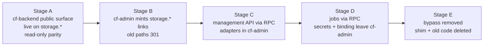

# 04 — Moving Staff Managed Storage to cf-backend

> **Parked 2026-09-22 (owner decision). Not part of cf-backup.** The plan was re-scoped
> to backups only (README). This document is kept unchanged below as the analysis of
> 2026-09-21, in case the move is ever revived as its own project. It describes a
> `cf-backend` with a second, public Worker that is **not** being built.
>
> Why parking costs little: the move was an improvement, not a fix. Its main security
> gain already exists, since cf-admin serves storage downloads with
> `Content-Disposition: attachment` and `X-Content-Type-Options: nosniff` (factor D3).
> Everything else (the Access bypass on `secure.*`, cf-admin's size, vendor links tied to
> cf-admin's uptime) stays exactly as it is today. Backing up the storage *files* stays in
> scope, as cf-backup Phase 4.1, and needs no move.

## 1. Why move it, and why it is safe now

- It is the largest self-contained domain in cf-admin (*measured*: ~57 files, ~14.6k lines, about 13% of `src/`). It owns the only deliberately public API surface in the portal and holds the most sensitive files (payroll, medical records).
- Today its public routes (`/api/storage/share/*`, `/api/storage/request/*`) live on `secure.madagascarhotelags.com` behind a **Cloudflare Access bypass**. Moving them to their own Worker and hostname means `secure.*` can drop that bypass and become fully SSO-walled again (the `/api/emails/unsubscribe` bypass remains; see §6).
- The previous separate hostname (`share.madagascarhotelags.com`) was retired on 2026-08-06 because two hostnames on **one** Worker caused route contention and dashboard URL flipping. A different Worker owning its own custom domain does not have that problem.

## 2. Target split

| Piece | Goes to | Notes |
|---|---|---|
| `src/lib/storage/**` (tokens, quota, keys, presign, reconcile) | cf-backend `src/storage/` | Rewritten file by file with tests moved alongside (not copy-paste debt; keep the behaviour, drop dead paths) |
| Storage DAL repos (2) | cf-backend | Queries against the **same** `madagascar-db` tables (OD-9) |
| Public share/request handlers + their HTML | cf-backend `src/public/` on `storage.*` | Same token format, so existing tokens remain valid |
| `scheduled-storage-notifications`, storage reconcile | cf-backend RPC methods | Still *scheduled* by cf-admin's `*/5` tick (lease-gated), so cf-backend uses no cron triggers |
| Management API (upload, rename, move, trash, restore, share create/revoke, file requests, quotas, reporting) | cf-backend `BackendRPC.storage.*` | Typed domain API (doc 02 §3) |
| UI islands (FileGrid, FileTable, modals, Trash, Storage profiles) | **stay in cf-admin** | Only their data calls change |
| cf-admin `api/storage/**` routes (24) | shrink to **thin adapters**, then collapse | Each becomes: guard → `env.BACKEND.storage.x(actor, input)` → envelope → JSON |
| Secrets `R2_ACCESS_KEY_ID`, `R2_SECRET_ACCESS_KEY`, share signing key(s) | cf-backend | cf-admin's env count drops (RULE #0.8) |
| `STAFF_STORAGE` R2 binding | cf-backend | cf-admin loses direct bucket access entirely |

**Table ownership rule after cutover:** `storage_*` tables are written only by cf-backend.
A `rules_check.py` rule in cf-admin fails on any SQL naming a `storage_` table under
`src/`. That turns "two Workers writing one table" from a hazard into a checked
invariant.

## 3. Link continuity: no live link may break

Share links and file-request links already sent to vendors point at
`secure.madagascarhotelags.com/api/storage/share/<token>` (and `/request/<token>`).

1. cf-backend serves the new canonical form, `https://storage.madagascarhotelags.com/s/<token>` and `/r/<token>`, accepting **the same tokens** (the same signing key moves with the code).
2. From cutover, cf-admin **mints** only `storage.*` links.
3. cf-admin keeps a **301 shim** for the old paths (token preserved, no other logic), still reachable through the existing Access bypass, until the last old link has expired. The longest share expiry is the bound; file-request links carry their own expiry.
4. When `storage_share_access_logs` shows no old-host hits for 30 days *and* every old token has expired, the owner removes the bypass policy and the shim is deleted. This is a documented Phase 4 exit criterion.

## 4. Cutover stages (each independently reversible)

| Stage | Done when | Rollback |
|---|---|---|
| A | Every public path returns byte-identical responses on both hosts for a fixture set of tokens (parity test), and the attempt-status logging is identical | Delete the custom domain; nothing depends on it yet |
| B | New links resolve on `storage.*`; old links 301 and still download | Flip minting back (one config key in `admin_portal_settings`) |
| C | All 24 cf-admin routes are adapters; UI behaviour unchanged (owner browser check) | Adapters can call the old in-repo implementation behind the same config key until Stage D |
| D | cf-admin no longer binds `STAFF_STORAGE` or holds the R2 S3 keys; notifications and reconcile run via RPC with their D1 budgets re-measured on the *configured* path (the CF-ADMIN-1Q/1S lesson) | Re-add the binding and secrets (kept documented, not deleted, until E) |
| E | Old-host traffic is zero for 30 days; bypass policy deleted; shim deleted; ratchet A15 in cf-admin falls by roughly the moved lines | — (terminal) |

## 5. Things that must not regress

- **Upload size path:** large uploads stay browser → R2 via presigned URL (the Worker never proxies the body). The presign call moves behind RPC; the browser still PUTs to R2 directly. CORS on the bucket is updated to allow the `secure.*` origin.
- **Consent and passcode gates, attempt statuses** (`SUCCESS`, `INVALID_PASSCODE`, `MISSING_CONSENT`, `EXPIRED_LINK`, `REVOKED_LINK`, `DISALLOWED_EXTENSION`, `FILE_TOO_LARGE`) and the hashed-IP access log.
- **Mass revocation lever:** nulling `share_token_hash` revokes immediately; this keeps working because the table stays.
- **Budgets:** migration `0053`'s partial indexes stay; the jobs' D1 budgets move with the jobs.
- **CSP:** `storage.*` gets its own strict CSP (no scripts beyond its own; `frame-ancestors 'none'`).
- **Link scanners must not act** (factor D2). Outlook Safe Links and similar tools fetch every URL in an email. The link GET only renders a landing page; the download is a POST after the passcode/consent step, so a scanner never uses up a download cap, records consent, or trips a rate limit.
- **Uploaded files never execute** (factor D3). Files go out with `Content-Disposition: attachment`, `X-Content-Type-Options: nosniff` and `Content-Security-Policy: sandbox`. The move itself is a security gain: today these files come from the admin origin, where an HTML or SVG opened inline could run script next to the admin session.
- **Tokens do not leak** (factor D4). Logs carry only a token hash prefix; `Referrer-Policy: no-referrer`; `X-Robots-Tag: noindex, nofollow`.
- **The account-wide request quota is protected** (factor A5). A WAF rate-limiting rule on `storage.*` blocks floods before the Worker runs, so a leaked or scraped link cannot use up the 100k/day shared with the public booking site. Per-token download caps and per-IP `[[ratelimits]]` sit behind it.
- **Audit coverage survives** (factor C8). Successful downloads write `admin_audit_log` today. The edge Worker keeps doing so through a ported row builder with the same redaction and a SEC-12-style coverage test.
- **Migrations stay in cf-admin** (OD-11). Any schema change to `storage_*` tables is still authored in cf-admin `migrations/`; cf-backend never applies migrations.

## 6. Out of scope, noted

`/api/emails/unsubscribe` and `/api/emails/webhook` also sit on `secure.*`. The
unsubscribe route has an Access bypass; the Brevo webhook has **none** (Brevo cannot
reach it, per the 2026-09-19 runbook log). Moving both to a public surface would be the
next natural step, but it is email-domain work and is left for a later decision.
