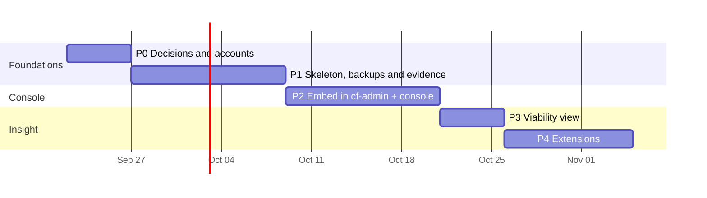

<!-- docs-check: proposed-paths -->
<!-- This is a plan: nothing in it is built yet. It names routes, files and folders that do not exist yet, in cf-admin and in the future cf-backup repo. -->

# 06 — Roadmap

> **Revised 2026-09-22.** The storage phases (old P3 and P4) are removed with the storage
> move, which is parked (doc 04). Phase 2 becomes "embed the console"; run evidence and
> usage are built into Phases 1 and 2 from the start, not added later.
>
> **As built (full build, 2026-09-23):** the code for P1 (skeleton, the pipeline, evidence)
> and almost all of P2 (the embedded console, reconcile via the tick, usage, keys, access,
> activity and config) was written in one cycle, across two worktrees
> (`cf-backup-build` for cf-backup, `cf-admin/.claude/worktrees/cf-backup-console` for the
> cf-admin half), against `docs/specs/2026-09-23-full-build-design.md` and its rulings —
> not strictly in the P0→P1→P2 order below. **Nothing in this roadmap's "Exit" or "Owner"
> columns has been done for real yet**: no repo, bucket, key, GitHub App or secret exists in
> production, nothing is deployed, and no live verification has run. This roadmap still
> states the *order the owner does the account and verification steps in* — P0 first, then
> the P1/P2 exits — even though the code that those steps light up already exists. Track the
> owner's actual sequence in `docs/OWNER-SETUP.md` (cf-backup-build) once it is written; until
> then, the P0 table below and doc 06 §"Definition of done" are the checklist.

**Ordering principle: value and safety first.** Today there is **no working backup at
all**, so the bridge comes first and real backups to R2 come before any console. Each phase
ships on its own, has an exit criterion measured against live infrastructure, and can be
rolled back without touching the next.

Dates are placeholders for sequencing, not commitments.

## P0 — Decisions and accounts (owner-heavy, no code)

| # | Task | Who |
|---|---|---|
| 0.0 | **Bridge, do first:** unblock the existing cf-admin `backups.yml` (rebuilt as one job 2026-09-22, doc 08 §8a) by adding its four secrets and dispatching one run ([08](08-existing-backup-workflow.md) §7). This gives the business its first real backup this week instead of after P1 | Owner (~15 min) + AI records results |
| 0.1 | Review README decisions OD-1…OD-27; accept or reverse each | Owner |
| 0.2 | Create private GitHub repo `mascotasmadagascar-cmd/cf-backup`; confirm 2FA on the account | Owner |
| 0.3 | Create R2 bucket `madagascar-backups`; add lock rules `v1/runs/full/` → 90 days, `v1/runs/daily/` → 30 days, `v1/ops/` → 90 days. Then prove all three behaviours: a delete is refused, an overwrite is refused, and **a new key under a locked prefix is accepted** (spike S-9) | Owner (dashboard) + AI |
| 0.4 | Create **key 1**, the one Cloudflare token (doc 12 §4; spikes S-11/S-12), store it with `gh secret set`, and set the `CLOUDFLARE_ACCOUNT_ID` variable | Owner |
| 0.5 | **First backup key** (doc 09 §7): apply the Supabase migration for the three `backup_key_*` functions and the key-holder role (OD-24), then run the planned `scripts/backup-key-init` once. It generates the key, stores the private half in Vault, sets `BACKUP_AGE_RECIPIENT`, and shows the recovery kit once. Owner and Vendor each save the kit | Owner + Vendor |
| 0.5′ | Create the **one GitHub App** (key 3, doc 12 §6) and install it on cf-backup, cf-admin and cf-astro. Its private key becomes a Worker secret in P1a, once the Worker exists | Owner |
| 0.6 | Create **key 2**: the `backup_reader` role (spike S-3), **proven unable to read Vault**, then the session-pooler URL secret (doc 12 §5) | Owner + AI |
| 0.7 | Verify the GitHub Free limits assumed in doc 05 §3 against current GitHub docs | AI |
| 0.8 | Measure: current account cron count; the real R2 usage baseline from the dashboard (doc 10 §5 check 6) | AI + owner |
| 0.9 | Supabase: confirm project slots for a restore (spike S-7); run the integer-precision audit on the three D1 databases (spike S-6) | AI |
| 0.10 | Set cf-backup repo Actions log and artifact retention to 14 days (factor D5) | Owner |
| 0.11 | **Free-tier checks** ([10](10-free-tier-feasibility.md) §5) | Owner + AI |
| 0.12 | Approve cf-backup's dependency list (doc 01 §6), including the Postgres driver OD-24 needs | Owner |

**Exit:** every OD answered; all secrets exist (verified by names, never values); lock
behaviour proven; measurements recorded in this folder.

## P1 — cf-backup skeleton + backups to R2, with full evidence (highest value)

| Stage | Tasks | Exit |
|---|---|---|
| 1a Skeleton **(code written 2026-09-23)** | Repo scaffold (layout in doc 01 §6); `verify` chain (typecheck, tests with the workers pool, ratchet, audit gate); **one** Worker with no route, `workers_dev = false`, `preview_urls = false`; the console shell served from `ASSETS` under `/dashboard/backup/app/`; standalone dev with the local-only Owner actor; `test/public-surface.test.ts`; Workers Builds project with **build command = `npm run verify`** (OD-10). Check what a cf-admin deploy does when a binding's target does not exist yet (factor C4) and the job-entry shape (spike S-10) | Deployed; reachable from a scratch binding and from nowhere else; the public-surface test green |
| 1b Spikes | S-2/S-8 (token permissions), S-3 (`backup_reader`), S-4 (sizes, seeded from the bridge run, P-22). S-6, S-7 and S-9 are answered in Phase 0 | Each answered with evidence in doc 03 §9 |
| 1b′ Scripts first (P-2) **(code written 2026-09-23)** | Port chunk 6's `parseExportTables` / `compareCounts` / `drillSummary` with their tests. Then add, each with tests: the manifest builder, the verdict rules, the report renderer (P-9), `doctor` (P-14/P-15), **the step logger and meter, the redactor (with canary secrets in every form), the sizes and usage writers** (doc 11), and **the live heartbeat writer** (doc 14 §5). Write the YAML guard tests (P-20) and the cross-workflow secret-reference guard (P-16) before the workflow | Scripts and guards green in `verify` before any YAML exists |
| 1c Pipeline **(code written 2026-09-23, not yet run for real)** | `db-backup.yml`, one job: `wrangler d1 export` for two databases plus the **query-based exporter for `chatbot-kb`** (factor A1); **`supabase db dump`** roles/schema/data + migration history (factor B1); drills in **`node:sqlite`** and **`supabase/postgres:17.6.1.104`** (factor B2, as built); `age` encryption with a recipient check (factor B9); the **full run folder** (doc 03 §4.3), including `logs/`, `usage/` and `env/`; GitHub artifact copy (OD-12); manifest last; `workflow_dispatch` plus the one weekly fallback schedule (D-4/D-5, as built) | Two consecutive scheduled `ok` runs (one full, one supabase); manifests validate; every file in `files[]` present; `redaction: passed` on every log; `chatbot-kb` restores with a working `kb_search`; heartbeats land in `v1/live/` every ~5 s during each run |
| 1d Restore proof | Owner decrypts and restores one full run offline and records it; the first **monthly real-path drill** (temporary D1, OD-15) runs and records its RTO; `npm run backup:local` (P-19) is exercised once from the owner's machine and produces the same folder shape | Rehearsal record written; real-path RTO measured; break-glass proven |
| 1e Retire the old | Delete cf-admin's `backups.yml` | cf-admin CI green |

**Rollback:** disable the workflow (one click). Nothing in production depends on it yet.

## P2 — Embed in cf-admin + the console

| Stage | Tasks | Exit |
|---|---|---|
| 2a cf-admin integration **(built and merged 2026-09-23, chunk CB-2)** | `BACKUP` binding; `/dashboard/backup` page with the frame; the gateway route (doc 02 §3); the frame-header exception with its guard test (OD-18); migration `0057` seeding the `/dashboard/backup` page row **and the new `backup_runs` table**; gateway tests: header stripping, timeout page, audit row | The owner opens the console from cf-admin; a browser-supplied `X-Backup-Actor` never reaches cf-backup (test); every other path still sends `DENY` (test) — code and tests green; **owner deploy/release/browser check still pending** |
| 2b Console v1 **(code written 2026-09-23, not yet run for real)** | In cf-backup: the **live operations view** (doc 14: the "Now" bar, the live panel and log, the duplicate-run guard, now driven by `backup_runs` per Ruling R-7); status, readiness panel (OD-14) with the System map; history, run detail (files, drill, steps, log viewer); Run now, Cancel, Drill, Prune, Enable/Disable. **The capability catalog is enforced from the first endpoint** (doc 13), now with per-person grants/denies, not just role defaults | The owner watches a manual backup live from Queued to finished; a second Run now is refused while it runs; deliberately deleting a test secret turns its readiness row red (proven, then restored) |
| 2c Reconcile and evidence **(code written 2026-09-23, superseded by D-4/D-11)** | Folded into `/internal/tick`'s budget-limited chores (no separate `backup-reconcile` job): `postrun/` enrichment (GitHub run, jobs, **log archive**); `ops/days` and `ops/events`; indexes; `backup:status`; the dead-man's switch (now reading `backup_runs`); alerts returned to cf-admin's `backup-tick` job, which queues them on its **own** `EMAIL_QUEUE` (no `cf-email-consumer` change needed — `projectSource` stays `cf-admin`, factor C7 moot) | A forced stale status produces exactly one alert email; a run killed mid-way still ends with GitHub's archive in `postrun/` |
| 2d Usage **(code written 2026-09-23, not yet run for real)** | The allowance catalog with sources; the runner's account snapshot (OD-21); the minutes meter folded into the tick's chores (no separate `backup-meter` job); the Usage screen; the resource receipt on run detail | Every tracked allowance shows a figure or an explicit `unavailable` with its reason (doc 11 §5.4) |
| 2e Keys **(code written 2026-09-23, not yet run for real)** | Doc 09's screens (status, rotate, reveal, confirm kit) and the weekly key check, using the OD-24 credential (**as built:** postgres.js over the Supavisor pooler) | Rotate → the next run encrypts to the new key → the key check is green |
| 2f Cron page **(built, CB-2)** | One read-only **Backups** row on `/dashboard/cron`, linking to the console | Owner browser check — pending |
| 2g Access, activity, config **(code written 2026-09-23, not yet run for real)** | The Access screen (per-person grants with expiry, history, reset), the activity timeline and export, the global config screen (doc 13), **plus the per-person daily Run-now limit (default 6) and the `PRUNE` typed confirmation (Rulings R-4, R-6)** | A time-boxed grant stops working at its expiry; the last-holder guard refuses a lockout; an activity export downloads and is itself audited |

**Rollback:** remove the page row (the page disappears for everyone). The binding and the
gateway are inert without it, and backups keep running on GitHub.

## P3 — Viability view

Trends and forecasts from `indexes/` (doc 11 §6): each allowance's growth, and the date
it would reach 80% at the last 30-day and 90-day rate; the tripwires of doc 10 §6 as
computed warnings.

**Exit:** every tracked allowance shows a trend and a projected 80% date, or says why it
cannot. **Rollback:** hide the screen; nothing else depends on it.

## P4 — Extensions (each optional, each its own decision)

| # | Item | Value |
|---|---|---|
| 4.1 | R2 mirror of `madagascar-staff-storage` (and `arco-documents`) into `madagascar-backups/v1/mirror/` | Closes MAINTENANCE S-2: payroll and medical files have no copy today. Needs no storage move: a read-only binding is enough |
| 4.2 | Twice-yearly restore rehearsal reminder in the console | Keeps the recovery kit, the runbook and the people honest |
| 4.3 | Move cf-chatbot's admin integration to the service-binding pattern | Retires the published trust literal (critical finding, 2026-09-19 / 2026-09-21) |
| 4.4 | Optional Workers AI summary of the PII-free evidence on the run view | "Executive summary" without shipping logs to a third party |
| 4.5 | Client "Platform Trust Report" for Velox deployments | Commercial, single-tenant only (doc 05 §5) |

## Parked

| Item | Where the analysis lives | Revisit when |
|---|---|---|
| Staff Storage move to its own Worker and `storage.*` | [04-staff-storage-move.md](04-staff-storage-move.md) (historical) | The owner wants it as its own project; nothing in cf-backup depends on it |

## Definition of done (every phase)

0. **Each phase is a program chunk** (P-21): a record from `CHUNK-TEMPLATE.md` under `program/chunks/`, written before the code, with its rollback, operator steps and a dated verification log. A pending owner step stays a visible `pending` row until done, and is mirrored on the readiness panel.
1. Both repos' `verify` green; Workers Builds green; Sentry clean for 7 days.
2. Live verification recorded (the command and its result), never a copied figure.
3. Docs updated in the same change: this folder, RoPA/DR where touched, the `documentation/README.md` index.
4. For cf-admin's shared checkout: stage only your own hunks; `git fetch` before trusting state; ratchet updated from a clean tree.
