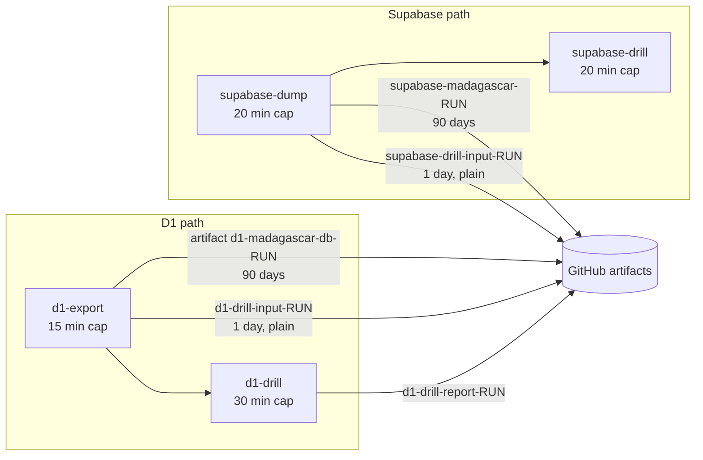

# 08 — The existing backup workflow, as it is today

> **TL;DR.** cf-admin has had an automated backup workflow since 2026-09-15:
> `.github/workflows/backups.yml`, built as viability chunk 6. It is well designed,
> with restore drills, row-count verification and optional encryption, but **it has
> never produced a single backup.** Both of its runs failed, because the four secrets it
> needs were never added to the repository, which holds only `PERSONAL_PAT`.
> **Fifteen minutes of owner setup would give the business its first real backup
> this week**, long before cf-backup exists (§7). This document is the baseline
> that doc 03 migrates. Its history lives in the [chunk 6 record](../chunks/2026-09-15-06-backups-and-dr-truth.md),
> and restore procedures in the [DR runbook](../../runbooks/disaster-recovery.md).
> Neither is restated here beyond what the analysis needs.

## 1. Identity

| | |
|---|---|
| File | `cf-admin/.github/workflows/backups.yml` (302 lines) + helper `scripts/backup_drill.mjs` (71 lines) + guard test `test/backup-guards.test.ts` (4 cases) |
| Built | 2026-09-15, chunk 6 "Backups and DR truth": `c3f6d54` (workflow), `6c58f18` (named secret pre-check after the first failure) |
| Last touched | `a9dd974` (2026-09-16): comment wording, and the drill's connection moved into `PG*` env variables. No behaviour change |
| Triggers | `schedule: '17 3 * * 1'` (every **Monday 03:17 UTC = Sunday 21:17 in Aguascalientes**) and `workflow_dispatch` (manual, Actions tab) |
| Permissions | `contents: read` for the whole workflow |
| Global env | `D1_NAME=madagascar-db`, `RETENTION_DAYS=90`, `CLOUDFLARE_VITE_FORCE_LOCAL=true` |

## 2. What it does, job by job

The two paths run **in parallel and independently**; each drill waits for its own dump.

### 2.1 `d1-export`

1. **Pre-check:** fails the job, deliberately and with a named error, if `CLOUDFLARE_API_TOKEN` or `CLOUDFLARE_ACCOUNT_ID` is missing, "so a missing backup is never a green run".
2. `npm ci --ignore-scripts`: installs all of cf-admin's dependencies, only to get `wrangler`.
3. **Export twice:** `wrangler d1 export madagascar-db --remote` (schema + data) and again with `--no-data` (schema only). The elapsed time is recorded.
4. **Source row counts:** `backup_drill.mjs counts` counts every table the export creates, on the live database, and writes `source-counts.json`. This is what the drill must reproduce.
5. **Checksums:** `SHA256SUMS`, plus a markdown table (file, bytes, sha256 prefix, export seconds) in the run's job summary.
6. **Encrypt if `BACKUP_PASSPHRASE` is set:** `tar` + `gpg --symmetric --cipher-algo AES256`. Otherwise it warns and uploads plain.
7. **Upload** artifact `d1-madagascar-db-<run id>`, 90 days (encrypted or plain).
8. **Upload `d1-drill-input-<run id>` for 1 day, always unencrypted**, so the drill job can read it.

### 2.2 `d1-drill` (needs `d1-export`)

1. Downloads the plain drill input.
2. `wrangler d1 create madagascar-db-drill-<run id> --location enam`: a **real, temporary D1 database in the production account**.
3. `wrangler d1 execute … --remote --file madagascar-db.sql`: imports the export.
4. Counts every table again (`restored-counts.json`) and `compare`s with the source. The job fails unless every table and every count matches. The elapsed seconds are the **measured restore-from-export time (RTO)**, written to the job summary.
5. **Always** deletes the temporary database; if the delete fails it prints the exact manual command.
6. Uploads the two count files as `d1-drill-report-<run id>` (90 days).

### 2.3 `supabase-dump`

1. Checks for `SUPABASE_DB_URL`. **If missing, it prints a warning and the job ends green**, and so does the whole Supabase path (§5, G2).
2. Installs the **PostgreSQL 17 client** from the PGDG repository: the project runs Postgres 17.6, `ubuntu-latest` ships 16, and `pg_dump` must not be older than the server.
3. `pg_dump --schema=public --no-owner --no-privileges --format=custom` through the **session pooler**. GitHub runners are IPv4-only, and the direct host is IPv6-only.
4. Source row counts for every `public` base table (`source-counts.csv`), a checksum, and a one-line job summary (tables, rows, bytes, seconds).
5. The same encrypt-or-warn logic, then artifact `supabase-madagascar-<run id>` (90 days) and a **plain** `supabase-drill-input-<run id>` (1 day).

### 2.4 `supabase-drill` (needs `supabase-dump`, only if it dumped)

1. Starts a `postgres:17` service container.
2. **Stubs Supabase's world** so the restore can create tables: roles `anon`, `authenticated`, `service_role`; schema `auth` with `uid()`, `role()`, `jwt()` returning NULL; schema `extensions`.
3. `pg_restore --no-owner --no-privileges … || true`: **errors are counted, not fatal.**
4. Recounts every table and `diff`s against the source. The job fails only if a count differs; `pg_restore` errors are listed in the summary but do not fail it (§5, G5).

## 3. Secrets, and their live state

Checked 2026-09-21 with `gh secret list`: the repository holds **one** secret, `PERSONAL_PAT`.

| Secret | Needed by | Required? | State | What happens without it |
|---|---|---|---|---|
| `CLOUDFLARE_API_TOKEN` | `d1-export`, `d1-drill` | Yes | **Missing** | `d1-export` fails at the pre-check; `d1-drill` is skipped |
| `CLOUDFLARE_ACCOUNT_ID` | same | Yes | **Missing** | same |
| `SUPABASE_DB_URL` | `supabase-dump`, `supabase-drill` | "Optional" | **Missing** | Whole Supabase path skipped, **reported green** |
| `BACKUP_PASSPHRASE` | both encrypt steps | Optional | **Missing** | Artifacts upload **unencrypted** (they contain login logs, consent evidence, bookings) |

The token needs the account permission **D1 Edit**: export needs read, and the drill
creates and deletes a database. `production-tests.yml` names the same Cloudflare secrets
and has never run green for the same reason.

## 4. Run history

| Run | When (UTC) | Trigger | Result | Detail |
|---|---|---|---|---|
| `35012389113` | 2026-09-15 19:14 → 19:14:44 | manual | **Failed** | `d1-export` failed in ~2 s (no Cloudflare token, before the named pre-check existed); `d1-drill` skipped; `supabase-dump` **green**, skipped with its warning; `supabase-drill` skipped |
| `35580420378` | 2026-09-21 **08:55** | schedule | **Failed** | Named pre-check: "No D1 backup was taken…". The Supabase path was green-skipped again. **The schedule said 03:17; GitHub started it 5 h 38 min late** |

Consequences recorded elsewhere, and still true today:

- The DR runbook §0 lists these secrets as blocking prerequisites.
- D1's recovery point beyond Time Travel's 7 days is **unbounded**.
- Supabase has **no restore path at all**: the Free plan has no platform backups.
- Dropping the two `zz_dead_*` Supabase tables (decision D-15) is gated on a green backup.

## 5. Gaps and defects

Numbered for reference; the right-hand column says where the cf-backup plan closes each one.

| # | Severity | Gap | Evidence | Closed by |
|---|---|---|---|---|
| G1 | **Critical** | **No backup has ever been produced** | §3, §4 | §7 of this doc (now), then doc 03 |
| G2 | High | `supabase-dump` reports **green without dumping** when its secret is missing, so the most exposed store (no platform backups at all) fails silently | lines 182–187 | Doc 03 §3 rule 1: missing config is a red run. Bridge fix in §7 |
| G3 | High | **Plaintext copies exist even when encryption is on**: `d1-drill-input` and `supabase-drill-input` are uploaded unencrypted for 1 day on every run | lines 125–131, 243–250 | Doc 03 §3 rule 2: the drill runs on the plaintext *inside the same job*; plaintext never leaves the VM |
| G4 | High | **Symmetric passphrase**: whoever holds the GitHub secret, or the runner itself, can decrypt every artifact | lines 95–108 | OD-4 / OD-13: public-key encryption; private key in Supabase Vault (doc 09) |
| G5 | High | **Supabase method and scope.** Raw `pg_dump` of `public` only misses `auth.users`, pg_cron jobs, roles and the migration ledger, and Supabase documents that raw `pg_dump` restores fail on permissions. The drill stubs roles and **tolerates restore errors**, so lost RLS policies or grants would still "pass" | lines 203, 287–288 | Factor B1/B2: `supabase db dump` roles/schema/data + history, drilled in `supabase/postgres` |
| G6 | Medium | **Only `madagascar-db`**; `chatbot-kb` and `whatsapp-chatbot` are not backed up | line 42 | Doc 03 §2 (all three; query-based exporter for `chatbot-kb`, factor A1) |
| G7 | Medium | **One location, and it expires itself.** GitHub artifacts only; every copy auto-deletes after 90 days, which sits oddly with the owner's "retention is manual" rule. No copy in R2 | line 43 | Doc 03 §4 (R2, bucket-locked, manual prune) + OD-12 (artifacts become the *second* copy) |
| G8 | Medium | **Schedule during business hours locally**: Sunday 21:17. A D1 export blocks the database, and the booking path writes to D1 first | line 34 | Doc 03 §3 rule 6: 09:17 UTC = 03:17 local |
| G9 | Medium | **The drill runs against production infrastructure**: it creates a real D1 in the account, needs the broad **D1 Edit** permission, and leaves a stray database if the delete fails. Measured cost is small (madagascar-db holds **2,425 rows**, so about 2.4% of the 100k daily write limit per drill) | lines 156–164 | Doc 03 §3 rule 2: drill into local `sqlite3`, so the token only needs export rights |
| G10 | Medium | **Nobody is told.** The only failure signal is GitHub's own email to the repository owner account. The two failed runs went unanswered for six days | §4 | Doc 03 §6: dead-man's switch + queue alerts |
| G11 | Low | **GitHub schedule drift is real**: 5 h 38 min late on its first scheduled run | §4 | Dead-man thresholds tolerate hours (8 days / 36 h) |
| G12 | Low | Heavy setup: `npm ci` of all of cf-admin just to run `wrangler` | line 64 | cf-backup's workflow installs `wrangler` alone |
| G13 | Low | Actions pinned by tag, not SHA (`checkout@v4`, `setup-node@v6`, `upload-artifact@v4`); runs already warn that Node 20 actions are deprecated | lines 50–51, 111 | Doc 05 §1 T5: SHA pinning |
| G14 | Low | Lives in cf-admin's repo, whose `push` workflows share the same secret store | — | cf-backup repo, where only `db-backup.yml` references backup secrets (doc 05 §3) |

What it gets **right**, and cf-backup keeps:

- the named fail-fast pre-check;
- restore drills with row-count verdicts;
- measured RTO in every job summary;
- checksums;
- Postgres 17 client pinning;
- the session-pooler rationale;
- `always()` cleanup of the scratch database;
- the "counts, not byte diffs" reasoning (`wrangler d1 export` promises no row order).

## 6. What one successful run would cost

| Resource | Estimate | Basis |
|---|---|---|
| GitHub Actions minutes | ~6–10 min per run across four jobs, mostly setup (`npm ci`, apt) | Four parallel/serial jobs; ~25–40 min/month weekly, 1–2% of 2,000 |
| Artifact storage | ~5–10 MB per run × 13 live runs (90 days) ≈ 65–130 MB | D1 export of a 2.2 MB database + a `public` dump of a 17 MB database; Free allows 500 MB |
| D1 writes (drill import) | ~2,425 rows per run | Live count 2026-09-21 |
| D1 reads (export + two counts) | a few thousand rows | Negligible against 5M/day |
| Supabase egress | ~17 MB per run | Negligible against 5 GB/month |

## 7. Fastest path to a real backup: this week, before cf-backup

cf-backup P1 is weeks away, and **there is no backup today**. The existing workflow can
start protecting the business as soon as its secrets exist. Recommended **bridge**,
in order (owner steps from the chunk 6 record §10, plus the decision each needs):

| Step | Who | Action | Effect |
|---|---|---|---|
| 1 | Owner | Cloudflare → My Profile → API Tokens → custom token, account permission **D1: Edit**, with an expiry date. Add `CLOUDFLARE_API_TOKEN` and `CLOUDFLARE_ACCOUNT_ID` as repository secrets | D1 path runs, with its drill |
| 2 | Owner | Generate a strong `BACKUP_PASSPHRASE`, store it in the password manager **first**, then add it as a secret | Main artifacts encrypted (G3 still leaves 1-day plain drill inputs) |
| 3 | Owner | Supabase → Connect → **Session pooler** URI → secret `SUPABASE_DB_URL` | Supabase path runs (with G5's limits: `public` data only, but that *is* the business data) |
| 4 | Owner or AI | Actions → `backups` → Run workflow; read both job summaries | First real backup + first **measured** RTOs |
| 5 | AI | Record the measured numbers in the chunk 6 record §11 and DR runbook §1; close the §0 prerequisites | The docs stop saying "unbounded" |

Optional **bridge code fixes**, small and reversible, worth doing only if cf-backup P1 is more
than a few weeks out (owner call; the workflow is retired in P1 stage 1e):

- **G2:** make a missing `SUPABASE_DB_URL` fail the job (a two-line change).
- **G3:** stop uploading the plain drill inputs; run each drill inside its dump job instead.
- **G8:** move the cron to `17 9 * * 0`.

Once steps 1–4 are done, the business has a D1 export with a rehearsed restore and a
Supabase `public` data dump every week, kept 90 days. That's imperfect, but it's the
difference between recoverable and not.

## 8. How it maps into cf-backup

| Today (cf-admin `backups.yml`) | cf-backup `db-backup.yml` (doc 03) |
|---|---|
| Monday 03:17 UTC, weekly | Sunday 09:17 UTC full + Mon–Sat Supabase-only |
| `madagascar-db` only | All three D1 databases (`chatbot-kb` via query export) |
| Raw `pg_dump --schema=public` | `supabase db dump` roles/schema/data + migration history |
| Drill: remote scratch D1 / plain `postgres:17` with stubs, errors tolerated | Drill (planned): local `sqlite3` / the `supabase/postgres` 17.6 image, errors fatal |
| GitHub artifacts, 90 days, auto-expire | R2 `madagascar-backups/v1/runs/{full,daily}/<year>/<month>/<runKey>/`, bucket-locked, manual prune; artifacts as 14-day second copy |
| Symmetric passphrase (optional) | Public-key encryption; private key in Supabase Vault, Owner/Vendor only (doc 09) |
| Plain 1-day drill inputs | Plaintext never leaves the job |
| Missing Supabase secret = green | Missing anything = red |
| Status: job summary only, logs kept by GitHub for its retention window | A full evidence bundle per run in R2: redacted logs, GitHub's own log archive, sizes, resource figures and allowances ([11](11-run-evidence-and-usage.md)) + `backup:status` + the backup console + alerts |
| Secrets in cf-admin repo | Two secrets in the cf-backup repo, two in the cf-backup Worker, none in cf-admin ([12](12-keys-and-secrets.md)) |

Its processes did not die with it: the good ones and the lessons from its failure became the
22 operating principles in [03 §10](03-backup-pipeline.md#10-operating-principles-adopted-from-the-existing-workflow)
(P-1…P-22), plus decisions OD-14 (readiness panel) and OD-15 (tiered drills).

## 8a. Bridge fixes applied 2026-09-22

The workflow was rebuilt as **one job** the day after this analysis (consolidation report §8,
`documentation/records/reports/2026-09-22-ci-workflow-consolidation.md`). Closed: **G2**
(a missing Supabase secret is now a red run), **G3** (no plaintext artifacts; the drill runs in the
same job), **G8** (Sunday 09:17 UTC), **G12** partly (one install, one job), **G13** (SHA-pinned
v7 actions), plus a defect this analysis missed: GnuPG ≥ 2.1 rejects `--passphrase` in batch mode
without `--pinentry-mode loopback`, so **encryption would have failed on the first real run**; it
now reads the passphrase from stdin. `BACKUP_PASSPHRASE` is now **required**. Still open until
cf-backup P1: G1 (the secrets), G4 (symmetric key), G5 (Supabase scope/method), G6 (the two chatbot
databases), G7 (GitHub artifacts only), G9, G10, G11, G14.

## 9. Verification log

| Date | Method | Result |
|---|---|---|
| 2026-09-21 | Read `backups.yml` in full; `git log` on it; `git show a9dd974` | As described in §1–§2 |
| 2026-09-21 | `gh run list --workflow backups.yml`; `gh run view` both runs, including logs | 2 runs, both failed; Supabase job green-skipped in both; scheduled run started 08:55 UTC for a 03:17 slot |
| 2026-09-21 | `gh secret list` | `PERSONAL_PAT` only |
| 2026-09-21 | `wrangler d1 execute madagascar-db --remote` total row count | 2,425 rows |
| 2026-09-21 | Supabase `get_project` + SQL | Postgres 17.6.1.104; 17 MB; `auth` 6 users; schemas include `vault`, `cron` |
