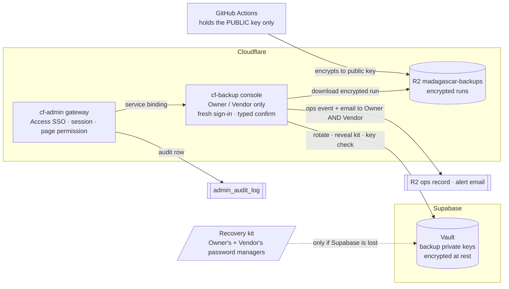

<!-- docs-check: proposed-paths -->
<!-- Built and deployed 2026-09-23/24; the "As built" notes record where the build differs from the plan. It names routes, files and folders in cf-backup's repository, not cf-admin's. -->

# 09 — Backup key management

> **TL;DR.** Backups are stored at **Cloudflare**; the key that opens them is stored at
> **Supabase** (Vault). Neither half is useful alone. Only the **Owner** and **Vendor
> support** can bring them together, and only through the backup console (served by
> cf-backup inside cf-admin), after a fresh sign-in, with every action audited and a notice
> sent to the alert recipients (as built, §2 K-4). A new key can be generated **on the spot**
> with one click. The one thing kept
> offline is a **recovery kit** (like 2FA recovery codes), needed only if Supabase itself
> is lost.
>
> **Revised 2026-09-22.** The key screens moved from a cf-admin page into the cf-backup
> console (doc 02). The two halves therefore now meet inside cf-backup, a Worker with no
> public address, instead of inside cf-admin (§1a).

## 1. The design in one picture

**What an attacker has to get past to read one backup:**

| Path | Layers to cross |
|---|---|
| Through the portal | Cloudflare Access SSO → an **Owner or Vendor** account (no other role can even see these controls) → a fresh sign-in → typed confirmation → the action is audited and a **notice** goes to the alert recipients (K-4) |
| Around the portal | Steal the ciphertext (Cloudflare R2, or GitHub's 14-day artifact copy) **and** the key (Supabase Vault, reachable only through three locked-down functions) **or** a recovery kit from a password manager. That means two different providers, or a personal vault |
| A stolen storage credential alone | Useless: ciphertext only |
| A Supabase dump alone | Useless: Vault contents stay encrypted in dumps (Supabase documents this) |

### 1a. Where the two halves meet (revised 2026-09-22)

In the first draft the joining point was cf-admin: it held the Supabase connection, and
could ask the backend for any encrypted run. It now sits in cf-backup, which holds the
`BACKUPS` binding and the Vault credential. This is **at least as strong**:

- cf-backup has **no public address** at all (doc 02 §4), where cf-admin is an internet-facing application behind Access.
- Its code is a fraction of cf-admin's size.
- Its Vault credential can be narrowed to the three key functions (OD-24), where cf-admin's is a service-role key over the whole project.

The key still never rests anywhere but Vault: cf-backup holds a private key only in memory,
for the length of one request (rotate, reveal, the weekly check, a re-key).

## 2. The rules

| # | Rule |
|---|---|
| K-1 | **One active backup key** (an `age` X25519 key pair). GitHub holds only its **public** half, as the repo variable `BACKUP_AGE_RECIPIENT`. |
| K-2 | **Private keys live only in Supabase Vault**, named `backup-key:<fingerprint>`. Retired keys **stay** in Vault (never deleted automatically), so old backups always remain openable. |
| K-3 | **Only Owner and Vendor support** can see key status, rotate, reveal the recovery kit, or download an encrypted run. This is **non-delegable**: no page grant can extend it to another role. cf-backup enforces it on every call (doc 13, the `keys.*` capabilities). |
| K-4 | **Every key action** requires a fresh sign-in, a typed confirmation and a rate limit (rotate ≤ 1/day, reveal ≤ 3/day per person). The gateway writes `admin_audit_log`, cf-backup writes an `ops/events` record, and a **notice** is emailed, so neither can act unseen. **As built:** the notice goes to the alert recipients in Settings → Alerts (not to two fixed people): for this rule to hold, both the Owner's and the Vendor's addresses must be on that list. Notices cannot be switched off email, and each email's delivery is tracked (doc 13 §2). |
| K-5 | **The recovery kit** is the private key shown **once** at creation. Owner and Vendor each save it in their own password manager. It is needed only if the Supabase project is lost, because Vault contents cannot be restored from a dump. |
| K-6 | **The system checks the key itself, weekly**. No human chores (§4). |

## 3. Generate a new key on the spot

One button, **Rotate backup key**, in the backup console (Owner or Vendor):

1. cf-backup generates a new X25519 key pair (**as built: WebCrypto**, `crypto.subtle`, fully supported in Workers; no new package — RULESAd SEC-10 prefers WebCrypto over Node's `crypto` in `src/`) and formats it as an `age` identity and recipient.
2. The private key goes into Vault through `backup_key_put()`. It is stored nowhere else.
3. cf-backup updates `BACKUP_AGE_RECIPIENT` through the GitHub App (key 3, doc 12 §6). Every later run refuses to encrypt unless the recipient is this registered active key.
4. The registry row `backup:key-registry` records the fingerprint, date and who rotated; the old key is marked `retired`.
5. The screen shows the **new recovery kit once**, with a "copy to password manager" prompt. The other person gets an email telling them to save theirs from the console (a *reveal*, which is itself audited).
6. The next backup run uses the new key. Nothing already stored changes.

When to rotate: **yearly** (reminder email), **immediately** if a device or account holding a kit is lost or suspected compromised, and **whenever Owner or Vendor changes**.

## 4. The weekly automatic key check

> **As built:** this runs as one of the chores `POST /internal/tick` performs on its
> once-a-week cadence (not a separate daily "reconcile" job — doc 02 §8), and records the
> result in that day's `ops/days` record.

| Check | How | Alert if |
|---|---|---|
| The active private key matches what GitHub encrypts to | Read the key from Vault, derive its public key (WebCrypto), compare with `BACKUP_AGE_RECIPIENT` and the newest manifest's recipient | They differ |
| Every retained backup can still be opened | Each manifest records its recipient fingerprint; each must have a key in Vault | Any run has no matching key |
| The recovery kits still exist | A yearly "I still have my kit" confirmation per person, recorded in the registry | Older than 12 months |

This replaces paper shares, key ceremonies and quarterly manual proofs. The only human
check that stays is the **twice-yearly restore rehearsal**, which compliance needs as
evidence anyway (§8). **As built (2026-09-24):** whoever decrypts a run with the kit records
it in the console (Keys → Restore proof: the run key and the date; `keys.rotate`). The
console shows the newest proof's age, and the daily check raises a `key` reminder when it is
more than six months old, or when none exists while a good backup does, at most once per
half-year.

**As built (Ruling R-2):** `backup:key-registry` carries two additive fields beyond the
shape in [C2](../cf-backup/README.md): `reveals: string[]` (the reveal timestamps behind
the 3-per-day limit, K-4) and `kitConfirmations: Record<string, string>` (each person's
last "I still have my kit" confirmation, the third row above). Both are additive within
`cf-backup/key-registry@1` (RE-8), and every reader — including the runner's `doctor`
(Track R) — parses the registry leniently, ignoring fields it does not know.

## 5. Restoring a backup

1. Fetch the run's files. **As built:** the console downloads them one at a time (the run's Evidence tab, or the Files section; Owner/Vendor, fresh sign-in, each confirmed); there is no whole-run archive, so a full restore fetches the folder with `wrangler r2 object get` (cf-backup's `docs/RESTORE.md` step 1).
2. **Reveal key** (Owner/Vendor; fresh sign-in; audited; a notice), or use your recovery kit.
3. On your own machine: `age -d -i key.txt file.age > file`. Then follow the restore steps in doc 03 §8.
4. Delete the local plaintext and key file afterwards.
5. Record it: Keys → Restore proof (§4).

## 6. What if…

| Situation | What happens | Data lost? |
|---|---|---|
| Laptop or password manager lost | The key is still in Vault. **Rotate** (the lost kit becomes a retired key) and save the new kit | No |
| Key "gets old" | Nothing breaks: rotation is one click, and old keys stay in Vault for old backups | No |
| Owner or Vendor leaves | Remove their cf-admin access, **rotate**, and the remaining person saves the new kit | No |
| Key suspected leaked | **Rotate now.** Past runs stay encrypted to the old key, so exposure needs the ciphertext too (R2 or the 14-day GitHub copy); revoke those credentials as well. Re-keying old runs ([10](10-free-tier-feasibility.md) §4) is **not built in this cycle** — `keys.rekey` answers 501 `not_implemented` (§7) — so the mitigation today is rotation plus revoking the leaked credential, not a re-wrap of old ciphertext | No (confidentiality incident) |
| Supabase project lost | Open the backups with either person's **recovery kit**, restore Supabase, then put the key back into Vault with `backup_key_put()` | No |
| Supabase lost **and** both recovery kits lost | Backups cannot be opened. That is why there are two kits and a yearly confirmation | **Yes** |

## 7. What to build (small)

| Piece | Where | Notes |
|---|---|---|
| Three Postgres functions: `backup_key_put(fingerprint, secret)`, `backup_key_get(fingerprint)`, `backup_key_list()` (fingerprints and dates only) | Supabase migration (RULE #0.7) | `SECURITY DEFINER`, wrapping `vault.create_secret` / `vault.decrypted_secrets`; `EXECUTE` revoked from `public`, `anon` and `authenticated`. **No new table** (RULE #0.9): Vault's own table holds the keys |
| The Vault credential (key 4, OD-24) | Supabase migration + the Hyperdrive config `cf-backup-vault`, bound to the cf-backup Worker as `VAULT_DB` | A key-holder role granted `EXECUTE` on the three functions and nothing else (doc 12 §7). **As built (2026-09-24):** reached with the `pg` driver through Hyperdrive, over the Supavisor **transaction pooler** (port 6543), with `sslmode verify-full` against Supabase's root CA and query caching off. The earlier Worker secret `SUPABASE_KEYS_URL` and postgres.js are retired. Key 4 is required: the planned by-hand scripts were not built (doc 12 §1) |
| Key screens: status, rotate, reveal, confirm kit | cf-backup console | Owner/Vendor only (K-3), fresh sign-in, typed confirmation |
| Updating `BACKUP_AGE_RECIPIENT` | cf-backup, through the GitHub App | Variables r/w (key 3) |
| First key, before the console exists | The planned `scripts/backup-key-init` (same code path, run once by the Owner) | Needed for P1, since backups start before the P2 console. **As built, load-bearing:** every run's `doctor` fails until `backup:key-registry` holds an active key matching `BACKUP_AGE_RECIPIENT` — the first key must exist **before the first dispatch**, not just before the console |
| Weekly key check | cf-backup's `/internal/tick` chores | §4 |
| ~~Re-key old backups~~ (`keys.rekey`, doc 10 §4) | — | **Out of this build.** It needs ChaCha20-Poly1305 to unwrap and re-wrap an `age` header, which WebCrypto does not provide. The capability exists (doc 13) but every call answers **501 `not_implemented`** with that reason. Retired keys stay in Vault, so backups encrypted to them remain openable without a re-key |

**Resolved during the full build (2026-09-23):**

- `signedInAt` is the Cloudflare Access assertion's **`iat`** (doc 02 §4), recorded when
  cf-admin's session is created; sessions from before this field existed fall back to their
  `createdAt`.
- `age` accepts a WebCrypto-generated X25519 key in its standard encoding, proven with a
  round-trip encrypt/decrypt test in Track W's suite.

## 8. Compliance and architecture text

**Add this to the live compliance documents only once it is built and verified**, not before.
Documents that describe unbuilt controls were a finding of the 2026-09-19 review.

| Document | Text to add |
|---|---|
| `security/SECURITY.md` / `THREAT-MODEL.md` | "Backups are encrypted with a public key before leaving the runner. The private key is held in Supabase Vault, a different provider from the Cloudflare storage that holds the backups. Access to it is limited to the Owner and Vendor-support roles through the admin portal, requires a fresh sign-in, and is audited, with a notice to the configured alert recipients. An offline recovery copy is held by each of the two roles." |
| `security/RoPA.md` | Backup key custody: Supabase (Vault) as a processor of key material; no personal data in the key itself |
| `runbooks/disaster-recovery.md` | §5 of this document as the restore procedure; §6 as the key-loss playbook |
| `architecture/PERMISSIONS-SYSTEM.md` | The non-delegable Owner/Vendor capability class (K-3), enforced in cf-backup behind the `/dashboard/backup` page key |

## 9. What changed from the earlier drafts

The first version of this document used paper Shamir shares (2-of-3), key ceremonies,
two encryption keys and quarterly manual canary proofs. It was replaced on 2026-09-21
with the design above, at the owner's request: **same protection against the realistic
threats, far less to operate.** The earlier design's one remaining advantage was that the
key never touched an online system; that trade is explicit (§1).

On 2026-09-22 the key screens moved into the cf-backup console with the rest of the
backup UI, and the joining point moved with them (§1a).
