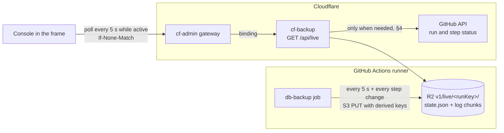

<!-- docs-check: proposed-paths -->
<!-- Built and deployed 2026-09-23/24; the "As built" notes record where the build differs from the plan. It names routes, files and folders in cf-backup's repository, not cf-admin's. -->

# 14 — The live operations view

> **TL;DR (owner requirement, 2026-09-22: "very important").** The console shows
> everything that is happening **now**, refreshed every 5 seconds by default while anything runs
> (Settings → Live view, 5–60 s; the plan's 2 s was raised on 2026-09-24 to match the heartbeat):
>
> - whether a backup is queued, running or finishing, and who or what started it;
> - every step with its status, time and expected finish, plus the live log;
> - live metrics, and the free-allowance figures with their age.
>
> Nobody starts a second backup by accident, and nobody has to wonder whether theirs
> started. It works without giving cf-backup a public address. The runner writes a
> heartbeat to R2 every 5 seconds, GitHub reports queue and step status, and the console
> polls cf-backup through cf-admin's gateway.

## 1. What "live" covers, and where each part comes from

| What you see | Source | How fresh |
|---|---|---|
| A run is **queued**, waiting for a GitHub runner | GitHub API (run status) | ~2 s |
| A run is **running**, and which step | The runner's **heartbeat** in R2; GitHub's per-step status as a fallback | ≤ 5 s |
| Progress inside a step: tables done, bytes dumped, current table, upload progress | Heartbeat | ≤ 5 s |
| **Live log**: every line, as it is printed (redacted) | Heartbeat log chunks | ≤ 5 s |
| Runner metrics: CPU, memory, disk, network | Heartbeat (sampled on the runner) | ≤ 5 s |
| This run's meter so far: D1 rows, R2 operations, Supabase bytes | Heartbeat | ≤ 5 s |
| Expected finish (ETA) | Median step times of the last 8 runs (`indexes/`) | per poll |
| cf-backup's own work: reconcile, prune, key check, export, config or access change | Recent-activity list in `backup:status` | on change |
| **Usage**: D1 today | cf-admin's existing hourly usage reading (`cron-control` row, read-only) | ≤ 1 h, shown |
| Usage: Actions minutes this month | The minutes meter (doc 11 §5.4) | ≤ 1 h, shown |
| Usage: R2, KV, Workers, Supabase size | The latest daily snapshot | ≤ 1 day, shown |

Every figure carries its age on screen ("read 12 min ago"). Something that is not live
never pretends to be.

## 2. How it flows



## 3. Why polling, not a stream

- **The work runs on GitHub, not in a Worker.** A stream from cf-backup would only relay what it re-reads from R2. cf-admin's own cron console streams (`src/pages/api/cron/jobs/[id]/stream.ts`) because there the job runs inside the request.
- **The runner cannot reach cf-backup**, which has no public address. R2 is the mailbox both can reach with what they already hold: key 1's derived S3 keys on one side, the `BACKUPS` binding on the other (doc 12).
- **A held-open stream** would pin a cf-admin request and a cf-backup invocation for minutes, and die on every deploy of either.
- **Polling with `If-None-Match` is cheap:** an unchanged state answers `304` with no body.
  *(As built in the full build, 2026-09-23, superseding the Phase 1a note below: this is now
  built — `GET /api/live` computes `liveEtag(view)` and answers `304` with no body when the
  request's `If-None-Match` matches it, `200` with a fresh `etag` otherwise. Phase 1a's
  interim state, where every poll answered `200` because every action still returned 503,
  no longer applies.)*
- **Cadence** (set in `backup:config`, doc 13 §7), as built on 2026-09-24:
  - every **5 s** while something is active and the tab is visible (5–60 s);
  - every **30 s** when idle (5–300 s), doubling while nothing changes, up to four times that;
  - **paused** while the tab is hidden, with a fresh poll the moment it is shown again;
  - after errors, the wait doubles up to 60 s; every wait carries ±10% jitter;
  - after 15 minutes with no interaction (5–240), polling stops behind a "Resume live view" button, so a forgotten tab costs nothing.
  - Ages and elapsed times keep counting on the console's own clock between polls, so a `304` never freezes them.

## 4. The console API

`GET /dashboard/backup/app/api/live` returns everything the "Now" bar and live panel need,
in one response:

```json
{
  "schema": "cf-backup/live-view@1",
  "now": "2026-10-04T09:19:02Z",
  "active": [{
    "runKey": "2026-10-04_full_gh12345678901a1", "ghRunId": 12345678901, "scope": "full",
    "trigger": { "kind": "manual", "by": "<name>", "at": "2026-10-04T09:17:00Z" },
    "state": "running", "heartbeatAgeSeconds": 3,
    "step": { "id": "postgres:dump", "index": 6, "of": 11, "progress": { "tables": 14, "of": 20, "bytes": 8912000 } },
    "steps": [{ "id": "doctor", "status": "ok", "seconds": 6.1 }],
    "elapsedSeconds": 119, "etaSeconds": 64,
    "metrics": { "cpuPct": 71, "memMB": 812, "diskMB": 2100, "netInMB": 35.2, "netOutMB": 4.1 },
    "meter": { "d1RowsRead": 2520, "r2ClassA": 4, "supabaseBytes": 8912000 },
    "counts": { "warnings": 1, "errors": 0 },
    "logCursor": 42
  }],
  "worker": { "recent": [{ "at": "…", "kind": "reconcile", "outcome": "ok" }] },
  "usage": [{ "service": "cloudflare.d1", "metric": "rowsWritten", "percent": 6.5, "readAt": "…" }]
}
```

> **As built in Phase 1a (2026-09-23):** `/api/live` does not return `usage[]` yet; the
> usage tiles (§8) read `/api/usage` instead. Additive to `/api/live` later.

`GET /dashboard/backup/app/api/live/<runKey>/log?after=<cursor>` returns the log lines
after the cursor. The console appends them.

**How cf-backup decides `active`, without flooding GitHub:**

- While a run's heartbeat is **fresh**, R2 alone answers. There is one R2 read per poll, and GitHub is not asked.
- GitHub is asked only in four cases: before a heartbeat exists (queued or starting); when a heartbeat goes stale; right after a dispatch or cancel; and, when idle, to discover a scheduled run that just started. That last check happens at most every 30 s per isolate.
- Answers are cached in memory for 2 s, so ten people watching cost about what one does.
- **As built (2026-09-24):** `active` comes from the `backup_runs` rows, and GitHub is asked only about a run a row records, when it has no heartbeat or one older than 20 s (a GitHub failure is cached 10 s). An idle console asks GitHub nothing: the tick records a scheduled run the moment it dispatches it. A source is called "measured" only when this answer actually read it.
- Installation tokens are minted in memory and reused until they expire; they are never stored.

## 5. The heartbeat (runner side)

> **As built (full build, 2026-09-23, C7).** Built field-for-field as designed, with these
> resolved details:
>
> - **The step `index` is 1-based** (Ruling 9), matching the built console's "step *N* of
>   *M*" (`NowBar`) and the dev simulation.
> - **Log chunks are named by the cursor of their *last* line** (Ruling 8, X1) — see doc 11
>   §3 for the full naming rule and what it buys the reader.
> - **A malformed or empty PID file can never make `stopHeartbeat` signal the wrong
>   process**: an empty or non-positive PID reads as "no process", and the daemon writes no
>   PID file at all when it fails to spawn (a review finding on the first cut, fixed before
>   merge).
> - **A failed chunk upload never blocks the terminal `state.json` write.** Each chunk is
>   its own try/catch, so a dropped upload cannot stop the heartbeat from reaching
>   `finished` / `finished-no-evidence` (a second review finding, fixed before merge).
> - **The daemon caps its pending backlog** (drop-oldest, about 5,000 lines / 2 MB) so a
>   stalled upload path cannot grow memory without bound during a very long step.

A small background loop in the job, started by the `plan` step and stopped by `seal`,
writes two kinds of object under `v1/live/<runKey>/`:

| Object | Written | Holds |
|---|---|---|
| `state.json` | Every 5 s, and at every step start and end (overwritten) | Phase, current step and its progress, the step list with status and seconds, metrics, meter, counts of warnings and errors, and the latest log cursor |
| `log/<cursor>.jsonl.gz` | Every 5 s, one chunk (append-only) | The log lines and events since the previous chunk, **already redacted** |

- **Redaction happens before upload.** Each chunk goes through the same redactor as the final evidence (doc 11 §4), with the residue check. A chunk that fails is replaced by a placeholder line saying so. A secret never reaches R2, even for five seconds.
- **The heartbeat can never fail the backup.** A failed upload is retried on the next beat and counted in the run's evidence, and the backup carries on.
- **Uploads use the S3 API** with the keys derived from key 1 (doc 12 §4.5): a single small PUT each time.
- **After the run**, the complete, final logs are in the run folder (doc 03 §4.3). `v1/live/` is **not** locked and **not** evidence: reconcile deletes a run's live folder 7 days after that run's evidence is complete.
- **Cost:** about 2 PUTs per 5 s, roughly 100 Class A operations per 4-minute run, about 3,000 a month against a free million.

## 6. States, and how the console decides them

| State | Rule | Shown as |
|---|---|---|
| `queued` | GitHub says queued; no heartbeat | "Waiting for a GitHub runner — 40 s so far (usually 10–60 s)" |
| `starting` | GitHub says in progress; no heartbeat yet | "Runner started, preparing" |
| `running` | Heartbeat younger than 20 s | Step, progress bar, live log, ETA |
| `stalled` | GitHub says in progress; heartbeat older than 60 s | Amber: "No word from the runner for 75 s". GitHub's step status is shown instead. A warning, not a failure |
| `sealing` | Current step is `seal` | "Encrypting and uploading" with upload progress |
| `finished` | `manifest.json` exists | The verdict; the panel turns into the run detail view |
| `finished-no-evidence` | GitHub says completed; no manifest | Red: "The runner stopped before sealing". Reconcile will attach GitHub's own log (doc 11 §3) |
| `cancelled` | GitHub says cancelled | Who cancelled it and why; `seal` still ran (`if: always()`) and recorded it |

> **As built in Phase 1a (2026-09-23):** a heartbeat between 20 s and 60 s old still counts
> as `running`, with its age shown (for example "last update 43 s ago") — this fills the
> gap the `running`/`stalled` rows above leave between 20 s and 60 s. Only a heartbeat
> older than 60 s moves the run to `stalled`, even when GitHub could not be asked.

## 7. No duplicates, and no "did it start?"

- **Run now is disabled while a run is queued or running.** The button says why ("A full backup is running, started 2 min ago by *name*"), with a **Watch** link. This check does not depend on the page being fresh.
- **The server refuses too, and no longer by asking GitHub first** (as built, Ruling R-7,
  superseding the Phase 1a note this replaced). Every attempt — schedule slot, manual
  dispatch, the fallback and a local break-glass run alike — first inserts a `backup_runs`
  row (C1); the partial unique index `backup_runs_one_active_lane` makes a second active row
  for the same lane (`actions`) impossible at the database level, so a dispatch that loses
  the race gets 409 `already_running` from the insert itself, not from a round trip to
  GitHub. GitHub's own `concurrency: db-backup` is a second, independent guard, and the
  workflow can still be triggered outside cf-backup only by someone with repo write access.
  `runs.bypass-cooldown` bypasses the *cooldown* only, never this lock.
- **Instant feedback.** The dispatch call returns GitHub's `workflow_run_id` at once, so a "Queued" card appears the moment Run now is pressed, before any runner exists. It then moves through the states above.
- **Scheduled runs appear on their own** when they start, for anyone watching, with "started by schedule".
- **cf-backup's own actions** (a prune, a re-key, an export) show in the same "Now" bar while they run, with who started them.

## 8. The screen

- **"Now" bar**, on every console screen. It shows "All quiet — last backup ok 6 h ago", or "● Full backup running, step 6 of 11, 1 min 59 s, ~1 min left", or an amber or red state from §6. Clicking it opens the live panel.
- **Live panel:**
  - the step timeline, with icons for pending / running / ok / warning / failed / skipped, each step's time, and its typical time;
  - a progress bar for the current step;
  - the **live log**: follows new lines, pauses when you scroll up, filters by level and by step, and can be searched;
  - small charts of CPU, memory and network;
  - the meter counters;
  - warning and error counts that jump to their lines;
  - a **Cancel** button, for holders of `runs.cancel`.
- **Activity strip**: cf-backup's own recent and running actions.
- **Usage tiles**: value, limit, percent, status colour, and the figure's age.
- **Accessibility:** state changes are announced through a polite live region; individual log lines are not, so a screen reader is not flooded. Colour is never the only signal.

## 9. Who sees what

Doc 13's capabilities apply:

- `console.view`: the "Now" bar and the live states (whether something is running, who started it, which step). Knowing that a backup is running is the point, so this is the lowest bar.
- `logs.view`: the live log, metrics and meter.
- `runs.cancel`: the Cancel button.
- `runs.run`: the Run now button.

## 10. What it costs

| Resource | While someone watches an active run | Idle |
|---|---|---|
| cf-admin requests (count toward 100k/day; each is also one cf-backup invocation) | as built: ~12 live polls a minute per viewer (5 s), each a `304` when nothing changed, plus a log request only when there are new lines | ~2 a minute per viewer (30 s), fewer while nothing changes; zero while the tab is hidden or paused |
| cf-admin session reads (KV) | one per request, as for every portal request | same |
| R2 Class B (reads) | one `state.json` read per poll, plus new log chunks | none |
| GitHub API | only in the cases of §4; well under the 5,000/hour installation limit | none (as built) |

A heavy day (three people watching ten minutes of runs) is at most about 720 cf-admin
requests (3 × 10 min × 24 a minute, if every poll also fetched log lines), under 1% of the
daily allowance; counting cf-backup's own invocation for each, about 1,440 of the account's
100k.

## 11. To verify when building

- How quickly GitHub's jobs endpoint reflects a step's status while a job is running.
- S3 PUT latency from GitHub-hosted runners to R2, and that the runner image has what the uploader needs (the AWS CLI, or `curl` with SigV4).
- That polling through the gateway adds no noticeable latency beyond cf-admin's normal request path.
