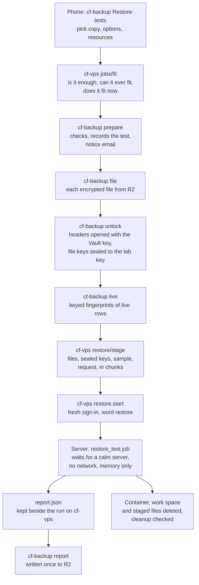

<!-- docs-check: proposed-paths -->
<!-- Built 2026-10-08, first run for real the same day (§13). It names routes, files, settings keys and jobs in cf-backup's and cf-vps's repositories, not cf-admin's, so cf-admin's path check cannot resolve them. -->

# 15 — Restore tests

> **TL;DR (owner's plan, approved 2026-10-08).** A **restore test** takes one backup copy,
> unlocks it inside a sealed, throwaway container on the cf-vps server, rebuilds every database
> in it, and runs ten groups of checks (A to J): is every file intact, does it unlock, does it
> rebuild, is every table and row there, is it healthy, is it the same as when it was saved,
> does it match live production, do its settings match, do the apps' key reads work on it, and
> how fast was it. The result is a score, a verdict and a timing. Then the container and every
> byte it unlocked are deleted; only the report (names, counts, timings, verdicts) is kept.
>
> - **No key to paste.** cf-backup's Worker opens only the small header of each file of the
>   chosen copy with the backup key in Vault, and sends the server the per-file keys sealed to
>   the server's **lab key**. The backup key never leaves the Worker; the server can open that
>   one copy and nothing else. Pasting the recovery kit stays available, to test the kit itself.
> - **Settings controlled by permissions.** Who may see, run and configure tests are three
>   separate capabilities; running and configuring are floors (Owner and Vendor only).
> - **Resources chosen per test.** Memory, CPU, work space, time limit and wait limit, within
>   limits set in Settings and the server's own ceilings, checked against the server before Start.
> - **No new secret, table, binding, variable or outside service.** One new library,
>   `age-encryption`, approved with the plan.
>
> **Status: built 2026-10-08, not yet run for real.** The code is written in cf-backup, cf-vps
> and cf-admin; the server's side waits for the owner's rollout (§13).

## 1. What a restore test proves, and what it cannot

| It proves | Group |
|---|---|
| Every encrypted file matches the checksums the run wrote, and the file list matches the manifest | A |
| The backup key on record (in Vault, or the pasted kit) opens every file, and every file decrypts and unzips | B |
| Each store rebuilds on another machine: PostgreSQL per Supabase project, SQLite per D1 database | C |
| Every table is there with the row count the manifest recorded | D |
| The rebuilt databases are healthy (index and heap checks, foreign keys, sequences; SQLite integrity) | E |
| Each table's content equals what was saved, by the per-table fingerprint in the manifest (§7) | F |
| A random sample of live rows matches the copy, by keyed fingerprints only (§6) | G |
| Table, index, policy, function, trigger and grant definitions and the migration ledgers match live | H |
| The key reads work, a rolled-back write per table succeeds, and the `anon` role reads nothing protected | I |
| How long decrypting, rebuilding and reading took, and the peak memory | J |

Gates make the verdict **fail** whatever the score: a failed check in A, B, C, D, E or I, a
table whose content differs in F, and in G a live row that differs although it is **proven** not
to have changed since the backup (§6). H and J only feed the score. A Full test scores 0 to 100 and gives one of:
*ready* (95 and up), *ready with notes* (85), *usable, fix soon* (70), *not trustworthy* (below
70) or *fail*. A Quick test (A to D) ends *quick pass* or *fail*.

**What it cannot prove**, listed on every report and never counted as passed: Supabase Storage
files, Vault secrets, database role passwords, Supabase's other sign-in tables, KV, R2
contents, Worker secrets and settings, DNS and Access. It does not restore anything into
production or into a real project, and it does not replace the twice-yearly full rehearsal in
cf-backup's restore guide: it makes the data part of it routine and timed.

## 2. Who may do what

Each service checks its own capabilities; a person needs both sides to start a test.

| Service | Capability | Allows | Class | Default holders |
|---|---|---|---|---|
| cf-backup | `restoretests.view` | See Restore tests: copies, history, reports, the reminder, Settings read-only; file a finished test's report | read | Admin, Owner, Vendor |
| cf-backup | `restoretests.run` | Start a test and carry it on (its files, the unlock, the live sample) | secret, **floor** | Owner, Vendor |
| cf-backup | `restoretests.configure` | Change Settings → Restore tests, and pin the server's lab key | secret, **floor** | Owner, Vendor |
| cf-vps | `restore.test` | Stage a copy's files on the server, start or cancel the `restore_test` job | admin, **floor** | Owner, Vendor |
| cf-vps | `host.view` | Watch a test's live steps and read its report and the server's ceilings | read | as today |

The catalog is in [13 §2](13-access-control.md#2-the-capability-catalog). Floors mean no
policy can give these to Admin or below: a test unlocks every record in the copy.

**Guards on a start:** a sign-in from the last 10 minutes on both sides; the typed word
`restore` on both sides; the daily limit (Settings, whole platform, reset at midnight UTC);
one notice email per test to the alert recipients; the lab key the page sends must equal the
one pinned in Settings. Only the person who started a test may carry it on, and only within 3
hours of preparing it.

## 3. The flow

**How to read it.** Both consoles are on cf-admin's origin, so the phone carries the copy from
one to the other; no new binding links the two Workers, and each checks the person's own
capabilities. The page first asks cf-vps whether the chosen resources are enough for this copy
and fit on the server. cf-backup then checks everything it needs (§4 limits, the lab key, the
copy's files), records the test in its settings row and sends a notice. The page fetches the
encrypted files, has cf-backup unlock the file keys (§5) and take the live sample (§6), and
uploads it all to a staging folder on the server. Starting the job moves that folder into the
run, where the host agent can no longer change it. When the server is calm the container runs,
writes its report and is removed with its memory-only work space; the runner deletes the staged
files and records that nothing is left. The page files the report in cf-backup; if the phone was
closed, whoever with `restoretests.view` opens the page next files it.

### The routes (cf-backup console API)

| Method and path | Capability | Audited as |
|---|---|---|
| `GET restore-tests` | `restoretests.view` | — |
| `GET restore-tests/copy/:copyId` | `restoretests.view` | — |
| `POST restore-tests/prepare` | `restoretests.run` | `restore.test op=prepare` |
| `GET restore-tests/:testId/file` | `restoretests.run` | — (a read) |
| `POST restore-tests/:testId/unlock` | `restoretests.run` | `restore.test op=unlock` |
| `POST restore-tests/kit-keys` | `restoretests.run` | `restore.test op=unlock key=kit` |
| `POST restore-tests/:testId/live` | `restoretests.run` | `restore.test op=sample` |
| `GET restore-tests/:testId/report` | `restoretests.view` | — |
| `POST restore-tests/:testId/report` | `restoretests.view` | `restore.test op=file` |
| `POST restore-tests/settings` | `restoretests.configure` | `config.edit op=restore-tests`, or `op=lab-key` when pinning |

On cf-vps: the capability `restore.test`; the actions `restore.start` (target
`restore_test:<stage>`, fresh sign-in, the word `restore`) and `restore.cancel`; the routes
`restore/info` and `jobs/fit`, `jobs/progress`, `jobs/report` (all `host.view`) and
`restore/stage` (`restore.test`, fresh sign-in). cf-admin records them as `vps_restore_test`
([VPS-CONSOLE.md](../../features/VPS-CONSOLE.md) §6).

## 4. Settings → Restore tests

One row in `admin_portal_settings`, key **`backup:restore-tests`** (no new table), compare-and-swap
on `rev`. It holds the settings, the pinned lab key (its public half, who pinned it and when) and
the newest **60** tests started (for the daily limit, the history and the reminder). Anyone with
`restoretests.view` reads it; only `restoretests.configure` changes the settings or pins the
key; only `restoretests.run` adds a test. The row is optional: a missing or unreadable field
falls back to its default.

| Group | Setting | Default | Bounds |
|---|---|---|---|
| Defaults | Depth | Full | Quick or Full |
| Defaults | Live comparison | Small (10 rows a table) | Off, Small, Larger (50 rows a table) |
| Defaults | Key source | Vault | Vault or kit, and only an allowed one |
| Defaults | Memory | 2048 MiB | 1024–2560 MiB, at most the limit below |
| Defaults | CPU | 1 core | 0.5–1.2 cores, at most the limit below |
| Defaults | Work space (memory-only) | 1024 MiB | 512–2048 MiB, at most memory less 512 MiB |
| Defaults | Time limit | 30 min | 15–60 min, at most the limit below |
| Defaults | Wait limit | 2 h | 30 min–4 h |
| Limits | Tests a day, whole platform | 3 | 1–10 |
| Limits | Most memory, CPU, time a person may ask for | 2560 MiB, 1.2 cores, 60 min | within the bounds above |
| Limits | People may change resources | yes | no: every test uses the defaults |
| Limits | Allow Vault, allow the recovery kit | both | at least one |
| Reminder | Remind to run a Full test after | 35 days | 7–180 days |

A default above its own limit is refused, not clipped. The bounds are the server's ceilings
(cf-vps `restore_test.toml`: memory 2G, at most 2560M; CPU 1, at most 1.2; work space 1G, at most
2G; time 30m, at most 1h; wait 2h, at most 4h). **Enforced three times:** cf-backup checks the
settings, cf-vps's Worker and the server's runner check the same ranges again
(`resolveRunResources` in cf-vps's contract), and Podman then holds the container to them as
hard limits. The plan's 3 GB ceiling became 2.5 GB as built, leaving 512 MiB of the jobs
group's 3 GB for the runner.

Before Start, cf-vps's `jobs/fit` answers three questions on the page: is the chosen work space
enough for this copy (estimated from its manifest and file sizes), can the server ever give it
(the ceilings), and does it fit now (the busy gate with this run's memory counted).

## 5. Unlocking without a pasted key

An age file's header holds a 16-byte **file key** sealed to the backup key; the rest of the file
is encrypted with that file key. The `age-encryption` library can open a header alone and return
its file key (`decryptHeader`).

**With Vault (the default),** `POST restore-tests/:testId/unlock`:

1. reads only the first 8 KiB of each chosen `.age` file from R2 (the header is a few hundred bytes);
2. opens Vault through the existing `VAULT_DB` binding, the same access the weekly key check uses;
3. tries each key in the key registry, the active key first and then the retired ones, so older
   copies still open; a file no key opens stops the unlock and names the file;
4. seals the file keys, with the fingerprint of the key that opened them, to the **lab key
   pinned in Settings**, never to one the page sends; then closes Vault and drops the keys.

The backup key never leaves cf-backup's Worker. The server never holds it, so it can open the
files of this one copy, during this run, and no other copy.

**With the recovery kit,** the page does steps 3 and 4 on the phone with the pasted key (a
password field, never stored or sent), and `POST restore-tests/kit-keys` records only the key's
fingerprint. A kit test that passes is also recorded as the **Restore proof** (doc 09 §5), with
the key fingerprint.

**The lab key** is a key pair made on the server once, inside the job's own image with no
network (cf-vps's lab key setup script): its private half is the encrypted systemd credential
`job-restore_test.LAB_KEY`, never in a file, log or command line; its public half is shown on
cf-vps's Restore tests page and pinned once in cf-backup's Settings. Pinning it sends a notice.
The container reads the credential once and removes it from its environment before starting
any other program.

**Controls:** `restoretests.run` (floor), a fresh sign-in, the typed word, the daily limit, the
notice email, and an audit row and an ops event naming the copy and the key fingerprint (never
the key). It is not counted as a key reveal: the key is never shown to anyone.

## 6. The live sample, and why it holds no values

`POST restore-tests/:testId/live` reads live data with access cf-backup already has:

| Store in the copy | Read through | Sampled |
|---|---|---|
| `postgres` (the live Supabase project) and `supabase-<project>` (another project backed up) | Supabase's read-only query endpoint, with the existing `SUPABASE_ACCESS_TOKEN`; it runs as Supabase's read-only role | tables in `public` with a primary key |
| `d1-madagascar-db` | the existing `DB` binding | tables with a primary key |
| any `…-auth` store (sign-in records) | — | **never**: compared by count only |
| other D1 databases | — | not sampled: cf-backup has no binding to them; the report says so |

What it returns, per sampled row: an HMAC-SHA256 of the key columns, an HMAC-SHA256 of the whole
row, and two times: `t`, the newest time on the row itself that has passed (every timestamp
column, or in D1 every column typed or named as a time), and `u`, when the row last changed **as
far as can be proven** (cf-backup `src/restore-tests/live.ts` `changeTime`). Both HMACs are keyed with a 32-byte salt made on the phone for this one test, so they mean nothing
outside it. Per store it also returns an md5 of each catalog definition (columns, constraints,
indexes, row-level security switches, policies, functions, triggers, grants) and the migration
ledger's names. **No name, email, phone number or other row value leaves production.** The
container computes the same recipe on the rebuilt copy and classifies each row as the same,
changed since the backup (expected), new since (expected), different although proven unchanged
since (a finding), older than the copy yet missing from it (a finding), or unknown (different,
and nothing shows when it last changed: a note at half marks).

**How "unchanged since" is proven.** A time on the row is not proof: a writer can change a row
without stamping `updated_at`, and none of the live project's tables keeps it with a trigger. The
first real test (2026-10-08) failed on exactly that: five `admin_authorized_users` rows whose
sign-in time had moved after the copy while their `updated_at` stayed older, so they read as
"different though unchanged" when the copy was right. Since then:

- **PostgreSQL, a copy with an export boundary** (§7): the row's own transaction number (`xmin`,
  made whole with the current epoch) against the boundary. Below it, the row was written before
  the export began, so the copy must hold it exactly and a difference is a finding; at or above
  it, the row changed since. This holds whatever the writer stamps.
- **Without a boundary** (an older copy, or D1): only a time on the row at or after the copy
  began proves a change. A different row whose times are all older is `unknown`, never a finding. The recipes and their test vectors live in both repositories so
they cannot drift. A store that cannot be sampled is noted, and the live comparison is then "not
run", not failed.

## 7. Content fingerprints in the manifest (deviation from the plan)

The plan put each table's content fingerprint in a **sealed** `fingerprints.json.gz.age` beside
the copy. As built, the backup engine writes them into the plain **`manifest.json`**, one field
per table:

- **PostgreSQL** (the live project, its sign-in records and any other project): taken on the copy
  the run restored to verify its counts: md5 of each row's text form under fixed session
  settings, the md5s sorted and joined, md5 of that (32 hex characters). The runner writes them
  to an intermediate `<store>.fingerprints.tsv`, which the manifest step merges.
- **D1**: every row as typed canonical text, sha256 per row, sorted and joined, sha256 of that
  (64 hex characters).
- **The export boundary** (from 2026-10-08): for the live project and each other project,
  `xidBefore`, the `pg_snapshot_xmin` of a snapshot taken just before `pg_dump` starts, so every
  row written below it is in the copy (§6). Optional: a run that cannot take it backs up as before.
- The manifest also gains `encryption.keyFingerprint`, the fingerprint of the key the run
  encrypted to, so a test (and the Restore proof) names the key that should open the copy.

**Why that is acceptable:** each value is one aggregate digest of a whole table, not a digest per
row, so it carries no row's value and the manifest stays readable without a key. **Its limit:**
it is unkeyed, so someone holding the manifest could confirm a guess of a table's entire content;
that matters only for a very small table, and the manifest lives in the private backups bucket.
A table without a fingerprint is a note, never a failed backup; a copy made before this change
carries none, and group F then judges on row counts at half marks.

## 8. What is stored where

| What | Where | Kept |
|---|---|---|
| Settings, the pinned lab key, the newest 60 tests started (id, copy, options, who, when, key fingerprint, verdict, score, report key) | D1 `admin_portal_settings` row `backup:restore-tests` | the newest 60 tests |
| The report: verdict, score, every check, timings, the not-covered list; no row values | R2 `madagascar-backups`, **`ops/restore-tests/<year>/<test id>.json`**, written once (it is never overwritten), under the bucket lock on `ops/` | permanently (a few KB each) |
| Ops events, kind **`restore-test`**: prepare, unlock, sample, file, settings, lab-key | R2 `ops/` (doc 11) | as every ops event |
| Who did what | cf-admin `admin_audit_log`, module `backup`: **`restore.test`** with `op=prepare`, `op=unlock`, `op=sample` or `op=file` becomes `backup_restore_test`; **`config.edit`** with `op=restore-tests` or `op=lab-key` becomes `backup_config_change` ([BACKUP-CONSOLE.md](../../features/BACKUP-CONSOLE.md) §4) | as the audit log |
| The run record, live steps and sanitized output on the server | cf-vps's job runs folder for `restore_test` | the job runner's 30 days |
| The decrypted copy, rebuilt databases | the container's memory-only `/work` | the length of the test, then deleted |

**Logs carry no customer data.** The checker prints names, counts, hashes and seconds only; the
runner withholds any output line shaped like an email address or phone number and counts it.

## 9. Emails and the reminder

- **On start:** a notice to the alert recipients naming the person, the copy, the depth and the key source.
- **On pinning a lab key:** a notice naming the new key's public half.
- **On a report that did not pass** (anything but *ready*, *ready with notes* or *quick pass*):
  an alert of kind `failed` naming the test, the copy and the verdict.
- **The reminder:** once a lab key is pinned, cf-backup's daily chore raises "A Full restore test
  is due" when no Full test has passed within `remindAfterDays` (35 by default). Its id is per
  calendar month, so it is raised at most once a month while due. Before a lab key is pinned it
  stays silent, so a platform that has not set the feature up is not nagged.

## 10. The console sections

- **cf-backup → Restore tests** (`/dashboard/backup/restore`; redesigned 2026-10-08 after the
  owner found the first version confusing). One line of state leads (a test running, then set-up
  left, then the Full-test reminder), then three tabs:
  - **Test a copy**: while anything is missing, a set-up list in the order a person fixes it
    (the server console updated, the server set up, the lab key made, the lab key pinned here,
    your permission here and on the server, Vault), each line saying in words what is missing,
    with the command where it is run on a computer and a Pin button for the key. It reads
    cf-vps's `/api/me` (whether its console knows `restore.test`, and whether you hold it) and
    `restore/info`, so a server not rolled out yet reads as that, not as `not_found`. Then the
    test running, if any (also one started from another device, found in cf-vps's job list),
    and the new-test form in five numbered parts: the copy (as cards, with its last test), what
    to check (Quick or Full, and the live comparison for Full), how it is unlocked, the server
    resources in GB, cores and minutes with the server check, and a review that lists
    everything still stopping the start, with Start disabled until that list is empty.
  - **Past tests**: each test's verdict, score, kind, copy and who started it; its report opens
    with the verdict and score, then the failed and warning checks, then every group.
  - **Settings** (read-only without `restoretests.configure`): the lab key, what a new test
    starts with, the limits and the reminder, in the same units, with a save bar.
- **cf-vps → Restore tests** (`/dashboard/vps/restore`): the lab key's public half, the server's
  ceilings next to cf-backup's settings, a test's live steps, its report and its server log.

## 11. Rules this keeps

| Rule | How |
|---|---|
| Reuse before create (RULE #0.6, #0.8, #0.9) | No new table (settings in `admin_portal_settings`), no new secret or variable (the existing `SUPABASE_ACCESS_TOKEN`, `DB`, `VAULT_DB`; the lab key is a new value of the job runner's existing credential kind), no new binding, no new outside service |
| Key custody (doc 09 K-3, K-4) | The backup key never leaves cf-backup's Worker (or the phone, for a kit test); Owner and Vendor only |
| The server holds only public keys (cf-vps) | It holds the lab key, which opens only file keys sealed to it for one run |
| The server's load rule | A `heavy` job through the busy gate, which counts the memory chosen; never more than the jobs group |
| Dependencies | One new library, `age-encryption` 0.3.1, approved with the plan |

## 12. Deviations from the approved plan

| Plan | As built (2026-10-08) |
|---|---|
| Fingerprints sealed in `fingerprints.json.gz.age` | Plain per-table digests in `manifest.json` (§7) |
| Memory up to 3 GB per test | Up to 2.5 GB (the server's `memory_max`, 2560M) |
| The pipeline's pinned `supabase/postgres` image in the container | The official PostgreSQL 17 image plus Node (cf-vps's job image); the rebuild runs without Supabase's start-up scripts |

## 13. Rollout and what is not verified

The owner's server steps, in cf-vps's ship order: install the job runner's additions and the
`restore_test` job, build its image on the server, deploy the agent, make the lab key, then pin
its public half in cf-backup → Settings → Restore tests. Done on 2026-10-08 from the owner's IDE
session.

**First real tests, 2026-10-08** (`rt-20261008T043435Z-e5626109`, larger live comparison, and
`rt-20261008T043615Z-5c578dd6`, small; both Full, Vault, copy `2026-10-07_full_gh37566190802a1`,
all five stores): the copy unlocked with the Vault key through the lab key, the PostgreSQL and
SQLite rebuilds loaded, every count matched, the health, settings and works checks passed, and
the live sample's PostgreSQL row text agreed with the lab's (137 of 144 rows the same). Both
ended **FAIL, 90**, on G alone: the five rows of §6, a false finding, now fixed. Two notes were
also wrong and are fixed: the memory estimate warned because the peak (161 MiB) was far
**under** the estimate (527 MiB), which is the safe side; and a D1 row "with no time column" now
reads as unknown in plain words. The copy predates content fingerprints, so F was at half marks.

Not verified yet (tracked in [MAINTENANCE.md](../../MAINTENANCE.md), section "Restore test
follow-ups"): the PostgreSQL content fingerprints on both sides (no copy carries them until the
next backup, the first since they were added); the export boundary on a real copy (the same
backup); the lab update (classification and memory check) on the server, which needs the job's
image rebuilt.

## 14. Verification log

| Date | Checked | Not checked |
|---|---|---|
| 2026-10-08 | §1, §6, §7 and §13 against the first real report and its cause: through the Supabase connector (counts only, no values), all 5 `admin_authorized_users` rows had a sign-in or sync time after 2026-10-07 while `updated_at` was older, and no `public` table has a trigger; the new sample query ran on the live project (counts only). The boundary and classification proven on a local PostgreSQL 16 against the server's own classifier: a row changed without any time stamp read as changed, a row damaged in the copy as a finding, others same or new. The old project's failed backup (2026-10-08 04:15 UTC) read from its job log and Supabase's pooler log | No backup has yet carried the boundary or PostgreSQL fingerprints; the lab update is not on the server; the phone was not used |
| 2026-10-08 | §10 re-read against cf-backup's redesigned page (`src/ui/screens/RestoreTestsScreen.tsx`, `src/ui/screens/restore/`, `src/ui/restore-tests.ts` `setupSteps` and `headline`) and its tests (`test/ui-restore-screen.test.ts`) | The page has not been opened on a phone; the server side is not rolled out, so only the set-up list's not-yet-set-up state can show today |
| 2026-10-08 | Read against the uncommitted code: cf-backup's restore-tests API, routes and capability catalog, its restore-tests settings, unlock, header, live and fingerprint modules, the daily chore, the ops kinds and audit actions, the engine's fingerprint and manifest steps and the workflow; cf-vps's contract (capabilities, actions, jobs, restore report), `restore_test.toml`, the job image, the lab, the runner's staging, cleanup and log guard, and the lab key setup script; cf-admin's audit words (`src/lib/backup-audit.ts`, `src/lib/vps-audit.ts`). The R2 bucket `madagascar-backups` exists (Cloudflare connector) | Nothing has run in production. The bucket's lock rules are not returned by the Cloudflare connector, so the lock on `ops/` is taken from cf-backup's records, not read live. The lab, its image and the PostgreSQL fingerprints were not run here |
