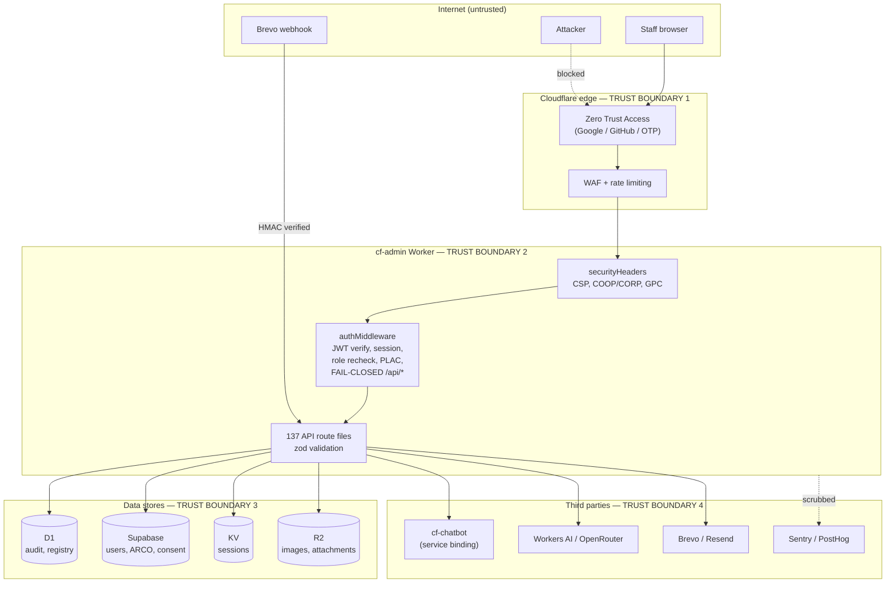

---

title: "Threat Model (STRIDE)"
status: active
audience: [technical, operator, ai, owner]
last_verified: 2026-08-23
verified_against: [code, config]
owner: harshil
related_docs: [SECURITY.md, RoPA.md, ../runbooks/incident-response.md, compliance/ASVS-L2.md, ../architecture/plac-and-audit.md]
tags: [threat-model, stride, security, owasp, asvs, dfd]
---

# Threat Model (STRIDE)

> **TL;DR (non-technical):** A structured list of how someone could attack this
> platform, and what stops them. Written so that the next person to change the
> auth or API layer can see which defences are load-bearing before they move
> something.

## Context / Scope

Closes gap **G8** from
[`../2026-07-22-compliance-certification-audit-all-frameworks-and-roadmap.md`](../2026-07-22-compliance-certification-audit-all-frameworks-and-roadmap.md).
Serves OWASP ASVS V1.1, OWASP Top 10 A04 (Insecure Design), SOC 2 CC3.2 and
ISO 27001 A.5.8.

**In scope:** `cf-admin` — Worker, middleware, API routes, D1/Supabase/KV/R2
access, control-plane connectors.
**Out of scope:** `cf-astro` and `cf-chatbot` internals (trust boundaries with
them are modelled); vendor infrastructure security (inherited, see
[`compliance/ISO-27017-27018.md`](compliance/ISO-27017-27018.md)).

## 1. Data-flow diagram

**Trust boundaries:**

1. **Internet → CF edge.** Identity is established here, not in the app. The
   Worker never sees an unauthenticated request except on the explicit
   allowlist (`/api/health`, `/api/auth/*`) and the HMAC-verified webhook.
2. **Edge → Worker.** The CF Access JWT is *verified* in-app
   (`verifyZeroTrustJwt`) — headers alone are not trusted.
3. **Worker → data.** All access is service-role/binding; the Supabase `anon`
   role has zero grants, zero policies, zero function ACLs.
4. **Worker → third parties.** Outbound only, no user-controlled URLs.

**Public exception — Staff Managed Storage share/request routes.** Two route
families are the one deliberate carve-out in trust boundary 1: they serve
external parties (vendors, vets) who have no portal account, so they cannot
sit behind CF Access.

- `/api/storage/share/[token]` — vendor download links. `GET` is always
  side-effect-free (renders a consent/passcode gateway form only); the actual
  file transfer happens on `POST`, so query-string data is never echoed or
  acted on.
- `/api/storage/request/[token]/*` — inbound File Request Links, letting an
  external party upload a file the staff member asked for. Same GET/POST
  split: `GET` never reads the passcode from the query string, `POST` reads it
  from form data and compares it with `timingSafeEqualStrings()`.

Token model: both are HMAC-signed, self-verifying, time-boxed tokens
(`mintShareToken`/`verifyShareToken`, `src/lib/storage/share-token.ts`) —
possession of the token is the credential, there is no session. An optional
passcode adds a second factor, hashed at rest (`hashPasscode`) and compared
timing-safely. Every access attempt — success or failure — is telemetry
logged to `storage_share_access_logs` (hashed IP, user agent, CF country,
attempt status), independent of whether the request succeeds.

A 2026-08 security pass found and closed a **reflected-XSS-to-session-
takeover chain**: the no-passcode path on `request/[token]/index.ts` embedded
the raw, unvalidated `?passcode=` query value inside an inline `<script>` via
unescaped `JSON.stringify()`, letting a crafted link execute same-origin
script in a staff browser that later followed it. Also closed in the same
pass: a passcode-bypass gap where the upload `presign`/`confirm` endpoints
never re-checked the passcode the landing-page gateway had already enforced,
and two non-timing-safe passcode comparisons (`!==` instead of
`timingSafeEqualStrings`). All three are reflected in the STRIDE rows below as
mitigated, not merely mitigatable.

## 2. STRIDE analysis

### S — Spoofing

| Threat | Mitigation | Residual |
|---|---|---|
| Forged CF Access header | JWT signature verified against the team's JWKS with audience pinning — headers alone never trusted | Low |
| Session hijack | `__Host-` prefix, `Secure`, `HttpOnly`, `SameSite=Strict` (SEC-02); 24h hard expiry | Low |
| Stolen session after role revocation | 30-min role re-check + KV revocation flag + Layer 3 CF session revoke | **Medium** — up to a 30-minute window unless force-kicked |
| Webhook impersonation | HMAC verification (`test/webhook-secret.test.ts`) | Low |

### T — Tampering

| Threat | Mitigation | Residual |
|---|---|---|
| SQL injection | D1 prepared statements + bound params; Supabase client parameterises. SEC-03 forbids raw `env.DB.prepare` in handlers | Low |
| Mass assignment | zod `.strict()` allowlists. **Was High** — `inquiries/edit` accepted `updates: any` straight into a Supabase `.update()`; fixed 2026-07-25 | Low |
| XSS | Nonce-based CSP; `sanitizeHtml` via HTMLRewriter; SEC-08 guards `dangerouslySetInnerHTML` | **Medium** — `script-src` still carries `'unsafe-inline'` pending the Report-Only canary |
| Reflected XSS via public storage link (`?passcode=`) | **Closed 2026-08.** No-passcode `GET` no longer reads or echoes query-string data; the upload gateway's passcode value now flows through an escaped `data-passcode` HTML attribute, never a `JSON.stringify()`'d inline `<script>` | Low |
| Storage upload/passcode bypass | **Closed 2026-08.** `presign`/`confirm` on File Request Links now independently re-verify any configured passcode server-side, and comparisons use `timingSafeEqualStrings()` instead of `!==` | Low |
| CSRF | Origin/Referer validation on every mutation, fail-closed (`test/csrf.test.ts`) | Low |
| Audit-log tampering | Append-only in practice; delete is PLAC-gated and snapshots rows first | **Medium** — no hash chain; an Owner could delete evidence |

### R — Repudiation

| Threat | Mitigation | Residual |
|---|---|---|
| Denying an action | Every mutation audited with actor, role, path, CF-Ray, hashed IP | Low |
| Audit silencing abuse | `is_audit_silenced` exists for solo-dev use and is itself auditable | **Medium** — by design, but a real gap in a multi-operator setting |
| Log gaps | `waitUntil` writes with retry; failures go to Sentry | Low |

### I — Information disclosure

| Threat | Mitigation | Residual |
|---|---|---|
| PII in error tracking | `sendDefaultPii: false` + scrubber (`test/sentry-scrub.test.ts`) | Low |
| Raw IPs at rest | HMAC-SHA-256 with `IP_HASH_SECRET`, never raw | Low |
| Secrets in source | CI secret-scan (blocking); `.dev.vars` gitignored | Low |
| Cross-tenant leakage | **N/A** — single tenant. Becomes the primary risk if multi-tenancy is ever added |
| Search-engine indexing | `robots.txt` + `X-Robots-Tag` (shipped 2026-07-25) | Low |
| Identity documents on ARCO tickets | Supabase RLS + service-role-only access | **Medium** — the most sensitive asset held |

### D — Denial of service

| Threat | Mitigation | Residual |
|---|---|---|
| Brute force / flooding | Cloudflare WAF + Upstash rate limiting on sensitive routes | Low |
| Unbounded bulk operations | Array caps in zod (ids ≤500, bookings ≤200, tags ≤30) | Low |
| Free-tier exhaustion | Quotas and usage dashboards | **Medium** — a determined attacker could burn D1/Workers quota |
| AI cost abuse | Closed model enum, per-user quota, rate limit | Low |

### E — Elevation of privilege

| Threat | Mitigation | Residual |
|---|---|---|
| **Unauthorised API access** | **Fail-closed `/api/*` authorization** (2026-07-25). Previously the decision was computed, audit-logged, then discarded — every route relied on self-guarding | Low |
| Unmapped route bypass | `resolveApiAuthz` returns null → deny; enforced by SEC-07 and a route-inventory test | Low |
| Prefix confusion | Segment-boundary anchored matching — `/api/usersomething` no longer inherits `/api/users` access | Low |
| Role escalation via payload | Client-supplied roles are informational; gates read `locals.user.role` (SEC-04) | Low |
| Dashboard prerender bypass | ESLint hard-errors on `prerender = true` under `src/pages/dashboard/**` | Low |
| Storage PLAC deny bypassed by hardcoded role array | **Closed 2026-08.** `requests/[id].ts` previously OR'd `placDenyResponse(...)` with a hardcoded `['dev','owner',...].includes(user.role)` clause, silently overriding an explicit per-user PLAC deny for those roles. The clause was removed — `placDenyResponse` alone now gates | Low |

## 3. Highest-priority residual risks

Ranked by exploitability × impact:

1. **`'unsafe-inline'` in `script-src`** — materially weakens XSS defence. The
   Report-Only canary is live; the flip is blocked on operator verification of
   Cloudflare Rocket Loader (`MAINTENANCE.md`).
2. **Audit log has no tamper-evidence** — an Owner-role compromise could delete
   evidence of its own actions. A hash chain or append-only export would fix it.
3. **30-minute role-revocation window** — a revoked user may retain access
   until the next re-check unless explicitly force-kicked.
4. **Single-operator concentration** — no separation of duties; the same person
   holds every role in the incident runbook.
5. **No tested DR restore** — recovery is documented but unproven.

## 4. Assumptions

If any of these stops being true, re-run this model:

- Single tenant. Multi-tenancy would make cross-tenant isolation the dominant
  concern and invalidate several "N/A" entries above.
- All operators are trusted employees; the model defends against external
  attackers and compromised accounts, not a determined malicious insider with
  Owner role.
- Cloudflare and Supabase platform security is inherited, not verified.
- No payment-card data and no human health data (see the compliance audit
  §6.1–6.2 for the triggers that would change this).
