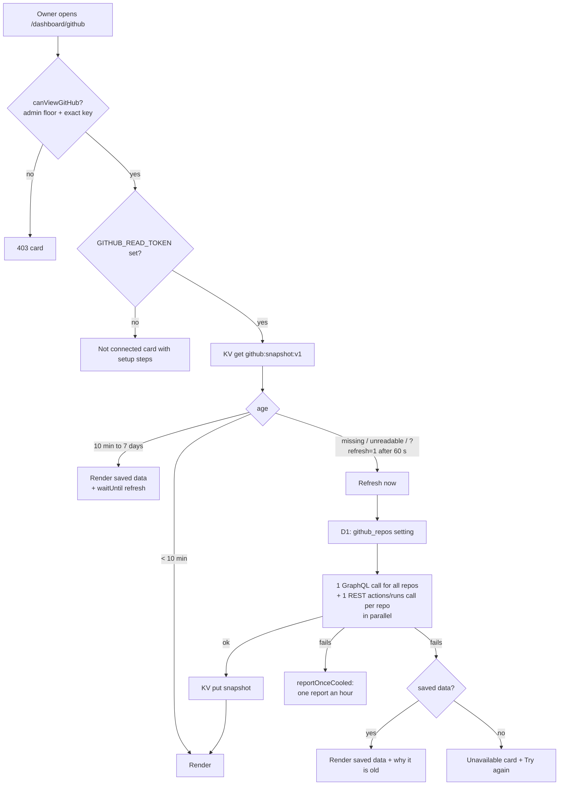

# GitHub page — design

> **In one minute:** a read-only page at `/dashboard/github` shows, for each of the platform's
> repositories, when it last changed ("3 h ago"), its latest commits with their full notes,
> its latest release, its GitHub Actions history and a few counts. It reads GitHub with one
> read-only token, keeps what it read for ten minutes, and does nothing at all when nobody
> has it open: no cron, no polling, no new table, no new package.

## 1. What the owner asked for (2026-10-07)

A page that gives each repository's status, its latest update ("xx hours or days ago"), what the
last commit was for, the notes pushed with it, the GitHub Actions history and other GitHub
stats, for review only. Three conditions:

1. It holds sensitive information, so it sits under PLAC and RBAC like every other page.
2. One fine-grained GitHub token for all of it.
3. Very light: the owner is cutting Cloudflare CPU, KV, D1 and observability use across every
   repository.

## 2. Decisions

Each is a reversible default unless marked as the owner's.

| # | Decision | Why |
|---|---|---|
| D1 | **One fine-grained personal access token** (owner's choice), created **by the `mascotasmadagascar-cmd` account**, read-only, "Only select repositories". | GitHub lets a fine-grained token reach only repositories its creator owns or an organization they belong to. The repositories belong to the personal account `mascotasmadagascar-cmd`; a token made by a collaborator account cannot read them. |
| D2 | Token permissions: **Actions, Contents, Issues, Pull requests**, all read-only, plus the automatic **Metadata**. Nothing else. | Actions = run history; Contents = commits and releases; Issues and Pull requests = the open counts (Dependabot opens pull requests). The page's GraphQL query asks for all four on every repository, and GitHub drops the whole repository from the answer when one permission is missing (§6), so all four are required. |
| D3 | Secret **`GITHUB_READ_TOKEN`**, optional (`src/env.d.ts`, not `[secrets] required`). The owner deletes **`RESEND_WEBHOOK_API`** (no reader, already scheduled for removal) in the same sitting, so the Worker stays at **42** env entries. | RULE #0.8's documented exception: an external credential with no dynamic-config home. It cannot live in D1: `admin_portal_settings` values reach the browser through `getAllSettings()`. |
| D4 | **Not** cf-backup's GitHub App. | Reusing it would widen cf-backup's App permissions and move its private key out of cf-backup, against cf-backup RULES.md 3. It stays the upgrade path if renewing the token every year becomes a burden. |
| D5 | Page **`/dashboard/github`**, registry row `required_role = 'owner'`, category `system`, sort 801 (after Service Control). Sidebar section MANAGEMENT. | Top tier by default. The owner grants it per person on the Access page. |
| D6 | **Admin floor in code** (`canViewGitHub`, floor table `page-floors.ts`): below canonical admin nobody gets in, whatever a grant says, and the sidebar shows the link greyed. | Commit notes and CI history describe the system's internals. The Email API page uses the same floor. |
| D7 | The page asks for its **exact key** (`placRequireGrant`), not the pipeline's inherited `/dashboard` answer. | Until a person's access map is recomputed after migration 0066, the pipeline would let them through on the inherited row. The Email API page has the same issue. Fail closed. |
| D8 | The repository list is **data**: `admin_portal_settings` `github_repos` (JSON array, seeded by 0066), with a code default when it is missing or unreadable. At most 12. | A new service needs no deploy (RULE #0.8). The cap keeps a refresh at 13 outbound requests or fewer, well inside Workers Free's 50. |
| D9 | **No API route, no island, no client JavaScript.** Server-rendered Astro; native `
` for the expandable parts; Refresh is a plain link (`?refresh=1`). | Nothing to gate twice, nothing to ship to the phone, no CSRF surface. |
| D10 | **One KV key** (`github:snapshot:v1` in `SESSION`, kept 7 days), fresh for 10 minutes, then served stale while a background refresh runs. Refresh is ignored within 60 seconds of the last read. | KV is the store cf-admin already uses for this kind of cache (`system:admin_pages_cache_v2`). The Workers Cache API does not work behind Cloudflare Access. |
| D11 | Cache timings are **code constants**, not settings. | Same as `PLAC_REFRESH_MS`: reading them from D1 on every view would cost more than the page. |
| D12 | **No Workers Builds results** on this page. | Workers Builds reports to GitHub as check runs, and fine-grained tokens cannot call the Checks API. Actions runs are shown; deploy status is a follow-up (MAINTENANCE). |

## 3. What the page shows

Per repository, in the configured order:

- name (links to GitHub), private or archived, main language, size;
- **last push**, as "N min/h/days ago";
- commits in the last 7 days, total commits on the default branch, open issues, open pull requests;
- the **5 latest commits** on the default branch: headline, age, author's GitHub login, short SHA;
  the latest one's **full notes** (the commit message body, up to 2,000 characters) behind a
  `
`, with commit trailers removed (§7);
- the **latest release**: tag, date and notes (up to 2,000 characters) behind a `
`;
- **GitHub Actions**: the last 10 runs (workflow, trigger, branch, result, age, link) and a
  summary ("8 passed, 1 failed of the last 10").

Page-wide: when the data was read, a Refresh link, the token's expiry date when it is within 14
days or past, and GitHub's remaining rate limit.

## 4. How it works

Each refresh writes a new snapshot. Repository names travel as GraphQL variables, never pasted
into the query text.

## 5. What it costs

| Event | D1 | KV | Outbound | When |
|---|---|---|---|---|
| Page view, saved data under 10 min old | 0 | 1 read | 0 | almost every view |
| Page view, older | 1 read (the setting) | 1 read + 1 write | 1 + N (N ≤ 12) | at most once per 10 min while someone looks |
| Nobody looking | 0 | 0 | 0 | always |
| GitHub failing | + at most 1 write per hour (the cooled report) | + 1 write per failed try | 1 + N per try, at most one try every 10 min | only during the failure |

Worst case if someone kept it open and reloaded all day: 144 KV writes (the account allows 1,000
a day). Realistic: a handful. A view also pays what every cf-admin page pays (session, nav,
layout); this page adds one KV read to that.

## 6. Failure modes, and what the person sees

| Failure | What happens |
|---|---|
| No token set | "GitHub is not connected" card with the setup steps. No outbound call. |
| Token expired or revoked (401) | Saved data with "GitHub refused the token…" and its age; or the unavailable card. The failure is kept beside the snapshot, so later views show it too and GitHub is not asked again for 10 minutes (a Refresh is honoured after 1). The snapshot keeps its original expiry. One report an hour. |
| GitHub slow (8 s GraphQL, 6 s REST timeouts) or down | Same as above, with "did not answer". |
| One repository not in the token, renamed, or deleted | That card says "GitHub did not return this repository" with GitHub's own message. The rest of the page is unaffected. |
| One permission missing from the token | Expected from GraphQL's null rule (the asked-for counts cannot be null, so the repository itself comes back null): every card shows GitHub's message (for example "Resource not accessible by personal access token") instead of vanishing. Fix: add the permission (D2). Confirmed with the real token at go-live. |
| One repository's Actions call fails | That card says "Actions history unavailable". The rest is unaffected. |
| KV down, or a corrupt or old-format value | Treated as nothing saved: the page reads GitHub live and still renders. A failed write is logged, not thrown. |
| Refresh link tapped repeatedly | Ignored within 60 seconds of the last read. |
| Two tabs refresh at once | Both write a valid snapshot; the last write wins. No partial state. |

## 7. Security and privacy

- The token is read in one place (`src/lib/github/cache.ts`) and sent only to `api.github.com`. A
  `GitHubError` carries GitHub's status and message, never a request header.
- No email addresses: commits keep only the author's GitHub login; the notes lose their
  `Co-Authored-By:` / `Signed-off-by:` style trailers (each carries an address); the Actions
  mapping copies named fields only, dropping the email that GitHub embeds in `head_commit`.
  Release notes are kept as written.
- No workflow logs are fetched. The page links to GitHub for them.
- Every value is rendered as text by Astro; there is no `set:html` (a test pins it).
- GitHub logins are cached in KV for up to 7 days (RoPA entry).

## 8. Rules this follows

- **RULE #0.6 (outside service):** GitHub is new to cf-admin. Nothing existing holds repository
  data; the owner asked for it by name.
- **RULE #0.7 / #0.7b:** migration `0066_github_page.sql`, data only (one `admin_pages` row, one
  `admin_portal_settings` row), applied before the push, with its ledger row and manifest
  entry. The live `d1_migrations` showed `0065` as the latest on 2026-10-07.
- **RULE #0.8:** a credential secret swapped one-for-one (D3); the repository list is D1 data.
- **RULE #0.9:** no new table.
- **§7.3 dependencies:** none added; plain `fetch`.

## 9. Owner steps

1. Signed in to GitHub **as `mascotasmadagascar-cmd`**: Settings → Developer settings → Personal
   access tokens → Fine-grained tokens → Generate new token. Name `cf-admin GitHub page
   (read-only)`; resource owner `mascotasmadagascar-cmd`; expiration 366 days; Only select
   repositories: the five in `github_repos`; Repository permissions, all Read-only: Actions,
   Contents, Issues, Pull requests (Metadata is added by GitHub).
2. In the `cf-admin` folder: `npx wrangler secret put GITHUB_READ_TOKEN` (paste the token), then
   `npx wrangler secret delete RESEND_WEBHOOK_API`.
3. Say yes to applying migration `0066` to production and to pushing `main`.

## 10. Not in this change

Workers Builds deploy status (D12), an editor for `github_repos`, Actions minutes and billing,
and webhooks. Each would add cost or surface the owner did not ask for.

## Verification log

| Date | Who | Checked | Not checked |
|---|---|---|---|
| 2026-10-07 | claude | Live `d1_migrations` (latest `0065`); `admin_pages` categories and sort orders; `wrangler secret list` (25 secrets, `RESEND_WEBHOOK_API` has 0 readers in `src/`); repositories under `mascotasmadagascar-cmd` (`gh repo list`; account type User); GitHub docs: fine-grained tokens cannot call the Checks API and can call GraphQL (changelog 2023-04-27); `GitHub-Authentication-Token-Expiration` header (changelog 2021-07-26) | The token itself (not created yet); the page's CPU (measured after deploy) |
