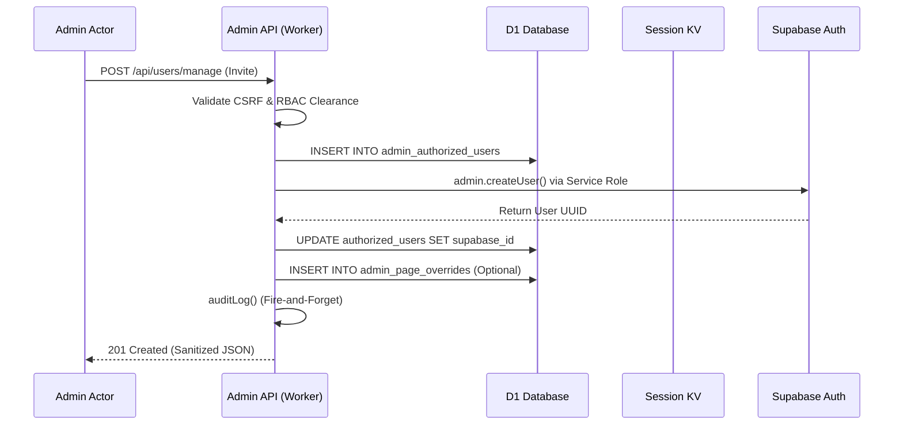
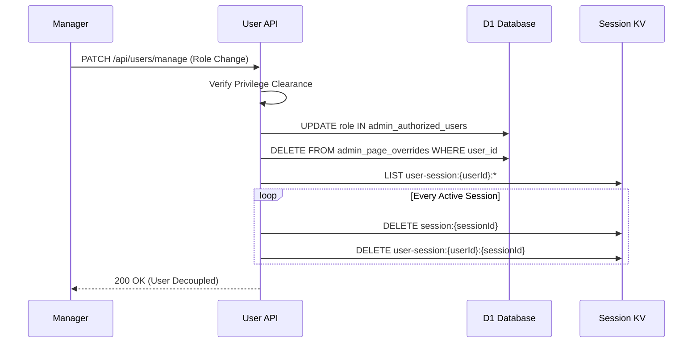


# Manage Users & RBAC Architecture

> **Component:** CF-Admin Role-Based Access Control (RBAC) System
> **Framework:** Astro 6 + Preact + Cloudflare Workers
> **Auth Provider:** Supabase GoTrue (Admin API / Service Role)
> **Last Updated:** 2026-04-14 (Bug-fix pass: CSRF dev fix, AuthError propagation, force-kick on lock, O(1) DELETE, lazy page fetch)

This document details the exact flow and architecture for managing administrative access within the internal admin portal (`cf-admin`).

## 1. System Overview & Security Posture

The CF-Admin portal operates under strict zero-trust principles optimized for Cloudflare's serverless environment:
- **Signups Disabled:** General signups are completely disabled in the Supabase GoTrue dashboard. Nobody can randomly create an account.
- **Whitelist-Driven Authentication:** Application access is heavily gated by a custom authorization whitelist table in D1.
- **Service-Role Isolation:** Magic links, User Creations, and Roles are managed exclusively via the `service_role` key accessed *only* server-side within the Cloudflare Worker.
- **CSRF Protection:** All mutation requests are validated via stateless Origin + Referer header checking, applied globally by middleware.
- **Error Sanitization:** All API error responses return generic messages — no internal stack traces, SQL errors, or schema details leak to the client.
- **Ghost Protection (Session Sweep):** Role mutations trigger a synchronous session invalidation across KV to prevent privilege persistence.

### Technical Interaction Model



## 2. Role Hierarchy (5-Tier)

Access levels operate dynamically based on strict numeric permissions (lower number = higher clearance). Defined centrally in the RBAC module:

| Level | Role | Capabilities |
|:-----:|:-----|:------------|
| **0** | **DEV** ⚡ | Absolute system access + hidden account creation + dev tools + DB admin |
| **1** | **Owner** 💎 | Project ownership + billing + API keys + view hidden accounts |
| **2** | **SuperAdmin** 👑 | Full access + user management + settings (cannot see hidden accounts) |
| **3** | **Admin** 🛡️ | Content management + bookings + reports. Cannot manage users. |
| **4** | **Staff** 👤 | Standard entry level, read-only metrics, minimal interaction. |

### Color Hierarchy: Thermal Gradient

The badge colors follow a **thermal gradient** designed for maximum readability on dark UI surfaces — progressing from Red (danger/system) through Emerald (ownership), Amber (authority), Purple (management), to Blue (operations).

### Hierarchy Logic Gate

Permission checks are performed using an integer-based comparison of the `ROLE_LEVEL` map.
- **Logic**: `ROLE_LEVEL[userRole] <= ROLE_LEVEL[requiredRole]`
- **Implementation**: `src/lib/auth/rbac.ts`

| Function | Logic | Purpose |
|----------|-------|---------|
| `hasPermission` | `userLvl <= reqLvl` | Core O(1) gatekeeper |
| `isDev` | `role === 'dev'` | Lock critical system internals |
| `isOwner` | `userLvl <= 1` | Billing and Ownership clearance |
| `isOwnerOrDev` | `userLvl <= 1` | Access to hidden/ghost account visibility |
| `isSuperAdmin` | `userLvl <= 2` | User Management clearance |
| `isAdmin` | `userLvl <= 3` | Content & Bookings clearance |

### 3.1 Session Revocation Workflow (Ghost Sweep)

When a user's role is changed or their account is deactivated, the system triggers a **Security Cascade** to prevent stale sessions from retaining high-privilege access.



**Reverse-Index KV Pattern**: 
Instead of scanning the entire session KV (which could be thousands of keys), we maintain a secondary index `user-session:{userId}:{sessionId}: '1'`. This allows the API to perform a targeted `LIST` operation and delete only relevant sessions in `O(sessions_per_user)` time instead of `O(total_sessions)`.

## 4. Hidden Accounts System

A special feature allowing **completely invisible** admin accounts for covert operations or monitoring.

| Aspect | Detail |
|--------|--------|
| **Storage** | A boolean flag in the authorized users table marks accounts as hidden |
| **Creation** | DEV-only — via the user management API with hidden flag enabled |
| **Visibility** | Only DEV and Owner see hidden accounts in user listings |
| **Anti-Enumeration** | Hidden accounts are excluded from user counts shown to lower roles. Unauthorized queries receive an identical 404 response shape whether or not the account exists. |

## 5. User Lifecycle Management (API Architecture)

The user management API endpoint securely bridges Supabase GoTrue logic. All mutations are gated by CSRF validation and RBAC hierarchy checks.

### 5.1 Inviting/Authorizing a New User
When an authorized admin adds a new member from the dashboard:
1. **Frontend Request:** UI validates inputs (Email, Role, Display Name) via the Invite Modal (Preact island).
2. **Page Access Fetch:** Modal lazy-fetches the page registry on the **first modal open** (not on component mount) — live page list from D1, zero hardcoding. Cached after first load; full error state and retry button shown on failure.
3. **CSRF Validation:** Middleware verifies Origin/Referer headers match the site URL.
4. **Endpoint Validation:** Endpoint verifies the requesting user has sufficient rank and prevents privilege elevation.
5. **Whitelist Insertion:** User details are inserted into the authorization table with active status enabled.
6. **GoTrue Admin Creation:** The Worker calls the Supabase Admin API to register the user, confirming email and setting role metadata.
7. **Page Override Batch Write:** If the admin customised page access during creation, overrides are batch-inserted using the new user's GoTrue UUID. Batch is capped at 50 overrides.
8. **Audit Log:** Mutation is logged via Ghost Audit Engine.

> **Non-fatal override writes:** If the batch override write fails, user creation still succeeds. The admin can set page permissions manually via the Page Access Manager after creation.

### 5.2 Role Selection UI (Invite Modal)
The Invite Modal renders a "Command Console" two-panel dialog:

**Left panel — Identity:**
- **Role Pill Selector**: 2×2 pill grid with role-specific colors. Roles at or above actor's level are greyed-out/disabled (server enforces this too).
- **Hidden Account Toggle**: Ghost-mode toggle only rendered for DEV and Owner actors.
- Email + Display Name inputs, Grant Access + Cancel buttons.

**Right panel — Page Access:**
- **Page Chip Grid**: Live page list fetched lazily on first modal open. Grouped by section (MAIN / CONTENT / TOOLS / MANAGEMENT). Error state with retry button displayed if fetch fails.
- Chips have four states:
  - `default_on` (●) — role naturally has access, no override written
  - `default_off` (○) — role has no natural access, no override written
  - `force_grant` (+) — click to grant above role baseline (override written)
  - `force_deny` (✕) — click to deny despite role baseline (override written)
- Click once to force-override; click again to revert to role default.
- Override count badge shown when customisations are active.

### 5.3 Restoring / Enabling Access
Access is managed via the active flag in the authorization table. When set to true, the login portal accepts the user's JWT.

### 5.4 Revoking / Locking Access
If a user needs immediate revocation:
1. **Soft Lock:** PATCH the user management endpoint with active flag set to false. The middleware guard immediately rejects future requests. The GoTrue UUID is resolved via the auth schema, then force-logout destroys active KV sessions immediately.
2. **Hard Lock (Force Logout):** Uses the reverse-index KV pattern for O(k) session destruction rather than O(n) full KV scan.
3. **Full Nuke:** Resolves the GoTrue UUID via the auth schema (O(1) — no full user list scan), force-kicks all KV sessions, then calls the Supabase Admin API to delete the user and removes the whitelist row.

## 6. UI Implementation (Manage Users Dashboard)

The interface is composed of multiple Preact islands:

| Component | Purpose |
|-----------|---------|
| **Users Manager** | Main orchestrator — user list, search, role filtering. Dispatches events to open invite modal |
| **User Card** | Individual user card with role badge, actions, permission display |
| **Page Access Manager** | Per-user PLAC override toggle grid (for existing users) |
| **Invite User Modal** | Two-panel "Command Console" Preact island |
| **Role Pill Selector** | Atomic: 2×2 role pill grid with RBAC-gated availability |
| **Hidden Account Toggle** | Atomic: ghost-mode toggle (DEV/Owner only) |
| **Page Chip Grid** | Atomic: interactive chip grid grouped by section, 4 chip states |

### Event Bus (Cross-Island Communication)
The modal uses CustomEvents for decoupled island-to-island messaging:

| Event | Direction | Purpose |
|-------|-----------|---------|
| Modal open | Users Manager → Invite Modal | Opens the creation dialog |
| User invited | Invite Modal → Users Manager | Triggers user list refresh |

### Filter Tabs
| Tab | Shows |
|-----|-------|
| **All** | All visible users (excluding hidden unless DEV/Owner) |
| **Admins** | Users with high-privilege roles (dev, owner, super_admin) |
| **Staff** | Users with operational roles (admin, staff) |

## 7. Security Boilerplates & Error Flow

All actions within the API routes return specific error states handled by the UI:
- `401 Unauthorized` → Render standard "Session Expired" overlay
- `403 Forbidden` → Render "Insufficient Permissions / Action Locked" message
- `405 Method Not Allowed` → Block manual HTTP verb injections
- `400 Bad Request` → Return sanitized error (no internal details)

### Auth Error Propagation

The auth guard throws a typed error with explicit HTTP status (401 or 403) so callers can return the correct status instead of a generic 500. API route catch blocks check for this specific error type before falling back to generic 500 handling.

### Local Dev CSRF

The site URL **must** be set in the local development environment. If absent, the middleware falls back to the production URL and every mutation fails with 403.

## 8. Page-Level Access Control (PLAC) System

For detailed PLAC documentation, see the dedicated [PLAC & Audit document](./PLAC_AND_AUDIT.md).

**Key integration with User Management:**
- The Page Access Manager renders a toggle grid showing all pages and their access state for a target user.
- Changes save immediately via optimistic UI with toast confirmation.
- Pages the actor cannot modify are shown locked (grayed out with lock icon).
- **Role Mutation Pipeline (Ghost Protection Invalidation):** Changing a user's role is a high-risk event. Any role update triggers a synchronous security cascade:
  1. `resetUserOverrides`: Purges all historical custom page overrides, returning the user to a clean RBAC state.
  2. `forceLogoutUser`: Immediately destroys the user's active KV session to prevent privilege escalation via stale tokens.

## 9. API Data Contracts

All administrative user management actions are performed via `POST`, `PATCH`, and `DELETE` methods on the `/api/users/manage` endpoint.

### 9.1 POST /api/users/manage (Invite User)

**Request Payload:**
```json
{
  "email": "user@example.com",
  "displayName": "John Doe",
  "role": "admin",
  "is_hidden": false,
  "pageOverrides": [
    { "pagePath": "/dashboard/settings", "granted": true }
  ]
}
```

**Success Response (201):**
```json
{
  "success": true,
  "message": "User authorized successfully."
}
```

**Common Error (403):**
```json
{
  "success": false,
  "error": "Target role exceeds your authorization clearance"
}
```

### 9.2 PATCH /api/users/manage (Modify User)

**Request Payload:**
```json
{
  "email": "user@example.com",
  "is_active": false,
  "display_name": "John Updated",
  "role": "staff"
}
```

**Success Response (200):**
```json
{
  "success": true
}
```

## 10. Operational Resilience & Failure Modes

The system is designed to "fail-closed" across various infrastructure disruptions.

| Failure Event | System Impact | Mitigation / Fallback |
|---------------|---------------|-----------------------|
| **KV Read Timeout** | Session cannot be verified | Request is rejected (401). Prevents unauthorized access on cache failure. |
| **D1 Write Failure** | Permission change not saved | API returns 500. UI shows error, no state change occurs. |
| **KV Write Failure** | Force-logout command fails | User remains logged in until next 30m JWT refresh, where role mismatch is detected. Audit log preserves the attempt. |
| **Supabase Outage** | Invitation/Auth fails | Whitelisting is rolled back atomically to prevent orphaned records. |

### Session Timing Matrix

| Component | Duration | Logic |
|-----------|----------|-------|
| **JWT Validity** | 30 Minutes | High-pulse refresh ensures role changes propagate quickly. |
| **Hard Expiry** | 24 Hours | All sessions must re-authenticate via Magic Link/SSO daily. |
| **KV Expiry** | 24 Hours | Session keys are set with `expirationTtl` matching max lifetime. |

