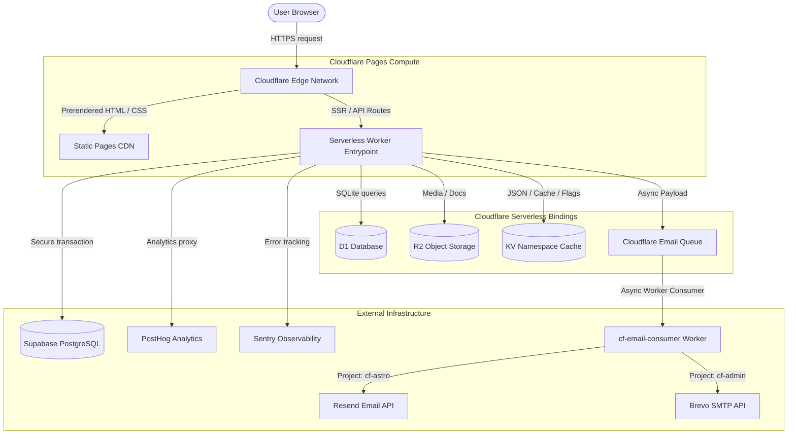


# System Architecture & Technical Operations Manual

This document provides a comprehensive, production-grade technical reference for the **cf-astro** application (Hotel para Mascotas Madagascar). It covers high-level business context, system architecture, database design, API routing, edge feature flags, asynchronous email pipelines, deployment configurations, and runtime resource limits.

---

## 1. Business Context & Migration Rationale

**Hotel para Mascotas Madagascar** is a luxury pet hotel and boarding business located in Aguascalientes, Mexico. The application (`madagascarhotelags.com`) serves both as a public marketing presence and a fully bilingual (ES/EN) customer booking platform.

Originally constructed with Next.js on Vercel, the application was systematically migrated to **Astro 6** deployed on **Cloudflare Pages** to achieve three fundamental business goals:

- **Zero-Cost Edge Infrastructure**: Fully utilizes Cloudflare's free tiers for static CDNs, serverless Workers, D1 SQL databases, R2 media storage, and KV namespaces.
- **Flawless SXO (Search Experience Optimization)**: Achieves instantaneous loads and a 100/100 Core Web Vitals score by defaulting to zero client-side JavaScript for marketing pages, utilizing Astro's component framework to prerender optimized HTML at build time.
- **Ultra-Fast Global Execution**: Serving all static content from Cloudflare's CDN and dynamic API endpoints from low-latency edge Workers located physically close to users in Mexico.

---

## 2. High-Level Architecture & Technical Stack

The entire application runs distributed at the network edge on the Cloudflare Edge network:



### Technical Stack Mapping

- **Framework**: Astro 6.1.2+ configured with the official `@astrojs/cloudflare` adapter.
- **Rendering Strategy**: Static-first Hybrid model (`output: 'static'`). Pages are precompiled to pure HTML unless explicitly marked with `export const prerender = false` (which triggers edge SSR).
- **Styling**: Tailwind CSS v4 utilizing the high-performance `@tailwindcss/vite` compiler plugin for lightning-fast builds.
- **Hydration Core**: Preact 10+ islands (`@astrojs/preact` configured with Vite `compat: true` for React ecosystem interoperability).
- **Validation Engine**: Zod ^3.25.0 for strict, typed, runtime parsing of client inputs and config variables.

---

## 3. Configuration Profiles & Edge Bindings

The application maps runtime environments, variables, and resources via three primary configuration artifacts:

### 3.1 `astro.config.ts`

Establishes the core compilation rules, internationalization routing, and build plugins:

- **`trailingSlash: 'always'`**: Enforces trailing slashes on all routes to prevent duplicate indexation and split canonical authority in search engines.
- **`i18n`**: Configured with `defaultLocale: 'es'` (Spanish) and `locales: ['es', 'en']` (English) with `prefixDefaultLocale: true` (ensuring URLs always start with explicit locale slugs, e.g., `/es/` or `/en/`).
- **`passthroughImageService()`**: Disables Astro's CPU-heavy local image optimization. Optimization is handled dynamically at the edge by Cloudflare Images/R2 custom domains.
- **`__BUILD_ID__` & `__LAST_UPDATED__`**: Injected at compile time to scope ISR cache layers and provide precise sitemap modified metadata.

### 3.2 `wrangler.toml`

Defines the Cloudflare Pages environment, build directory (`./dist`), compatibility flags (`compatibility_flags = ["nodejs_compat"]`), and system bindings:

- **`DB` (D1 Database)**: Binds the local SQLite engine for fast content delivery and dead-letter queue audits.
- **`ISR_CACHE` (KV Namespace)**: Caches HTML page structures and CMS content blocks. _(Note: standard static assets like images and fonts bypass KV entirely and are cached natively by Cloudflare's CDN using `public, max-age=31536000, immutable`)._
- **`SESSION` (KV Namespace)**: Stores transient session ids and validation state.
- **`EMAIL_QUEUE` (Queue)**: Handles async email payloads to protect the user from booking timeouts.

---

## 4. Edge API Routes & Data Pipelines

### 4.1 System API Reference

| Endpoint                | Method | Prerender | Security                                | Purpose                                                          |
| ----------------------- | ------ | --------- | --------------------------------------- | ---------------------------------------------------------------- |
| `/api/booking`          | `POST` | `false`   | CSRF + Turnstile + Upstash Rate Limit   | Processes atomic booking transaction across D1 and Supabase.     |
| `/api/revalidate`       | `POST` | `false`   | Bearer Token (Constant-Time comparison) | Purges KV Cache and updates CMS data blocks.                     |
| `/api/ingest/[...path]` | `ALL`  | `false`   | Transparent Proxy                       | Obfuscates PostHog analytical calls to prevent ad-blocker drops. |
| `/api/privacy/arco`     | `POST` | `false`   | CSRF + Turnstile + Rate Limit           | Handles Mexican LFPDPPP legal data requests.                     |
| `/api/consent`          | `POST` | `false`   | Zod + Rate Limit                        | Hashes and logs GDPR/LFPDPPP privacy agreements.                 |

### 4.2 The Atomic Booking Transaction

The booking submission flow is designed with extreme resilience to avoid losing customer data under high-load conditions or database outages:

```
[BookingWizard (Preact Island)]
               │
               ▼  (POST JSON Payload)
   [/api/booking (Worker SSR)]
               │
               ├─► [1. CSRF + Turnstile Validate] (Fails closed)
               │
               ├─► [2. Write Attempt to D1 `booking_attempts`] (Dead-Letter Logger)
               │
               ├─► [3. Execute Supabase PG Transaction]
               │         ├─► Insert into `bookings` (Generates PK)
               │         ├─► Insert into `consent_records` (Foreign Key linked)
               │         ├─► Insert into `booking_pets` (Multi-relations mapped)
               │         └─► Log email audit queue record
               │
               ├─► [4. Push JSON paylods to `env.EMAIL_QUEUE`]
               │
               ▼  (Return 200 OK + bookingRef)
        [Confirmation UI]
```

### 4.3 3-Tier CMS Content Fallback Strategy

Marketing page texts, service pricing tables, and blog posts are loaded via a robust 3-tier fallback matrix inside Astro component frontmatter to guarantee that the site renders even if the database is completely offline:

1. **`ISR_CACHE` KV (`cms:<key>`)**: The primary high-speed layer. Injected directly by the CMS revalidation webhook.
2. **D1 SQL Database (`cms_content`)**: The local edge database. Queried via `getJsonBlock(db, group, key)` if KV returns null.
3. **Static Locale files (`es.json` / `en.json`)**: Code-level fallbacks. Hardcoded dictionary texts that ensure standard structures render instantly if all databases are unreachable.

---

## 5. Edge Feature Routing & Configuration

Feature flags are queried instantly at the edge without requiring server restarts or rebuilds:

1. **Administrative Flags**: Managed inside the `cf-admin` CMS, setting boolean values in D1's `admin_feature_flags` table.
2. **Caching Middleware**: Astro middleware intercepts all requests, reading the flags from D1 and cache-wrapping them inside KV under the key `features:global` with a 60-second TTL.
3. **Context Hydration**: The cached flags are populated into `Astro.locals.features` and made instantly available to Astro components during SSR compile loops.

---

## 6. Email Infrastructure & Async Queue Pipeline

To prevent slow third-party API networks from causing booking timeouts, the email infrastructure is fully decoupled:

### 6.1 Queue Producer (`cf-astro`)

The booking API route constructs two email payloads (one for customer confirmation, one for admin alerts) and pushes them to `env.EMAIL_QUEUE`. The booking route returns `200 OK` instantly, bypassing synchronous wait states.

### 6.2 Queue Consumer (`cf-email-consumer`)

An isolated, lightweight worker sidecar consumes the queue:

- **Absolute Code Isolation**: The consumer worker is completely decoupled from `cf-astro`. It must never import Drizzle ORM schemas or Astro layouts to prevent cyclic compilation failures.
- **Email Assembly**: Uses the high-performance **Eta** template engine to format elegant HTML layouts.
- **Dual-SMTP Provider Router**: The consumer dynamically inspects the `projectSource` of the payload. It delivers `cf-astro` emails via **Resend's HTTP API** and `cf-admin` emails via **Brevo's SMTP API**, maximizing deliverability and leveraging higher quotas.

### 6.3 Delivery Webhooks & Observability

- **Webhook Endpoint**: `POST /api/webhooks/resend` captures delivery, bounces, and complaints.
- **Security**: Because the Edge Worker lacks standard Node.js crypto binaries, signature verification is computed manually using the **Web Crypto API** (`crypto.subtle.verify`) matching Svix HMAC-SHA256 headers.
- **Audit Log**: Verified webhook events are pushed into the `email_audit_logs` Supabase table inside a JSONB `delivery_events` array for auditing.

---

## 7. Operations, Provisioning & Local Development

### 7.1 Local Development Commands

```bash
# 1. Install precise dependencies
npm install

# 2. Run local Astro dev server with HMR
npm run dev

# 3. Clean Vite caches and start dev server
npm run dev:clean

# 4. Preview build locally with full Cloudflare proxy bindings (D1, KV, R2)
npm run cf:dev

# 5. Compile production build
npm run build

# 6. Apply database migrations to local D1 instance
npm run db:migrate

# 7. Apply database migrations to production D1 instance
npm run db:migrate:remote
```

### 7.2 Manual Provisioning Guide

If deploying the infrastructure from scratch on a new Cloudflare account, execute these steps in order:

```bash
# 1. Create the D1 Database
npx wrangler d1 create madagascar-db

# 2. Apply initial schemas to production D1
npx wrangler d1 migrations apply madagascar-db --remote

# 3. Create the KV cache namespaces
npx wrangler kv:namespace create ISR_CACHE
npx wrangler kv:namespace create SESSION

# 4. Bind Secrets to Pages Worker
npx wrangler secret put DATABASE_URL        # Supabase postgres:// URL
npx wrangler secret put RESEND_API_KEY      # Resend API Auth Token
npx wrangler secret put REVALIDATION_SECRET  # Webhook bearer key
npx wrangler secret put SENTRY_AUTH_TOKEN    # Sentry source map uploader token
```

---

## 8. Domain Routing & DNS Setup

Because `cf-astro` is deployed to Cloudflare Pages, cross-domain redirection (such as forcing `www.madagascarhotelags.com` to redirect to the apex `madagascarhotelags.com`) **cannot** be handled via the static `public/_redirects` file due to edge container limits.

These redirects must be configured manually inside the **Cloudflare Dashboard**:

1. Navigate to your Domain Zone > **Rules** > **Redirect Rules**.
2. Create a rule:
   - **Expression**: `(http.host eq "www.madagascarhotelags.com")` or `(http.host eq "cf-astro.pages.dev")` or `(http.host eq "pet.madagascarhotelags.com")`.
   - **Type**: Dynamic 301 Redirect.
   - **Target URL**: `concat("https://madagascarhotelags.com", http.request.uri)`
   - **Preserve Query String**: Enabled.

This completely resolves GSC "Redirect errors" and consolidates search rank authority onto the apex domain.

---

## 9. Operations, Free Tier Limits & Resource Budgets

The system operates strictly inside Cloudflare's free tier quotas, ensuring monthly operational cost is exactly **$0 USD**:

| Resource                | Current Usage | Cloudflare Free Tier Limit | Status       |
| ----------------------- | ------------- | -------------------------- | ------------ |
| **Pages Builds**        | ~30 / month   | 500 / month                | 🟢 Excellent |
| **Worker Requests**     | ~1,200 / day  | 100,000 / day              | 🟢 Excellent |
| **D1 Rows Read**        | ~5,000 / day  | 5,000,000 / day            | 🟢 Excellent |
| **D1 Rows Written**     | ~150 / day    | 100,000 / day              | 🟢 Excellent |
| **KV Storage Capacity** | ~2 MB         | 1 GB                       | 🟢 Excellent |
| **R2 Storage Capacity** | ~450 MB       | 10 GB                      | 🟢 Excellent |

---

## 10. AI & Human Extension Guide (Invariants)

To ensure this codebase remains perfectly editable, maintainable, and robust for both human teams and future AI coding models, strictly follow these structural guidelines:

> [!WARNING]
> **System Architectural Invariants**
>
> 1. **Do Not Introduce Local Image Processors**: Never replace `passthroughImageService()` with `@astrojs/image` or standard Sharp compilation. Doing so will break static SSR execution limits on Cloudflare Pages Workers (1MB container limit).
> 2. **Never Import Database Schemas in Email Consumer**: The `cf-email-consumer` worker must remain 100% decoupled from `cf-astro/src/db` and Drizzle schemas. Any imports between them will break build cycles and cause module resolution crashes during bundle packaging.
> 3. **Preserve `trailingSlash: 'always'`**: All page-level generation logic, routing hooks, and canonical calculations rely on trailing slashes. Changing this parameter will immediately throw 404/301 loops in production.


