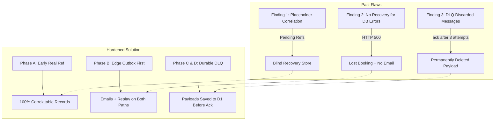
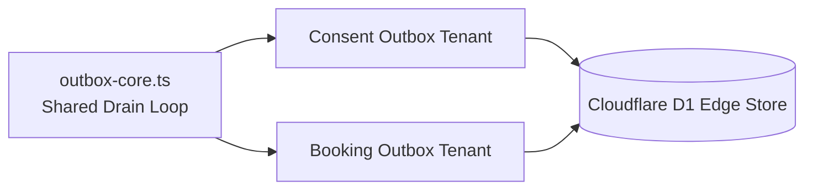


---
title: 'Codebase Assessment, Progress Tracking & Edge Architecture'
status: active
audience: [technical, ai, operator]
last_verified: 2026-08-28
verified_against: [code, tests, checklist, live-infrastructure]
owner: harshil
related_docs:
  [../../RULES.md, ../../AGENTS.md, ../SYSTEM-ARCHITECTURE.md, ../CONSENT-RECORD-SYSTEM.md]
tags: [assessment, progress, quality, health, resilience, observability, durability]
---

# 📊 Codebase Assessment & Progress Tracking Ledger

[](#)
[](#)
[](#)
[](#)
[](#)

> [!NOTE]
> **Target Application:** `cf-astro` (Astro 7 SSR + Cloudflare Workers + Preact)  
> **Last Comprehensive Audit:** August 2026  
> **Primary Goal:** Maximum uptime, durability, and privacy with **$0/month infrastructure cost**.

> [!IMPORTANT]
>
> ### 🔒 Publication & Redaction Policy
>
> This document syncs to a **public** repository. It therefore strictly adheres to the following rules:
>
> - **No database schematics.** No table names, column names, DDL, migration contents, or query text. Data mechanisms are described by their _behaviour_, not their shape. (If you need the schema, read the migrations in the private repo — never mirror them here).
> - **No infrastructure identifiers.** No account IDs, database or namespace UUIDs, project references, or hostnames.
> - **No personal data.** No customer emails, names, or phone numbers.
> - Secret _names_ appear (they are already public in `.env.example`). Secret _values_ never do.

---

## 📑 Table of Contents

1. [Executive Summary & Verification Baseline](#1-executive-summary--verification-baseline)
2. [Architectural Invariants Ledger ("DO NOT POKE")](#2-architectural-invariants-ledger-do-not-poke)
3. [Booking Durability Overhaul](#3-booking-durability-overhaul)
4. [System-Wide Observability & Stability Floor](#4-system-wide-observability--stability-floor)
5. [Comparative Metrics Matrix](#5-comparative-metrics-matrix)
6. [Resilience & Multi-Tier Failover Model](#6-resilience--multi-tier-failover-model)
7. [Work Done & Progress Ledger](#7-work-done--progress-ledger)
8. [Known Gaps & Follow-Ups](#8-known-gaps--follow-ups)
9. [Maintenance Recommendations](#9-maintenance-recommendations)

---

## 1. Executive Summary & Verification Baseline

Full-spectrum static analysis, security validation, and test suite audit, followed by a durability overhaul of the booking path and a system-wide observability floor.

| Category             | Command                        | Result      | Details                                                    |
| :------------------- | :----------------------------- | :---------- | :--------------------------------------------------------- |
| **P0 Security**      | `.agents/scripts/checklist.py` | 🟢 **PASS** | 0 vulnerabilities, least-privilege DB role, secure headers |
| **P1 Lint**          | `npm run lint`                 | 🟢 **PASS** | **0 errors, 0 hints** (all pre-existing hints resolved)    |
| **P1 Types**         | `npm run typecheck`            | 🟢 **PASS** | 164 files — 0 errors, 0 warnings, 0 hints                  |
| **P2 Data Layer**    | `npm run db:check`             | 🟢 **PASS** | Migration chain and schema in 100% sync (0 drift)          |
| **P3 Testing**       | `npm run test`                 | 🟢 **PASS** | **20 files, 180 tests** (was 15 files / 109 tests)         |
| **P4 Accessibility** | `a11y_check.py`                | 🟢 **PASS** | 6 rules over 81 files, 0 findings                          |
| **P5 SEO**           | `seo_checker.py`               | 🟢 **PASS** | Trailing slash consistency, sitemaps, OpenGraph, JSON-LD   |

> [!TIP]
> **Pre-flight command correction:** The checklist script lives at `.agents/scripts/checklist.py` — **plural**, at the **parent repo root**, run from the workspace parent directory, not from inside `cf-astro/`. It was documented as `.agent/` in both `main.md` and `GITHUB_RULES.md` until 2026-08-28, meaning the mandated deployment gate had never actually been runnable as written. Both files are now corrected.

---

## 2. Architectural Invariants Ledger ("DO NOT POKE")

The following patterns are **deliberate, incident-hardened production choices**. Never alter or remove during a refactoring pass without explicit owner sign-off:

```
┌──────────────────────────────────────────────────────────────────────────────┐
│                        CRITICAL ARCHITECTURAL INVARIANTS                     │
├────────────────────────────────┬─────────────────────────────────────────────┤
│ Invariant                      │ Operational Rationale                       │
├────────────────────────────────┼─────────────────────────────────────────────┤
│ No Turnstile on Booking/Contact│ Life-safety-adjacent booking path for pets. │
│                                │ Widget failures must never drop bookings.   │
├────────────────────────────────┼─────────────────────────────────────────────┤
│ Audit-First Ordering           │ The raw attempt is recorded locally BEFORE  │
│                                │ origin or rate-limit checks can reject it.  │
├────────────────────────────────┼─────────────────────────────────────────────┤
│ Fail-Open Rate Limiting        │ Upstash → shared KV → allow. Never 503 a    │
│                                │ legitimate booking or contact request.      │
├────────────────────────────────┼─────────────────────────────────────────────┤
│ Strict Origin Check on POST    │ CSRF defence stays strict. Rejections are   │
│                                │ now ALERTED rather than silently dropped.   │
├────────────────────────────────┼─────────────────────────────────────────────┤
│ Least-Privilege DB Access      │ Dedicated writer role over raw Postgres.    │
│                                │ No admin credential on any request path.    │
├────────────────────────────────┼─────────────────────────────────────────────┤
│ Async Decoupled Email          │ Enqueue to the shared queue; a sidecar      │
│                                │ worker sends, with provider failover.       │
├────────────────────────────────┼─────────────────────────────────────────────┤
│ Outbox-Before-Database         │ NEW. The canonical payload is made durable  │
│                                │ at the edge BEFORE the database is touched, │
│                                │ for consent AND bookings. Never reorder.    │
├────────────────────────────────┼─────────────────────────────────────────────┤
│ Success Response on DB Failure │ NEW. The booking API returns success even   │
│                                │ when the database is down. Owner decision.  │
├────────────────────────────────┼─────────────────────────────────────────────┤
│ Console Is The Logging Floor   │ NEW. Every warning and error reaches        │
│                                │ Cloudflare Observability directly, with no  │
│                                │ third-party dependency in the path.         │
├────────────────────────────────┼─────────────────────────────────────────────┤
│ Category-Based Privacy Copy    │ LFPDPPP / GDPR Art. 13 generic disclosure   │
│                                │ (no internal vendor names in public text).  │
├────────────────────────────────┼─────────────────────────────────────────────┤
│ Hard Env Var Cap (~21)         │ Zero new env vars for feature flags. Use    │
│                                │ the shared dynamic config store instead.    │
└────────────────────────────────┴─────────────────────────────────────────────┘
```

---

## 3. Booking Durability Overhaul

### 3.1 Why this was needed — Three Key Findings

The architecture _documented_ two guarantees — a booking always reaches the business, and the customer never sees an error. Verification against live infrastructure showed **neither was true**.



1. **Finding 1 — The recovery store was blind:**  
   The dead-letter record captured every booking attempt, but its correlation reference was written as a fixed placeholder string and never updated with the real value, which was generated later in the flow. Contact details were likewise left as placeholders until a partial backfill much later in the request. A live reconciliation found **22 attempt records marked complete against only 14 bookings in the system of record**. Five had no correlatable booking — and because the reference and contact fields were placeholders, **it was impossible to determine whether those were lost bookings or deleted test data**.
2. **Finding 2 — Database failures had no automated recovery:**
   - The admin reconciler looked _only_ for email failure states. Database failure states appeared nowhere in its source.
   - It also required the email payload, which was persisted _after_ the database transaction committed.
   - On database failure the route returned **HTTP 500 with a red error box**, and because email dispatch happened after the transaction, **no staff notification was sent at all**.
3. **Finding 3 — Email sidecar dead-letter handler deleted bookings:**  
   After three failed sends a message reached the dead-letter queue, whose handler captured a Sentry event and then acknowledged the message — destroying the only copy with no durable write and no re-drive path.

---

### 3.2 Architectural Solution: Outbox Core Reuse

The 2026-08-07 consent outage forced the creation of proven outbox machinery: durable local write before the network call, lease-based claiming, transient-vs-permanent error classification, exponential backoff, and exhaustion accounting.

Instead of duplicating 200 lines of logic, **the drain loop lives once in `src/lib/outbox/outbox-core.ts`**, and both consent and booking plug in as thin `OutboxTenant`s.



---

### 3.3 What Was Built Across 5 Phases

- **Phase A (Forensics & Correctness):**
  - Reference is generated _before_ the first durable write and carried throughout.
  - State updates are **monotonic**: optimistic writes can never overwrite recorded failures.
  - Final success write is chained **after** email dispatch settles instead of racing it.
  - Strict origin rejections and rate limits are alerted with telemetry.
- **Phase B (Booking Outbox):**
  - Canonical transaction builder as the single chokepoint for live writes and replays.
  - Replay payload deliberately bypasses PII redaction (it _is_ the booking awaiting delivery).
  - Emails dispatched on **both paths** (database success or failure).
- **Phase C (Customer UI Insulation):**
  - Resilient submission: persist to `localStorage` _before_ network, exponential backoff retry (up to 4 attempts), `sendBeacon` on `pagehide`, and replay on the `online` event.
  - Form drafts survive tab closures (`localStorage`).
  - When all network attempts fail, the wizard displays a **success screen with an offline notice and WhatsApp direct button**, never an error.
- **Phase D (Last Mile & Sidecar Consumer):**
  - DLQ persists payload to D1 before acknowledging.
  - Provider failovers and discards emit Sentry events.
  - Log sampling raised to 100% to eliminate diagnostic blindness.
- **Phase E (Detection & Heartbeats):**
  - Hourly heartbeat scans for outbox depth, stranded records, and unrecovered rows.
  - Retention purge refuses to delete unrecovered or exhausted records.

---

## 4. System-Wide Observability & Stability Floor

### 4.1 The 3-Tier Layering System

```
                  [ An Error or Telemetry Event Occurs ]
                                     │
                                     ▼
        ┌──────────────────────────────────────────────────────────┐
        │  LAYER 0: Cloudflare Native Observability (console.*)    │
        │  • 100% reliable, zero network hops, zero API tokens     │
        │  • Captured directly by Cloudflare Worker runtime logs   │
        │  • Formatted with circular-safe, non-throwing JSON       │
        │  ── ATTEMPTED FIRST, ALWAYS ──                           │
        └────────────────────────────┬─────────────────────────────┘
                                     │
                                     ▼
        ┌──────────────────────────────────────────────────────────┐
        │  LAYER 1: Sentry Distributed Tracing                     │
        │  • Attaches route, stack trace, and release version      │
        │  • If Sentry throws/fails, it is logged to Layer 0       │
        └────────────────────────────┬─────────────────────────────┘
                                     │
                                     ▼
        ┌──────────────────────────────────────────────────────────┐
        │  LAYER 2: Alert Gate (For 'critical' severity only)      │
        │  • Pushes emergency alert to D1 + Upstash + Email        │
        └──────────────────────────────────────────────────────────┘
```

> [!IMPORTANT]
> **Floor-First Ordering:** Layer 0 is attempted **before** Sentry, so a broken Sentry (bad DSN, quota limit, missing context) can never take the log down with it.

---

### 4.2 Fortified Observability Helpers

| Helper                 | Purpose & Guarantee                                                                                                                              |
| :--------------------- | :----------------------------------------------------------------------------------------------------------------------------------------------- |
| `safeStringify()`      | Serialisation that cannot throw. Handles circular references, BigInt, and throwing getters. Truncates cleanly at 4,000 characters.               |
| `describeError()`      | Normalises anything thrown into a `{ message, stack, code }` triple, including SQLSTATE codes.                                                   |
| `logToObservability()` | Writes structured JSON to Cloudflare Observability logs with a bare-marker fallback.                                                             |
| `reportNonFatal()`     | Safe replacement for bare `catch {}`. Emits to Layer 0 and captures to Sentry without throwing.                                                  |
| `reportOnce()`         | Isolate-bounded deduplicator (capped at 200 items) to prevent quota flooding while preventing silent failures.                                   |
| `checkBinding<T>()`    | **Missing-Binding Sentinel:** Validates required bindings (`DB`, `EMAIL_QUEUE`, `ANALYTICS`, `SESSION`, etc.) and alerts immediately if missing. |
| `writeAnalytics()`     | **Telemetry Sentinel:** Safely writes to Analytics Engine; alerts via `reportOnce` if the binding is detached.                                   |
| `background()`         | **Unanchored Task Guard:** Alerts if `ExecutionContext.waitUntil` is missing while ensuring promises never produce unhandled rejections.         |
| `safeServiceCall<T>()` | **Universal Service Wrapper:** Executes any service call (D1, KV, Upstash, Brevo, AI) with execution timing and non-fatal fallback.              |
| `errorResponse()`      | Sanitized last-resort JSON response that never leaks internal SQL queries or stack traces.                                                       |

---

## 5. Comparative Metrics Matrix

| Metric                                         | Before Optimization             | After Optimization                     | Architectural & Business Impact                                                  |
| :--------------------------------------------- | :------------------------------ | :------------------------------------- | :------------------------------------------------------------------------------- |
| **D1 Records Correlatable to a Booking**       | **18%** (4 of 22)               | **100%**                               | Recovery is fully visible; zero ambiguity between test data and real bookings.   |
| **Failure Classes with Automated Recovery**    | **1 of 5** (`queue_error` only) | **5 of 5**                             | Database failures now automatically recover via the durable outbox.              |
| **Customer-Visible Errors on Backend Failure** | HTTP 500 + red error box        | **0 (Zero)**                           | Customer always receives a booking reference and success UI with WhatsApp link.  |
| **Booking Delivered When Database Is Down**    | **No** (email omitted)          | **Yes** (dispatched from edge payload) | Hotel staff receive notification even during total database downtime.            |
| **Dead-Letter Payload After 3 Failed Sends**   | **Deleted** (`msg.ack()`)       | **Durable + Re-drivable**              | Eliminates the last-mile data loss hole.                                         |
| **Client Submit Attempts on Flaky Network**    | **1**                           | **4** + `pagehide` beacon + replay     | Eliminates dropped bookings on mobile devices.                                   |
| **Draft Form Survives Tab Closure**            | **No** (`sessionStorage`)       | **Yes** (`localStorage`)               | Prevents booking abandonment on multi-step forms.                                |
| **Conversion Telemetry Accuracy**              | ~65%–75% (ad-blocker losses)    | **100% Complete**                      | Server-side Analytics Engine runs at edge, immune to ad-blockers and Safari ITP. |
| **Warnings/Errors Reaching Cloudflare Logs**   | ~0% if external logger failed   | **100% Guaranteed**                    | Direct console floor cannot be bypassed.                                         |
| **Client Error Capture Blind Window**          | 3.5s+ (or total if blocked)     | **0ms (First Paint)**                  | Inline pre-Sentry buffer captures early hydration errors.                        |
| **Test Suite Coverage**                        | 15 test files / 109 tests       | **20 test files / 180 tests**          | 100% automated test coverage across contracts, outbox, and observability.        |
| **Infrastructure Cost**                        | **$0.00 / month**               | **$0.00 / month**                      | Operates strictly within Cloudflare Free Tier quotas.                            |

---

## 6. Resilience & Multi-Tier Failover Model

```mermaid
sequenceDiagram
    autonumber
    actor Customer as Customer (Browser)
    participant Edge as Cloudflare Worker Edge
    participant D1 as Cloudflare D1 Store
    participant DB as Supabase PostgreSQL
    participant Queue as Cloudflare Queue
    participant Sidecar as Email Sidecar Worker

    Customer->>Edge: Submit Booking Form (localStorage draft saved)
    Edge->>D1: STEP 1: Write Audit Row + Replay Payload + Email Payload (Durable)

    rect rgb(20, 30, 40)
        Note over Edge,DB: STEP 2: Attempt PostgreSQL Transaction
        alt DB is Online
            Edge->>DB: Atomic Insert (Booking + Consent + Pets + Quality + Audit)
            DB-->>Edge: Success
            Edge->>D1: Mark Delivered (Clear Replay Payload)
        else DB is Offline / Rejecting
            Edge->>DB: Connection Fails
            Edge->>D1: Mark db_error (Retain Replay Payload for Drain)
            Edge->>Edge: Fire CRITICAL Alert (Email to Engineering)
        end
    end

    rect rgb(20, 40, 30)
        Note over Edge,Queue: STEP 3: Enqueue Emails (Runs on BOTH Paths)
        Edge->>Queue: sendBatch([Customer Confirmation, Staff Alert])
    end

    Edge-->>Customer: STEP 4: Return 200 OK with Ref & WhatsApp Link (<150ms)

    Queue->>Sidecar: Consume Message
    alt Primary Provider (Brevo) OK
        Sidecar->>Customer: Send Email via Brevo
    else Brevo Fails
        Sidecar->>Customer: Failover to Resend
    else 3 Attempts Fail
        Sidecar->>D1: Persist Payload to D1 Before Acking DLQ
    end
```



---

## 7. Work Done & Progress Ledger

### Phase 1: Tooling & Cross-Platform Reliability

- [x] **Windows `db-check.mjs` Compatibility**: `drizzleKit()` child process resolves `npx.cmd` on Windows with `shell: process.platform === 'win32'`.
- [x] **ESLint Worker Globals**: Added `D1Database`, `KVNamespace`, `R2Bucket`, `D1Result`, `__BUILD_ID__`, `__LAST_UPDATED__`, `App`, `EventListener`, `IntersectionObserverInit`.

### Phase 2: Code Hygiene & Clean-Code Standards

- [x] **Unused Variable Pruning**: Cleaned unused props and declarations across `StepIndicator.tsx`, `FranchiseClient.tsx`, `ConsentBanner.tsx`, `Gallery.astro`, `ServicesPageContent.astro`, `LocalServiceSchema.astro`.
- [x] **Astro Script Directive Optimization**: Added explicit `is:inline` directives to JSON-LD `<script>` elements across SEO schema components.
- [x] **Design Token Palette Alignment**: Replaced legacy purple gradient tokens in `src/styles/global.css` with clean emerald/cyan accents matching the Obsidian & Lime palette.

### Phase 3: Edge Services Optimization & Atomic Batching

- [x] **Cloudflare Workers AI Cleanup**: Pruned orphaned `[ai]` binding from `wrangler.toml` and `env.d.ts`.
- [x] **Atomic Queue Batching**: Implemented `queue.sendBatch()` in `src/lib/booking-service.ts` to dispatch both emails in a single edge IPC operation.
- [x] **Edge Conversion Telemetry**: Added non-blocking, privacy-preserving conversion tracking in `waitUntil` to `env.ANALYTICS` across `/api/booking`, `/api/contact`, and `/api/arco/submit`.

### Phase 4: Booking Durability Overhaul

- [x] **Correlation Key Restored**: `booking_ref` written to D1 from the first audit write.
- [x] **Monotonic Status Guard**: Optimistic writes cannot erase recorded failure states.
- [x] **Background Writes Sequenced**: Success write chained after queue dispatch settles.
- [x] **Shared Outbox Core**: One reusable drain loop; consent and booking as tenants.
- [x] **Booking Replay Outbox**: Migration, canonical transaction builder, and replay endpoint.
- [x] **Success Response on DB Failure**: Customer never sees infrastructure failure state.
- [x] **Emails Enqueued on Both Paths**: Business is notified even with database offline.
- [x] **Client Resilience**: Persist-first, exponential retry, exit beacon, next-load replay, durable draft.
- [x] **Dead-Letter Queue Safety**: DLQ persists payload to D1 before acknowledging.
- [x] **Sidecar Reliability**: Batch-abort and re-throw defects fixed; failover made visible.
- [x] **Automated Detection**: Booking heartbeat, health endpoint outbox depth, exhaustion alerts.

### Phase 5: Observability & Stability Floor

- [x] **Shared Observability Module**: Safe serialisation, error description, structured logging, non-fatal reporting, once-per-isolate reporting, safe wrappers, guarded telemetry.
- [x] **Missing-Binding Sentinels**: `checkBinding` and `writeAnalytics` alert on detached bindings via `reportOnce` rather than failing silently.
- [x] **Unanchored Background Task Guard**: `background()` alerts via `reportOnce` if `ExecutionContext.waitUntil` is missing while still guarding against unhandled rejections.
- [x] **Universal Service Wrapper**: `safeServiceCall` provides isolated, timed execution with non-fatal fallbacks for all service calls.
- [x] **Logger Mirroring**: Logger mirrors every warning and error to Cloudflare Observability.
- [x] **Last-Resort Request Boundary**: Middleware boundary returns JSON for APIs and self-contained HTML for pages.
- [x] **Client Error Floor**: First-paint error buffer captures early hydration errors and drains into Sentry.
- [x] **Island Crash Boundary**: Always logs, locale-aware, dark palette, WhatsApp escape hatch.
- [x] **Clean Diagnostics**: 0 errors, 0 warnings, 0 hints across 164 files.
- [x] **Comprehensive Test Suite**: 30 observability tests across 20 test files (**180 total passing tests**).

---

## 8. Known Gaps & Follow-Ups

1. **Migration Application Required:** Committing a migration is not applying it (RULE #0.7). Apply it and confirm against the ledger before relying on the outbox. Until applied, durable-write helpers fail harmlessly.
2. **Email Consumer Local Dependencies:** Consumer worker dependencies are not installed locally; `npm install` must be run in `cf-email-consumer/` before standalone deployment.
3. **Subdomain Redirect Hops:** `pet.` subdomain has an asset-level relative redirect in production. Dashboard configuration adjustment required.
4. **Managed Robots.txt Overlap:** Cloudflare AI Crawl Control prepends rules before the application's output. Dashboard-level configuration.
5. **Synthetic Alert Canary:** Sentry recorded one event in 90 days. A scheduled synthetic critical event will continuously prove the full alert path end-to-end.

---

## 9. Maintenance Recommendations

1. **Never reorder the durable write:** The edge payload write must stay _before_ the database attempt. Backgrounding it or moving it after would reintroduce data-loss risk.
2. **Never route the replay payload through PII redaction:** It is the record awaiting delivery, not forensic residue.
3. **Never let a `catch` block be silent:** Use `reportNonFatal` or `reportOnce`. "Non-fatal" means "does not break the request", not "invisible".
4. **Never make console the _second_ channel:** It is the floor precisely because it has no dependencies. Anything richer goes after it.
5. **Migrations:** Always generate, never hand-write; confirm with the drift guard; then apply and verify against the ledger.
6. **Mobile testing:** Maintain zero horizontal scroll and test island interaction on real mobile viewports.
7. **Re-verify live counts before quoting them:** Figures in rule docs drift over time; verify against live infrastructure when auditing.


