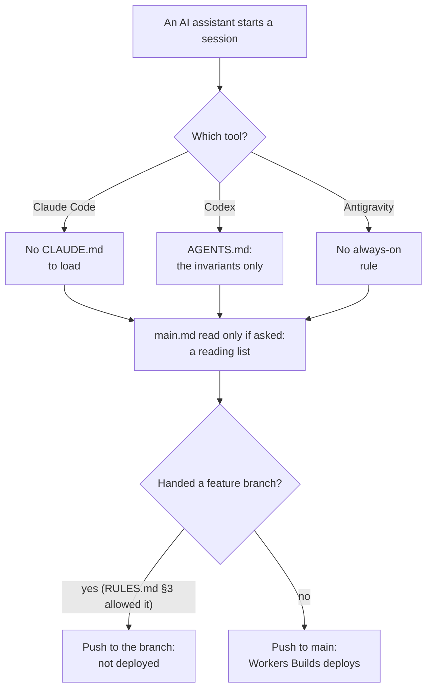
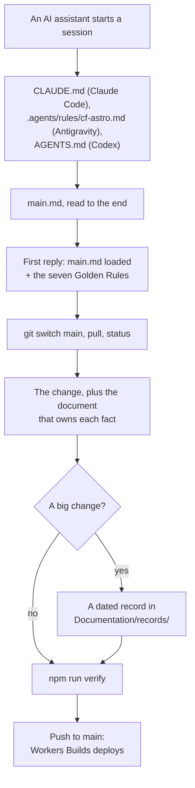


---
title: 'One contract for every AI agent — change record'
status: historical
audience: [owner, non-technical, technical, ai, operator]
last_verified: 2026-10-04
verified_against: [code, infra]
owner: harshil
related_code: [main.md, CLAUDE.md, AGENTS.md, RULES.md, wrangler.toml, .agents/rules/cf-astro.md]
related_docs:
  [../README.md, ../_templates/change-record.md, ../SEO-OPERATIONS.md, ../SYSTEM-ARCHITECTURE.md]
tags: [record, agents, documentation, git, deploy]
---

# One contract for every AI agent

> **In one minute (for everyone)**
>
> - **What changed:** the instructions every AI assistant reads before working on the website now
>   live in one file, `main.md`, written the same way as the admin portal's. Claude Code and
>   Antigravity load it by themselves; Codex is pointed to it.
> - **Why:** the Owner asked on 2026-10-03 whether the admin portal's rules could govern every
>   repository, and on 2026-10-04 approved the changes that make it so: work goes straight to
>   `main`, documentation changes with the code, and every big change gets a record like this one.
> - **What you will notice:** nothing on the website. An assistant's first reply in a session now
>   starts with `main.md loaded` and the seven rules.
> - **What it costs or saves:** nothing.

|                       |                                                                                                                                                                                                                                                                |
| --------------------- | -------------------------------------------------------------------------------------------------------------------------------------------------------------------------------------------------------------------------------------------------------------- |
| **Date**              | 2026-10-04                                                                                                                                                                                                                                                     |
| **Asked for by**      | The Owner (Harshil): "I approve all your recommendations, just remember main branch push only, improvements and all info to be logged in in documentation and for events like this where big changes are made it has to be separate file in respective folder" |
| **Done by**           | Claude (Claude Code, in the project's thread)                                                                                                                                                                                                                  |
| **Commits**           | One commit on `main` in this repository; the same contract went to cf-admin, cf-backup, cf-vps, cf-email-consumer and cf-graph the same day, each with its own record                                                                                          |
| **Risk**              | Low. Comments and documents only; the Worker's code, bindings and settings are unchanged                                                                                                                                                                       |
| **Can it be undone?** | Yes: revert the commit (§8)                                                                                                                                                                                                                                    |

## 1. What happened, for non-technical staff

The website's code is worked on by AI assistants as well as people. Each assistant reads a set of
instructions before it starts. Until today those instructions were spread over several files, and
which ones an assistant read depended on the tool: there was no `CLAUDE.md` for Claude Code to
load, no always-on rule for Antigravity, and Codex read only the invariants file.

One rule also disagreed with the Owner: the deploy rules let an assistant that had been handed a
"feature branch" push its work there instead of to `main`. The website only goes live from `main`,
so that work would have sat unpublished.

Now every assistant starts from the same file, `main.md`. It says, in order, what to read, how to
check the code is on `main`, the Owner's seven standing rules, which document to update for each
kind of change, and a checklist to finish with. The admin portal has used this format since
2026-10-03; the other four repositories got it today as well.

Two small corrections came with it. The configuration file still described the site as a
"Cloudflare Pages" project, which it stopped being in July 2026; its comments now describe a
Worker. And `main.md` now lists every check `npm run verify` actually runs.

## 2. Impact on each service

| Service                       | Before                                               | After                                                                          | Does anyone need to act? |
| ----------------------------- | ---------------------------------------------------- | ------------------------------------------------------------------------------ | ------------------------ |
| Public website (cf-astro)     | Live from `main` through Workers Builds              | The same. This push rebuilds the Worker, but no code, binding or setting moved | No                       |
| Public documentation mirror   | Copies `RULES.md` and `Documentation/` on every push | The same, now including `records/` and `_templates/`; no identifier was added  | No                       |
| The other five repositories   | Each had its own kind of entry file, or none         | All six follow the same contract, each with its own change record              | No                       |
| AI assistants working on this | Read different files depending on the tool           | Load `main.md` and acknowledge it before working                               | No                       |

The admin portal, backups, email delivery, the server dashboard and outside services are not
touched by this repository's change.

## 3. How it worked before

The rules existed, but nothing made an assistant read them first, and the branch exception meant
work could be finished on a branch that never went live.

## 4. How it works now

Every tool lands on the same file, the first reply proves it was read, and there is one way to
ship: verified, documented, on `main`.

## 5. Technical detail (for engineers)

- **Files changed:**
  - `main.md`: rewritten in cf-admin's contract format (§0 session start, §1 Golden Rules and the
    conflict order, §2 how a change reaches production, §3 routing, §4 which document to update,
    §5 the RULE #0 to #0.9 summaries kept word for word, §6 how to work, §7 the done checklist).
    The verify description now names the ratchet, the gate self-tests and `format:check`.
  - `CLAUDE.md` (new): imports `main.md`, so Claude Code loads it at session start.
  - `.agents/rules/cf-astro.md` (new): Antigravity's always-on rule, a summary that defers to
    `main.md`.
  - `AGENTS.md`: a pointer to `main.md` at the top; the invariants are unchanged.
  - `RULES.md` §3: the feature-branch exception removed.
  - `wrangler.toml`: comments only. The custom-domain note now describes a Worker; the secret
    commands say `wrangler secret put`, not `wrangler pages secret put`; the D1 note points to
    cf-admin's `RULESAd.md` RULE #0.9, which holds the rule, instead of its `main.md`.
  - `Documentation/_templates/change-record.md` and `Documentation/records/` (new), and the index.
- **Decisions:** the RULE summaries were kept verbatim so no figure is re-derived; `AGENTS.md`
  stays the home of the invariants, because Codex reads it and the ADRs cite it.
- **Data and schema:** none. **Security and privacy:** none.

## 6. How it was verified

| Check                | Command or method                                     | Result                                     |
| -------------------- | ----------------------------------------------------- | ------------------------------------------ |
| Full gate            | `npm run verify`                                      | the result is quoted in the commit message |
| Formatting           | `npx prettier --write` on every touched Markdown file | clean                                      |
| The site is a Worker | Cloudflare connector, `workers_list` (2026-10-04)     | `cf-astro` is listed as a Worker script    |
| Bindings unchanged   | `git diff wrangler.toml`                              | only comment lines differ                  |

**Not checked:** how the apex domain is attached in the dashboard (a custom domain or a route);
the connector does not show it, so the comment names only where to look. The Workers Builds build
settings are not visible from the repository either.

## 7. What is left

Nothing for this change. The redirect loop on `www.*` and `pet.*` described in
`SYSTEM-ARCHITECTURE.md` is unrelated and stays tracked there.

## 8. Rolling back

`git revert` the commit and push to `main`. Nothing else depends on it.

## Phone test steps

1. Open `madagascarhotelags.com` and one booking page: both load as before.
2. On GitHub, open `Documentation/records/2026-10-04-agent-contract-alignment.md` in the
   cf-astro repository: both flowcharts render as diagrams.


