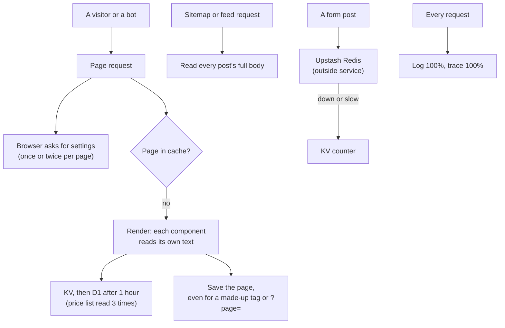
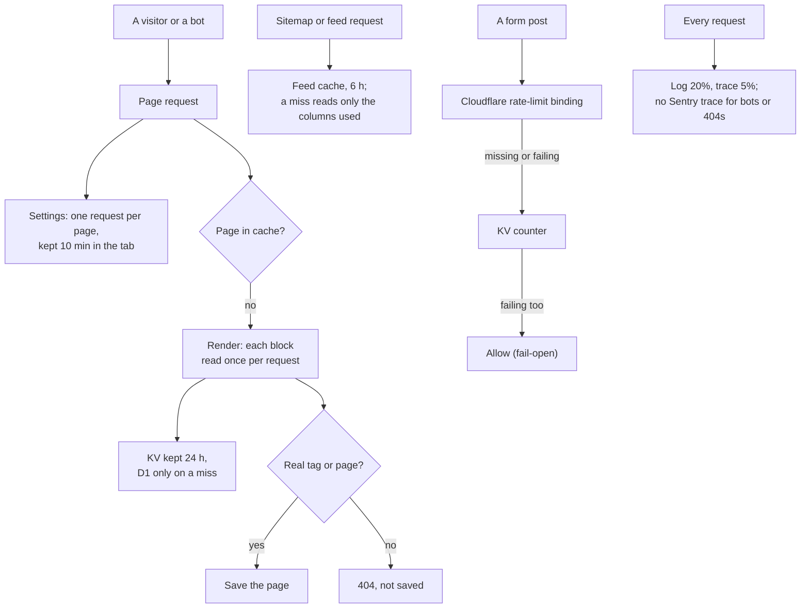
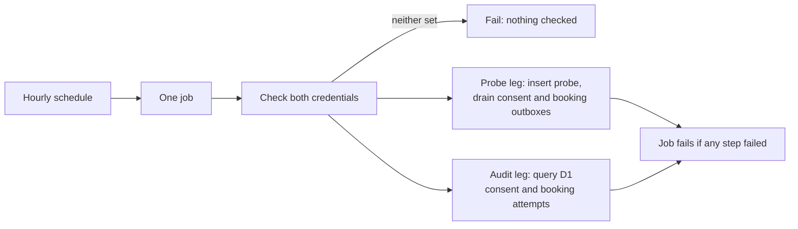


---
title: 'The public website does less work for the same result'
status: historical
audience: [owner, non-technical, technical, ai, operator]
last_verified: 2026-10-07
verified_against: [code, infra]
owner: harshil
related_code:
  [
    src/scripts/runtime-config-client.ts,
    src/lib/request-memo.ts,
    src/lib/feed-cache.ts,
    src/lib/isr-cache-key.ts,
    src/lib/blog.ts,
    src/lib/server-trace-sampling.ts,
    src/lib/rate-limit.ts,
    src/lib/alert-gate.ts,
    src/pages/api/revalidate.ts,
    src/middleware.ts,
    wrangler.toml,
    .github/workflows/consent-heartbeat.yml,
    src/data/zones.ts,
  ]
related_docs:
  [
    ../SYSTEM-ARCHITECTURE.md,
    ../OPERATIONS.md,
    ../../SECURITY.md,
    ../adr/0001-fail-open-rate-limiting.md,
    ../CONSENT-RECORD-SYSTEM.md,
    ../WHERE-THE-DATA-LIVES.md,
    ../TODO-BACKLOG.md,
  ]
tags: [record, resources, cache, rate-limiting, observability, free-tier]
---

# The public website does less work for the same result

> **In one minute (for everyone)**
>
> - **What changed:** the website now reuses work it had already done (settings, page text, sitemaps,
>   feeds) instead of redoing it on every visit; made-up blog addresses get a real "page not found"
>   instead of being stored; logs and traces are sampled; form spam limits moved from an outside
>   service (Upstash) to one built into Cloudflare; and the hourly health check runs as one job, not
>   two, and now fails instead of passing when it has no credentials to check with.
> - **Why:** the Owner approved the resource-usage plan of 2026-10-04, which measured where the free
>   allowances go and found most of the spend was work done for nothing: bots, repeats and timers.
> - **What you will notice:** nothing on the website. Bookings, contact and consent work as before.
>   The hourly health check will show as failed until its two GitHub secrets are set (§7): every
>   run looked at since 2026-09-07 checked nothing.
> - **What it costs or saves:** no money either way. It saves database reads, cache writes, log
>   events, traces and GitHub minutes, and removes one outside service from the public website.

|                       |                                                                                                                                                                 |
| --------------------- | --------------------------------------------------------------------------------------------------------------------------------------------------------------- |
| **Date**              | 2026-10-04 (the plan, whose date the file name keeps, as cf-admin's record does); committed 2026-10-07                                                          |
| **Asked for by**      | The Owner (Harshil), approving the 2026-10-04 resource-usage plan, including Cloudflare's rate-limiting binding as the one new piece in place of Upstash Redis  |
| **Done by**           | Claude (Claude Code), in an orchestrated session that finished an interrupted session's uncommitted work                                                        |
| **Commits**           | Two commits on `main` in this repository: the work, then the fixes from its review; cf-admin and cf-backup carry their own parts, each with its own record      |
| **Risk**              | Medium. The booking, contact and consent paths changed their rate limiter; the fallback and the fail-open rule are unchanged, and both are tested               |
| **Can it be undone?** | Yes: revert both commits and push (§8). The Upstash database and its secret were deliberately left in place, so the old limiter can come back with the old code |

## 1. What happened, for non-technical staff

The website runs on Cloudflare's free plan, which gives a daily allowance of database reads, cache
writes, log lines and so on. On 2026-10-04 we measured where that allowance goes. The website was
healthy and well inside the limits, but much of what it spent was wasted: the same settings fetched
once or twice for every page, the same price list read three times to draw one page, sitemaps rebuilt from
scratch for every search-engine visit, and made-up addresses (such as a blog "tag" that does not
exist) being treated as real pages and saved.

Now the website remembers what it has just worked out. A visitor's browser keeps the site's
settings for ten minutes instead of asking again on every page. Page text from the admin portal is
kept for a day instead of an hour; publishing in the admin portal still replaces it straight away.
Sitemaps and news feeds are kept for six hours, and a publish clears them. A blog address that
does not exist now answers "page not found", which is also what search engines expect.

The spam limits on the booking, contact and consent forms used to be counted by an outside service
called Upstash. They are now counted by Cloudflare itself, inside the same system that already runs
the website. The rule that matters most did not change: if the counting ever fails, the form still
goes through, because a pet emergency must never be blocked by a spam filter.

Two things are recorded more lightly. The website's own activity log now keeps one request in five
instead of every request, and detailed timing traces skip bots and missing pages. Every error is
still reported in full to the error tracker. And the hourly health check that is meant to prove
consent records are being saved now runs as one job instead of two, which halves the GitHub minutes
it uses without losing any of its checks.

Checking that health check against GitHub showed a problem older than this work: the two passwords
it needs were never stored in GitHub, so every run we looked at since 2026-09-07 skipped every check
and still showed green. It now shows red when it has nothing to check with, until the Owner stores
the two passwords (§7).

Nobody else has to do anything differently. The Owner's steps are in §7, the heartbeat secrets first.

## 2. Impact on each service

| Service                                    | Before                                                                                                           | After                                                                                 | Does anyone need to act?                                                |
| ------------------------------------------ | ---------------------------------------------------------------------------------------------------------------- | ------------------------------------------------------------------------------------- | ----------------------------------------------------------------------- |
| Public website (cf-astro)                  | Repeated reads per page; bots' made-up URLs cached; logs and traces 100%                                         | One read per block per page; made-up URLs are 404s; logs 20%, traces 5%               | Owner: check the first deploy (§7)                                      |
| Form rate limits (booking, contact, ARCO…) | Upstash Redis over the internet, KV fallback, then allow                                                         | Cloudflare's rate-limiting binding, the same KV fallback, then allow                  | Owner: delete the old secret (§7)                                       |
| Admin portal (cf-admin)                    | Publishes overwrite page text kept for 1 hour                                                                    | The same publishes; the text is kept for 24 hours; feeds are cleared on every publish | No. Two old cf-admin quirks matter more now and are in the backlog (§7) |
| Upstash Redis                              | Written by cf-astro for every form post (the plan estimated about 50 a day), shared with cf-admin and cf-chatbot | cf-astro no longer writes to it; cf-admin and cf-chatbot still use it                 | Not yet: retire it only after the other two stop                        |
| Sentry                                     | 10% of every server request traced, scanners and bots included                                                   | 10% of human requests; none for scanner paths, bots or 404s; errors unchanged         | No                                                                      |
| GitHub Actions                             | Hourly heartbeat billed as two jobs (each at least a minute); with no secrets set, every run checked nothing     | One job with the same two independent legs; a run with no secret at all fails         | Owner: set the two heartbeat secrets (§7)                               |

Backups, email delivery, the server dashboard and the knowledge graph are not touched. No data was
migrated, no table or KV namespace was added, and no money was spent.

**Measured on 2026-10-04 (before):** D1 account-wide about 70,000 rows read and 650 written a day;
Sentry 39,470 spans in 7 days for this site and cf-admin together (this site's spans report into
the Sentry project `cf-admin`; checked with the Sentry connector on 2026-10-07); the heartbeat had
run 579 times, each billing two jobs and, with no secrets set, each checking nothing. The plan
estimated about 50 form posts a day through Upstash (it had no Upstash access). Worker requests, CPU time and log-event counts could **not** be measured
(the Cloudflare connector has no usage analytics), so every "after" figure in this record is an
estimate from the code, not a measurement.

## 3. How it worked before

Every page view could cost one or two extra calls just for settings. When the page was not in the
cache, each part of it fetched its own copy of the page text, and after an hour that meant the
database. A bot could invent tag names or page numbers and each one was rendered and saved, using
up the 1,000 cache writes a day the free plan allows. Sitemaps and feeds read whole articles to
print a title and a date. Form limits depended on a service outside Cloudflare, and every request,
bots included, was logged and traced in full.

## 4. How it works now

Settings are fetched once and reused; each block of page text is read once per request and kept
for a day; made-up blog addresses stop at a 404 that is never saved; sitemaps and feeds are served
from a six-hour cache; and form limits are counted inside Cloudflare, with the same fallback and the
same "allow if everything fails" rule. The difference from §3: the same answers, with the repeats,
the bot-driven writes and the outside service taken out.

The heartbeat changed shape too:

Before, the two legs were two jobs, and GitHub bills each job as at least a minute. Now they are
two groups of steps in one job. Each leg still checks its own credential, each step runs whatever
the steps before it did, and a failure in either leg still fails the run, so losing one credential
never blinds the other leg (the lesson of the 2026-08-07 outage). With neither credential, the run
now fails at the first step instead of ending green with two warnings.

## 5. Technical detail (for engineers)

- **Files changed:**
  - Runtime config: `src/scripts/runtime-config-client.ts` shares one in-flight promise per page and
    keeps a good answer in `sessionStorage` (`mada_runtime_config`, 10 minutes, tied to the build).
    A failed or malformed answer is never stored, and an unreadable store is a miss.
  - CMS: `src/pages/api/revalidate.ts` writes `cms:<key>` for 24 hours (was 1 hour; the comment on
    `CMS_KV_TTL_SECONDS` says why it is not permanent) and clears `feed:` on every path
    revalidation. `src/lib/request-memo.ts` (AsyncLocalStorage, wired in `src/middleware.ts`)
    memoises `getPricing`, `getTestimonials` and `getAboutStats` per request; a rejected load is
    forgotten, and each caller gets its own copy.
  - Feeds: `src/lib/feed-cache.ts` (`feed:<path>#<build>`, 6 hours, `X-Feed-Cache` header) wraps
    the three sitemaps and both RSS feeds; `src/lib/blog-sources.ts` and `src/lib/blog.ts` select
    only the feed columns and skip the COUNT query where it is not needed. A degraded render is
    never stored: the sitemaps count a failed zone read (`loadDynamicZones` in
    `src/data/zones.ts`) or a failed collection read as degraded, not only the blog query. The
    `feed:` purge in `/api/revalidate` is best effort, so a failed KV list cannot fail a publish. `src/pages/llms.txt.ts` was removed: `public/llms.txt` is a static asset, which
    Cloudflare serves before the Worker, so the route never ran.
  - 404s: `src/lib/isr-cache-key.ts` keys `?page=` only on the two blog indexes;
    `parseBlogPageParam`, `[SUPABASE_PROJECT_REF]` and `isUnknownBlogTag` in `src/lib/blog.ts` decide
    the 404s; the blog index and tag pages call `Astro.rewrite('/404/')`, and `404.astro` sets status
    404, which the middleware never caches. The trailing slash is required: a rewrite runs the
    middleware again, which redirects a page path without one, so the first version's
    `rewrite('/404')` answered `308 → /404/` (found in review, before it shipped). The unknown-post
    and unknown-zone pages had the same bug from the start and get the same fix. While D1 is
    failing, a blog page past 1 is a 503 (`isDegradedLaterBlogPage`), never a cached 200.
  - Observability: `wrangler.toml` `[observability]` logs 0.2, traces 0.05.
    `src/lib/server-trace-sampling.ts` gives Sentry a `tracesSampler` (0 for probe paths and
    non-human user agents, otherwise the browser's decision or 10%) and a `beforeSendTransaction`
    that drops 404s.
  - Rate limiting: `src/lib/rate-limit.ts` uses ten `[[ratelimits]]` bindings (`RL_PER_MIN_3` …
    `RL_PER_MIN_1000`, namespace ids `10000 + n`), key `<endpoint>:<ip>`, the burst guard on
    `RL_PER_MIN_30` with `burst:<ip>`; the KV and in-memory fallbacks are unchanged.
    `src/lib/alert-gate.ts` lost its Upstash list channel (nothing read it).
    `@upstash/ratelimit` and `@upstash/redis` left `package.json`; `UPSTASH_REDIS_REST_URL` left
    `[vars]`; `env.d.ts`, `.env.example` and `worker-configuration.d.ts` follow.
  - Heartbeat: `.github/workflows/consent-heartbeat.yml` is one job; every step after the credential
    check is `if: ${{ !cancelled() && … }}` and nothing uses `continue-on-error`. The credential
    step exits 1 when both secrets are missing.
  - Comments that still described Upstash: `booking.ts`, `contact.ts`, `consent.ts`,
    `observability.ts`, `error-context.ts`, `logger.ts`.
- **Decisions:**
  - _24 hours, not "no expiry", for `cms:`._ Two cf-admin paths can leave KV older than D1: an
    outbox redrive that lands after a newer publish, and a history rollback whose block id is not
    the KV key (`about_stats` is published as `about`, `faq_items` as `faqs`). 24 hours matches the
    page cache, so neither can outlive what a cached page already allows.
  - _The binding, not KV alone, for rate limits._ Every KV check is a read and a write, and the
    namespace shares 1,000 writes a day with the page cache. A binding has a fixed limit, so a
    ladder of ten covers any value cf-admin's Service Config can set, rounding up so a limit is
    never stricter than configured. This is the one new piece the Owner approved (a binding, not an
    environment variable, table, namespace or outside service).
  - _Heartbeat stays hourly._ The plan suggested every 3 hours; the approved scope kept hourly.
  - _The plan's "inline the config into the page" was not done._ A shared promise plus a session
    cache gives the same saving without changing how prerendered pages are built.
- **Data and schema:** no migration, no table, no new KV namespace. New KV key family `feed:`
  (6 hours) in the existing `ISR_CACHE`; `cms:` TTL 3600 → 86400 seconds. One new browser
  `sessionStorage` key with no personal data.
- **Security and privacy:** the client IP is still the rate-limit key; it now goes to Cloudflare's
  rate limiter instead of Upstash, and cf-astro writes no Redis keys at all. The fail-open rule
  (AGENTS.md invariant #3, ADR-0001) is unchanged and tested. A longer `cms:` TTL lengthens how long
  a poisoned value could live, but writing one still needs the revalidation secret and passes the
  allowlist and sanitizer (`SECURITY.md` §8).

Tests added or changed

- New: `test/runtime-config-client.test.ts`, `test/request-memo.test.ts`,
  `test/feed-cache.test.ts` (also each sitemap with a failing zone read, and `loadDynamicZones`),
  `test/cache-flood.test.ts` (also every `Astro.rewrite` target ends with a slash, and the
  degraded later page), `test/revalidate-cache.test.ts` (also a failing `feed:` list),
  `test/server-trace-sampling.test.ts` (also pins the `wrangler.toml` sampling values and the
  middleware wiring), `test/rate-limit-binding.test.ts` (the ladder, `wrangler.toml` in step, the
  fallback chain and fail-open), `test/heartbeat-workflow.test.ts` (hourly, one job, independent
  legs, nothing swallows a failure, and the credential step run in bash with each mix of secrets).
- Changed: `test/alert-gate.test.ts`, `test/rate-limit-memo.test.ts`, `test/blog-fallback.test.ts`.
- Removed with the code they tested: `test/rate-limit-analytics.test.ts` and
  `test/rate-limit-timeout.test.ts` (Upstash analytics and the Upstash timeout path).

## 6. How it was verified

| Check                        | Command or method                                                                                              | Result                                                                                                                                                                                                                               |
| ---------------------------- | -------------------------------------------------------------------------------------------------------------- | ------------------------------------------------------------------------------------------------------------------------------------------------------------------------------------------------------------------------------------ |
| Full gate                    | `npm run verify`                                                                                               | exit 0 (2026-10-07, after the review fixes): astro check 0 errors, 0 warnings over 170 files; ratchet: every count matches; 337 tests in 32 files passed; 11 gate self-tests OK; a11y_check 0 findings over 82 files; Prettier clean |
| Generated binding types      | `npm run types:check`                                                                                          | up to date with `wrangler.toml`                                                                                                                                                                                                      |
| Build                        | `npm run build`                                                                                                | exit 0; the ten bindings appear in the built Worker config                                                                                                                                                                           |
| Binding syntax               | wrangler's own config schema, and Cloudflare's documentation                                                   | `[[ratelimits]]` with `simple = { limit, period = 60 }`                                                                                                                                                                              |
| Tags are safe to match       | read-only query of production D1 (Cloudflare connector)                                                        | 15 published posts; tags stored lowercase                                                                                                                                                                                            |
| Nothing reads the old lists  | search of the six repositories for the retired Redis list keys                                                 | no reader                                                                                                                                                                                                                            |
| Heartbeat guard bites        | removed `!cancelled()` from one step and ran its test                                                          | the test failed, as it should                                                                                                                                                                                                        |
| Real 404s over HTTP          | the built Worker under `wrangler dev --local`, local D1 seeded with two posts                                  | unknown tag, `?page=abc`, page past the last, unknown post and zone: 404, no `Location`; real tag and page 1: 200 `MISS`; with `rewrite('/404')` the same URLs had answered 308 (the reviewers' run)                                 |
| Degraded pages stay uncached | the same, with the local `blog_posts` table renamed                                                            | `/es/blog/?page=3` (twice: not stored), `/en/blog/?page=2` and an unknown tag: 503 with `Retry-After`; `?page=abc`: 404                                                                                                              |
| Feed cache                   | the same, two requests each                                                                                    | `sitemap-es.xml` and `es/rss.xml`: `MISS`, then `HIT`; with no zone settings table (the zone read throws) the sitemap was served but not stored                                                                                      |
| Heartbeat in production      | GitHub connector, read-only: the steps of runs 441 (2026-09-07) and 591 (2026-10-07), the list of runs 587–590 | 441 and 591: every step of both legs `skipped`, conclusion `success`, the log shows `HEALTH_CHECK_SECRET` empty; 587–590: `success` in 8–10 s each                                                                                   |

**Not checked:** the Free-plan allowance of the rate-limiting binding (the pricing page could not
be fetched from this session; cf-admin recorded it as included on 2026-09-19); Worker requests,
CPU and log events before or after (no analytics access); whether wrangler accepts the bindings on
this account, which the first deploy will show. Nothing was deployed from this session.

## 7. What is left

All tracked in [`TODO-BACKLOG.md`](../TODO-BACKLOG.md), section "Resource-usage follow-ups":

- Owner, first: set `HEALTH_CHECK_SECRET` and `CLOUDFLARE_API_TOKEN` as GitHub Actions secrets in
  this repository, then run the heartbeat once by hand. Until then it fails on every run, which is
  the truth: it checks nothing.
- Read the first deploy's build log and send one contact form from a phone.
- Owner: `npx wrangler secret delete UPSTASH_REDIS_REST_TOKEN` on this Worker.
- Retire the Upstash database only after cf-admin and cf-chatbot stop using it; cf-admin's RoPA
  should drop Upstash for this site's rate limiting.
- cf-admin: send the published key name on a history rollback, and order outbox redrives.
- Skip the page-cache read for paths with a file extension; a free WAF rule for scanner paths.
- cf-graph's public Systems view still says rate limiting is "Redis-backed"; update it once this
  site and cf-admin are deployed.
- This site's Sentry events land in the project `cf-admin`; point its DSNs at `cf-astro`.

## 8. Rolling back

Revert both commits and push to `main`; Workers Builds deploys the previous code. That brings back
`@upstash/*`, the `UPSTASH_REDIS_REST_URL` variable and the Upstash code path, which works as long
as the `UPSTASH_REDIS_REST_TOKEN` secret has not been deleted yet: roll back before deleting it, or
set it again. Nothing in D1, Supabase or KV needs undoing: `feed:` keys expire within 6 hours and
`cms:` keys are rewritten by the next publish. To roll back only the sampling, set the three
`head_sampling_rate` values in `wrangler.toml` back to `1` and push.

## Phone test steps

1. Open `madagascarhotelags.com`, then two or three more pages. Everything looks as before.
2. Open `madagascarhotelags.com/es/blog/tag/no-existe-123/`: you see the "página no encontrada"
   page, and the address bar still shows the address you typed (it does not jump to `/404/`).
   Open a real tag from any article: it lists that tag's articles.
3. Open `madagascarhotelags.com/es/blog/?page=999`: "página no encontrada", same address. `?page=1`
   shows the blog.
4. Open `madagascarhotelags.com/sitemap-es.xml`: the list of pages appears, including the latest
   article.
5. Send the contact form once with your own details: it goes through and the email arrives.
6. In the admin portal, publish a small text change on the home page, then reload the home page on
   the phone: the change is there.


