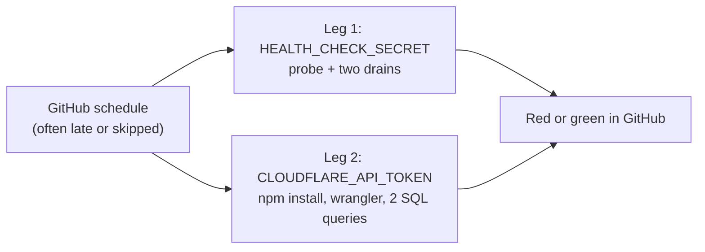
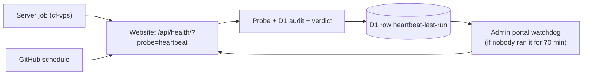


---
title: 'The hourly heartbeat now runs inside the website, so any runner needs one secret'
status: historical
audience: [owner, non-technical, technical, ai, operator]
last_verified: 2026-10-07
verified_against: [code]
owner: harshil
related_code:
  [
    src/lib/heartbeat.ts,
    src/pages/api/health.ts,
    .github/workflows/consent-heartbeat.yml,
    test/heartbeat.test.ts,
    test/heartbeat-workflow.test.ts,
  ]
related_docs: [../CONSENT-RECORD-SYSTEM.md, ../WHERE-THE-DATA-LIVES.md, ../../SECURITY.md]
tags: [record, heartbeat, consent, booking, monitoring]
---

# The hourly heartbeat now runs inside the website, so any runner needs one secret

> **In one minute (for everyone)**
>
> - **What changed:** the hourly check that consents are recorded and no booking is
>   stranded now runs inside the website itself. GitHub (and soon the server, and the
>   admin portal as a fallback) only has to ask for it.
> - **Why:** the check needed two GitHub secrets, one of them a Cloudflare key that can
>   edit the database, and installed a full toolchain every run to count rows. GitHub also
>   runs "hourly" jobs late or not at all: 5 runs in the 25 hours to 21:10 UTC on 7 October.
>   Harshil asked to move the heartbeat off GitHub onto the server, with a light fallback.
> - **What you will notice:** the GitHub run needs only `HEALTH_CHECK_SECRET`. The
>   Cloudflare API token is never needed.
> - **What it costs or saves:** each GitHub run is three web calls instead of a package
>   install; no new secret, table or setting.

|                       |                                                                                                    |
| --------------------- | -------------------------------------------------------------------------------------------------- |
| **Date**              | 2026-10-07                                                                                         |
| **Asked for by**      | Harshil: "we dont want to waste and use Github Action resources … set a fallback system"           |
| **Done by**           | Claude (Claude Code), project thread "VPS job runner and heartbeat"                                |
| **Commits**           | cf-astro: this commit. cf-admin: the `heartbeat-watchdog` job. cf-vps: the job platform (separate) |
| **Risk**              | Low: one opt-in query mode on an authenticated endpoint; other modes unchanged                     |
| **Can it be undone?** | Yes (§8)                                                                                           |

## 1. What happened, for non-technical staff

Every hour a check asks two questions: are customers' cookie and privacy choices still
being saved, and is any booking stuck on its way into the database? Until today that check
lived on GitHub, the service that stores our code. It needed two passwords to work. Neither
had ever been set, so for at least a month it checked nothing while showing green.

The check now lives inside the website, which already has the data. Whoever asks for it
needs only one password, and gets back a simple answer: fine, needs a look, or broken, with
the reasons in plain sentences.

That makes it easy to ask from more than one place. GitHub still asks every hour. The admin
portal will ask whenever nobody has for 70 minutes, and the hotel's own server will become
the normal place to ask from. If one of them stops, another one covers.

## 2. Impact on each service

| Service                   | Before                                                     | After                                                                           | Does anyone need to act?                           |
| ------------------------- | ---------------------------------------------------------- | ------------------------------------------------------------------------------- | -------------------------------------------------- |
| Public website (cf-astro) | `/api/health/?probe=consent` tested the consent write path | `?probe=heartbeat` also reads the D1 audit trail, judges it and records the run | No                                                 |
| Admin portal (cf-admin)   | Not involved                                               | Its `heartbeat-watchdog` job reads the run record and steps in when it is stale | No (its own record)                                |
| Server (cf-vps)           | Not involved                                               | Will run the heartbeat as a container job (its own record)                      | Owner runs the server steps when they are ready    |
| GitHub                    | Two secrets, npm install, wrangler, ~1–2 min with secrets  | One secret, three web calls                                                     | **Owner sets `HEALTH_CHECK_SECRET`** (backlog §00) |

Not touched: backups, email delivery, the knowledge graph.

## 3. How it worked before

GitHub started the job when it had room. The first leg called the website with one secret.
The second leg installed the project's packages and used a Cloudflare key with database-edit
power to run two counting queries. Neither secret was set, so both legs were skipped.

## 4. How it works now

Any runner asks the website for the heartbeat with the one secret. The website runs the live
probe and the two audit queries, applies the same rules the workflow applied, answers a
verdict, and writes down when it ran and for whom. The admin portal reads that note and runs
the check itself when it gets old. The difference from §3: the checks live in one tested place
and no runner needs a database key.

## 5. Technical detail (for engineers)

- **Files changed:**
  - `src/lib/heartbeat.ts` (new): the two audit queries moved verbatim from the workflow,
    `evaluateHeartbeat` (the workflow's rules and messages), `recordHeartbeatRun` (upsert of
    `admin_portal_settings` `heartbeat-last-run`, global scope, JSON `{at, runner, verdict}`),
    `parseRunner` (fixed list `vps`, `cf-admin`, `github`, `manual`).
  - `src/pages/api/health.ts`: `?probe=heartbeat` runs the existing consent probe block, then
    the audit, and adds `heartbeat` to the answer; a `fail` verdict makes the answer `207`.
    `?probe=consent` and the plain call are unchanged.
  - `.github/workflows/consent-heartbeat.yml`: one credential check (fails with no secret, as
    since 2026-10-07), one check step reading the verdict, the two drains unchanged; no
    checkout, Node, npm or wrangler.
  - Tests: `test/heartbeat.test.ts` (new; real SQLite with this repo's migrations 0005, 0006,
    0008, 0013, 0014, 0015, plus the endpoint), `test/heartbeat-workflow.test.ts` (rewritten
    for the one-secret shape, runs the credential and verdict scripts in bash).
- **Decisions:** the exhausted-replay error takes the larger of the probe's outbox count and
  the audit's, so a count helper that fails quietly to 0 cannot hide one. The run record is
  best effort: a failed write is logged and never turns the verdict red. The Worker raises no
  alert of its own on `fail`; each runner reports its own run (GitHub's red run, the server's
  Sentry alert, cf-admin's cooled Sentry report), so a persisting failure does not email every
  hour from two places.
- **Data and schema:** no migration. One row in cf-admin's `admin_portal_settings`, written by
  this Worker, like cf-backup's `backup:` rows.
- **Security and privacy:** same bearer secrets and `admin` rate-limit bucket. The audit returns
  counts and messages, never a personal record. `runner` cannot carry free text.

## 6. How it was verified

| Check      | Command or method                       | Result                                                                                                                                                                                                        |
| ---------- | --------------------------------------- | ------------------------------------------------------------------------------------------------------------------------------------------------------------------------------------------------------------- |
| Full gate  | `npm run verify`                        | exit 0: astro check 0 errors over 171 files; ratchet every count matches (B4 rose 29349 → 29682, reason recorded); 351 tests in 33 files passed; 11 gate self-tests OK; a11y_check 0 findings; Prettier clean |
| SQL        | `test/heartbeat.test.ts` on node:sqlite | both audit queries run on this repo's migrations and count seeded rows as the workflow did                                                                                                                    |
| Live check | none yet                                | runs after the deploy (§7)                                                                                                                                                                                    |

Not checked: the live endpoint after deploy, which needs the secret; the GitHub run, which
stays red until the secret is set.

## 7. What is left

- Owner: set `HEALTH_CHECK_SECRET` in GitHub (and in the Worker if its value is unknown):
  [`TODO-BACKLOG.md`](../TODO-BACKLOG.md) §00.
- cf-admin `heartbeat-watchdog` and the cf-vps job platform: their own change records.
- Once the server job has run on time for 48 hours, remove the GitHub `schedule:` and keep
  the manual button (Owner's decision, 2026-10-07).

## 8. Rolling back

Revert this commit. `?probe=heartbeat` then answers like a plain health call (no
`heartbeat` field), which cf-admin's watchdog treats as a failed run and reports.

## Phone test steps

1. Open GitHub → cf-astro → Actions → "Consent & booking heartbeat (hourly)" → Run workflow
   (after the secret is set).
2. Open the run: the "Run the heartbeat check" step shows `Heartbeat verdict: ok` (or `warn`
   with the reasons), and the summary shows the JSON with `heartbeat.consent` and
   `heartbeat.booking` counts.


