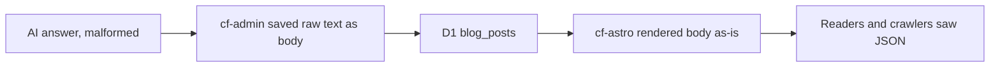
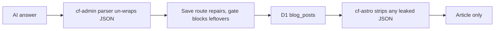


---
title: 'Blog round 2: no AI JSON on the page, a real answers section, lighter page cache'
status: historical
audience: [owner, non-technical, technical, ai]
last_verified: 2026-10-10
verified_against: [code]
owner: harshil
related_code:
  [
    src/lib/blog-body-envelope.ts,
    src/lib/blog.ts,
    src/components/blog/AioDirectAnswers.astro,
    src/components/sections/BlogPostContent.astro,
    src/lib/isr-response.ts,
    src/lib/isr-cache-key.ts,
    src/middleware.ts,
    src/pages/api/revalidate.ts,
    test/blog-body-envelope.test.ts,
    test/isr-response.test.ts,
    test/revalidate-cache.test.ts,
  ]
related_docs:
  [
    ../FRONTEND-AND-SEO.md,
    ../SYSTEM-ARCHITECTURE.md,
    ../TODO-BACKLOG.md,
    2026-10-10-blog-seo-audit-fixes.md,
  ]
tags: [record, blog, ai, cache, kv, seo]
---

# Blog round 2: no AI JSON on the page, a real answers section, lighter page cache

> **In one minute (for everyone)**
>
> - **What changed:** a blog post can no longer show the AI writer's raw data (the
>   `{ "title": …` text at the top and `"translation_slug": …` at the bottom of
>   `/en/blog/why-chose-us/`); the questions box under a post is a normal, light section;
>   pages and publishes use fewer cache operations.
> - **Why:** the owner's screenshots of the broken post, and a request to make the blog
>   reliable and fast for search engines and AI crawlers.
> - **What you will notice:** the why-chose-us post shows only its article; the "Quick
>   answers" section matches the site; "4 min read" has its space.
> - **What it costs or saves:** fewer KV reads and lists on Cloudflare's free allowance.

|                       |                                                                                                                                             |
| --------------------- | ------------------------------------------------------------------------------------------------------------------------------------------- |
| **Date**              | 2026-10-10                                                                                                                                  |
| **Asked for by**      | Harshil: "each and every image in cf-astro screenshot attached is broken … ensuring that future cf-admin blog creation … doesnt break it"   |
| **Done by**           | Claude Code (project thread session)                                                                                                        |
| **Commits**           | cf-astro: this record's commit. cf-admin: the same day's "Blog round 2" commit (its record is in cf-admin `documentation/records/reports/`) |
| **Risk**              | Medium: the page-cache code in the middleware changed (every page passes through it)                                                        |
| **Can it be undone?** | Yes, by reverting the commit (§8)                                                                                                           |

## 1. What happened, for non-technical staff

In August an AI-written article, "Why Chose Us?", was saved with the AI's raw answer
instead of the article. The AI had made a formatting mistake, and the admin portal's old
code saved the whole raw answer as the article's text. The public site showed it as it was,
so readers and search engines saw computer data around the article, and a made-up
question ("What should I know about Why Chose Us??") in the answers box.

The website now recognises that raw data and shows only the article inside it. The admin
portal (a separate change the same day) repairs it when a post is saved and refuses to
publish a post that still contains it, so a new post cannot go out this way.

The answers box under a post was a dark purple panel that looked like an advert. It is now
a light section in the site's colours, with the same heading structure as the article, and
it hides an "answer" that only repeats the post's summary.

Behind the scenes the website does less work per page: it no longer looks in the page
cache for sitemaps and feeds (which are never stored there), it starts sending a page while
it is still being written instead of waiting for the end, and it can tell a search engine
"nothing changed" without resending the page. A publish clears the cache with a handful of
direct deletions instead of about twenty searches.

## 2. Impact on each service

| Service                   | Before                                              | After                                                                | Does anyone need to act?                                    |
| ------------------------- | --------------------------------------------------- | -------------------------------------------------------------------- | ----------------------------------------------------------- |
| Public website (cf-astro) | Showed a stored post body as-is; dark answers box   | Strips leaked AI data at render; light answers section; leaner cache | No                                                          |
| Admin portal (cf-admin)   | Could save and publish a body holding the AI's JSON | Repairs it on save, and the quality gate blocks what remains         | The owner decides whether to regenerate or archive the post |

Backups, email, the server dashboard, the knowledge graph and outside services are not touched.

## 3. How it worked before

The model wrote a broken `"body:` key, the old route saved `
` + the whole response, and
nothing between the database and the page looked at the body's content.

## 4. How it works now

The same rules run at three points: the AI parser, the save route (with a blocking,
non-bypassable quality check), and the public page for rows saved before today.

## 5. Technical detail (for engineers)

- **`src/lib/blog-body-envelope.ts`** (new): `unwrapJsonEnvelope(body)` returns the article
  inside a leaked envelope or `null`. It handles the stored `
{…"body: "…}
` shape, the
  same after the HTML sanitiser closed the wrapper `
` early, a body that is itself JSON,
  escaped `\"` and `\n`, and an article followed only by the trailing fields. A copy of
  cf-admin's `src/lib/blog/body-envelope.ts` (the repos cannot share code); both test files
  pin the same cases.
- **`src/lib/blog.ts`**: `parseBlogPostRow` serves the repaired body and reports it once
  per post (`blog.body_envelope_repaired`); direct answers that repeat the description are
  dropped and a doubled `??` is collapsed. `getBlogPostBySlug` selects explicit columns
  (no `embedding` vector).
- **Post pages**: the translation check uses `getPublishedSlugs` (one `SELECT slug`) instead
  of reading the whole translated post; a bundled post's reading time uses its Markdown.
- **`AioDirectAnswers.astro`**: `<section>` with an `<h2>` and an `<h3>` per question, light
  palette (`bg-primary-light`); `.article-direct-answers` kept for `speakable`.
- **`BlogPostContent.astro`**: reading time counts text, not tags, and renders "4 min read".
- **`global.css`**: `.prose .cms-callout` styles the AI writer's "Key takeaway" box.
- **`src/lib/isr-response.ts`** (new) and **`middleware.ts`**: dotted paths skip the ISR KV
  read; a miss streams through `tee()` while a copy is stored; the KV entry's metadata holds
  a SHA-256 ETag, and a hit answers a matching `If-None-Match` with 304.
- **`/api/revalidate`**: deletes `isr:<path>#<build>` by name and lists only the `?page=`
  keys of the two paginated blog indexes, in parallel; a failed list no longer fails the
  publish.
- **Not changed, and why:** the zone purge by `Cache-Tag` stays, but Worker responses never
  enter Cloudflare's zone cache, so it purges nothing today; the round-1 record's "working
  cache purge" is true of the KV purge only. Moving pages into `caches.default` is an owner
  decision (`TODO-BACKLOG.md` §0b).

## 6. How it was verified

| Check       | Command or method                                                 | Result                                          |
| ----------- | ----------------------------------------------------------------- | ----------------------------------------------- |
| Full gate   | `npm run verify`                                                  | exit 0; 36 test files, 378 tests passed         |
| Build       | `npx astro build`                                                 | completed; the new classes are in the CSS       |
| Broken post | `test/blog-body-envelope.test.ts`: the stored why-chose-us shapes | the article comes back, the fake answer is gone |
| Cache purge | `test/revalidate-cache.test.ts`: only `isr:/es/blog?` is listed   | passes                                          |
| ETag        | `test/isr-response.test.ts`                                       | passes                                          |

Not checked: the live D1 row of why-chose-us (the Cloudflare connector's sign-in had
expired), and the deployed page, which the owner checks by phone.

## 7. What is left

In `TODO-BACKLOG.md` §0b: repair or archive the why-chose-us row (owner), an edge cache in
front of KV (owner), and a pricing KV write-back.

## 8. Rolling back

`git revert` this commit and push to `main`. The cache keys keep their names, so old and
new code read each other's entries; an entry written without an ETag is simply served
without one.

## Phone test steps

1. Open `madagascarhotelags.com/en/blog/why-chose-us/`: no `{ "title"` at the top and no
   `"translation_slug"` at the bottom.
2. Scroll below the article: no "What should I know about Why Chose Us??".
3. Open any other post with questions: a light "Quick answers" section, matching the site.
4. Check the line under a post's date: "4 min read", with the space.


