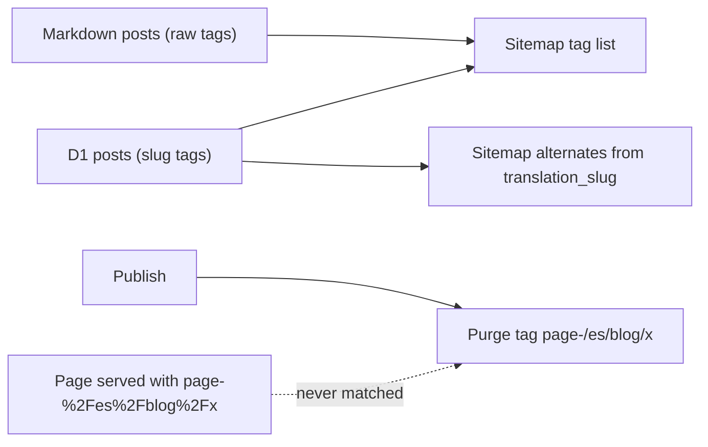
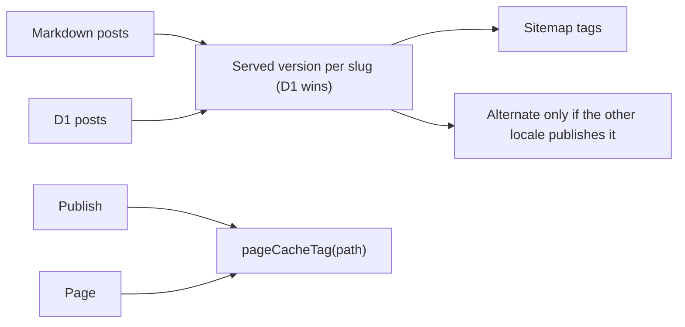


---
title: 'Blog SEO fixes: no empty tag pages or broken language links in the sitemaps, one business name, working cache purge'
status: historical
audience: [owner, non-technical, technical, ai]
last_verified: 2026-10-10
verified_against: [code]
owner: harshil
related_code:
  [
    src/lib/blog-sitemap.ts,
    src/lib/blog-schema.ts,
    src/lib/blog-sources.ts,
    src/lib/blog.ts,
    src/lib/isr-cache-key.ts,
    src/lib/indexnow.ts,
    src/pages/sitemap-es.xml.ts,
    src/pages/sitemap-en.xml.ts,
    src/pages/api/revalidate.ts,
    test/blog-seo-audit.test.ts,
  ]
related_docs: [../FRONTEND-AND-SEO.md, ../SEO-OPERATIONS.md, ../TODO-BACKLOG.md]
tags: [record, blog, seo, sitemap, structured-data, cache]
---

# Blog SEO fixes: no empty tag pages or broken language links in the sitemaps, one business name, working cache purge

> **In one minute (for everyone)**
>
> - **What changed:** the sitemaps stop sending Google about 20 empty tag pages and a
>   language link to a page that does not exist; blog posts name the business the same
>   way the home page does; publishing now really clears Cloudflare's cache.
> - **Why:** a blog SEO/GEO audit requested on 2026-10-10 found these on the live site.
> - **What you will notice:** old accented tag pages such as `/es/blog/tag/pensión/` are
>   now "page not found"; the answers box on a post reads "Preguntas frecuentes" /
>   "Quick answers" without the "Verified Knowledge" badge.
> - **What it costs or saves:** one extra small D1 read when a sitemap is rebuilt (they
>   are cached for 6 hours), and one when an unknown tag page is asked for.

|                       |                                                                                                        |
| --------------------- | ------------------------------------------------------------------------------------------------------ |
| **Date**              | 2026-10-10                                                                                             |
| **Asked for by**      | Harshil: "read everything on how we have dynamic blogging system … SEO, AIO, GEO … run in-depth scans" |
| **Done by**           | Claude Code, project thread "Blog System Improvements"                                                 |
| **Commits**           | this commit (cf-astro); a companion commit in cf-admin                                                 |
| **Risk**              | low: no schema, binding or variable changes; each rule is covered by a test                            |
| **Can it be undone?** | yes, revert the commit (§8)                                                                            |

## 1. What happened, for non-technical staff

The 14 original blog articles were re-published from the admin portal some time ago. The
portal stores tags in a plain form (`pension`), while the old articles used accented
ones (`pensión`). The sitemaps kept listing both, and the accented tag pages showed "no
articles". Google treats such pages as low quality, and we were pointing it at them.

The sitemaps also trusted the "translated version" field of each post. One English post
claimed a Spanish twin that was never published, so the sitemap pointed Google at a
missing page. The post page itself already checked this; now the sitemap does too.

Each blog post told Google it was written by "Madagascar Pet Hotel", using the same
identity as the home page, which calls the business "Hotel para mascotas Madagascar".
Posts now use the one name, and a post with a real person as author will show that
person.

Finally, when a post was published, the website tried to clear Cloudflare's copy of the
page but used a slightly different label from the one the page carried, so nothing was
cleared. Both sides now use the same label.

## 2. Impact on each service

| Service                   | Before                                                       | After                                                       | Does anyone need to act? |
| ------------------------- | ------------------------------------------------------------ | ----------------------------------------------------------- | ------------------------ |
| Public website (cf-astro) | sitemaps listed empty tag pages and a missing translation    | only real tag pages and real translations                   | no                       |
| Admin portal (cf-admin)   | publish purge silently missed Cloudflare's edge cache        | the purge matches; archive and rename also purge (cf-admin) | no                       |
| Bing / IndexNow           | told about six URLs per publish, most redirecting or missing | told about canonical pages only; posts come from cf-admin   | no                       |

Backups, email, the server dashboard and the knowledge graph are not touched.

## 3. How it worked before

Tags came from both sources even when D1's version of the post replaced the Markdown one,
so the raw tags stayed. Alternates came straight from the free-text `translation_slug`.
The purge label was built without encoding, the page label with it.

## 4. How it works now

The difference: tags and alternates come from what is actually served, and the page and
the purge share one function for the cache label.

## 5. Technical detail (for engineers)

- **`src/lib/blog-sitemap.ts`** (new): `buildBlogSitemapEntries(static, d1, otherLocaleSlugs)`.
  Both sitemaps use it; the other locale's slugs come from `getMergedBlogPosts(db, other, 500)`.
- **Tag pages** (`src/pages/{es,en}/blog/tag/[tag].astro`): when D1 is healthy and has no
  post with the tag, `getStaticOnlyTagListing` keeps only bundled posts D1 does not publish
  (`getPublishedSlugs` in `src/lib/blog.ts`). None left is a 404; some left are rendered
  instead of an empty page. A failed D1 lookup keeps every bundled match (never a 404).
- **`src/lib/blog-schema.ts`** (new): `buildBlogPostingSchema`. A byline matching the
  business name (accent- and case-insensitive) is the `#organization` node with the home
  page's name; anything else is a `Person`. `publisher` carries name and logo. A cover
  image claims no size.
- **`pageCacheTag`** in `src/lib/isr-cache-key.ts`, used by `src/middleware.ts` and
  `src/pages/api/revalidate.ts`.
- **`[SUPABASE_PROJECT_REF]`** in `src/lib/indexnow.ts`: locale-prefixed paths only, with the
  trailing slash, and no single posts (cf-admin's `broadcastIndexNow` announces those).
- **`prettifyTag`**: capitalises after whitespace only (`pensión` → `Pensión`).
- **`AioDirectAnswers.astro`**: heading in plain words, badge removed.
- No migration, binding, environment variable or new store.

## 6. How it was verified

| Check         | Command or method                                                                                                | Result                                                                                     |
| ------------- | ---------------------------------------------------------------------------------------------------------------- | ------------------------------------------------------------------------------------------ |
| Full gate     | `npm run verify`                                                                                                 | see the commit message                                                                     |
| New tests     | `test/blog-seo-audit.test.ts`                                                                                    | 16 tests: sitemap tags and alternates, tag 404s, schema, purge tag, IndexNow URLs, accents |
| Live (before) | fetched `sitemap-es.xml`, `sitemap-en.xml`, `/es/blog/tag/pensi%C3%B3n/`, `/en/blog/why-chose-us/` on 2026-10-10 | the empty tag pages and the alternate to `/es/blog/es-why-chose-us/` were present          |

Not checked: D1 rows directly (the Cloudflare connector was unavailable in the session),
and whether the edge cache actually holds Worker responses on this zone; the purge label
is now correct either way.

## 7. What is left

The audit's open items (author field in the admin, RSS full text, `llms.txt` articles,
thin tag pages, `410` for archived posts, per-post SEO controls) are in
[`TODO-BACKLOG.md`](../TODO-BACKLOG.md) §0b.

## 8. Rolling back

Revert this commit and push. Nothing stored changes, so nothing else needs undoing.

## Phone test steps

1. Open `https://madagascarhotelags.com/es/blog/tag/pensi%C3%B3n/`: it shows the "page
   not found" page. `https://madagascarhotelags.com/es/blog/tag/pension/` lists posts.
2. Open `https://madagascarhotelags.com/sitemap-en.xml` and search for `why-chose-us`:
   its entry has no `es` alternate.
3. Open a post with a "Preguntas frecuentes" box: no "AIO" or "Verified Knowledge" text.


