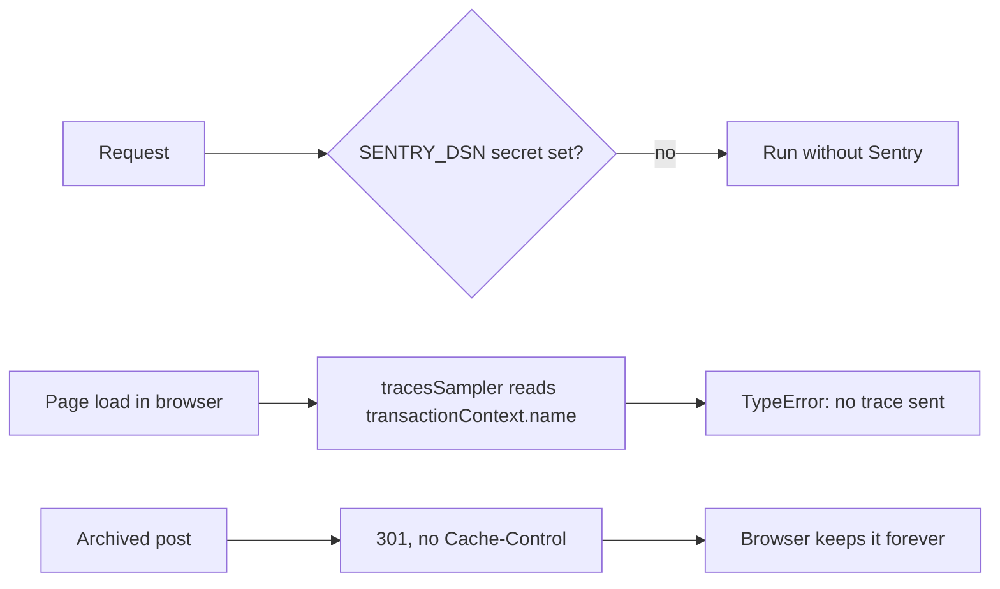
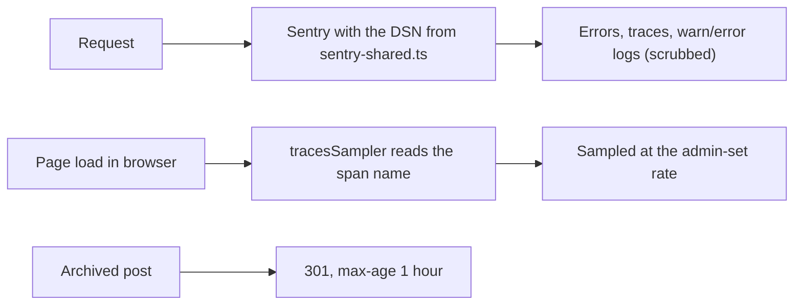


---
title: 'Sentry receives cf-astro again, and a blog redirect no longer sticks on phones'
status: historical
audience: [owner, non-technical, technical, ai]
last_verified: 2026-10-10
verified_against: [code, live-d1, live-sentry, live-site]
owner: harshil
related_code:
  [
    src/lib/sentry-shared.ts,
    src/scripts/sentry.ts,
    src/middleware.ts,
    src/lib/blog.ts,
    src/pages/en/blog/[slug].astro,
    src/pages/es/blog/[slug].astro,
    test/sentry-delivery.test.ts,
  ]
related_docs:
  [
    ../FRONTEND-AND-SEO.md,
    ../../SECURITY.md,
    ../TODO-BACKLOG.md,
    2026-10-10-blog-round-2-ai-json-and-cache.md,
  ]
tags: [record, sentry, observability, blog, redirect, cache]
---

# Sentry receives cf-astro again, and a blog redirect no longer sticks on phones

> **In one minute (for everyone)**
>
> - **What changed:** the public website reports its errors, logs and page timings to Sentry
>   again; a blog post that was moved or archived now sends visitors on with a redirect that
>   browsers forget after an hour.
> - **Why:** the owner's phone was sent from `/en/blog/why-chose-us/` to `/en/blog/`, and
>   Sentry showed nothing for the website.
> - **What you will notice:** the `cf-astro` project in Sentry fills with errors, warnings,
>   logs and traces. The why-chose-us post opens on a phone once the phone's old redirect is
>   cleared (phone test steps below).
> - **What it costs:** Sentry free-tier quota for the website's events, at the sampling rates
>   already set in the admin portal.

|                       |                                                                                                  |
| --------------------- | ------------------------------------------------------------------------------------------------ |
| **Date**              | 2026-10-10                                                                                       |
| **Asked for by**      | Harshil: "When I go to …/en/blog/why-chose-us it kicks me to …/en/blog/ Also no logs in sentry!" |
| **Done by**           | Claude Code (project thread session)                                                             |
| **Commits**           | this record's commit                                                                             |
| **Risk**              | Low: Sentry start-up in the middleware and one response on the blog post pages                   |
| **Can it be undone?** | Yes, by reverting the commit (§8)                                                                |

## 1. What happened, for non-technical staff

**The redirect.** On 30 August the why-chose-us post was archived, and the site started
sending its visitors to the blog's front page with a "moved permanently" answer. On
1 September the post was published again, and the site has served it ever since. But a
"moved permanently" answer with no expiry is kept by a browser for good: a phone that opened
the post during those two days goes on skipping straight to the front page without asking the
site. The site now sends that answer with a one-hour expiry, so this cannot outlast a fix
again. A phone that already holds the old answer has to clear it once.

**Sentry.** The website sent Sentry nothing. Two separate faults:

- The server only started Sentry when a secret named `SENTRY_DSN` existed, and nothing in
  Sentry suggests it does: no server event in the project's 30 days of history, not even the
  warning every view of the why-chose-us post produces. The address is public anyway (every
  page already ships it to browsers), so the server now uses it from the code.
- In browsers, the piece that decides which page loads to time crashed on every page, because
  it read a field Sentry stopped providing in version 8. No page timing was recorded in 90 days.

The server also now copies its warning and error lines into Sentry Logs, with email addresses
and phone numbers masked.

## 2. Impact on each service

| Service                   | Before                                               | After                                                          | Does anyone need to act?                                       |
| ------------------------- | ---------------------------------------------------- | -------------------------------------------------------------- | -------------------------------------------------------------- |
| Public website (cf-astro) | Nothing reached Sentry; a blog 301 was kept forever  | Errors, logs and traces reach Sentry; a blog 301 lasts an hour | Owner: clear the phone's site data once; may delete the secret |
| Admin portal (cf-admin)   | Unchanged (its Sentry works: 33,612 logs in 30 days) | Unchanged                                                      | No                                                             |

## 3. How it worked before

## 4. How it works now

## 5. Technical detail (for engineers)

- **`src/lib/sentry-shared.ts`** (new): `SENTRY_DSN` (the project's only DSN, per Sentry
  `find_dsns`), `sampledPath(ctx)` (the span `name`, else `location.pathname`) and
  `scrubLogText` (emails; 10+ digits with single spaces).
- **`src/middleware.ts`**: `Sentry.wrapRequestHandler` runs whenever there is an execution
  context, with `dsn: SENTRY_DSN`, `enableLogs`, `consoleLoggingIntegration` for `warn` and
  `error`, and `beforeSendLog` scrubbing the message. `env.SENTRY_DSN` is no longer read and
  left `env.d.ts`.
- **`src/scripts/sentry.ts`**: the sampler is `resolveRates(sampledPath(ctx), …)`. Sentry's
  `CustomSamplingContext` is `{ [key: string]: any }`, so TypeScript never flagged the removed
  `transactionContext`.
- **`[SUPABASE_PROJECT_REF](target)`** in `src/lib/blog.ts`: a 301 with
  `Cache-Control: public, max-age=3600`, used by both post pages instead of
  `Astro.redirect(target, 301)` (which sent no Cache-Control; the middleware passes non-200
  responses through untouched).
- **Not changed:** the live D1 row and the stale `blog_redirects` row (`TODO-BACKLOG.md` §0b).

## 6. How it was verified

| Check           | Command or method                                                             | Result                                                             |
| --------------- | ----------------------------------------------------------------------------- | ------------------------------------------------------------------ |
| The post in D1  | Cloudflare D1 connector: `blog_posts` and `blog_redirects` for `why-chose-us` | `published`, updated 2026-09-01; redirect row from 2026-08-30      |
| The live page   | Fetched `/en/blog/why-chose-us/` with and without the slash                   | The article, no JSON, no redirect                                  |
| Sentry intake   | Sentry `find_dropped_events` and searches, project `cf-astro`                 | 0 errors and 0 logs in 30 days, 0 spans in 90, nothing dropped     |
| DSN             | Sentry `find_dsns` for `cf-astro`                                             | One key, the same as in the code                                   |
| Sampler field   | `@sentry/core` 10.76.1 `SamplingContext` type and `sampleSpan`                | `name`, no `transactionContext`; the sampler call has no try/catch |
| Tests and gates | `test/sentry-delivery.test.ts`, then `npm run verify`                         | see the commit message                                             |

Not checked: whether the `SENTRY_DSN` secret exists (no Cloudflare credentials here; the
conclusion that it is missing is inferred from the empty project), and events arriving after
the deploy, which the owner can see in Sentry.

## 7. What is left

In `TODO-BACKLOG.md` §0b: the why-chose-us row itself, and the redirect row a republish leaves
behind. The owner may delete the unused secret with `wrangler secret delete SENTRY_DSN`.

## 8. Rolling back

`git revert` this commit and push to `main`. The server then needs the `SENTRY_DSN` secret
again to report anything.

## Phone test steps

1. On the phone, clear this site's stored data once: iPhone Safari, Settings → Apps → Safari →
   Advanced → Website Data, search "madagascar", delete; Android Chrome, open the site, tap the
   icon left of the address → Site settings → Delete data.
2. Open `madagascarhotelags.com/en/blog/why-chose-us/`: the article opens.
3. Open two or three other pages, then in Sentry open project `cf-astro`: page-load traces
   appear under Traces within a few minutes, and server warnings (such as
   `blog.body_envelope_repaired`) under Issues and Logs.


