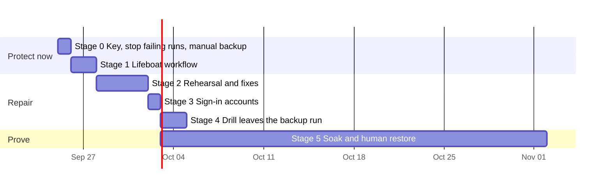

<!-- docs-check: proposed-paths -->
<!-- This is a plan. It names files that do not exist yet: .github/workflows/lifeboat.yml,
     .github/workflows/backup-rehearsal.yml and sql/supabase/04_backup_auth_export.sql. -->

# 06 — Plan

> **TL;DR (non-technical):** Today the owner makes sure the backups could ever be opened, stops
> the runs that can only fail, and takes one backup by hand. Within a day or two a small,
> separate daily backup (the "lifeboat") takes over. Only then is the main system repaired, with
> every fix tested on the real tools before it reaches production. Both run side by side for 30
> days, and a person restores from the bucket once. **From today on, there is never a day with
> zero copies of the data.**

> **Status: draft for owner review.** Every decision is a default that applies if the owner says
> nothing ([07](07-decisions.md)). *This page replaces the first plan of 2026-09-25 morning. That
> plan's rehearsal job and fixes are Stage 2 here; the second review put the key, the manual
> backup and the lifeboat in front of them.*

Dates are placeholders for sequencing, not commitments.

## 1. What changed from the first plan, and why

| First plan said | This plan says | Why |
|---|---|---|
| Start with a 1 to 2 day rehearsal job; Supabase has no copy until the first real backup is green | A manual backup **today**, and the lifeboat within 1 to 2 days, before any repair | Supabase has zero copies; every day of repair is a day of exposure ([05](05-options.md) option D) |
| Pause the schedules by commenting out the fallback cron | Turn the schedule flags off, **then** disable `db-backup.yml` in GitHub | Commenting out the cron fails CI; the fallback ignores the flags (N6) |
| Check the recovery kit at the end | The key is **step 1** | 0 kit confirmations and 0 reveals in the registry (N9) |
| Seal reads `steps.jsonl` (L5) | Seal reads each step's `outcome` | `steps.jsonl` would not have caught runs 3 and 4 |
| Nothing on cf-admin's `backups.yml` | Disable it now; retire it after Stage 1 (RD-8) | It fails every Sunday and holds no secrets (N8) |

## 2. Rules for every stage

1. **A backup exists only as a file in storage that has been restored.** Passing tests, approved
   reviews and green checks are not evidence that one exists.
2. **The smallest proven path comes first.** New features wait (feature freeze, RD-4).
3. **Every stage ends with evidence**: a run link, an object listing, restored row counts. Nothing
   is reported fixed without one.
4. **The real tools see a change before production does.** From Stage 2, a runner change lands
   only with a green rehearsal run linked in its commit.
5. **Fakes fail the way the real tool fails**, and a contract test proves it.
6. **Results tell the truth.** A failed step fails the run; nothing prints "pass" for work that
   did not happen; the error code names the step that failed.
7. **Two independent paths** until the day-30 decision (RD-11). The lifeboat shares no code with
   the main runner.
8. **One number is watched**: the age of the newest backup that passed a restore check, per
   store.
9. A failure found by the rehearsal or the lifeboat's first runs is fixed there; it does not count
   against production.

## 3. Stage 0 — Protect now (the owner, about 1 hour, today)

| # | Task | Who |
|---|---|---|
| 0.1 | **Make sure the backups can be opened.** Find the recovery kit (`AGE-SECRET-KEY-1…`) saved when the key was created; if it was not saved, Console → Keys → **Reveal** (fresh sign-in; audited) and save it now. Save it as `key.txt` for a minute: `age-keygen -y key.txt` must print the active recipient shown on the Keys screen. Delete `key.txt`. Record the kit confirmation on the Keys screen | Owner (10 min) |
| 0.2 | The same for the Vendor: reveal, save, check, confirm. Until both are done, every backup is one lost password manager away from being unreadable | Vendor (10 min) |
| 0.3 | **Stop the runs that can only fail, in this order:** (a) Console → Settings → Schedule: turn **off** full and Supabase; (b) GitHub → cf-backup → Actions → `db-backup` → **Disable workflow** (or `gh workflow disable db-backup.yml --repo mascotasmadagascar-cmd/cf-backup`), which also stops the Monday fallback; (c) GitHub → cf-admin → Actions → `backups` → **Disable workflow** (RD-8). Doing (b) before (a) makes every tick's dispatch fail with an alert | Owner (5 min) |
| 0.4 | **Take one backup by hand**, following [10](10-manual-backup-runbook.md): the official Supabase dump as `postgres` (**sign-in accounts included**), the three D1 databases, encrypted to the backup key, stored in the bucket under `lifeboat/manual/<date>/` and in a second place, one file decrypted to prove it | Owner (45 min) |
| 0.5 | Repeat 0.4 once a week until Stage 1 is green, and keep doing it until Stage 3 is green (it is the only copy of the sign-in accounts until then) | Owner |

The daily stale-backup alerts keep coming; that is correct. "Run now" in the console will not start
runs until Stage 2 turns the workflow back on.

**Exit:** the key registry shows two kit confirmations; no new `backup_runs` row on Saturday
09-26; both workflows show "disabled"; the manual backup's files are listed under
`lifeboat/manual/<date>/` with one file decrypted.

## 4. Stage 1 — The lifeboat (engineering about 1 day; the owner 15 minutes)

A separate workflow, `.github/workflows/lifeboat.yml`, specified in [09](09-lifeboat-spec.md):
official tools and shell only, the existing two secrets and two variables, daily, Postgres
(`public`, `supabase_migrations`) and all three D1 databases, a restore check in the same run,
ciphertext only to R2 and a 30-day artifact, red on any failure.

| # | Task | Who |
|---|---|---|
| 1.1 | Write `lifeboat.yml` (under 250 lines); add it to `DOCUMENTED_SECRETS` and the common checks in `scripts/backup/lib/workflow-guards.ts`, with a test that its image reference equals `scripts/backup/lib/pins.ts`; record the exception in `RULES.md` rule 7 and `main.md` (RD-12). `npm run verify` green | AI |
| 1.2 | Start it by hand until it is green. Its failures cost 2 to 3 minutes each and touch nothing in production; this is the lifeboat's own rehearsal. Record in [09](09-lifeboat-spec.md) §7 what the first runs prove (the `chatbot-kb` method, the drill superuser, minutes, sizes) | AI |
| 1.3 | Download one file from `lifeboat/` and decrypt it with the recovery kit | Owner |
| 1.4 | Add a bucket lock rule on `lifeboat/` (30 days) and a lifecycle rule deleting objects there after 35 days (RD-12) | Owner (dashboard) |
| 1.5 | If RD-9 is accepted: create the healthchecks.io check and store its ping URL as a secret | Owner |
| 1.6 | Leave the schedule on; watch the first scheduled run | AI |

**Exit (all of them):**

- One run **started by the schedule** is green.
- The bucket lists its files under `lifeboat/…`, and the run's read-back matches every checksum.
- The run summary shows restored row counts equal to the source for Postgres and all three D1
  databases.
- The owner decrypted one file from the bucket with the recovery kit.
- The owner has received GitHub's failure email for a lifeboat run (a red attempt in 1.2, or one
  failed on purpose), so the alert path is proven.

From here, **Supabase data is backed up daily and restore-checked.**

## 5. Stage 2 — Repair the main pipeline (engineering 2 to 4 days; the owner 20 minutes)

### 5.1 The rehearsal job and contract tests

| # | Task | Who |
|---|---|---|
| 2.1 | Create the test resources (RD-2): a 4th D1 database, a second R2 bucket with no locks, and a test Cloudflare token scoped to only those two. No production secret is used by the rehearsal | Owner |
| 2.2 | Add `.github/workflows/backup-rehearsal.yml`: one job on `ubuntu-24.04`, run on changes to `scripts/backup/**`, `src/backups/**`, `sql/supabase/**` and `db-backup.yml`, weekly, and by hand | AI |
| 2.3 | The job seeds the test D1 database (more than 5 tables, a full-text table, some rows), starts the pinned `supabase/postgres` container with a schema-only fixture of the live `public` schema plus sample rows, and creates a throwaway age key pair | AI |
| 2.4 | It runs the **same commands as production** (`plan`, `tools`, `doctor`, `d1`, `postgres`, `seal`), with the targets swapped by environment only | AI |
| 2.5 | Then it checks what production never checked: every expected file is in the bucket; each **decrypts** with the throwaway key; a restore of the decrypted files matches the manifest's row counts. It fails on any step's error, not on the pipeline's own verdict | AI |
| 2.6 | Contract tests for the fakes: D1 SQL runs against Miniflare (in the `wrangler` package already), not plain SQLite; the fake wrangler, age and `pg_dump` refuse a missing output folder, and the rehearsal checks each real tool against the same case | AI |

**Exit:** the rehearsal runs and is **red on today's code** for T1, T2 and T5. A rehearsal that
passes today is wrong.

### 5.2 The fixes (each lands with a green rehearsal)

| # | Fix | Defects ([04](04-defect-register.md)) | Note |
|---|---|---|---|
| 2.7 | Create the three output folders before use; fakes stop creating them | T1 | One `ensureDir` in the command that owns each path |
| 2.8 | D1 counts and fingerprints without a compound `SELECT` | T2, L2, N3 | Three call sites: `d1-backup.ts:122,177,298`. One `SELECT` with a scalar subquery per table has no compound at all; or groups of at most 5. Proven on real D1 |
| 2.9 | Drop the Supabase CLI: `pg_dump` in the pinned 17 image, explicit schemas, no `--role`; remove the `supabase cli` step; update `docs/OWNER-SETUP.md` | T5, L1, L4, L16, N4 | **Use the lifeboat's exact commands** ([09](09-lifeboat-spec.md) §3.2), so both paths dump the same way |
| 2.10 | A drill shim for `auth.jwt()` | L3 | The same shim as the lifeboat |
| 2.11 | Seal reads every step's `outcome`; any `failure` fails the run | T4, L5 | |
| 2.12 | The error code and message name the step that failed | N1 | Skip the drill when there is nothing to drill |
| 2.13 | No "pass" without something checked, per store | L6, N2 | A test: no Postgres dump, no Postgres pass |
| 2.14 | Log every problem when it happens | T7, L7 | |
| 2.15 | The doctor does the work: a file in each work folder, one real table export, one real one-table dump | L8 | Seconds, not minutes |
| 2.16 | A failed store check stops that store only | N5 | RD-13 |
| 2.17 | No real backup until the latest runner test passed with the same settings | L15 | The setup gate |

### 5.3 Back to production

| # | Task | Who |
|---|---|---|
| 2.18 | Re-enable `db-backup.yml` in GitHub (the schedule flags stay off) | Owner |
| 2.19 | Start **one runner test**, then **one full backup** by hand | Owner |
| 2.20 | When that backup is green, turn the schedule flags back on | Owner |

**Exit:** the rehearsal is green twice in a row on `main` and is a required check on the runner's
paths; one real full backup has the verdict `ok` or `warning` (the only warning allowed is
"auth.users not in this backup", until Stage 3); the bucket holds the run's 10 data files, the
manifest and the checksums; the report has no "pass" for a store that did not run; a failure
injected in the rehearsal shows the right error code.

## 6. Stage 3 — Sign-in accounts (half a day; the owner runs one SQL file)

For RD-1's default (read-only views owned by `postgres`, so the Vault stays refused):

| # | Task | Who |
|---|---|---|
| 3.1 | `sql/supabase/04_backup_auth_export.sql`: a schema `backup_export` owned by `postgres`, with read-only views over `auth.users` and `auth.identities`; `SELECT` on them to the backup role only. The doctor keeps proving the Vault refused | AI |
| 3.2 | Run the SQL file once in the Supabase SQL editor | Owner (5 min) |
| 3.3 | The main Postgres step and the lifeboat export those views as `COPY` data into a fourth plain file, encrypted like the others | AI |
| 3.4 | **Where the restore is tested.** The bare image has 5 of the 27 `auth` tables, and there is no free project slot (C9 in [03](03-reality-check.md)). So the rehearsal restores sign-in accounts into a local full stack (`supabase start`, with unneeded services left out), **once a month**. `docs/RESTORE.md` gains a section on loading them into a new project after its Auth service has created the tables | AI |

**Exit:** the monthly rehearsal restores the accounts; the next real backup has no `auth.users`
warning and its manifest shows the live count (6 today). Task 0.5 stops.

## 7. Stage 4 — The drill leaves the backup run (1 to 2 days)

| # | Task | Who |
|---|---|---|
| 4.1 | The daily run keeps only plan, tools, doctor, D1 export, Postgres dump and seal. No container starts on a daily run | AI |
| 4.2 | A weekly drill run **downloads the latest full backup from the bucket**, checks every file against the manifest and checksums, and restores it (D1 into `node:sqlite`, Postgres into the pinned image with the shim). With RD-3's default, it verifies the downloaded ciphertext by header, size and checksum, and restores the plain files re-exported in the same run | AI |
| 4.3 | The monthly real-path D1 drill (a throwaway D1 database) becomes the weekly drill's first run each month | AI |

**Exit:** one green weekly drill, one green `check` run and one green monthly real-path drill,
started by the schedule where they have one.

## 8. Stage 5 — Soak, a human restore, the day-30 decision (30 days; the owner about 1 hour)

| # | Task | Who |
|---|---|---|
| 5.1 | Both paths run on their schedules. A red run is fixed in the rehearsal first; the count of consecutive green runs restarts after any red one | AI |
| 5.2 | After **7 consecutive scheduled green** main runs, **one real restore by hand** from the bucket with the recovery kit, following `docs/RESTORE.md`, on a machine that is not the runner. Row counts must match the manifest for all four stores, sign-in accounts included. Record it under Keys → Restore proof. Fix any wrong or unclear step the same day | Owner (1 hour) |
| 5.3 | The Vendor decrypts one file with their own kit | Vendor |
| 5.4 | Day 30: decide the two paths' future (RD-11) | Owner |

## 9. Definition of done

All true at the same time:

1. **The one number:** the newest restore-checked backup is under 26 hours old for Supabase and
   under 8 days old for D1, on both paths.
2. 7 consecutive scheduled green main runs, and 30 days with no missed scheduled run on either
   path.
3. The rehearsal job is a required check and green.
4. One human restore from the bucket, with a recovery kit, matching the manifest, sign-in accounts
   included.
5. Two kit confirmations, and each kit has decrypted a real backup.
6. One weekly drill and one monthly real-path D1 drill green.
7. `docs/RESTORE.md` and `docs/OWNER-SETUP.md` describe what was actually done.

After this, the feature freeze lifts (RD-4). The rehearsal stays a required check permanently.

## 10. Budget check (GitHub minutes a month, cf-backup)

Estimates, replaced by measured values in Stage 1.

| Item | Runs | Minutes each | Total |
|---|---|---|---|
| Lifeboat, daily until day 30 | 30 | 3 | 90 |
| Main backup, daily (no drill after Stage 4) | 30 | 3 | 90 |
| Weekly drill | 4 to 5 | 5 | 25 |
| Rehearsal (runner changes plus weekly) | 20 to 30 | 5 | 100 to 150 |
| Monthly full-stack rehearsal (Stage 3) | 1 | 10 | 10 |
| Fallback, runner tests, checks | about 6 | 2 | 12 |
| **Total** | | | **about 330 to 380**; about 250 to 300 once the lifeboat is weekly |

Within the 400-minute ceiling (RD-7). If the measured total goes over, the rehearsal first drops
its weekly run, then runs only on changes to the runner. R2 storage is a few megabytes; D1 reads
are thousands of rows against 5 million a day.

## 11. Risks

| Risk | What the plan does |
|---|---|
| Both paths fail for the same reason (the token, Supabase down, GitHub down) | Both go red: GitHub's failure email, the tick's stale alerts, and the outside dead-man (RD-9) |
| The lifeboat grows into a second big system | Hard limits in [09](09-lifeboat-spec.md) §2: one file, under 250 lines, shell and official tools only, no console link |
| A D1 export blocks the database | About a second at this size; the lifeboat runs at 02:41 local time |
| A recovery kit is lost | Two kits, a yearly confirmation, and a real decrypt with each |
| Personal data in plain text on the runner | Only on the runner's temporary disk, deleted with it; only ciphertext is uploaded |
| A leaked token deletes backups | Bucket locks on `lifeboat/` (RD-12) and on `backups/` and `ops/` (already there) |
| GitHub drops a scheduled run | Daily cadence, stale alerts, and the dead-man (RD-9) |

## 12. Status

Update this table in the same commit that completes a stage, with the evidence links. A red
rehearsal or a red real run also gets an entry in `docs/DIAGNOSTICS-PREFLIGHT-STORAGE.md`: the log
line, the cause, the fix commit.

| Stage | State | Evidence |
|---|---|---|
| 0.1–0.2 Recovery kits | not started | |
| 0.3 Stop failing runs | not started | |
| 0.4 Manual backup | not started | |
| 1 Lifeboat | not started | |
| 2 Main pipeline repaired | not started | |
| 3 Sign-in accounts | waiting on RD-1 | |
| 4 Drill separated | not started | |
| 5 Soak, human restore, day 30 | not started | |

## 13. Verification log

| Date | Checked by | Method | Result |
|---|---|---|---|
| 2026-09-25 | claude | First plan written against the defect register | Phases 0 to 4 (now Stages 2 to 5) |
| 2026-09-25 | claude | Second review: live schedule, key registry, cf-admin's `backups.yml`, the fallback's guard (`workflow-guards.ts:195-198`, `plan.ts:57`) | Stages 0 and 1 added; the pause method corrected |
| 2026-09-25 | claude | Minutes: `backup_runs.billed_minutes` (1 to 2 per failing run) | Budget estimates as in §10 |

## 14. Related

- [04-defect-register.md](04-defect-register.md): what each fix addresses.
- [07-decisions.md](07-decisions.md): RD-1 to RD-13.
- [09-lifeboat-spec.md](09-lifeboat-spec.md): Stage 1 in detail.
- [10-manual-backup-runbook.md](10-manual-backup-runbook.md): Stage 0.4 step by step.
