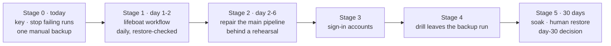

# 10: The robust plan

**This is the current plan.** Where it differs from [06](06-plan.md), this one wins. 06's
rehearsal job and its list of fixes carry on unchanged in intent inside Stage 2 below. The
evidence behind every change is in [08](08-second-review.md) and [09](09-how-others-do-it.md).

## The idea in one paragraph

First make sure the backups could ever be opened (the key), and stop the runs that can only fail.
Then **make one real, encrypted, off-site backup today, by hand**. Within a day or two, automate
that with a **small, separate workflow (the "lifeboat")** that backs up, checks a restore, and fails
loudly. Only then repair the main pipeline, proving every fix against the real tools before
production. Keep both running until the main pipeline has 30 green days and a person has restored
from it. **From today on, there is never a day with zero copies of the data.**

## What changed from 06, and why

| 06 said | This plan says | Why ([08](08-second-review.md), [09](09-how-others-do-it.md)) |
|---|---|---|
| Start with a 1 to 2 day rehearsal job; Supabase has no copy until Phase 1 is green | A manual backup **today**, and an automated lifeboat within 1 to 2 days, before any repair | Supabase has zero copies. Every day of repair is a day of exposure. Walking skeleton first |
| Pause the schedules by commenting out the fallback cron | Turn the schedule flags off, **then** disable `db-backup.yml` in GitHub | Commenting out the cron fails CI; the fallback ignores the flags |
| The key is checked at the end ("check now that the kit is where it says") | The key is **step 1** | 0 kit confirmations and 0 reveals in the registry |
| L5: seal reads `steps.jsonl` | Seal reads each step's `outcome` | `steps.jsonl` would not have caught runs 3 and 4 |
| No word on cf-admin's `backups.yml` | Disable it now; retire it once the lifeboat is green (D8) | It fails every Sunday and holds no secrets |
| Done = 06's six points | Adds: the lifeboat green for 30 days, two confirmed kits, and one number to watch (below) | A backup is a restore, not a green run |

## Rules for every stage

1. **A backup exists only as a file in storage that has been restored.** Passing tests, approved
   reviews and green checks are not evidence that a backup exists.
2. **The smallest proven path comes first.** New features wait (06's freeze stands, decision 4).
3. **Every stage ends with evidence**: a run link, an object listing, restored row counts. Nothing
   is reported fixed without it.
4. **The real tools see a change before production does.** From Stage 2, any change to the runner
   lands only with a green rehearsal run linked in its commit.
5. **Fakes fail like the real thing** (06 rule 4), and a contract test proves it.
6. **Results tell the truth.** A step that fails fails the run. Nothing prints "pass" for work
   that did not happen. The error code names the step that failed.
7. **Two independent paths** until the day-30 decision (D11). The lifeboat shares no code with the
   main runner.
8. **One number is watched**: the age of the newest backup that has passed a restore check,
   for each store.

## Stage 0: today (the owner, about 1 hour)

### 0.1 Make sure the backups can be opened (10 minutes)

1. Console → Keys. Find the recovery kit you saved when the key was created (a line beginning
   `AGE-SECRET-KEY-1`) in your password manager.
2. If you did not save it, use **Reveal** now (fresh sign-in; audited) and save it.
3. Check that it is the right key: save it as `key.txt` for a minute; `age-keygen -y key.txt` must
   print the same `age1…` recipient as the active key on the Keys screen. Then delete `key.txt`.
4. Record your kit confirmation on the Keys screen.
5. **Ask the Vendor to do steps 2 to 4 as well.** Until both are done, every backup is one lost
   password manager away from being unreadable.

**Evidence:** the key registry shows two kit confirmations.

### 0.2 Stop the runs that can only fail (5 minutes, in this order)

1. Console → Settings → Schedule: turn **off** both the full and the Supabase schedule.
2. GitHub → cf-backup → Actions → `db-backup` → **Disable workflow** (or
   `gh workflow disable db-backup.yml --repo mascotasmadagascar-cmd/cf-backup`). This also stops the
   Monday fallback (2026-09-28 12:43 UTC). Do it after step 1: a disabled workflow with the flags
   still on makes every tick's dispatch fail with an alert.
3. GitHub → cf-admin → Actions → `backups` → **Disable workflow** (D8).

The daily stale-backup alerts keep coming. That is correct: there is no backup. "Run now" in the
console will not start runs until Stage 2 turns the workflow back on.

**Evidence:** no new `backup_runs` row on Saturday 09-26; both workflows show "disabled".

### 0.3 Take one backup by hand (about 45 minutes)

Follow [12](12-manual-backup-today.md). You make the official Supabase dump as the `postgres`
user, so **it includes the 6 sign-in accounts**, which no automated path can do yet. You also
export the three D1 databases, encrypt everything to the backup key, store it in two places, and
decrypt one file to prove it.

**Evidence:** the file list and sizes under `lifeboat/manual/<date>/` in the bucket, and "decrypted
OK" for one file. **Repeat 0.3 once a week until Stage 1 is green.**

## Stage 1: the lifeboat (engineering about 1 day; the owner 15 minutes)

A separate workflow, `lifeboat.yml`, in this repository. The full specification is
[11](11-lifeboat.md). In short:

- **Official tools and shell only:** `pg_dump` in the pinned Postgres 17 image, `wrangler`, `age`.
  No TypeScript from the runner, no Supabase CLI, no console, no D1 row. It stays under 250 lines.
- **The same two secrets and two variables** the main pipeline already has. No new secret.
- **Daily**, at a quiet minute away from the hour and from 09:17. Manual runs too.
- **Backs up** Postgres (`public` and `supabase_migrations`) and all three D1 databases.
- **Checks a restore in the same run.** It restores Postgres into the pinned image and D1 into
  SQLite, and compares every table's row count with the source. A mismatch fails the run.
- **Encrypts** each file to `BACKUP_AGE_RECIPIENT` and uploads **ciphertext only** to R2 under
  `lifeboat/<date>/<run id>-<attempt>/`. It reads each object back and checks its SHA-256. It also
  keeps a 30-day GitHub artifact, so there is a second copy with a second provider.
- **Fails loudly:** any failed step turns the run red, and GitHub emails the person who started it
  (for a scheduled run, the person who last changed its cron line).

**Tasks**

1. Write `lifeboat.yml`, and update the workflow guards (`DOCUMENTED_SECRETS` and the common
   checks) and `RULES.md` rule 7 (D12). `npm run verify` green.
2. Start it by hand until it is green. Its failures cost 2 to 3 minutes each and touch nothing in
   production. This is the rehearsal for the lifeboat itself.
3. **The owner** downloads one file from `lifeboat/` and decrypts it with the recovery kit.
4. **The owner** adds a bucket lock rule on `lifeboat/` (30 days) and a lifecycle rule that deletes
   objects there after 35 days (D12).
5. Leave the schedule on.

**Acceptance (all of them)**

- One run **started by the schedule** is green.
- The bucket lists its files under `lifeboat/…`, and the run's read-back matches every checksum.
- The run summary shows restored row counts equal to the source for Postgres and all three D1
  databases.
- The owner decrypted one file from the bucket with the recovery kit.
- The owner has received GitHub's failure email for a lifeboat run (a red attempt in task 2, or one
  failed on purpose), so the alert path is proven.

From here, **Supabase data is backed up daily and restore-checked**, and sign-in accounts are
covered weekly by 0.3, until Stage 3.

## Stage 2: repair the main pipeline (engineering 2 to 4 days; the owner 20 minutes)

06's Phase 0 and Phase 1, amended.

### 2.1 The rehearsal and contract tests

- **The rehearsal job:** as 06 Phase 0 describes. The real commands and real tools run against a
  test D1 database, a test bucket with no locks, a local `supabase/postgres` container and a
  throwaway age key. It decrypts what it uploaded and restores it (decision 2 in 07 stands). It
  must be **red on today's code** for T1, T2 and L1. A rehearsal that passes today is wrong.
- **Contract tests for the fakes** (new, cheap, in `npm run verify` where possible):
  - D1 SQL runs against Miniflare (already inside the `wrangler` package), not plain SQLite, so
    the 5-part limit bites in tests.
  - The fake `wrangler`, `age` and `pg_dump` refuse a missing output folder, as the real ones do.
    A contract test in the rehearsal checks each real tool against the same case.

### 2.2 The fixes (each lands with a green rehearsal)

| Fix | Defects | Note |
|---|---|---|
| Create the three output folders before use; fakes stop creating them | T1 | One `ensureDir` in the command that owns each path |
| D1 counts and fingerprints without a compound `SELECT` | T2, L2, N3 (**three** call sites: `d1-backup.ts:122,177,298`) | One `SELECT` with a scalar subquery per table has no `UNION` at all; or groups of at most 5. Prove it on real D1 |
| Drop the Supabase CLI: `pg_dump` in the pinned 17 image, explicit schemas, no `--role` | L1, L4, N4, L16 | **Use the lifeboat's exact commands** (11), so both paths dump the same way. Remove the `supabase cli` step |
| Drill shim for `auth.jwt()` | L3 | The same shim as the lifeboat |
| Seal reads every step's `outcome`; any `failure` fails the run | T4, L5 | Replaces 06's `steps.jsonl` idea |
| The error code and message name the step that failed | N1 | Skip the drill when there is nothing to drill; branch on "no files", not "no drill" |
| No "pass" without something checked, per store | L6, N2 | A test: a run with no Postgres dump never prints a Postgres pass |
| Log every problem when it happens | L7 | |
| The doctor does the work: a file written in each work folder, one real table export, one real one-table dump | L8 | Seconds, not minutes |
| A failed store check stops that store only (D13) | N5 | Checks shared by every store (the key, R2) still stop everything |
| A real backup cannot be started until the latest runner test passed with the same settings | L15 | The setup gate |

### 2.3 Back to production

1. The owner re-enables `db-backup.yml` in GitHub (the flags stay off).
2. The owner starts **one runner test**, then **one full backup** by hand.
3. When that backup is green, the owner turns the schedule flags back on.

**Acceptance**

- The rehearsal is green twice in a row on `main`, and it is a required check on the runner's
  paths.
- One real full backup has the verdict `ok` or `warning`. The only warning allowed is "auth.users
  not in this backup", until Stage 3.
- The bucket holds the run's 10 data files, the manifest and the checksums.
- The report has no "pass" for a store that did not run, and a failure injected in the rehearsal
  shows the right error code.

## Stage 3: sign-in accounts (half a day; the owner runs one SQL file)

As 06 Phase 2, with 07's decision 1 default (read-only views owned by `postgres`, so the Vault
stays refused). Two additions:

- **Where to test the restore.** The bare image cannot take `auth` rows (it has 5 of the 27
  tables). There is no free slot for a second Supabase project either: the organisation already
  has two projects, and the Free plan allows two active free projects. So the rehearsal restores
  sign-in accounts into a local full stack (`supabase start`, with the services it does not need
  left out), **once a month**. It pulls several images, which is why it is monthly.
- **The lifeboat** adds the same views' export once they exist.

**Acceptance:** the monthly rehearsal restores the accounts; the next real backup has no
`auth.users` warning, and its manifest shows the live count (6 today). From then on 0.3 is no
longer needed.

## Stage 4: the drill leaves the backup run (1 to 2 days)

06 Phase 3, unchanged: the daily run only exports, encrypts and uploads; a weekly drill downloads
the latest backup from the bucket and restores it. 07's decision 3 (no drill key in CI) stands.

## Stage 5: soak, a human restore, and the day-30 decision (30 days; the owner about 1 hour)

1. Both paths run on their schedules. A red run is fixed in the rehearsal first. The count of
   consecutive green runs starts again after any red one.
2. After **7 consecutive scheduled green** main runs, the owner does **one real restore by hand**
   from the bucket with the recovery kit, following `docs/RESTORE.md`, on a machine that is not the
   runner. Row counts must match the manifest for all four stores, sign-in accounts included.
   The owner records it under Keys → Restore proof. Any wrong or unclear step in the guide is
   fixed the same day.
3. The Vendor decrypts one file with their own kit, so both kits are proven.
4. **Day 30:** decision D11 (below).

## Definition of done

All true at the same time:

1. **The one number:** the newest restore-checked backup is under 26 hours old for Supabase and
   under 8 days old for D1, on both paths.
2. 7 consecutive scheduled green main runs, and 30 days with no missed scheduled run on either
   path.
3. The rehearsal is a required check and green.
4. One human restore from the bucket, with a recovery kit, matching the manifest, sign-in accounts
   included.
5. Two kit confirmations, and each kit has decrypted a real backup.
6. One weekly drill and one monthly real-path D1 drill green.
7. `docs/RESTORE.md` and `docs/OWNER-SETUP.md` describe what was actually done.

After this, the freeze lifts (07, decision 4).

## Decisions

07's decisions 1 to 7 stand, with 5's method changed as above. New ones, each with a default that
applies if the owner says nothing:

| # | Decision | Default | Why |
|---|---|---|---|
| D8 | cf-admin's `backups.yml` | **Disable now; delete it in a cf-admin commit after Stage 1 is green.** If Stage 1 slips past 48 hours, the fallback is to add its four secrets to cf-admin and run it as it is | Its design lives on in the lifeboat. Keeping it would put production secrets in cf-admin, which the plan of record forbids, plus a fifth secret (its passphrase) |
| D9 | A dead-man's switch outside GitHub and Cloudflare | **Yes:** a free healthchecks.io check, pinged by the lifeboat (and later the main run) on success. It emails if a day passes without a ping | GitLab's backups failed silently for a long time. Today every alert path depends on GitHub or on cf-admin's tick. It costs one more secret (the ping URL), outside the four keys |
| D10 | `pg_read_all_data` for the backup role, to read `auth` | **No**, unless a test in the drill image shows the Vault stays refused | It opens every schema; the design refuses the Vault to the runner |
| D11 | Day 30: the future of the two paths | **Keep both. The lifeboat goes weekly** (about 12 minutes a month), as a second code path | Two paths that share no code rarely fail for the same reason. Other choices: make the main runner's store steps call the lifeboat's commands and delete the rest, or retire the lifeboat |
| D12 | The lifeboat is a second scheduled workflow | **Allow it**, recorded in `RULES.md` rule 7 as an exception until D11. Its prefix gets a 30-day lock and a 35-day lifecycle rule | Today's rule says the only schedule is the fallback |
| D13 | Pre-flight policy (N5) | **Per store:** a store's own failed check stops that store only | Keeps D1 backed up when Supabase is down, as the workflow header promises |

## Timeline

| When | Stage | Who |
|---|---|---|
| Today or tomorrow | 0 | Owner, about 1 hour |
| Days 1 to 2 | 1 | Engineering about 1 day; owner 15 minutes |
| Days 2 to 6 | 2 | Engineering 2 to 4 days; owner 20 minutes |
| Days 6 to 7 | 3 | Engineering half a day; owner 5 minutes |
| Days 7 to 9 | 4 | Engineering 1 to 2 days |
| Days 7 to 37 | 5 | The schedules; owner about 1 hour |

## Cost (GitHub minutes a month for cf-backup; estimates, replaced by measurements in Stage 1)

| Item | Runs | Minutes each | Total |
|---|---|---|---|
| Lifeboat, daily until day 30 | 30 | 3 | 90 |
| Main backup, daily (no drill after Stage 4) | 30 | 3 | 90 |
| Weekly drill | 4 to 5 | 5 | 25 |
| Rehearsal (runner changes plus weekly) | 20 to 30 | 5 | 100 to 150 |
| Monthly full-stack rehearsal (Stage 3) | 1 | 10 | 10 |
| Fallback, runner tests, checks | about 6 | 2 | 12 |
| **Total** | | | **about 330 to 380**; about 250 to 300 once the lifeboat is weekly |

That fits 07's ceiling of 400 (decision 7). R2 storage is a few megabytes; D1 reads are thousands
of rows against 5 million a day.

## Risks

| Risk | What the plan does |
|---|---|
| Both paths fail for the same reason (the token, Supabase down, GitHub down) | Both go red: GitHub emails, the tick's stale alerts and the outside dead-man (D9) |
| The lifeboat grows into a second big system | Hard limits in [11](11-lifeboat.md): one file, under 250 lines, shell and official tools only, no console link |
| A D1 export blocks the database | Exports take about a second at this size; the lifeboat runs at 02:41 local time |
| A recovery kit is lost | Two kits, a yearly confirmation, and a real decrypt with each |
| Personal data in plain text on the runner | Only on the runner's temporary disk, deleted with it. Only ciphertext is uploaded, to R2 and to the artifact |
| A leaked token deletes backups | Bucket locks on `lifeboat/` (D12) and on `backups/` and `ops/` (already there) |
| GitHub drops a scheduled run | Daily cadence, stale alerts, and the dead-man (D9) |

## Status

Update this table in the same commit that completes a stage, with the evidence links.

| Stage | State | Evidence |
|---|---|---|
| 0.1 Key | not started | |
| 0.2 Stop failing runs | not started | |
| 0.3 Manual backup | not started | |
| 1 Lifeboat | not started | |
| 2 Main pipeline repaired | not started | |
| 3 Sign-in accounts | waiting on decision 1 | |
| 4 Drill separated | not started | |
| 5 Soak, human restore, day 30 | not started | |
