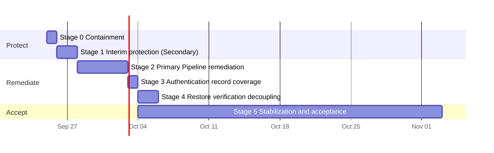

<!-- docs-check: proposed-paths -->
<!-- This is a plan. It names files that do not exist yet: .github/workflows/secondary-pipeline.yml,
     .github/workflows/preprod-validation.yml and sql/supabase/04_auth_export_views.sql. -->

# 06 — Remediation plan

> **TL;DR (non-technical):** Today the Owner confirms that the recovery points can be decrypted,
> stops the scheduled runs that can only fail, and produces one recovery point manually. Within one
> to two days a small, independent Secondary Pipeline takes over daily. Only then is the Primary
> Pipeline remediated, with every change validated against the real tools before production. Both
> pipelines then run for a 30-day stabilization period, and a person performs one recovery test
> from the archive. **From today onward, there is no day without a copy of the data.**

> **Status: draft for owner review.** Every decision is a default that applies unless the Owner
> decides otherwise ([07](07-decision-log.md)). *This plan supersedes the first plan of 2026-09-25
> (morning). That plan's validation workflow and fixes form Stage 2 here; the second review placed
> key verification, containment and the Secondary Pipeline before them.* Terms:
> [11](11-terminology-standard.md).

Dates indicate sequence, not commitments.

## 1. Changes from the first plan

| First plan | This plan | Rationale |
|---|---|---|
| Begin with a 1 to 2 day validation workflow; Supabase has no copy until the first production run passes | A manual baseline export **today**, and the Secondary Pipeline within 1 to 2 days, before any remediation | Supabase has no copy; every day of remediation is a day of exposure ([05](05-options-analysis.md) option D) |
| Pause the schedules by commenting out the fallback schedule | Disable the schedule settings, **then** disable `db-backup.yml` in GitHub | Commenting out the cron fails CI; the fallback ignores the settings (N6) |
| Verify the offline recovery key at the end | Key verification is **step 1** | 0 confirmations and 0 reveals in the registry (N9) |
| The finalization stage reads `steps.jsonl` (L5) | The finalization stage reads each step's `outcome` | `steps.jsonl` would not have detected runs 3 and 4 |
| No provision for cf-admin's legacy export workflow | Disable now; retire after Stage 1 (RD-8) | It fails every Sunday and holds no secrets (N8) |
| — | Nomenclature alignment in code before the stabilization period (RD-14) | Informal identifiers (N10) |

## 2. Governing principles

1. **A recovery point exists only once it is archived and has passed restore verification.**
   Passing tests, approved reviews and successful checks are not evidence of one.
2. **The smallest proven path comes first.** New features wait (feature freeze, RD-4).
3. **Every stage closes with evidence**: a run link, an object listing, restored row counts.
   Nothing is reported resolved without it.
4. **Real tools before production.** From Stage 2, a runner change is merged only with a passing
   Pre-production Validation run referenced in its commit.
5. **Test doubles fail the way the real tool fails**, proven by a contract test.
6. **Accurate results.** A failed step fails the run; nothing reports "pass" for work not done;
   the error code identifies the failing stage.
7. **Two independent pipelines** until the day-30 decision (RD-11). The Secondary Pipeline shares
   no code with the Primary Pipeline.
8. **One key indicator**: Recovery Point Actual (RPA), the age of the newest verified recovery
   point per store, measured against the RPO.
9. A failure detected by Pre-production Validation or by the Secondary Pipeline's commissioning
   runs is resolved there and does not count against production.

## 3. Stage 0 — Containment (Owner, about one hour, today)

| # | Task | Owner |
|---|---|---|
| 0.1 | **Verify the offline recovery key.** Locate the key (`AGE-SECRET-KEY-1…`) saved when the archive encryption key was created; if it was not saved, Console → Keys → **Reveal** (fresh sign-in; audited) and save it now. Save it temporarily as `key.txt`: `age-keygen -y key.txt` must print the active recipient shown on the Keys screen. Delete `key.txt`. Record the confirmation on the Keys screen (the console labels it "recovery kit") | Owner (10 min) |
| 0.2 | The Vendor repeats 0.1. Until both are complete, every recovery point is one lost password manager away from being unrecoverable | Vendor (10 min) |
| 0.3 | **Stop the scheduled runs, in this order:** (a) Console → Settings → Schedule: disable **full** and **Supabase**; (b) GitHub → cf-backup → Actions → `db-backup` → **Disable workflow** (or `gh workflow disable db-backup.yml --repo mascotasmadagascar-cmd/cf-backup`), which also stops the fallback schedule; (c) GitHub → cf-admin → Actions → `backups` → **Disable workflow** (RD-8). Performing (b) before (a) causes every Scheduler dispatch to fail with an alert | Owner (5 min) |
| 0.4 | **Produce one manual baseline export**, following [10](10-sop-manual-baseline-export.md): the official Supabase export as `postgres` (**authentication records included**) and the three D1 databases, encrypted to the archive encryption key, stored under `secondary/manual/<date>/` in the archive bucket and in a second location, with one file decrypted as proof | Owner (45 min) |
| 0.5 | Repeat 0.4 weekly until Stage 1 passes, and continue until Stage 3 passes (it is the only copy of the authentication records until then) | Owner |

The Scheduler's daily staleness alerts continue; that is correct. "Run now" in the console will
not start runs until Stage 2 re-enables the workflow.

**Exit criteria:** the key registry shows two confirmations; no new `backup_runs` row on Saturday
09-26; both workflows show "disabled"; the manual baseline export is listed under
`secondary/manual/<date>/` with one file decrypted.

## 4. Stage 1 — Interim protection: Secondary Pipeline (engineering about one day; Owner 15 minutes)

A separate workflow, `.github/workflows/secondary-pipeline.yml`, specified in
[09](09-secondary-pipeline-specification.md): vendor tools and shell only, the existing two
secrets and two variables, daily, PostgreSQL (`public`, `supabase_migrations`) and all three D1
databases, restore verification in the same run, ciphertext only to R2 plus a 30-day artifact,
failure on any error.

| # | Task | Owner |
|---|---|---|
| 1.1 | Implement `secondary-pipeline.yml` (under 250 lines); add it to `DOCUMENTED_SECRETS` and the common checks in `scripts/backup/lib/workflow-guards.ts`, with a test that its image reference equals `scripts/backup/lib/pins.ts`; record the exception in `RULES.md` rule 7 and `main.md` (RD-12). `npm run verify` passes | Engineering |
| 1.2 | Commission it with manual runs until it passes. Commissioning failures cost 2 to 3 minutes each and do not touch production. Record in [09](09-secondary-pipeline-specification.md) §7 what the commissioning runs establish (the `chatbot-kb` method, the restore-target superuser, minutes, sizes) | Engineering |
| 1.3 | Download one file from `secondary/pipeline/` and decrypt it with the offline recovery key | Owner |
| 1.4 | Add a bucket lock rule on `secondary/` (30 days) and a lifecycle rule deleting objects there after 35 days (RD-12) | Owner (dashboard) |
| 1.5 | If RD-9 is accepted: create the external heartbeat monitor and store its ping URL as a secret | Owner |
| 1.6 | Leave the schedule enabled; observe the first scheduled run | Engineering |

**Exit criteria (all):**

- One run **started by the schedule** passes.
- The archive bucket lists its files under `secondary/pipeline/…`, and the run's read-back matches
  every checksum.
- The run summary shows restored row counts equal to the source for PostgreSQL and all three D1
  databases.
- The Owner decrypted one file from the bucket with the offline recovery key.
- The Owner has received GitHub's failure notification for a Secondary Pipeline run (a failed
  commissioning run, or one failed deliberately), proving the alert path.

From this point, **Supabase data is exported daily and restore-verified.**

## 5. Stage 2 — Primary Pipeline remediation (engineering 3 to 5 days; Owner 20 minutes)

### 5.1 Pre-production Validation and contract tests

| # | Task | Owner |
|---|---|---|
| 2.1 | Create the test resources (RD-2): a 4th D1 database, a second R2 bucket without locks, and a test Cloudflare token scoped to those two only. No production secret is used by validation | Owner |
| 2.2 | Add `.github/workflows/preprod-validation.yml`: one job on `ubuntu-24.04`, triggered by changes to `scripts/backup/**`, `src/backups/**`, `sql/supabase/**` and `db-backup.yml`, weekly, and on demand | Engineering |
| 2.3 | The job seeds the test D1 database (more than 5 tables, a full-text table, sample rows), starts the pinned `supabase/postgres` container with a schema-only fixture of the live `public` schema plus sample rows, and creates a temporary age key pair | Engineering |
| 2.4 | It runs **the same commands as production** (`plan`, `tools`, `doctor`, `d1`, `postgres`, `seal`), with targets substituted through environment variables only | Engineering |
| 2.5 | It then verifies what production never verified: every expected file is in the bucket; each **decrypts** with the temporary key; a restore of the decrypted files matches the manifest's row counts. It fails on any step error, independent of the pipeline's own verdict | Engineering |
| 2.6 | Contract tests for the test doubles: D1 SQL runs against Miniflare (already in the `wrangler` package), not plain SQLite; the wrangler, age and `pg_dump` doubles refuse a missing output directory, and validation checks each real tool against the same case | Engineering |

**Exit criterion:** validation runs and **fails on today's code** for T1, T2 and T5. Validation
that passes today is itself defective.

### 5.2 Remediation items (each merged with passing validation)

| # | Change | Defects ([04](04-defect-register.md)) | Note |
|---|---|---|---|
| 2.7 | Create the three output directories before use; test doubles stop creating them | T1 | One `ensureDir` in the command that owns each path |
| 2.8 | D1 row counts and fingerprints without a compound `SELECT` | T2, L2, N3 | Three call sites: `d1-backup.ts:122,177,298`. A single `SELECT` with one scalar subquery per table, or batches of at most 5; proven on real D1 |
| 2.9 | Remove the Supabase CLI: `pg_dump` in the pinned 17 image, explicit schemas, no `--role`; remove the `supabase cli` step; update `docs/OWNER-SETUP.md` | T5, L1, L4, L16, N4 | **Use the Secondary Pipeline's exact export commands** ([09](09-secondary-pipeline-specification.md) §3.2) |
| 2.10 | A compatibility shim for `auth.jwt()` in restore verification | L3 | The same shim as the Secondary Pipeline |
| 2.11 | The finalization stage reads every step's `outcome`; any `failure` fails the run | T4, L5 | |
| 2.12 | The error code and message identify the failing stage | N1 | Skip restore verification when there is nothing to verify |
| 2.13 | No "pass" without something verified, per store | L6, N2 | Test: no PostgreSQL export, no PostgreSQL pass |
| 2.14 | Log every problem when it is recorded | T7, L7 | |
| 2.15 | Pre-flight diagnostics test capability: a file in each working directory, one real table export, one real one-table dump | L8 | Seconds, not minutes |
| 2.16 | A failed store-specific check stops that store only | N5 | RD-13 |
| 2.17 | No production run until the latest pre-flight run passed with the same configuration | L15 | The configuration gate |

### 5.3 Return to production

| # | Task | Owner |
|---|---|---|
| 2.18 | Re-enable `db-backup.yml` in GitHub (schedule settings remain disabled) | Owner |
| 2.19 | Start **one pre-flight run**, then **one full backup run**, manually | Owner |
| 2.20 | When that run passes, re-enable the schedule settings | Owner |

### 5.4 Nomenclature alignment (RD-14)

| # | Task | Owner |
|---|---|---|
| 2.21 | Rename the code and console identifiers to the standard in [11](11-terminology-standard.md) §3–§4: stage names and step ids (`doctor` → `preflight`, `seal` → `finalize`), run-type labels, the console's "Runner test" label, and log prefixes. Persisted values (`backup_runs.kind` and `error_code`, R2 layout, settings keys) keep their current values unless the Owner approves a cf-admin migration; the console maps them to the new labels | Engineering |
| 2.22 | Update the living documents that describe the built system (`docs/RESTORE.md`, `docs/OWNER-SETUP.md`, `README.md`, `main.md`) in the same change | Engineering |

Performed in one change after 2.20, with passing validation, and **before** the stabilization
period starts, so the 30 days observe the final system.

**Exit criteria:** validation passes twice consecutively on `main` and is a required check on the
runner's paths; one production full run has the verdict `ok` or `warning` (the only permitted
warning is "auth.users not included", until Stage 3); the archive bucket holds the run's 10 data
files, the manifest and the checksums; the report has no "pass" for a store that did not run; a
failure injected in validation produces the correct error code; 2.21 and 2.22 are merged.

## 6. Stage 3 — Authentication record coverage (half a day; Owner runs one SQL file)

For RD-1's default (read-only views owned by `postgres`, so the Vault remains refused):

| # | Task | Owner |
|---|---|---|
| 3.1 | `sql/supabase/04_auth_export_views.sql`: a schema `auth_export` owned by `postgres`, with read-only views over `auth.users` and `auth.identities`; `SELECT` granted to the read-only export role only. Pre-flight diagnostics continue to prove the Vault refused | Engineering |
| 3.2 | Run the SQL file once in the Supabase SQL editor | Owner (5 min) |
| 3.3 | The Primary and Secondary Pipelines export those views as `COPY` data into an additional file, encrypted like the others | Engineering |
| 3.4 | **Restore target.** The bare image has 5 of the 27 `auth` tables, and there is no free project slot (C9 in [03](03-dependency-assessment.md)). Validation therefore restores authentication records into a local full stack (`supabase start`, unneeded services excluded) **once a month**. `docs/RESTORE.md` gains a section on loading them into a new project once its Auth service has created the tables | Engineering |

**Exit criteria:** the monthly validation restores the authentication records; the next production
run has no `auth.users` warning and its manifest shows the live count (6 today). Task 0.5 ends.

## 7. Stage 4 — Restore verification decoupling (1 to 2 days)

| # | Task | Owner |
|---|---|---|
| 4.1 | The daily run retains only run planning, toolchain provisioning, pre-flight diagnostics, D1 export, PostgreSQL export and finalization. No container starts on a daily run | Engineering |
| 4.2 | A weekly restore verification **downloads the latest full recovery point from the archive bucket**, checks every file against the manifest and checksums, and restores it (D1 into `node:sqlite`, PostgreSQL into the pinned image with the shim). Under RD-3's default, it verifies the downloaded ciphertext by header, size and checksum, and restores the plain exports produced in the same run | Engineering |
| 4.3 | The monthly live restore test (a temporary D1 database) becomes the first weekly verification of each month | Engineering |

**Exit criteria:** one passing weekly restore verification, one passing verification run and one
passing monthly live restore test, each started by its schedule where one exists.

## 8. Stage 5 — Stabilization and acceptance (30 days; Owner about one hour)

| # | Task | Owner |
|---|---|---|
| 5.1 | Both pipelines run on schedule. A failed run is resolved in validation first; the count of consecutive passing runs restarts after any failure | Engineering |
| 5.2 | After **7 consecutive scheduled passing** Primary Pipeline runs, a **recovery test by a person** from the archive bucket with the offline recovery key, following `docs/RESTORE.md`, on a machine other than the runner. Row counts must match the manifest for all four stores, authentication records included. Record it under Keys → Restore proof. Correct any inaccurate step the same day | Owner (1 hour) |
| 5.3 | The Vendor decrypts one file with their own offline recovery key | Vendor |
| 5.4 | Day 30: decide the future of the two pipelines (RD-11) | Owner |

## 9. Acceptance criteria (definition of done)

All true simultaneously:

1. **Recovery Point Actual (RPA)** is under 26 hours for Supabase (RPO 24 hours) and under 8 days
   for D1, on both pipelines.
2. 7 consecutive scheduled passing Primary Pipeline runs, and 30 days without a missed scheduled
   run on either pipeline.
3. Pre-production Validation is a required check and passing.
4. One recovery test by a person from the archive bucket, with an offline recovery key, matching
   the manifest, authentication records included.
5. Two offline-recovery-key confirmations, each key having decrypted a real recovery point.
6. One weekly restore verification and one monthly live restore test passing.
7. `docs/RESTORE.md` and `docs/OWNER-SETUP.md` describe what was actually done.

On acceptance the feature freeze lifts (RD-4). Pre-production Validation remains a required check
permanently.

## 10. Budget (GitHub Actions minutes per month, cf-backup)

Estimates, replaced by measured values in Stage 1.

| Item | Runs | Minutes each | Total |
|---|---|---|---|
| Secondary Pipeline, daily until day 30 | 30 | 3 | 90 |
| Primary Pipeline, daily (no restore verification after Stage 4) | 30 | 3 | 90 |
| Weekly restore verification | 4 to 5 | 5 | 25 |
| Pre-production Validation (runner changes plus weekly) | 20 to 30 | 5 | 100 to 150 |
| Monthly full-stack validation (Stage 3) | 1 | 10 | 10 |
| Fallback schedule, pre-flight runs, verification runs | about 6 | 2 | 12 |
| **Total** | | | **about 330 to 380**; about 250 to 300 once the Secondary Pipeline runs weekly |

Within the 400-minute ceiling (RD-7). Above it, validation first drops its weekly run, then runs only
on runner changes. R2 storage is a few megabytes; D1 reads are thousands of rows against 5 million a
day.

## 11. Risk register

| Risk | Mitigation |
|---|---|
| Both pipelines fail for a common reason (the token, a Supabase outage, a GitHub outage) | Both fail visibly: GitHub's failure notification, the Scheduler's staleness alerts, and the external heartbeat monitor (RD-9) |
| The Secondary Pipeline grows into a second large system | Hard limits in [09](09-secondary-pipeline-specification.md) §2: one file, under 250 lines, shell and vendor tools only, no console integration |
| A D1 export blocks the database | About one second at this size; the Secondary Pipeline runs at 02:41 local time |
| An offline recovery key is lost | Two keys, an annual confirmation, and a real decryption with each |
| Personal data in plain text on the runner | Only on the runner's ephemeral disk, destroyed with it; only ciphertext is uploaded |
| A leaked token deletes recovery points | Bucket locks on `secondary/` (RD-12) and on `backups/` and `ops/` (in place) |
| GitHub drops a scheduled run | Daily cadence, staleness alerts, and the external heartbeat monitor (RD-9) |
| Renaming identifiers breaks persisted data or the console | 2.21 keeps persisted values and maps labels; it lands with passing validation, before stabilization |

## 12. Status

Updated in the same commit that completes a stage, with evidence links. A failed validation run or
a failed production run is also recorded in `docs/DIAGNOSTICS-PREFLIGHT-STORAGE.md` (the log line,
the cause, the fix commit).

| Stage | State | Evidence |
|---|---|---|
| 0.1–0.2 Offline recovery keys | not started (re-checked 2026-09-25 16:00 UTC) | Registry: 0 confirmations |
| 0.3 Containment of scheduled runs | not started (re-checked 2026-09-25 16:00 UTC) | Schedule enabled; both workflows active |
| 0.4 Manual baseline export | not started | |
| 1 Secondary Pipeline | not started | |
| 2 Primary Pipeline remediation | not started | |
| 3 Authentication record coverage | awaiting RD-1 | |
| 4 Restore verification decoupling | not started | |
| 5 Stabilization and acceptance | not started | |

## 13. Verification log

| Date | Checked by | Method | Result |
|---|---|---|---|
| 2026-09-25 | claude | First plan written against the defect register | Now Stages 2 to 5 |
| 2026-09-25 | claude | Second review: live schedule, key registry, cf-admin's legacy export workflow, the fallback guard (`workflow-guards.ts:195-198`, `plan.ts:57`) | Stages 0 and 1 added; containment method corrected |
| 2026-09-25 | claude | `backup_runs.billed_minutes` (1 to 2 per failed run) | Budget estimates in §10 |
| 2026-09-25 | claude | Terminology review; status re-checked at 16:00 UTC | §5.4 added; §12 current |

## 14. Related

- [04-defect-register.md](04-defect-register.md): what each change resolves.
- [07-decision-log.md](07-decision-log.md): RD-1 to RD-14.
- [09-secondary-pipeline-specification.md](09-secondary-pipeline-specification.md): Stage 1 in detail.
- [10-sop-manual-baseline-export.md](10-sop-manual-baseline-export.md): Stage 0.4, step by step.
- [11-terminology-standard.md](11-terminology-standard.md): the vocabulary used here.
