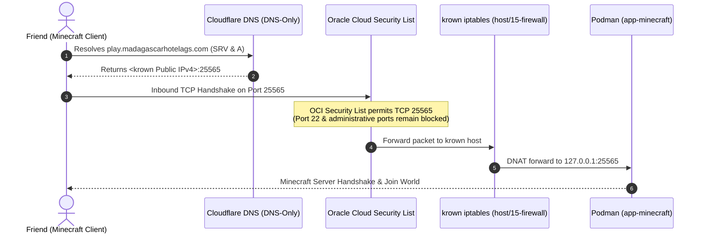

# 03. Zero-Cost Multiplayer Networking & DNS Configuration

> **TL;DR (non-technical):** This document explains how friends connect to your Minecraft server
> from anywhere in the world for completely free. It uses Oracle Cloud's free internet bandwidth
> and free Cloudflare DNS records so players just type `play.madagascarhotelags.com` to join.
> It also explains how to let friends on phones and consoles play with you.

---

## 1. Network Traffic Flow



---

## 2. Oracle Cloud (OCI) Ingress Rule Setup

Oracle Cloud Always Free and Pay-As-You-Go accounts include **10 TB of outbound internet bandwidth per month**
and static public IPv4 addresses at **$0.00 cost**.

### Step-by-Step Security List Configuration

1. Open the [Oracle Cloud Infrastructure Console](https://cloud.oracle.com/).
2. Navigate to **Networking → Virtual Cloud Networks**.
3. Select the VCN hosting `krown` (e.g. `krown-vcn`).
4. Under **Resources**, click **Security Lists**, then select **Default Security List for krown-vcn**.
5. Click **Add Ingress Rules** and create the rule for **Java Edition**:
   - **Source Type:** CIDR
   - **Source CIDR:** `0.0.0.0/0`
   - **IP Protocol:** `TCP`
   - **Source Port Range:** All
   - **Destination Port Range:** `25565`
   - **Description:** `Minecraft Java Edition Ingress (TCP)`
6. *(Optional for Bedrock/Console Cross-Play)* Add a second rule for **Bedrock Edition**:
   - **Source Type:** CIDR
   - **Source CIDR:** `0.0.0.0/0`
   - **IP Protocol:** `UDP`
   - **Source Port Range:** All
   - **Destination Port Range:** `19132`
   - **Description:** `Minecraft Bedrock Geyser Ingress (UDP)`

> [!IMPORTANT]
> **Host Security Boundaries Preserved**: Only port `25565` (and optional `19132`) is opened.
> SSH (port 22), PostgreSQL (5432), the cf-vps agent (7070), and Nginx (8080) remain strictly closed
> to the public internet.

---

## 3. Cloudflare DNS Configuration

Cloudflare provides enterprise-grade, ultra-fast DNS resolution at zero cost.

> [!WARNING]
> **Why Proxy Status MUST Be "DNS Only (Gray Cloud)"**:
> Cloudflare's free proxy only handles HTTP and HTTPS web traffic. Raw TCP game traffic (such as Minecraft on 25565)
> cannot pass through Cloudflare's orange-cloud proxy without an Enterprise Cloudflare Spectrum plan.
> Therefore, Minecraft records must be set to **DNS Only (Gray Cloud)**.

### 3.1 Record 1: Direct Host Mapping (`A` Record)
- **Type:** `A`
- **Name:** `mc` (or `minecraft`)
- **IPv4 Address:** `<Your krown Public IP>` (Retrieve via `curl -s https://ifconfig.me` on the server)
- **Proxy Status:** **DNS Only (Gray Cloud)**
- **TTL:** Auto

### 3.2 Record 2: Minecraft SRV Record (`SRV` Record)
The SRV record allows players to connect using just `play.madagascarhotelags.com` without typing `:25565`:

- **Type:** `SRV`
- **Name:** `play`
- **Service:** `_minecraft`
- **Protocol:** `_tcp`
- **Priority:** `0`
- **Weight:** `5`
- **Port:** `25565`
- **Target:** `mc.madagascarhotelags.com`
- **TTL:** Auto

---

## 4. Cross-Platform Play: Enabling Friends on Mobile & Consoles

Many friends play on smartphones (iOS / Android), iPads, Xbox, PlayStation, or Nintendo Switch (Bedrock Edition).
By default, Bedrock and Java editions cannot play together. We solve this for free with **GeyserMC** and **Floodgate**.

### 4.1 How Geyser Works
Geyser acts as an on-the-fly translator:
- It listens for Bedrock clients on **UDP port 19132**.
- It translates Bedrock network packets into Java packets in memory and forwards them to PaperMC on loopback.
- **Floodgate** removes the requirement for Bedrock players to own a Java Minecraft account; they can authenticate
  securely using their existing Microsoft / Xbox Live accounts.

### 4.2 Installing Geyser & Floodgate

Run on `krown`:

```bash
# Navigate to the Minecraft plugins volume
cd /srv/apps/minecraft/plugins

# Download latest stable release builds
sudo curl -Lo Geyser-Spigot.jar https://download.geysermc.org/v2/projects/geyser/versions/latest/builds/latest/downloads/spigot
sudo curl -Lo Floodgate-Spigot.jar https://download.geysermc.org/v2/projects/floodgate/versions/latest/builds/latest/downloads/spigot

# Ensure container user owns the jars
sudo chown -R 100000:100000 /srv/apps/minecraft/plugins

# Restart container to load plugins
sudo systemctl restart app-minecraft.service
```

### 4.3 Bedrock Connection Settings
Friends on mobile or console enter:
- **Server Name:** `Madagascar SMP`
- **Server Address:** `play.madagascarhotelags.com` (or `mc.madagascarhotelags.com`)
- **Port:** `19132` (Default Bedrock UDP port)

---

## 5. Alternative: Zero-Port Tunneling with Playit.gg

If the operator strictly prefers **never** opening inbound ports in OCI, [Playit.gg](https://playit.gg) offers
a 100% free gaming tunnel.

### How Playit.gg Works
1. Runs a small agent inside the container that makes an **outbound** UDP connection to Playit's anycast routing mesh.
2. Generates a free custom subdomain (e.g. `madagascar-smp.gl.joinmc.link`).
3. Players connect to that domain; traffic is forwarded through the outbound tunnel.
4. **Trade-off**: Completely free with zero open ports on OCI, but introduces 15–25 ms of additional proxy latency.

---

## 6. Verification & Connection Testing

Run these commands from any client or terminal to verify that networking is operational:

```bash
# 1. Test DNS resolution
nslookup mc.madagascarhotelags.com

# 2. Test TCP port accessibility from an external machine
nc -zv mc.madagascarhotelags.com 25565
# Expected output: Connection to mc.madagascarhotelags.com 25565 port [tcp/*] succeeded!

# 3. Query server status from CLI using python mcstatus (optional)
pip install mcstatus
mcstatus mc.madagascarhotelags.com status
```

---

## 7. Next Steps

Proceed to [`04-OBSERVABILITY-AND-MONITORING.md`](./04-OBSERVABILITY-AND-MONITORING.md) to integrate Minecraft
with Madagascar's Node.js monitoring and console telemetry.
