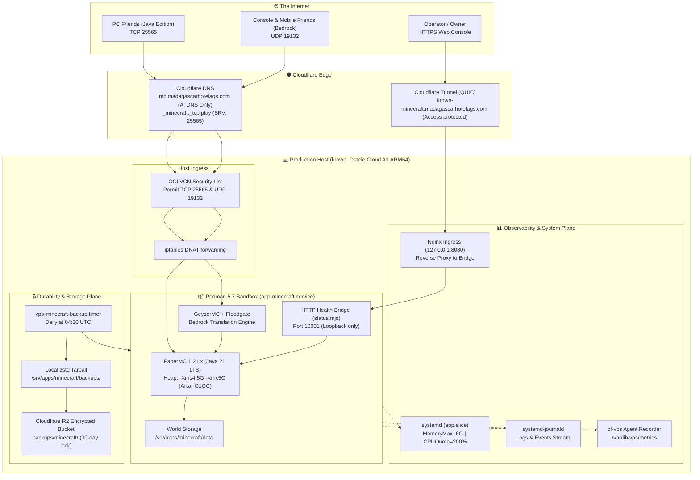

# 🎮 Minecraft Dedicated Server Documentation Hub

> **TL;DR (non-technical):** This documentation suite explains how the Madagascar platform's production
> host (`krown`) hosts a private, high-performance Minecraft world using exactly **50% of its resources**
> (6 GB RAM and 2 vCPUs on ARM64) at **$0.00 additional operating cost**. It runs inside a secure,
> unprivileged container, accepts direct connections from friends online for free (with cross-play for
> phones and consoles), and is monitored through the admin console just like our web applications.

---

## 🗺️ Documentation Directory Map

This guide is organized modularly so you can navigate directly to the specific area you need on GitHub:

```
documentation/minecraft/
├── README.md                          <-- You are here (Navigation hub & executive summary)
├── 01-ARCHITECTURE-AND-SIZING.md      <-- Host hardware, 50% resource budget, cgroups, JVM allocation
├── 02-PODMAN-QUADLET-SETUP.md         <-- Podman 5.7 Quadlet container, user namespaces, filesystem
├── 03-NETWORKING-AND-DNS.md           <-- Zero-cost multiplayer, OCI security list, Cloudflare DNS, Bedrock
├── 04-OBSERVABILITY-AND-MONITORING.md <-- Node.js monitoring parity, HTTP health bridge, Nginx, console
├── 05-BACKUPS-AND-DISASTER-RECOVERY.md<-- Automated R2 backups, zstd compression, point-in-time restore
└── 06-ADMINISTRATION-AND-TUNING.md    <-- PaperMC, Aikar G1GC flags, RCON cheatsheet, Spark profiling
```

### Quick Topic Matrix

| If You Want To | Read Document | Primary Focus |
|---|---|---|
| **Understand resource limits & sizing** | [`01-ARCHITECTURE-AND-SIZING.md`](./01-ARCHITECTURE-AND-SIZING.md) | 6 GB RAM, 2 vCPUs, cgroup v2, JVM heap sizing |
| **Inspect container unit & systemd files** | [`02-PODMAN-QUADLET-SETUP.md`](./02-PODMAN-QUADLET-SETUP.md) | Quadlet unit, `UserNS=auto`, volume mounts |
| **Connect friends for free & enable consoles** | [`03-NETWORKING-AND-DNS.md`](./03-NETWORKING-AND-DNS.md) | OCI ingress, DNS `A` + `SRV` records, GeyserMC |
| **Monitor server health & check uptime** | [`04-OBSERVABILITY-AND-MONITORING.md`](./04-OBSERVABILITY-AND-MONITORING.md) | Loopback HTTP bridge (`/healthz`, `/status`), Nginx |
| **Restore a lost/corrupted world** | [`05-BACKUPS-AND-DISASTER-RECOVERY.md`](./05-BACKUPS-AND-DISASTER-RECOVERY.md) | RCON snapshot, age encryption, R2 bucket restore |
| **Manage whitelist, OP users & fix lag** | [`06-ADMINISTRATION-AND-TUNING.md`](./06-ADMINISTRATION-AND-TUNING.md) | RCON commands, Aikar flags, Spark profiler |

---

## 🏛️ System Architecture Topology

The Minecraft server runs side-by-side with Madagascar platform services without compromising host security
or starving existing daemons:



---

## ⚡ Core Operational Guarantees

1. **Strict 50% Host Sandbox**: Systemd cgroup v2 strictly limits memory to **6.0 GB** and CPU to **2 vCPUs**. If the game container leaks memory or experiences runaway entity generation, systemd isolates and throttles only the game container, leaving host daemons (Postgres, Vector, Agent) completely unaffected.
2. **Zero Recurring Costs**: Oracle Cloud Always Free / Pay-As-You-Go includes 10 TB/month of outbound bandwidth and dedicated public IPs. Connecting friends over direct DNS costs $0.00.
3. **Zero Software Required for Friends**: Friends open vanilla Minecraft, add `play.madagascarhotelags.com`, and join immediately. No Hamachi, no client-side VPNs, no third-party launcher software.
4. **Console Parity with Web Apps**: You can monitor uptime, RAM consumption, and player activity from the `cf-vps` admin console or via `https://krown-minecraft.madagascarhotelags.com/status` behind Cloudflare Access.
5. **Nightly Off-Box Disaster Recovery**: The world is automatically flushed, compressed with Zstandard, encrypted with `age`, and pushed to Cloudflare R2 every night at 04:30 UTC.

---

> [!TIP]
> **Getting Started**: If you are deploying this for the first time, begin with [`01-ARCHITECTURE-AND-SIZING.md`](./01-ARCHITECTURE-AND-SIZING.md) to understand the resource envelope, followed by [`02-PODMAN-QUADLET-SETUP.md`](./02-PODMAN-QUADLET-SETUP.md) for step-by-step setup instructions.
